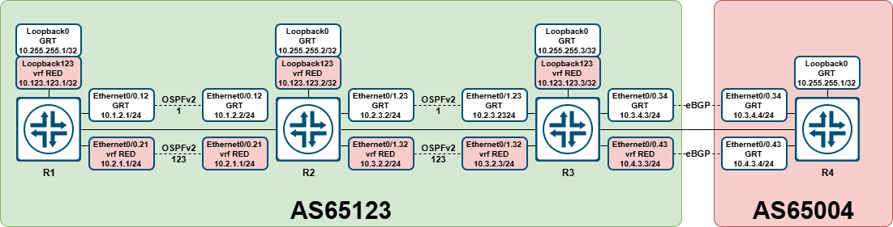
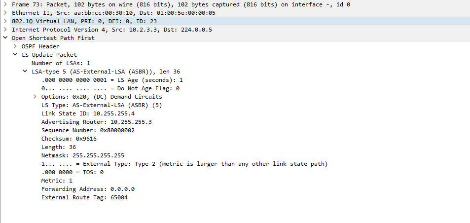
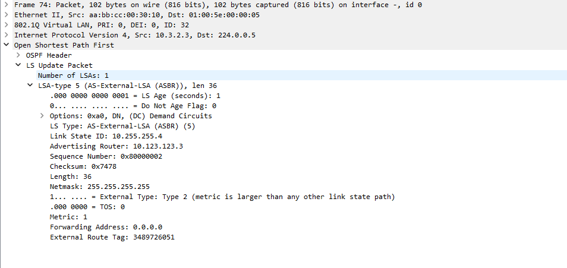

# OSPF DN-bit - пример на Cisco

- [OSPF DN-bit - пример на Cisco](#ospf-dn-bit---пример-на-cisco)
  - [Краткое описание](#краткое-описание)
  - [Топология](#топология)
  - [Конфигурация](#конфигурация)
  - [Проверка](#проверка)

## Краткое описание

В рамках данной заметки будет рассмотрено воспроизведение проблемы с DN-bit в OSPF.

DN-bit - это механизм в OSPF, позволяющий избежать петель маршрутизации при импортировании BGP-маршрутов в PE-CE взаимодействии в рамках MPLS L3VPN. Описан данный механизм в [RFC4576](https://datatracker.ietf.org/doc/html/rfc4576) и [RFC4577](https://datatracker.ietf.org/doc/html/rfc4577).

Если коротко и по простому: бывают такие ситуации, когда в процесс OSPF для какого-то VRF необходимо импортировать маршруты, полученные по BGP. И вот здесь может так случиться, что на соседнем роутере External LSA будет, а вот маршрута в RIB уже нет. Вот с этим и будем разбираться дальше :).

## Топология



## Конфигурация

**R1:**

```cisco
vrf definition RED
 rd 10.255.255.1:123
 !
 address-family ipv4
 exit-address-family
!
interface Loopback0
 ip address 10.255.255.1 255.255.255.255
 ip ospf 1 area 0
!
interface Loopback123
 vrf forwarding RED
 ip address 10.123.123.1 255.255.255.255
 ip ospf 123 area 0
!
interface Ethernet0/0
 no ip address
!
interface Ethernet0/0.12
 encapsulation dot1Q 12
 ip address 10.1.2.1 255.255.255.0
 ip ospf network point-to-point
 ip ospf 1 area 0
!
interface Ethernet0/0.21
 encapsulation dot1Q 21
 vrf forwarding RED
 ip address 10.2.1.1 255.255.255.0
 ip ospf network point-to-point
 ip ospf 123 area 0
!    
router ospf 123 vrf RED
 router-id 10.123.123.1
!
router ospf 1
 router-id 10.255.255.1
!
```

**R2:**

```cisco
vrf definition RED
 rd 10.255.255.2:123
 !
 address-family ipv4
 exit-address-family
!
interface Loopback0
 ip address 10.255.255.2 255.255.255.255
 ip ospf 1 area 0
!
interface Loopback123
 vrf forwarding RED
 ip address 10.123.123.2 255.255.255.255
 ip ospf 123 area 0
!
interface Ethernet0/0
 no ip address
!
interface Ethernet0/0.12
 encapsulation dot1Q 12
 ip address 10.1.2.2 255.255.255.0
 ip ospf network point-to-point
 ip ospf 1 area 0
!
interface Ethernet0/0.21
 encapsulation dot1Q 21
 vrf forwarding RED
 ip address 10.2.1.2 255.255.255.0
 ip ospf network point-to-point
 ip ospf 123 area 0
!
interface Ethernet0/1
 no ip address
!
interface Ethernet0/1.23
 encapsulation dot1Q 23
 ip address 10.2.3.2 255.255.255.0
 ip ospf network point-to-point
 ip ospf 1 area 0
!
interface Ethernet0/1.32
 encapsulation dot1Q 32
 vrf forwarding RED
 ip address 10.3.2.2 255.255.255.0
 ip ospf network point-to-point
 ip ospf 123 area 0
!
router ospf 123 vrf RED
 router-id 10.123.123.2
!
router ospf 1
 router-id 10.255.255.2
!
```

**R3:**

```cisco
vrf definition RED
 rd 10.255.255.3:123
 !
 address-family ipv4
 exit-address-family
!
interface Loopback0
 ip address 10.255.255.3 255.255.255.255
 ip ospf 1 area 0
!
interface Loopback123
 vrf forwarding RED
 ip address 10.123.123.3 255.255.255.255
 ip ospf 123 area 0
!
interface Ethernet0/0
 no ip address
!
interface Ethernet0/0.34
 encapsulation dot1Q 34
 ip address 10.3.4.3 255.255.255.0
!
interface Ethernet0/0.43
 encapsulation dot1Q 43
 vrf forwarding RED
 ip address 10.4.3.3 255.255.255.0
!
interface Ethernet0/1
 no ip address
!
interface Ethernet0/1.23
 encapsulation dot1Q 23
 ip address 10.2.3.3 255.255.255.0
 ip ospf network point-to-point
 ip ospf 1 area 0
!
interface Ethernet0/1.32
 encapsulation dot1Q 32
 vrf forwarding RED
 ip address 10.3.2.3 255.255.255.0
 ip ospf network point-to-point
 ip ospf 123 area 0
!         
router ospf 123 vrf RED
 router-id 10.123.123.3
 redistribute bgp 65123
!
router ospf 1
 router-id 10.255.255.3
 redistribute bgp 65123
!
router bgp 65123
 bgp log-neighbor-changes
 neighbor 10.3.4.4 remote-as 65004
 !
 address-family ipv4 vrf RED
  neighbor 10.4.3.4 remote-as 65004
  neighbor 10.4.3.4 activate
 exit-address-family
!
```

**R4:**

```cisco
interface Loopback0
 ip address 10.255.255.4 255.255.255.255
!
interface Ethernet0/0
 no ip address
!
interface Ethernet0/0.34
 encapsulation dot1Q 34
 ip address 10.3.4.4 255.255.255.0
!
interface Ethernet0/0.43
 encapsulation dot1Q 43
 ip address 10.4.3.4 255.255.255.0
!
router bgp 65004
 bgp log-neighbor-changes
 neighbor 10.3.4.3 remote-as 65123
 neighbor 10.4.3.3 remote-as 65123
 !
 address-family ipv4
  network 10.255.255.4 mask 255.255.255.255
  neighbor 10.3.4.3 activate
  neighbor 10.4.3.3 activate
 exit-address-family
!
```

Как видно из конфигурации, между R3 и R4 подняты две eBGP-сессии. Со стороны R3 одна из них находится в vrf RED, вторая - в GRT. Также на R3 настроена редистрибьюция из BGP в процессы OSPF.

## Проверка

Проверяем таблицы маршрутизации на R1, R2, R3 как в GRT, так и в vrf RED.

Сначала в GRT:

**R1:**

```cisco
R1#show ip route | b Gateway
Gateway of last resort is not set

      10.0.0.0/8 is variably subnetted, 7 subnets, 2 masks
C        10.1.2.0/24 is directly connected, Ethernet0/0.12
L        10.1.2.1/32 is directly connected, Ethernet0/0.12
O        10.2.3.0/24 [110/20] via 10.1.2.2, 00:28:24, Ethernet0/0.12
C        10.255.255.1/32 is directly connected, Loopback0
O        10.255.255.2/32 [110/11] via 10.1.2.2, 00:28:52, Ethernet0/0.12
O        10.255.255.3/32 [110/21] via 10.1.2.2, 00:26:35, Ethernet0/0.12
O E2     10.255.255.4/32 [110/1] via 10.1.2.2, 00:22:34, Ethernet0/0.12
R1#
```

**R2:**

```cisco
R2#show ip route | b Gateway
Gateway of last resort is not set

      10.0.0.0/8 is variably subnetted, 8 subnets, 2 masks
C        10.1.2.0/24 is directly connected, Ethernet0/0.12
L        10.1.2.2/32 is directly connected, Ethernet0/0.12
C        10.2.3.0/24 is directly connected, Ethernet0/1.23
L        10.2.3.2/32 is directly connected, Ethernet0/1.23
O        10.255.255.1/32 [110/11] via 10.1.2.1, 00:28:59, Ethernet0/0.12
C        10.255.255.2/32 is directly connected, Loopback0
O        10.255.255.3/32 [110/11] via 10.2.3.3, 00:26:39, Ethernet0/1.23
O E2     10.255.255.4/32 [110/1] via 10.2.3.3, 00:22:33, Ethernet0/1.23
R2#
```

**R3:**

```cisco
R3#show ip route | b Gateway
Gateway of last resort is not set

      10.0.0.0/8 is variably subnetted, 9 subnets, 2 masks
O        10.1.2.0/24 [110/20] via 10.2.3.2, 00:26:39, Ethernet0/1.23
C        10.2.3.0/24 is directly connected, Ethernet0/1.23
L        10.2.3.3/32 is directly connected, Ethernet0/1.23
C        10.3.4.0/24 is directly connected, Ethernet0/0.34
L        10.3.4.3/32 is directly connected, Ethernet0/0.34
O        10.255.255.1/32 [110/21] via 10.2.3.2, 00:26:39, Ethernet0/1.23
O        10.255.255.2/32 [110/11] via 10.2.3.2, 00:26:39, Ethernet0/1.23
C        10.255.255.3/32 is directly connected, Loopback0
B        10.255.255.4/32 [20/0] via 10.3.4.4, 00:22:33
R3#
```

Как видно, на R1 и R2 попал маршрут до 10.255.255.4/32.

Теперь проверим в vrf RED:

**R1:**

```cisco
R1#show ip route vrf RED | b Gateway
Gateway of last resort is not set

      10.0.0.0/8 is variably subnetted, 6 subnets, 2 masks
C        10.2.1.0/24 is directly connected, Ethernet0/0.21
L        10.2.1.1/32 is directly connected, Ethernet0/0.21
O        10.3.2.0/24 [110/20] via 10.2.1.2, 00:03:47, Ethernet0/0.21
C        10.123.123.1/32 is directly connected, Loopback123
O        10.123.123.2/32 [110/11] via 10.2.1.2, 00:03:47, Ethernet0/0.21
O        10.123.123.3/32 [110/21] via 10.2.1.2, 00:03:47, Ethernet0/0.21
R1#
```

**R2:**

```cisco
R2#show ip route vrf RED | b Gateway
Gateway of last resort is not set

      10.0.0.0/8 is variably subnetted, 7 subnets, 2 masks
C        10.2.1.0/24 is directly connected, Ethernet0/0.21
L        10.2.1.2/32 is directly connected, Ethernet0/0.21
C        10.3.2.0/24 is directly connected, Ethernet0/1.32
L        10.3.2.2/32 is directly connected, Ethernet0/1.32
O        10.123.123.1/32 [110/11] via 10.2.1.1, 00:03:47, Ethernet0/0.21
C        10.123.123.2/32 is directly connected, Loopback123
O        10.123.123.3/32 [110/11] via 10.3.2.3, 00:29:36, Ethernet0/1.32
R2#
```

**R3:**

```cisco
R3#show ip route vrf RED | b Gateway
Gateway of last resort is not set

      10.0.0.0/8 is variably subnetted, 9 subnets, 2 masks
O        10.2.1.0/24 [110/20] via 10.3.2.2, 00:29:35, Ethernet0/1.32
C        10.3.2.0/24 is directly connected, Ethernet0/1.32
L        10.3.2.3/32 is directly connected, Ethernet0/1.32
C        10.4.3.0/24 is directly connected, Ethernet0/0.43
L        10.4.3.3/32 is directly connected, Ethernet0/0.43
O        10.123.123.1/32 [110/21] via 10.3.2.2, 00:03:47, Ethernet0/1.32
O        10.123.123.2/32 [110/11] via 10.3.2.2, 00:29:35, Ethernet0/1.32
C        10.123.123.3/32 is directly connected, Loopback123
B        10.255.255.4/32 [20/0] via 10.4.3.4, 00:25:53
R3#
```

В vrf RED ситуация отличается: на R1 и R2 нужный маршрут отсутствует. Проверим LSDB:

**R1:**

```cisco
R1#show ip ospf 123 database 

            OSPF Router with ID (10.123.123.1) (Process ID 123)

                Router Link States (Area 0)

Link ID         ADV Router      Age         Seq#       Checksum Link count
10.123.123.1    10.123.123.1    328         0x80000007 0x00686C 3         
10.123.123.2    10.123.123.2    329         0x80000009 0x004E2B 5         
10.123.123.3    10.123.123.3    1756        0x80000004 0x000FBA 3         

                Type-5 AS External Link States

Link ID         ADV Router      Age         Seq#       Checksum Tag
10.255.255.4    10.123.123.3    1656        0x80000001 0x007677 3489726051
R1#
```

**R2:**

```cisco
R2#show ip ospf 123 database 

            OSPF Router with ID (10.123.123.2) (Process ID 123)

                Router Link States (Area 0)

Link ID         ADV Router      Age         Seq#       Checksum Link count
10.123.123.1    10.123.123.1    329         0x80000007 0x00686C 3         
10.123.123.2    10.123.123.2    328         0x80000009 0x004E2B 5         
10.123.123.3    10.123.123.3    1755        0x80000004 0x000FBA 3         

                Type-5 AS External Link States

Link ID         ADV Router      Age         Seq#       Checksum Tag
10.255.255.4    10.123.123.3    1656        0x80000001 0x007677 3489726051
R2#
```

**R3:**

```cisco
R3#show ip ospf 123 database 

            OSPF Router with ID (10.123.123.3) (Process ID 123)

                Router Link States (Area 0)

Link ID         ADV Router      Age         Seq#       Checksum Link count
10.123.123.1    10.123.123.1    330         0x80000007 0x00686C 3         
10.123.123.2    10.123.123.2    329         0x80000009 0x004E2B 5         
10.123.123.3    10.123.123.3    1754        0x80000004 0x000FBA 3         

                Type-5 AS External Link States

Link ID         ADV Router      Age         Seq#       Checksum Tag
10.255.255.4    10.123.123.3    1655        0x80000001 0x007677 3489726051
R3#
```

Как видно, LSA Type 5 для префикса 10.255.255.4/32 внутри процесса для vrf была выпущена. Посмотрим на нее внимательней:

**R2:**

```cisco
R2#show ip ospf 123 database external 10.255.255.4

            OSPF Router with ID (10.123.123.2) (Process ID 123)

                Type-5 AS External Link States

  LS age: 1724
  Options: (No TOS-capability, DC, Downward)
  LS Type: AS External Link
  Link State ID: 10.255.255.4 (External Network Number )
  Advertising Router: 10.123.123.3
  LS Seq Number: 80000001
  Checksum: 0x7677
  Length: 36
  Network Mask: /32
        Metric Type: 2 (Larger than any link state path)
        MTID: 0 
        Metric: 1 
        Forward Address: 0.0.0.0
        External Route Tag: 3489726051

R2#
```

Сравним с аналогичной LSA, но в GRT:

**R2:**

```cisco
R2#show ip ospf 1 database external 10.255.255.4  

            OSPF Router with ID (10.255.255.2) (Process ID 1)

                Type-5 AS External Link States

  LS age: 1807
  Options: (No TOS-capability, DC, Upward)
  LS Type: AS External Link
  Link State ID: 10.255.255.4 (External Network Number )
  Advertising Router: 10.255.255.3
  LS Seq Number: 80000001
  Checksum: 0x9815
  Length: 36
  Network Mask: /32
        Metric Type: 2 (Larger than any link state path)
        MTID: 0 
        Metric: 1 
        Forward Address: 0.0.0.0
        External Route Tag: 65004

R2#
```

Также можно посмотреть на эти LSA из дампа:

|               GRT LSA 5               |               VRF LSA 5               |
| :-----------------------------------: | :-----------------------------------: |
|  |  |

Проблема в DN-бите, который проставляет R3 при редистрибьюции из BGP в OSPF в vrf RED. Этот механизм используется для того, чтобы избежать появления петель (см. [RFC4576](https://datatracker.ietf.org/doc/html/rfc4576) и [RFC4577](https://datatracker.ietf.org/doc/html/rfc4577)). Если коротко, то маршрутизатор обязан игнорировать LSA с проставленным DN-битом и не использовать информацию из таких LSA во время расчета маршрутов в OSPF.

Для проверки настроим на R1 процесс BGP:

**R1:**

```cisco
!
router bgp 65123
 bgp log-neighbor-changes
 !
 address-family ipv4
  redistribute ospf 1 match internal external 1 external 2
 exit-address-family
 !
 address-family ipv4 vrf RED
  redistribute ospf 123 match internal external 1 external 2
 exit-address-family
!
```

> Ремарка: указание в явном виде, что импортируются как внутренние, так и внешние маршруты, т.к. Cisco по умолчанию не импортирует external-маршруты.

Теперь проверим:

**R1:**

```cisco
R1#show bgp ipv4 unicast | b Network
     Network          Next Hop            Metric LocPrf Weight Path
 *>   10.1.2.0/24      0.0.0.0                  0         32768 ?
 *>   10.2.3.0/24      10.1.2.2                20         32768 ?
 *>   10.255.255.1/32  0.0.0.0                  0         32768 ?
 *>   10.255.255.2/32  10.1.2.2                11         32768 ?
 *>   10.255.255.3/32  10.1.2.2                21         32768 ?
 *>   10.255.255.4/32  10.1.2.2                 1         32768 ?
R1#show bgp vpnv4 unicast vrf RED | b Network
     Network          Next Hop            Metric LocPrf Weight Path
Route Distinguisher: 10.255.255.1:123 (default for vrf RED)
 *>   10.2.1.0/24      0.0.0.0                  0         32768 ?
 *>   10.3.2.0/24      10.2.1.2                20         32768 ?
 *>   10.123.123.1/32  0.0.0.0                  0         32768 ?
 *>   10.123.123.2/32  10.2.1.2                11         32768 ?
 *>   10.123.123.3/32  10.2.1.2                21         32768 ?
R1#
```

Как решить эту проблему? В случае Cisco эта проблема решается добавлением в конфигурацию инструкции `capability vrf-lite` в контексте процесса OSPF для vrf (у других вендоров тоже есть аналогичные решения, у Huawei, например, это `vpn-instance-capability simple`).

Проверим на R1:

**R1:**

```cisco
R1#configure 
Configuring from terminal, memory, or network [terminal]? 
Enter configuration commands, one per line.  End with CNTL/Z.
R1(config)#router ospf 123 vrf RED
R1(config-router)#capability vrf-lite
R1(config-router)#
*Mar 26 19:19:23.243: %OSPF-5-ADJCHG: Process 123, Nbr 10.123.123.2 on Ethernet0/0.21 from FULL to DOWN, Neighbor Down: Interface down or detached
*Mar 26 19:19:23.245: %OSPF-5-ADJCHG: Process 123, Nbr 10.123.123.2 on Ethernet0/0.21 from LOADING to FULL, Loading Done
R1(config-router)#end
R1#
*Mar 26 19:19:36.055: %SYS-5-CONFIG_I: Configured from console by console
R1#show ip route | b Gateway
Gateway of last resort is not set

      10.0.0.0/8 is variably subnetted, 7 subnets, 2 masks
C        10.1.2.0/24 is directly connected, Ethernet0/0.12
L        10.1.2.1/32 is directly connected, Ethernet0/0.12
O        10.2.3.0/24 [110/20] via 10.1.2.2, 00:07:51, Ethernet0/0.12
C        10.255.255.1/32 is directly connected, Loopback0
O        10.255.255.2/32 [110/11] via 10.1.2.2, 00:07:51, Ethernet0/0.12
O        10.255.255.3/32 [110/21] via 10.1.2.2, 00:07:51, Ethernet0/0.12
O E2     10.255.255.4/32 [110/1] via 10.1.2.2, 00:07:51, Ethernet0/0.12
R1#show ip route vrf RED | b Gateway
Gateway of last resort is not set

      10.0.0.0/8 is variably subnetted, 7 subnets, 2 masks
C        10.2.1.0/24 is directly connected, Ethernet0/0.21
L        10.2.1.1/32 is directly connected, Ethernet0/0.21
O        10.3.2.0/24 [110/20] via 10.2.1.2, 00:00:25, Ethernet0/0.21
C        10.123.123.1/32 is directly connected, Loopback123
O        10.123.123.2/32 [110/11] via 10.2.1.2, 00:00:25, Ethernet0/0.21
O        10.123.123.3/32 [110/21] via 10.2.1.2, 00:00:25, Ethernet0/0.21
O E2     10.255.255.4/32 [110/1] via 10.2.1.2, 00:00:25, Ethernet0/0.21
R1#show bgp ipv4 unicast | b Network         
     Network          Next Hop            Metric LocPrf Weight Path
 *>   10.1.2.0/24      0.0.0.0                  0         32768 ?
 *>   10.2.3.0/24      10.1.2.2                20         32768 ?
 *>   10.255.255.1/32  0.0.0.0                  0         32768 ?
 *>   10.255.255.2/32  10.1.2.2                11         32768 ?
 *>   10.255.255.3/32  10.1.2.2                21         32768 ?
 *>   10.255.255.4/32  10.1.2.2                 1         32768 ?
R1#show bgp vpnv4 unicast vrf RED | b Network
     Network          Next Hop            Metric LocPrf Weight Path
Route Distinguisher: 10.255.255.1:123 (default for vrf RED)
 *>   10.2.1.0/24      0.0.0.0                  0         32768 ?
 *>   10.3.2.0/24      10.2.1.2                20         32768 ?
 *>   10.123.123.1/32  0.0.0.0                  0         32768 ?
 *>   10.123.123.2/32  10.2.1.2                11         32768 ?
 *>   10.123.123.3/32  10.2.1.2                21         32768 ?
 *>   10.255.255.4/32  10.2.1.2                 1         32768 i
R1#
```

На всякий случай уточню, что данная инструкция является локальной, и на R2 ничего не изменилось:

**R2:**

```cisco
R2#
*Mar 26 19:19:27.888: %OSPF-5-ADJCHG: Process 123, Nbr 10.123.123.1 on Ethernet0/0.21 from LOADING to FULL, Loading Done
R2#show ip route vrf RED | b Gateway
Gateway of last resort is not set

      10.0.0.0/8 is variably subnetted, 7 subnets, 2 masks
C        10.2.1.0/24 is directly connected, Ethernet0/0.21
L        10.2.1.2/32 is directly connected, Ethernet0/0.21
C        10.3.2.0/24 is directly connected, Ethernet0/1.32
L        10.3.2.2/32 is directly connected, Ethernet0/1.32
O        10.123.123.1/32 [110/11] via 10.2.1.1, 00:02:01, Ethernet0/0.21
C        10.123.123.2/32 is directly connected, Loopback123
O        10.123.123.3/32 [110/11] via 10.3.2.3, 00:47:32, Ethernet0/1.32
R2#
```
