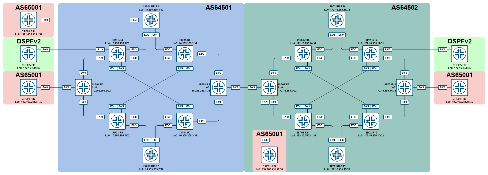

# LAB - Cisco - BGP Option B MPLS L3VPN

- [LAB - Cisco - BGP Option B MPLS L3VPN](#lab---cisco---bgp-option-b-mpls-l3vpn)
  - [Топология](#топология)
  - [Описание](#описание)
  - [Решение](#решение)
  - [Выполненная конфигурация](#выполненная-конфигурация)

## Топология



## Описание

В данной лабораторной работе необходимо организовать связность между сайтами клиентов, подключенных в разных AS. Для этого необходимо организовать interAS-стык по схеме «option B», т.е. поднятие между ASBR’ми interAS eBGP-сессии в AFI/SAFI VPNv4 Unicast.

## Решение

По умолчанию, на оборудовании Cisco фильтруются получаемые VPNv4-маршруты, если, конечно, получает не рефлектор. Т.к. ASBR’ы у нас не являются рефлекторами, отключаем фильтрацию при помощи команды `no bgp default route-target filter`.

**R1:**

```cisco
ISP01-ASBR-R1#show bgp vpnv4 uni all | b Network
     Network          Next Hop            Metric LocPrf Weight Path
Route Distinguisher: 10.255.255.1:11 (default for vrf MGMT)
 *>   10.0.0.1/32      0.0.0.0                  0         32768 ?
 *>i  10.0.0.2/32      10.255.255.2             0    100      0 ?
 *>i  10.0.0.3/32      10.255.255.3             0    100      0 ?
 *>i  10.0.0.4/32      10.255.255.4             0    100      0 ?
 *>i  10.0.0.5/32      10.255.255.5             0    100      0 ?
 *>i  10.0.0.6/32      10.255.255.6             0    100      0 ?
 *>i  10.0.0.7/32      10.255.255.7             0    100      0 ?
 *>i  10.0.0.8/32      10.255.255.8             0    100      0 ?
Route Distinguisher: 10.255.255.2:11
 * i  10.0.0.2/32      10.255.255.2             0    100      0 ?
 *>i                   10.255.255.2             0    100      0 ?
Route Distinguisher: 10.255.255.3:11
 * i  10.0.0.3/32      10.255.255.3             0    100      0 ?
 *>i                   10.255.255.3             0    100      0 ?
Route Distinguisher: 10.255.255.4:11
 * i  10.0.0.4/32      10.255.255.4             0    100      0 ?
 *>i                   10.255.255.4             0    100      0 ?
Route Distinguisher: 10.255.255.5:11
 * i  10.0.0.5/32      10.255.255.5             0    100      0 ?
 *>i                   10.255.255.5             0    100      0 ?
Route Distinguisher: 10.255.255.6:11
     Network          Next Hop            Metric LocPrf Weight Path
 * i  10.0.0.6/32      10.255.255.6             0    100      0 ?
 *>i                   10.255.255.6             0    100      0 ?
Route Distinguisher: 10.255.255.7:11
 * i  10.0.0.7/32      10.255.255.7             0    100      0 ?
 *>i                   10.255.255.7             0    100      0 ?
Route Distinguisher: 10.255.255.8:11
 * i  10.0.0.8/32      10.255.255.8             0    100      0 ?
 *>i                   10.255.255.8             0    100      0 ?
ISP01-ASBR-R1#
```

После применения:

**R1:**

```cisco
ISP01-ASBR-R1#show bgp vpnv4 uni all | b Network
     Network          Next Hop            Metric LocPrf Weight Path
Route Distinguisher: 10.255.255.1:11 (default for vrf MGMT)
 *>   10.0.0.1/32      0.0.0.0                  0         32768 ?
 *>i  10.0.0.2/32      10.255.255.2             0    100      0 ?
 *>i  10.0.0.3/32      10.255.255.3             0    100      0 ?
 *>i  10.0.0.4/32      10.255.255.4             0    100      0 ?
 *>i  10.0.0.5/32      10.255.255.5             0    100      0 ?
 *>i  10.0.0.6/32      10.255.255.6             0    100      0 ?
 *>i  10.0.0.7/32      10.255.255.7             0    100      0 ?
 *>i  10.0.0.8/32      10.255.255.8             0    100      0 ?
Route Distinguisher: 10.255.255.2:11
 * i  10.0.0.2/32      10.255.255.2             0    100      0 ?
 *>i                   10.255.255.2             0    100      0 ?
Route Distinguisher: 10.255.255.3:11
 * i  10.0.0.3/32      10.255.255.3             0    100      0 ?
 *>i                   10.255.255.3             0    100      0 ?
Route Distinguisher: 10.255.255.4:11
 * i  10.0.0.4/32      10.255.255.4             0    100      0 ?
 *>i                   10.255.255.4             0    100      0 ?
Route Distinguisher: 10.255.255.4:1002
 * i  10.104.119.0/24  10.255.255.4             0    100      0 ?
 *>i                   10.255.255.4             0    100      0 ?
 * i  172.16.0.19/32   10.255.255.4            11    100      0 ?
 *>i                   10.255.255.4            11    100      0 ?
Route Distinguisher: 10.255.255.5:11
 * i  10.0.0.5/32      10.255.255.5             0    100      0 ?
 *>i                   10.255.255.5             0    100      0 ?
Route Distinguisher: 10.255.255.6:11
 * i  10.0.0.6/32      10.255.255.6             0    100      0 ?
 *>i                   10.255.255.6             0    100      0 ?
Route Distinguisher: 10.255.255.6:1001
 * i  10.6.17.0/24     10.255.255.6             0    100      0 ?
 *>i                   10.255.255.6             0    100      0 ?
 * i  192.168.255.17/32
                       10.255.255.6             0    100      0 65001 i
 *>i                   10.255.255.6             0    100      0 65001 i
Route Distinguisher: 10.255.255.7:11
 * i  10.0.0.7/32      10.255.255.7             0    100      0 ?
 *>i                   10.255.255.7             0    100      0 ?
Route Distinguisher: 10.255.255.8:11
 * i  10.0.0.8/32      10.255.255.8             0    100      0 ?
 *>i                   10.255.255.8             0    100      0 ?
Route Distinguisher: 10.255.255.8:1001
 *>i  10.8.21.0/24     10.255.255.8             0    100      0 ?
 * i                   10.255.255.8             0    100      0 ?
 *>i  192.168.255.21/32
                       10.255.255.8             0    100      0 65001 i
 * i                   10.255.255.8             0    100      0 65001 i
```

После этого настроим eBGP-стык между ASBR’ами.

**R1:**

```cisco
router bgp 64501
 no bgp default route-target filter
 neighbor 192.0.2.1 remote-as 64502
 neighbor 192.0.2.1 update-source Ethernet0/3
 !
 address-family vpnv4
  neighbor 192.0.2.1 activate
  neighbor 192.0.2.1 send-community both
 exit-address-family
 !
!
```

**R9:**

```cisco
router bgp 64502
 no bgp default route-target filter
 neighbor 192.0.2.0 remote-as 64501
 neighbor 192.0.2.0 update-source Ethernet0/3
 !
 address-family vpnv4
  neighbor 192.0.2.0 activate
  neighbor 192.0.2.0 send-community both
 exit-address-family
 !
!
```

После поднятия BGP-сессии на интерфейсах Ethernet0/3 автоматически будет включен MPLS:

**R9:**

```cisco
ISP02-ASBR-R09#
*Mar 18 18:18:24.693: %BGP-5-ADJCHANGE: neighbor 192.0.2.0 Up
ISP02-ASBR-R09#
*Mar 18 18:18:24.698: %BGP_LMM-6-AUTOGEN1: The mpls bgp forwarding command has been configured on interface: Ethernet0/3
ISP02-ASBR-R09#show mpls interface
Interface              IP            Tunnel   BGP Static Operational
Ethernet0/0            Yes (ldp)     No       No  No     Yes
Ethernet0/1            Yes (ldp)     No       No  No     Yes
Ethernet0/3            No            No       Yes No     Yes
ISP02-ASBR-R09#
```

Проверим что сейчас в VPNv4 Unicast BGP Rib на ISP01-ASBR-R1:

**R1:**

```cisco
ISP01-ASBR-R1#show bgp vpnv4 unicast all | b Network
     Network          Next Hop            Metric LocPrf Weight Path
Route Distinguisher: 10.255.255.1:11 (default for vrf MGMT)
 *>   10.0.0.1/32      0.0.0.0                  0         32768 ?
 *>i  10.0.0.2/32      10.255.255.2             0    100      0 ?
 *>i  10.0.0.3/32      10.255.255.3             0    100      0 ?
 *>i  10.0.0.4/32      10.255.255.4             0    100      0 ?
 *>i  10.0.0.5/32      10.255.255.5             0    100      0 ?
 *>i  10.0.0.6/32      10.255.255.6             0    100      0 ?
 *>i  10.0.0.7/32      10.255.255.7             0    100      0 ?
 *>i  10.0.0.8/32      10.255.255.8             0    100      0 ?
Route Distinguisher: 10.255.255.2:11
 * i  10.0.0.2/32      10.255.255.2             0    100      0 ?
 *>i                   10.255.255.2             0    100      0 ?
Route Distinguisher: 10.255.255.3:11
 * i  10.0.0.3/32      10.255.255.3             0    100      0 ?
 *>i                   10.255.255.3             0    100      0 ?
Route Distinguisher: 10.255.255.4:11
 * i  10.0.0.4/32      10.255.255.4             0    100      0 ?
 *>i                   10.255.255.4             0    100      0 ?
Route Distinguisher: 10.255.255.4:1002
 * i  10.104.119.0/24  10.255.255.4             0    100      0 ?
 *>i                   10.255.255.4             0    100      0 ?
 * i  172.16.0.19/32   10.255.255.4            11    100      0 ?
 *>i                   10.255.255.4            11    100      0 ?
Route Distinguisher: 10.255.255.5:11
 * i  10.0.0.5/32      10.255.255.5             0    100      0 ?
 *>i                   10.255.255.5             0    100      0 ?
Route Distinguisher: 10.255.255.6:11
 * i  10.0.0.6/32      10.255.255.6             0    100      0 ?
 *>i                   10.255.255.6             0    100      0 ?
Route Distinguisher: 10.255.255.6:1001
 * i  10.6.17.0/24     10.255.255.6             0    100      0 ?
 *>i                   10.255.255.6             0    100      0 ?
 * i  192.168.255.17/32
                       10.255.255.6             0    100      0 65001 i
 *>i                   10.255.255.6             0    100      0 65001 i
Route Distinguisher: 10.255.255.7:11
 * i  10.0.0.7/32      10.255.255.7             0    100      0 ?
 *>i                   10.255.255.7             0    100      0 ?
Route Distinguisher: 10.255.255.8:11
 * i  10.0.0.8/32      10.255.255.8             0    100      0 ?
 *>i                   10.255.255.8             0    100      0 ?
Route Distinguisher: 10.255.255.8:1001
 *>i  10.8.21.0/24     10.255.255.8             0    100      0 ?
 * i                   10.255.255.8             0    100      0 ?
 *>i  192.168.255.21/32
                       10.255.255.8             0    100      0 65001 i
 * i                   10.255.255.8             0    100      0 65001 i
Route Distinguisher: 172.16.255.9:11
 *>   10.0.0.9/32      192.0.2.1                0             0 64502 ?
Route Distinguisher: 172.16.255.9:10001
 *>   10.9.22.0/24     192.0.2.1                0             0 64502 ?
 *>   192.168.255.22/32
                       192.0.2.1                              0 64502 65001 i
Route Distinguisher: 172.16.255.10:11
 *>   10.0.0.10/32     192.0.2.1                              0 64502 ?
Route Distinguisher: 172.16.255.11:11
 *>   10.0.0.11/32     192.0.2.1                              0 64502 ?
Route Distinguisher: 172.16.255.12:11
 *>   10.0.0.12/32     192.0.2.1                              0 64502 ?
Route Distinguisher: 172.16.255.12:10002
 *>   10.112.120.0/24  192.0.2.1                              0 64502 ?
 *>   172.16.0.20/32   192.0.2.1                              0 64502 ?
Route Distinguisher: 172.16.255.13:11
 *>   10.0.0.13/32     192.0.2.1                              0 64502 ?
Route Distinguisher: 172.16.255.14:11
 *>   10.0.0.14/32     192.0.2.1                              0 64502 ?
Route Distinguisher: 172.16.255.14:10001
 *>   10.14.18.0/24    192.0.2.1                              0 64502 ?
 *>   192.168.255.18/32
                       192.0.2.1                              0 64502 65001 i
Route Distinguisher: 172.16.255.15:11
 *>   10.0.0.15/32     192.0.2.1                              0 64502 ?
Route Distinguisher: 172.16.255.16:11
 *>   10.0.0.16/32     192.0.2.1                              0 64502 ?
ISP01-ASBR-R1#
```

Здесь мы видим, что от другого ASBR мы получили необходимую информацию.

Теперь проверим, что у нас есть на рефлекторах:

**R8:**

```cisco
ISP01-RR-R8#show bgp vpnv4 uni all | b Route Distinguisher: 172.16.255
Route Distinguisher: 172.16.255.9:11
 * i  10.0.0.9/32      192.0.2.1                0    100      0 64502 ?
Route Distinguisher: 172.16.255.9:10001
 * i  10.9.22.0/24     192.0.2.1                0    100      0 64502 ?
 * i  192.168.255.22/32
                       192.0.2.1                0    100      0 64502 65001 i
Route Distinguisher: 172.16.255.10:11
 * i  10.0.0.10/32     192.0.2.1                0    100      0 64502 ?
Route Distinguisher: 172.16.255.11:11
 * i  10.0.0.11/32     192.0.2.1                0    100      0 64502 ?
Route Distinguisher: 172.16.255.12:11
 * i  10.0.0.12/32     192.0.2.1                0    100      0 64502 ?
Route Distinguisher: 172.16.255.12:10002
 * i  10.112.120.0/24  192.0.2.1                0    100      0 64502 ?
 * i  172.16.0.20/32   192.0.2.1                0    100      0 64502 ?
Route Distinguisher: 172.16.255.13:11
 * i  10.0.0.13/32     192.0.2.1                0    100      0 64502 ?
Route Distinguisher: 172.16.255.14:11
 * i  10.0.0.14/32     192.0.2.1                0    100      0 64502 ?
Route Distinguisher: 172.16.255.14:10001
 * i  10.14.18.0/24    192.0.2.1                0    100      0 64502 ?
 * i  192.168.255.18/32
                       192.0.2.1                0    100      0 64502 65001 i
     Network          Next Hop            Metric LocPrf Weight Path
Route Distinguisher: 172.16.255.15:11
 * i  10.0.0.15/32     192.0.2.1                0    100      0 64502 ?
Route Distinguisher: 172.16.255.16:11
 * i  10.0.0.16/32     192.0.2.1                0    100      0 64502 ?
```

Мы видим, что на рефлекторы необходимая маршрутная информация попала. Теперь проверим наличие в RIB для vrf CUST1 наличие нужных маршрутов:

**R8:**

```cisco
ISP01-RR-R8#show ip route vrf CUST1 | b Gateway
Gateway of last resort is not set

      10.0.0.0/8 is variably subnetted, 3 subnets, 2 masks
B        10.6.17.0/24 [200/0] via 10.255.255.6, 00:27:35
C        10.8.21.0/24 is directly connected, Ethernet0/3
L        10.8.21.8/32 is directly connected, Ethernet0/3
      192.168.255.0/32 is subnetted, 2 subnets
B        192.168.255.17 [200/0] via 10.255.255.6, 00:27:35
B        192.168.255.21 [20/0] via 10.8.21.21, 00:27:35
ISP01-RR-R8#show bgp vpnv4 unicast vrf CUST1 | b Network
     Network          Next Hop            Metric LocPrf Weight Path
Route Distinguisher: 10.255.255.8:1001 (default for vrf CUST1)
 *>i  10.6.17.0/24     10.255.255.6             0    100      0 ?
 *>   10.8.21.0/24     0.0.0.0                  0         32768 ?
 *>i  192.168.255.17/32
                       10.255.255.6             0    100      0 65001 i
 *>   192.168.255.21/32
                       10.8.21.21               0             0 65001 i
ISP01-RR-R8#
```

И здесь мы видим, что в RIB vrf CUST1 ничего не попало, что, впрочем, ожидаемо, т.к. route-target у ISP01 и ISP02 для этого vrf отличаются. На маршрутизаторах ISP01, к которым подключены CPE01, добавим RT на импорт и экспорт 64502:10001:

**R8:**

```cisco
vrf definition CUST1
 !
 address-family ipv4
  route-target export 64502:10001
  route-target import 64502:10001
 exit-address-family
!
```

**R6:**

```cisco
vrf definition CUST1
 !
 address-family ipv4
  route-target export 64502:10001
  route-target import 64502:10001
 exit-address-family
!
```

Проверим еще раз, и увидим, что в BGP RIB на RR маршруты попали, а вот в RIB уже нет:

**R8:**

```cisco
ISP01-RR-R8#show ip route vrf CUST1 | b Gateway
Gateway of last resort is not set

      10.0.0.0/8 is variably subnetted, 3 subnets, 2 masks
B        10.6.17.0/24 [200/0] via 10.255.255.6, 00:33:50
C        10.8.21.0/24 is directly connected, Ethernet0/3
L        10.8.21.8/32 is directly connected, Ethernet0/3
      192.168.255.0/32 is subnetted, 2 subnets
B        192.168.255.17 [200/0] via 10.255.255.6, 00:33:50
B        192.168.255.21 [20/0] via 10.8.21.21, 00:00:30
ISP01-RR-R8#show bgp vpnv4 unicast vrf CUST1 | b Network
     Network          Next Hop            Metric LocPrf Weight Path
Route Distinguisher: 10.255.255.8:1001 (default for vrf CUST1)
 *>i  10.6.17.0/24     10.255.255.6             0    100      0 ?
 *>   10.8.21.0/24     0.0.0.0                  0         32768 ?
 * i  10.9.22.0/24     192.0.2.1                0    100      0 64502 ?
 * i  10.14.18.0/24    192.0.2.1                0    100      0 64502 ?
 *>i  192.168.255.17/32
                       10.255.255.6             0    100      0 65001 i
 * i  192.168.255.18/32
                       192.0.2.1                0    100      0 64502 65001 i
 *>   192.168.255.21/32
                       10.8.21.21               0             0 65001 i
 * i  192.168.255.22/32
                       192.0.2.1                0    100      0 64502 65001 i
ISP01-RR-R8#
```

Посмотрим более внимательно, что находится в BGP RIB на одном из полученных маршрутов (спойлер, ответ там будет):

**R8:**

```cisco
ISP01-RR-R8#show bgp vpnv4 unicast vrf CUST1 192.168.255.18/32
BGP routing table entry for 10.255.255.8:1001:192.168.255.18/32, version 0
Paths: (1 available, no best path)
  Not advertised to any peer
  Refresh Epoch 2
  64502 65001, (Received from a RR-client), imported safety path from 172.16.255.14:10001:192.168.255.18/32 (global)
    192.0.2.1 (inaccessible) (via default) from 10.255.255.1 (10.255.255.1)
      Origin IGP, metric 0, localpref 100, valid, internal
      Extended Community: RT:64502:10001
      mpls labels in/out nolabel/90018
      rx pathid: 0, tx pathid: 0
ISP01-RR-R8#
```

Здесь мы видим, что маршрут признан некорректным из-за того, что нет маршрута до next-hop’а 192.0.2.1. Собственно, есть два варианта решения данной проблемы:

1. Использовать next-hop-self на ASBR’е в сторону рефлекторов.
2. Добавить адрес next-hop в IGP.

Наиболее распространенным и простым является использование next-hop-self. Именно им мы воспользуемся в AS64501:

**R1:**

```cisco
router bgp 64501
!
 address-family vpnv4
  neighbor RR send-community both
  neighbor RR next-hop-self
exit-address-family
!
```

Проверим снова на RR:

**R8:**

```cisco
ISP01-RR-R8#show bgp vpnv4 unicast vrf CUST1 192.168.255.18/32
BGP routing table entry for 10.255.255.8:1001:192.168.255.18/32, version 70
Paths: (1 available, best #1, table CUST1)
  Advertised to update-groups:
     1
  Refresh Epoch 5
  64502 65001, (Received from a RR-client), imported path from 172.16.255.14:10001:192.168.255.18/32 (global)
    10.255.255.1 (metric 200) (via default) from 10.255.255.1 (10.255.255.1)
      Origin IGP, metric 0, localpref 100, valid, internal, best
      Extended Community: RT:64502:10001
      mpls labels in/out nolabel/10031
      rx pathid: 0, tx pathid: 0x0
ISP01-RR-R8#
```

И на ISP01-R6:

**R6:**

```cisco
ISP01-R6#show bgp vpnv4 unicast vrf CUST1 | b Network
     Network          Next Hop            Metric LocPrf Weight Path
Route Distinguisher: 10.255.255.6:1001 (default for vrf CUST1)
 *>   10.6.17.0/24     0.0.0.0                  0         32768 ?
 *>i  10.8.21.0/24     10.255.255.8             0    100      0 ?
 *>i  10.9.22.0/24     10.255.255.1             0    100      0 64502 ?
 *>i  10.14.18.0/24    10.255.255.1             0    100      0 64502 ?
 *>   192.168.255.17/32
                       10.6.17.17               0             0 65001 i
 *>i  192.168.255.18/32
                       10.255.255.1             0    100      0 64502 65001 i
 *>i  192.168.255.21/32
                       10.255.255.8             0    100      0 65001 i
 *>i  192.168.255.22/32
                       10.255.255.1             0    100      0 64502 65001 i
ISP01-R6#show ip route vrf CUST1 | b Gateway
Gateway of last resort is not set

      10.0.0.0/8 is variably subnetted, 5 subnets, 2 masks
C        10.6.17.0/24 is directly connected, Ethernet0/3
L        10.6.17.6/32 is directly connected, Ethernet0/3
B        10.8.21.0/24 [200/0] via 10.255.255.8, 00:18:25
B        10.9.22.0/24 [200/0] via 10.255.255.1, 00:01:08
B        10.14.18.0/24 [200/0] via 10.255.255.1, 00:01:08
      192.168.255.0/32 is subnetted, 4 subnets
B        192.168.255.17 [20/0] via 10.6.17.17, 00:01:08
B        192.168.255.18 [200/0] via 10.255.255.1, 00:01:08
B        192.168.255.21 [200/0] via 10.255.255.8, 00:18:53
B        192.168.255.22 [200/0] via 10.255.255.1, 00:01:08
ISP01-R6#
```

В общем-то, на стороне ISP01 мы закончили, однако, на данный момент связности между сайтами клиента в разных ISP нет. Поэтому идем настраивать вторую половину.

В рамках настройки ISP02 мы попробуем уже второй вариант решения проблемы с недоступным next-hop, а именно, добавим его в IGP (в данном случае, OSPFv2).

Прежде чем начать, посмотрим внимательно RIB на ISP02-ASBR-R09:

**R9:**

```cisco
ISP02-ASBR-R09#show ip route | i 192.0.2.
      192.0.2.0/24 is variably subnetted, 5 subnets, 2 masks
C        192.0.2.0/31 is directly connected, Ethernet0/3
C        192.0.2.0/32 is directly connected, Ethernet0/3
L        192.0.2.1/32 is directly connected, Ethernet0/3
C        192.0.2.2/31 is directly connected, Ethernet0/3.10
L        192.0.2.3/32 is directly connected, Ethernet0/3.10
ISP02-ASBR-R09#
```

`Ethernet0/3.10` – это временный сабинтерфейс, единственная цель которого показать разницу.

В выводе выше мы видим следующее: в RIB для Ethernet0/3 находится 3 записи:

- прописанный на интерфейсе local-префикс 192.0.2.1/32,
- connected-префикс 192.0.2.0/31,
- connected-префикс 192.0.2.0/32

А вот для E0/3.10 такого нет: у него только connected /31 и local /32. Давайте сравним конфиг этих интерфейсов:

**R9:**

```cisco
!
interface Ethernet0/3
 ip address 192.0.2.1 255.255.255.254
 duplex auto
 mpls bgp forwarding
!
interface Ethernet0/3.10
 encapsulation dot1Q 10
 ip address 192.0.2.3 255.255.255.254
!
```

`mpls bgp forwarding` – это команда, которая была добавлена автоматически при поднятии VPNv4-сессии между ASBR. В этот же момент, IOS/IOS-XE автоматически добавил /32 connected-маршрут: он необходим для корректной работы LSP, требующей резолва через /32-префикс. Кстати, в IOS-XR такого действия по умолчанию нет, поэтому приходится костылить со статиком /32.

Возвращаемся к добавлению адреса next-hop в IGP. У нас есть несколько вариантов:

1. Включение OSPF на интерфейсе в сторону другого ASBR (не забываем включить passive-interface).
2. Редистрибьюция в OSPF (в нашем случае connected).

А теперь вспоминаем требование о необходимости резолва через /32: исходя из этого, единственный рабочий вариант для нас – это редистрибьюция connected-маршрутов, причем с фильтрацией (см. вывод ниже).

**R9:**

```cisco
ISP02-ASBR-R09(config)#router ospf 1
ISP02-ASBR-R09(config-router)#redistribute connected subnets
ISP02-ASBR-R09#
*Mar 19 06:20:32.647: %SYS-5-CONFIG_I: Configured from console by console
ISP02-ASBR-R09#
*Mar 19 06:20:32.652: %OSPF-4-CONFLICTING_LSAID: Process 1 area dummy area: LSA origination prevented by LSA with same LSID but a different mask
  Existing Type 5 LSA: LSID 192.0.2.0/31
  New Destination: 192.0.2.0/32
ISP02-ASBR-R09#show ip ospf database external

            OSPF Router with ID (172.16.255.9) (Process ID 1)

                Type-5 AS External Link States

  LS age: 77
  Options: (No TOS-capability, DC, Upward)
  LS Type: AS External Link
  Link State ID: 192.0.2.0 (External Network Number )
  Advertising Router: 172.16.255.9
  LS Seq Number: 80000001
  Checksum: 0x39DF
  Length: 36
  Network Mask: /31
        Metric Type: 2 (Larger than any link state path)
        MTID: 0
        Metric: 20
        Forward Address: 0.0.0.0
        External Route Tag: 0

ISP02-ASBR-R09# 
```

Собственно, из вывода выше видно, что при обычной редистрибьюции, в OSPF DB попадает только /31 префикс. Поэтому настраиваем фильтрацию:

**R9:**

```cisco
ip prefix-list PL_RDSTB_CON_TO_OSPF seq 10 permit 192.0.2.0/32
!
route-map RM_RDSTB_CON_TO_OSPF permit 10
 match ip address prefix-list PL_RDSTB_CON_TO_OSPF
!
router ospf 1
 redistribute connected subnets route-map RM_RDSTB_CON_TO_OSPF
!
```

Проверяем:

**R9:**

```cisco
ISP02-ASBR-R09#show ip ospf database external

            OSPF Router with ID (172.16.255.9) (Process ID 1)

                Type-5 AS External Link States

  LS age: 6
  Options: (No TOS-capability, DC, Upward)
  LS Type: AS External Link
  Link State ID: 192.0.2.0 (External Network Number )
  Advertising Router: 172.16.255.9
  LS Seq Number: 80000003
  Checksum: 0x3BDA
  Length: 36
  Network Mask: /32
        Metric Type: 2 (Larger than any link state path)
        MTID: 0
        Metric: 20
        Forward Address: 0.0.0.0
        External Route Tag: 0

ISP02-ASBR-R09#
```

Проверим на ISP02-R14 и на CPE01-R18:

**R14:**

```cisco
ISP02-R14#show ip route vrf CUST1 | b Gateway
Gateway of last resort is not set

      10.0.0.0/8 is variably subnetted, 5 subnets, 2 masks
B        10.6.17.0/24 [200/0] via 192.0.2.0, 00:00:20
B        10.8.21.0/24 [200/0] via 192.0.2.0, 00:07:22
B        10.9.22.0/24 [200/0] via 172.16.255.9, 00:39:16
C        10.14.18.0/24 is directly connected, Ethernet0/3
L        10.14.18.14/32 is directly connected, Ethernet0/3
      192.168.255.0/32 is subnetted, 4 subnets
B        192.168.255.17 [200/0] via 192.0.2.0, 00:00:20
B        192.168.255.18 [20/0] via 10.14.18.18, 00:39:28
B        192.168.255.21 [200/0] via 192.0.2.0, 00:07:22
B        192.168.255.22 [200/0] via 172.16.255.9, 00:39:16
ISP02-R14#show bgp vpnv4 unicast vrf CUST1 | b Network
     Network          Next Hop            Metric LocPrf Weight Path
Route Distinguisher: 172.16.255.14:10001 (default for vrf CUST1)
 *>i  10.6.17.0/24     192.0.2.0                0    100      0 64501 ?
 *>i  10.8.21.0/24     192.0.2.0                0    100      0 64501 ?
 *>i  10.9.22.0/24     172.16.255.9             0    100      0 ?
 *>   10.14.18.0/24    0.0.0.0                  0         32768 ?
 *>i  192.168.255.17/32
                       192.0.2.0                0    100      0 64501 65001 i
 *>   192.168.255.18/32
                       10.14.18.18              0             0 65001 i
 *>i  192.168.255.21/32
                       192.0.2.0                0    100      0 64501 65001 i
 *>i  192.168.255.22/32
                       172.16.255.9             0    100      0 65001 i
ISP02-R14#
```

**R18:**

```cisco
CPE01-R18#show ip route | b Gateway
Gateway of last resort is not set

      10.0.0.0/8 is variably subnetted, 5 subnets, 2 masks
B        10.6.17.0/24 [20/0] via 10.14.18.14, 00:03:30
B        10.8.21.0/24 [20/0] via 10.14.18.14, 00:10:31
B        10.9.22.0/24 [20/0] via 10.14.18.14, 00:42:25
C        10.14.18.0/24 is directly connected, Ethernet0/0
L        10.14.18.18/32 is directly connected, Ethernet0/0
      192.168.255.0/32 is subnetted, 4 subnets
B        192.168.255.17 [20/0] via 10.14.18.14, 00:03:30
C        192.168.255.18 is directly connected, Loopback0
B        192.168.255.21 [20/0] via 10.14.18.14, 00:10:31
B        192.168.255.22 [20/0] via 10.14.18.14, 00:42:25
CPE01-R18#
```

Судя по выводу, control-plane у нас сошелся. Проверим наличие связности:

**R18:**

```cisco
CPE01-R18#ping 192.168.255.21 so Lo0
Type escape sequence to abort.
Sending 5, 100-byte ICMP Echos to 192.168.255.21, timeout is 2 seconds:
Packet sent with a source address of 192.168.255.18
.....
Success rate is 0 percent (0/5)
CPE01-R18#traceroute 192.168.255.21 so Lo0
Type escape sequence to abort.
Tracing the route to 192.168.255.21
VRF info: (vrf in name/id, vrf out name/id)
  1 10.14.18.14 [AS 64502] 1 msec 1 msec 0 msec
  2  *
CPE01-R18#
```

Давайте разбираться, почему не проходит. Для начала посмотрим, есть ли MPLS-метка для префикса:

**R14:**

```cisco
ISP02-R14#show bgp vpnv4 unicast vrf CUST1 192.168.255.21/32
BGP routing table entry for 172.16.255.14:10001:192.168.255.21/32, version 40
Paths: (1 available, best #1, table CUST1)
Flag: 0x100
  Advertised to update-groups:
     1
  Refresh Epoch 1
  64501 65001, imported path from 10.255.255.8:1001:192.168.255.21/32 (global)
    192.0.2.0 (metric 20) (via default) from 172.16.255.15 (172.16.255.15)
      Origin IGP, metric 0, localpref 100, valid, internal, best
      Extended Community: RT:64501:1001 RT:64502:10001
      Originator: 172.16.255.9, Cluster list: 172.16.255.255
      mpls labels in/out nolabel/10028
      rx pathid: 0, tx pathid: 0x0
ISP02-R14#
```

Метка (`10028`) есть. На всякий случай убедимся в том, что в RIB есть маршрут до Next-hop’а.

**R14:**

```cisco
ISP02-R14#show ip route 192.0.2.0
Routing entry for 192.0.2.0/32, 1 known subnets
O E2     192.0.2.0 [110/20] via 172.31.34.13, 00:19:31, Ethernet0/1
                   [110/20] via 172.31.24.12, 00:19:31, Ethernet0/0
ISP02-R14#
```

Проверим LFIB на наличие метки для адреса next-hop’а:

**R14:**

```cisco
ISP02-R14#show mpls forwarding-table 192.0.2.0 32
Local      Outgoing   Prefix           Bytes Label   Outgoing   Next Hop
Label      Label      or Tunnel Id     Switched      interface
140001     No Label   192.0.2.0/32     0             Et0/0      172.31.24.12
           No Label   192.0.2.0/32     0             Et0/1      172.31.34.13
```

Собственно, мы видим, что метки нет, что и является проблемой. Также это можно было узнать и посмотрев FIB для vrf CUST1:

**R14:**

```cisco
ISP02-R14#show ip cef vrf CUST1 192.168.255.21/32 detail
192.168.255.21/32, epoch 0, flags [rib defined all labels]
  recursive via 192.0.2.0 label 10028
    nexthop 172.31.24.12 Ethernet0/0 unusable: no label
    nexthop 172.31.34.13 Ethernet0/1 unusable: no label
ISP02-R14#
```

Метка не была выделена из-за настроек MPLS LDP на всех маршрутизаторах ISP02:

**R14:**

```cisco
ISP02-R14#show run | i mpls ldp advertise
no mpls ldp advertise-labels
mpls ldp advertise-labels for ACL_ISP02_LOOPBACKS
ISP02-R14#show ip access-lists ACL_ISP02_LOOPBACKS
Standard IP access list ACL_ISP02_LOOPBACKS
    10 permit 172.16.255.0, wildcard bits 0.0.0.255 (24 matches)
ISP02-R14#
```

Чтобы исправить, нужно добавить нужную строчку в ACL на каждом роутере ISP02:

**R09 / R10 / R11 / R12 / R13 / R14 / R15 / R16:**

```cisco
ip access-list standard ACL_ISP02_LOOPBACKS
 permit 192.0.2.0 0.0.0.0
!
```

Добавив, проверяем LFIB на ISP02-R14:

**R14:**

```cisco
ISP02-R14#show mpls forwarding-table 192.0.2.0 32
Local      Outgoing   Prefix           Bytes Label   Outgoing   Next Hop
Label      Label      or Tunnel Id     Switched      interface
140001     120001     192.0.2.0/32     0             Et0/0      172.31.24.12
           130001     192.0.2.0/32     0             Et0/1      172.31.34.13
```

Судя по выводу, сейчас все сошлось. Проверим работу на CPE01-R18:

**R18:**

```cisco
CPE01-R18#ping 192.168.255.21 so Lo0
Type escape sequence to abort.
Sending 5, 100-byte ICMP Echos to 192.168.255.21, timeout is 2 seconds:
Packet sent with a source address of 192.168.255.18
!!!!!
Success rate is 100 percent (5/5), round-trip min/avg/max = 3/4/6 ms
```

Теперь посмотрим, что у нас по трейсу:

**R18:**

```cisco
CPE01-R18#traceroute 192.168.255.21 so Lo0
Type escape sequence to abort.
Tracing the route to 192.168.255.21
VRF info: (vrf in name/id, vrf out name/id)
  1 10.14.18.14 [AS 64502] 1 msec 1 msec 1 msec
  2 172.31.24.12 [MPLS: Labels 120001/10028 Exp 0] 4 msec 3 msec 4 msec
  3 172.31.112.10 [MPLS: Labels 100001/10028 Exp 0] 3 msec 4 msec 5 msec
  4 172.31.109.9 [MPLS: Labels 90019/10028 Exp 0] 4 msec 3 msec 4 msec
  5 192.0.2.0 [MPLS: Label 10028 Exp 0] 5 msec 4 msec 3 msec
  6 10.1.2.2 [MPLS: Labels 20008/80011 Exp 0] 4 msec 5 msec 3 msec
  7 10.8.21.8 [AS 64501] [MPLS: Labels 0/80011 Exp 0] 2 msec 2 msec 3 msec
  8 10.8.21.21 [AS 64501] 5 msec *  12 msec
CPE01-R18#
```

Краткое описание:

| №   | Запись                                              | Комментарий                                                                                                                                                 |
| :-- | :-------------------------------------------------- | :---------------------------------------------------------------------------------------------------------------------------------------------------------- |
| 1   | `10.14.18.14 [AS 64502]`                            | Пакет от CPE01-R18 до ISP02-R14                                                                                                                             |
| 2   | `172.31.24.12 [MPLS: Labels 120001/10028 Exp 0]`    | Пакет от ISP02-R14 до ISP02-R12:<br>PUSH на R14 10028 – VPN-метка для префикса 192.168.255.21/32<br>PUSH на R14 120001 – транспортная метка до 192.0.2.0/32 |
| 3   | `172.31.112.10 [MPLS: Labels 100001/10028 Exp 0]`   | Пакет от ISP02-R12 до ISP02-R10<br>SWAP на R12 метки 120001 на 100001                                                                                       |
| 4   | `172.31.109.9 [MPLS: Labels 90019/10028 Exp 0]`     | Пакет от ISP02-R10 до ISP02-ASBR-R09<br>SWAP на R10 метки 100001 на 90019                                                                                   |
| 5   | `192.0.2.0 [MPLS: Label 10028 Exp 0]`               | Пакет от ISP02-ASBR-R09 до ISP01-ASBR-R1 (см. описание)                                                                                                     |
| 6   | `10.1.2.2 [MPLS: Labels 20008/80011 Exp 0]`         | Пакет от ISP01-ASBR-R1 до ISP01-R2:<br>SWAP на R1 10028 на 80001<br>PUSH на R1 20008 – транспортная метка до 10.255.255.8                                   |
| 7   | `10.8.21.8 [AS 64501] [MPLS: Labels 0/80011 Exp 0]` | Пакет от ISP01-R2 до ISP01-RR-R8:<br>SWAP на R2 20008 на 0 (exp-null)                                                                                       |
| 8   | `10.8.21.21 [AS 64501]`                             | Пакет от ISP01-RR-R8 до CPE01-R21:<br>POP на R8 0<br>POP на R8 80011                                                                                        |

Теперь посмотрим более подробно. Начнем с R14:

**R14:**

```cisco
ISP02-R14#show bgp vpnv4 unicast vrf CUST1 192.168.255.21/32
BGP routing table entry for 172.16.255.14:10001:192.168.255.21/32, version 40
Paths: (1 available, best #1, table CUST1)
Flag: 0x100
  Advertised to update-groups:
     1
  Refresh Epoch 1
  64501 65001, imported path from 10.255.255.8:1001:192.168.255.21/32 (global)
    192.0.2.0 (metric 20) (via default) from 172.16.255.15 (172.16.255.15)
      Origin IGP, metric 0, localpref 100, valid, internal, best
      Extended Community: RT:64501:1001 RT:64502:10001
      Originator: 172.16.255.9, Cluster list: 172.16.255.255
      mpls labels in/out nolabel/10028
      rx pathid: 0, tx pathid: 0x0
ISP02-R14#
ISP02-R14#show mpls forwarding-table 192.0.2.0 32
Local      Outgoing   Prefix           Bytes Label   Outgoing   Next Hop
Label      Label      or Tunnel Id     Switched      interface
140001     120001     192.0.2.0/32     0             Et0/0      172.31.24.12
           130001     192.0.2.0/32     0             Et0/1      172.31.34.13
ISP02-R14#
ISP02-R14#show mpls forwarding-table vrf CUST1 192.168.255.21 32 detail
Local      Outgoing   Prefix           Bytes Label   Outgoing   Next Hop
Label      Label      or Tunnel Id     Switched      interface
None       10028      192.168.255.21/32[V]   \
                                                     Et0/0      172.31.24.12
        MAC/Encaps=14/22, MRU=1496, Label Stack{120001 10028}
        AABBCC00C001AABBCC00E0008847 1D4C10000272C000
        VPN route: CUST1
        No output feature configured
    Per-destination load-sharing, slots: 0
           10028      192.168.255.21/32[V]   \
                                                     Et0/1      172.31.34.13
        MAC/Encaps=14/22, MRU=1496, Label Stack{130001 10028}
        AABBCC00D001AABBCC00E0108847 1FBD10000272C000
        VPN route: CUST1
        No output feature configured
    Per-destination load-sharing, slots: 1
ISP02-R14#
```

- `10028` – это VPN-метка, сгенерированная R1.
- `120001` и `130001` – это выходные метки до 192.0.2.0/32.

Соответственно, до префикса 192.168.255.21/32 возможны два стека меток, в зависимости от выбранного выходного интерфейса:

1. `{120001 10028}` – через R12
2. `{130001 10028}` – через R13

На транзитных маршрутизаторах ничего особо интересного не происходит, только swap меток. А вот на ASBR’ы нужно посмотреть внимательно:

Для начала, посмотрим, что именно находится за меткой 90019 в LFIB на R9:

**R9:**

```cisco
ISP02-ASBR-R09#show mpls forwarding-table labels 90019
Local      Outgoing   Prefix           Bytes Label   Outgoing   Next Hop
Label      Label      or Tunnel Id     Switched      interface
90019      Pop Label  192.0.2.0/32     3088          Et0/3      192.0.2.0
ISP02-ASBR-R09#
```

Здесь мы явно видим выходной интерфейс (Ethernet0/3) и действие – снятие верхней метки. В трейсе, в пункте 5, мы это и видим: метка 90019 была снята и MPLS-пакет с меткой 10028 была отправлена через интерфейс Ethernet0/3 в сторону ISP01-ASBR-R1.
Теперь посмотрим, что внутри R1. Начнем с того, что скрывается за меткой 10028.

**R1:**

```cisco
ISP01-ASBR-R1#show mpls forwarding-table labels 10028
Local      Outgoing   Prefix           Bytes Label   Outgoing   Next Hop
Label      Label      or Tunnel Id     Switched      interface
10028      80011      10.255.255.8:1001:192.168.255.21/32   \
                                       2968          Et0/0      10.1.2.2
```

Судя по выводу, это VPN-метка для префикса 192.168.255.21/32 с RD 10.255.255.8:1001. Посмотрим на этот префикс в BGP RIB:

**R1:**

```cisco
ISP01-ASBR-R1#show bgp vpnv4 unicast all 192.168.255.21/32
BGP routing table entry for 10.255.255.8:1001:192.168.255.21/32, version 38
Paths: (2 available, best #2, no table)
  Advertised to update-groups:
     2
  Refresh Epoch 2
  65001
    10.255.255.8 (metric 200) (via default) from 10.255.255.7 (10.255.255.7)
      Origin IGP, metric 0, localpref 100, valid, internal
      Extended Community: RT:64501:1001 RT:64502:10001
      Originator: 10.255.255.8, Cluster list: 10.255.255.7
      mpls labels in/out 10028/80011
      rx pathid: 0, tx pathid: 0
  Refresh Epoch 2
  65001
    10.255.255.8 (metric 200) (via default) from 10.255.255.8 (10.255.255.8)
      Origin IGP, metric 0, localpref 100, valid, internal, best
      Extended Community: RT:64501:1001 RT:64502:10001
      mpls labels in/out 10028/80011
      rx pathid: 0, tx pathid: 0x0
ISP01-ASBR-R1#
```

А метку для 10.255.255.8 (next-hop для указанного префикса) узнаем также через LFIB:

**R1:**

```cisco
ISP01-ASBR-R1#show mpls forwarding-table 10.255.255.8 32
Local      Outgoing   Prefix           Bytes Label   Outgoing   Next Hop
Label      Label      or Tunnel Id     Switched      interface
10005      20008      10.255.255.8/32  0             Et0/0      10.1.2.2
ISP01-ASBR-R1#
```

Соответственно, label stack в сторону R8 будет {20008 80011}.
Также эту информацию можно посмотреть и так:

**R1:**

```cisco
ISP01-ASBR-R1#show mpls forwarding-table labels 10028 detail
Local      Outgoing   Prefix           Bytes Label   Outgoing   Next Hop
Label      Label      or Tunnel Id     Switched      interface
10028      80011      10.255.255.8:1001:192.168.255.21/32   \
                                       2968          Et0/0      10.1.2.2
        MAC/Encaps=14/22, MRU=1496, Label Stack{20008 80011}
        AABBCC002001AABBCC0010008847 04E280001388B000
        No output feature configured
ISP01-ASBR-R1#
```

В общем и целом, мы получили связность между сайтами клиента, подключенных к разным AS.

Ну и напоследок, поправим настройки для vrf CUST2 – теперь уже с обеих сторон:

**R14:**

```cisco
vrf definition CUST2
 !
 address-family ipv4
  route-target export 64502:10002
 exit-address-family
!
```

**R14:**

```cisco
vrf definition CUST2
 !
 address-family ipv4
  route-target export 64501:1002
 exit-address-family
!
```

## Выполненная конфигурация

**AS 64501:**

**#ISP01-ASBR-R1:**

```cisco
router bgp 64501
 no bgp default route-target filter
 neighbor 192.0.2.1 remote-as 64502
 neighbor 192.0.2.1 update-source Ethernet0/3
 !
 address-family vpnv4
  neighbor RR next-hop-self
  neighbor 192.0.2.1 activate
  neighbor 192.0.2.1 send-community both
 exit-address-family
 !
!
```

**#ISP01-RR-R8:**

```cisco
!
vrf definition CUST1
 !
 address-family ipv4
  route-target export 64502:10001
  route-target import 64502:10001
 exit-address-family
!
```

**#ISP01-R4:**

```cisco
vrf definition CUST2
 !
 address-family ipv4
  route-target export 64502:10002
 exit-address-family
!
```

**#ISP01-R6:**

```cisco
!
vrf definition CUST1
 !
 address-family ipv4
  route-target export 64502:10001
  route-target import 64502:10001
 exit-address-family
!
```

**AS 64502:**

**#ISP02-ASBR-R09:**

```cisco
ip access-list standard ACL_ISP02_LOOPBACKS
 permit 192.0.2.0 0.0.0.0
!
ip prefix-list PL_RDSTB_CON_TO_OSPF seq 10 permit 192.0.2.0/32
!
route-map RM_RDSTB_CON_TO_OSPF permit 10
 match ip address prefix-list PL_RDSTB_CON_TO_OSPF
!
router ospf 1
 redistribute connected subnets route-map RM_RDSTB_CON_TO_OSPF
!
router bgp 64502
 no bgp default route-target filter
 neighbor 192.0.2.0 remote-as 64501
 neighbor 192.0.2.0 update-source Ethernet0/3
 !
 address-family vpnv4
  neighbor 192.0.2.0 activate
  neighbor 192.0.2.0 send-community both
 exit-address-family
 !
!
```

**#ISP02-R10:**

```cisco
ip access-list standard ACL_ISP02_LOOPBACKS
 permit 192.0.2.0 0.0.0.0
!
```

**#ISP02-R11:**

```cisco
ip access-list standard ACL_ISP02_LOOPBACKS
 permit 192.0.2.0 0.0.0.0
!
```

**#ISP02-R12:**

```cisco
ip access-list standard ACL_ISP02_LOOPBACKS
 permit 192.0.2.0 0.0.0.0
!
vrf definition CUST2
 !
 address-family ipv4
  route-target export 64501:1002
 exit-address-family
!
```

**#ISP02-R13:**

```cisco
ip access-list standard ACL_ISP02_LOOPBACKS
 permit 192.0.2.0 0.0.0.0
!
```

**#ISP02-R14:**

```cisco
ip access-list standard ACL_ISP02_LOOPBACKS
 permit 192.0.2.0 0.0.0.0
!
```

**#ISP02-RR-R15:**

```cisco
ip access-list standard ACL_ISP02_LOOPBACKS
 permit 192.0.2.0 0.0.0.0
!
```

**#ISP02-RR-R16:**

```cisco
ip access-list standard ACL_ISP02_LOOPBACKS
 permit 192.0.2.0 0.0.0.0
!
```
