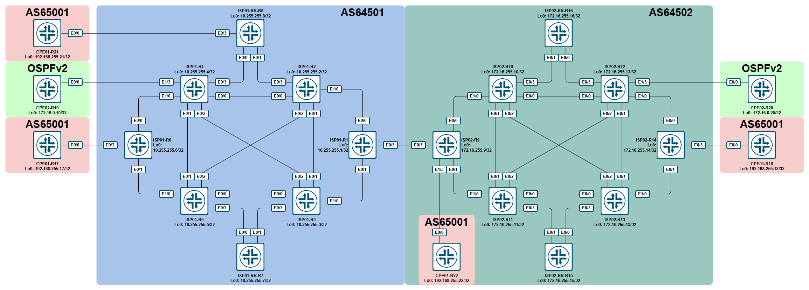

# LAB - Cisco - BGP Option C MPLS L3VPN

- [LAB - Cisco - BGP Option C MPLS L3VPN](#lab---cisco---bgp-option-c-mpls-l3vpn)
  - [Топология](#топология)
  - [Описание](#описание)
  - [Настройка](#настройка)
    - [Настройка -  IPv4 Labeled Unicast](#настройка----ipv4-labeled-unicast)
    - [Настройка -  VPNv4 Unicast RR \<\> RR](#настройка----vpnv4-unicast-rr--rr)
  - [Примененная конфигурация](#примененная-конфигурация)

## Топология



## Описание

В данной лабораторной работе необходимо обеспечить связность между сайтами клиентов, подключенных к разным автономным системам. Для этого необходимо организовать interAS-стык по схеме «option C».

Данную задачу можно разбить на две последовательные подзадачи:

1. Поднятие interAS-стыка в AFI/SAFI IPv4 Labeled-unicast между ASBR’ами.
2. Поднятие interAS-стыков в AFI/SAFI VPNv4 Unicast между рефлекторами, расположенных в разных AS.

## Настройка

### Настройка -  IPv4 Labeled Unicast

**AS64501:**

**R1:**

```cisco
router bgp 64501
 address-family ipv4
  network 10.255.255.1 mask 255.255.255.255
  neighbor 10.255.255.7 activate
  neighbor 10.255.255.8 activate
  neighbor RR send-community
  neighbor RR send-label explicit-null
 exit-address-family
 !
!
```

**R2:**

```cisco
router bgp 64501
 address-family ipv4
  network 10.255.255.2 mask 255.255.255.255
  neighbor 10.255.255.7 activate
  neighbor 10.255.255.8 activate
  neighbor RR send-community
  neighbor RR send-label explicit-null
 exit-address-family
 !
!
```

**R3:**

```cisco
router bgp 64501
 address-family ipv4
  network 10.255.255.3 mask 255.255.255.255
  neighbor 10.255.255.7 activate
  neighbor 10.255.255.8 activate
  neighbor RR send-community
  neighbor RR send-label explicit-null
 exit-address-family
 !
!
```

**R4:**

```cisco
router bgp 64501
 address-family ipv4
  network 10.255.255.4 mask 255.255.255.255
  neighbor 10.255.255.7 activate
  neighbor 10.255.255.8 activate
  neighbor RR send-community
  neighbor RR send-label explicit-null
 exit-address-family
 !
!
```

**R5:**

```cisco
router bgp 64501
 address-family ipv4
  network 10.255.255.5 mask 255.255.255.255
  neighbor 10.255.255.7 activate
  neighbor 10.255.255.8 activate
  neighbor RR send-community
  neighbor RR send-label explicit-null
 exit-address-family
 !
!
```

**R6:**

```cisco
router bgp 64501
 address-family ipv4
  network 10.255.255.6 mask 255.255.255.255
  neighbor 10.255.255.7 activate
  neighbor 10.255.255.8 activate
  neighbor RR send-community
  neighbor RR send-label explicit-null
 exit-address-family
 !
!
```

**R7:**

```cisco
router bgp 64501
 !
 address-family ipv4
  network 10.255.255.7 mask 255.255.255.255
  neighbor 10.255.255.1 activate
  neighbor 10.255.255.2 activate
  neighbor 10.255.255.3 activate
  neighbor 10.255.255.4 activate
  neighbor 10.255.255.5 activate
  neighbor 10.255.255.6 activate
  neighbor 10.255.255.8 activate
  neighbor OWN_RRC send-community
  neighbor OWN_RRC send-label explicit-null
  neighbor OWN_RRC route-reflector-client
  neighbor RRN send-community
  neighbor RRN send-label explicit-null
 exit-address-family
 !
!
```

**R8:**

```cisco
router bgp 64501
 !
 address-family ipv4
  network 10.255.255.8 mask 255.255.255.255
  neighbor 10.255.255.1 activate
  neighbor 10.255.255.2 activate
  neighbor 10.255.255.3 activate
  neighbor 10.255.255.4 activate
  neighbor 10.255.255.5 activate
  neighbor 10.255.255.6 activate
  neighbor 10.255.255.7 activate
  neighbor OWN_RRC send-community
  neighbor OWN_RRC send-label explicit-null
  neighbor OWN_RRC route-reflector-client
  neighbor RRN send-community
  neighbor RRN send-label explicit-null
 exit-address-family
 !
!
```

Проверяем в AS64501:

**R8:**

```cisco
ISP01-RR-R8#show bgp ipv4 unicast | b Network
     Network          Next Hop            Metric LocPrf Weight Path
 r i  10.255.255.1/32  10.255.255.1             0    100      0 i
 r>i                   10.255.255.1             0    100      0 i
 r i  10.255.255.2/32  10.255.255.2             0    100      0 i
 r>i                   10.255.255.2             0    100      0 i
 r i  10.255.255.3/32  10.255.255.3             0    100      0 i
 r>i                   10.255.255.3             0    100      0 i
 r i  10.255.255.4/32  10.255.255.4             0    100      0 i
 r>i                   10.255.255.4             0    100      0 i
 r i  10.255.255.5/32  10.255.255.5             0    100      0 i
 r>i                   10.255.255.5             0    100      0 i
 r i  10.255.255.6/32  10.255.255.6             0    100      0 i
 r>i                   10.255.255.6             0    100      0 i
 r>i  10.255.255.7/32  10.255.255.7             0    100      0 i
 *>   10.255.255.8/32  0.0.0.0                  0         32768 i
ISP01-RR-R8#show bgp ipv4 unicast labels
   Network          Next Hop      In label/Out label
   10.255.255.1/32  10.255.255.1    nolabel/exp-null
                    10.255.255.1    nolabel/exp-null
   10.255.255.2/32  10.255.255.2    nolabel/exp-null
                    10.255.255.2    nolabel/exp-null
   10.255.255.3/32  10.255.255.3    nolabel/exp-null
                    10.255.255.3    nolabel/exp-null
   10.255.255.4/32  10.255.255.4    nolabel/exp-null
                    10.255.255.4    nolabel/exp-null
   10.255.255.5/32  10.255.255.5    nolabel/exp-null
                    10.255.255.5    nolabel/exp-null
   10.255.255.6/32  10.255.255.6    nolabel/exp-null
                    10.255.255.6    nolabel/exp-null
   10.255.255.7/32  10.255.255.7    nolabel/exp-null
   10.255.255.8/32  0.0.0.0         imp-null/nolabel
```

**AS64502:**

**R09:**

```cisco
router bgp 64502
 address-family ipv4
  network 172.16.255.9 mask 255.255.255.255
  neighbor 172.16.255.15 activate
  neighbor 172.16.255.16 activate
  neighbor RR send-community
  neighbor RR send-label explicit-null
 exit-address-family
 !
!
```

**R10:**

```cisco
router bgp 64502
 address-family ipv4
  network 172.16.255.10 mask 255.255.255.255
  neighbor 172.16.255.15 activate
  neighbor 172.16.255.16 activate
  neighbor RR send-community
  neighbor RR send-label explicit-null
 exit-address-family
 !
!
```

**R11:**

```cisco
router bgp 64502
 address-family ipv4
  network 172.16.255.11 mask 255.255.255.255
  neighbor 172.16.255.15 activate
  neighbor 172.16.255.16 activate
  neighbor RR send-community
  neighbor RR send-label explicit-null
 exit-address-family
 !
!
```

**R12:**

```cisco
router bgp 64502
 address-family ipv4
  network 172.16.255.12 mask 255.255.255.255
  neighbor 172.16.255.15 activate
  neighbor 172.16.255.16 activate
  neighbor RR send-community
  neighbor RR send-label explicit-null
 exit-address-family
 !
!
```

**R13:**

```cisco
router bgp 64502
 address-family ipv4
  network 172.16.255.13 mask 255.255.255.255
  neighbor 172.16.255.15 activate
  neighbor 172.16.255.16 activate
  neighbor RR send-community
  neighbor RR send-label explicit-null
 exit-address-family
 !
!
```

**R14:**

```cisco
router bgp 64502
 address-family ipv4
  network 172.16.255.14 mask 255.255.255.255
  neighbor 172.16.255.15 activate
  neighbor 172.16.255.16 activate
  neighbor RR send-community
  neighbor RR send-label explicit-null
 exit-address-family
 !
!
```

**R15:**

```cisco
router bgp 64502
 !
 address-family ipv4
  network 172.16.255.15 mask 255.255.255.255
  neighbor 172.16.255.9  activate
  neighbor 172.16.255.10 activate
  neighbor 172.16.255.11 activate
  neighbor 172.16.255.12 activate
  neighbor 172.16.255.13 activate
  neighbor 172.16.255.14 activate
  neighbor OWN_RRC send-community
  neighbor OWN_RRC send-label explicit-null
  neighbor OWN_RRC route-reflector-client
 exit-address-family
 !
!
```

**R16:**

```cisco
router bgp 64502
 !
 address-family ipv4
  network 172.16.255.16 mask 255.255.255.255
  neighbor 172.16.255.9  activate
  neighbor 172.16.255.10 activate
  neighbor 172.16.255.11 activate
  neighbor 172.16.255.12 activate
  neighbor 172.16.255.13 activate
  neighbor 172.16.255.14 activate
  neighbor OWN_RRC send-community
  neighbor OWN_RRC send-label explicit-null
  neighbor OWN_RRC route-reflector-client
 exit-address-family
 !
!
```

Проверяем в AS64502:

**R15:**

```cisco
ISP02-RR-R15#show bgp ipv4 unicast | b Network
     Network          Next Hop            Metric LocPrf Weight Path
 r>i  172.16.255.9/32  172.16.255.9             0    100      0 i
 r>i  172.16.255.10/32 172.16.255.10            0    100      0 i
 r>i  172.16.255.11/32 172.16.255.11            0    100      0 i
 r>i  172.16.255.12/32 172.16.255.12            0    100      0 i
 r>i  172.16.255.13/32 172.16.255.13            0    100      0 i
 r>i  172.16.255.14/32 172.16.255.14            0    100      0 i
 *>   172.16.255.15/32 0.0.0.0                  0         32768 i
ISP02-RR-R15#show bgp ipv4 unicast labels
   Network          Next Hop      In label/Out label
   172.16.255.9/32  172.16.255.9    nolabel/exp-null
   172.16.255.10/32 172.16.255.10   nolabel/exp-null
   172.16.255.11/32 172.16.255.11   nolabel/exp-null
   172.16.255.12/32 172.16.255.12   nolabel/exp-null
   172.16.255.13/32 172.16.255.13   nolabel/exp-null
   172.16.255.14/32 172.16.255.14   nolabel/exp-null
   172.16.255.15/32 0.0.0.0         imp-null/nolabel
```

Сейчас поднимем BGP-стык между ASBR'ми:

**R1:**

```cisco
router bgp 64501
!
 neighbor 192.0.2.1 remote-as 64502
 neighbor 192.0.2.1 update-source Ethernet0/3
 !
 address-family ipv4
  neighbor 192.0.2.1 activate
  neighbor 192.0.2.1 send-community
  neighbor 192.0.2.1 send-label explicit-null
  neighbor RR next-hop-self
 !
!
```

**R9:**

```cisco
router bgp 64502
!
 neighbor 192.0.2.0 remote-as 64501
 neighbor 192.0.2.0 update-source Ethernet0/3
 !
 address-family ipv4
  neighbor 192.0.2.0 activate
  neighbor 192.0.2.0 send-community
  neighbor 192.0.2.0 send-label explicit-null
  neighbor RR next-hop-self
 !
!
```

Как и в случае с optB, при поднятии BGP-сессии, подразумевающей обмен метками и прохождение MPLS-пакетов, включается MPLS на интерфейсе:

**R1:**

```cisco
ISP01-ASBR-R1#
*Mar 19 13:18:45.522: %BGP-5-ADJCHANGE: neighbor 192.0.2.1 Up
ISP01-ASBR-R1#
*Mar 19 13:18:45.525: %BGP_LMM-6-AUTOGEN1: The mpls bgp forwarding command has been configured on interface: Ethernet0/3
ISP01-ASBR-R1#show mpls interface
Interface              IP            Tunnel   BGP Static Operational
Ethernet0/0            Yes (ldp)     No       No  No     Yes
Ethernet0/1            Yes (ldp)     No       No  No     Yes
Ethernet0/3            No            No       Yes No     Yes
ISP01-ASBR-R1#show ip route 192.0.2.0
Routing entry for 192.0.2.0/24, 3 known subnets
  Attached (3 connections)
  Variably subnetted with 2 masks
C        192.0.2.0/31 is directly connected, Ethernet0/3
L        192.0.2.0/32 is directly connected, Ethernet0/3
C        192.0.2.1/32 is directly connected, Ethernet0/3
ISP01-ASBR-R1#
```

Проверяем RIB и LFIB на ASBR:

**R1:**

```cisco
ISP01-ASBR-R1#show ip route bgp  | b Gateway
Gateway of last resort is not set

      172.16.0.0/32 is subnetted, 8 subnets
B        172.16.255.9 [20/0] via 192.0.2.1, 00:06:26
B        172.16.255.10 [20/0] via 192.0.2.1, 00:06:26
B        172.16.255.11 [20/0] via 192.0.2.1, 00:06:26
B        172.16.255.12 [20/0] via 192.0.2.1, 00:06:26
B        172.16.255.13 [20/0] via 192.0.2.1, 00:06:26
B        172.16.255.14 [20/0] via 192.0.2.1, 00:06:26
B        172.16.255.15 [20/0] via 192.0.2.1, 00:06:26
B        172.16.255.16 [20/0] via 192.0.2.1, 00:06:26
ISP01-ASBR-R1#show mpls forwarding-table next-hop 192.0.2.1
Local      Outgoing   Prefix           Bytes Label   Outgoing   Next Hop
Label      Label      or Tunnel Id     Switched      interface
10000      Pop Label  192.0.2.1/32     0             Et0/3      192.0.2.1
10001      explicit-n 172.16.255.9/32  0             Et0/3      192.0.2.1
10002      90009      172.16.255.10/32 0             Et0/3      192.0.2.1
10011      90008      172.16.255.11/32 0             Et0/3      192.0.2.1
10012      90007      172.16.255.12/32 0             Et0/3      192.0.2.1
10013      90006      172.16.255.13/32 0             Et0/3      192.0.2.1
10014      90005      172.16.255.14/32 0             Et0/3      192.0.2.1
10015      90004      172.16.255.15/32 0             Et0/3      192.0.2.1
10016      90003      172.16.255.16/32 0             Et0/3      192.0.2.1
ISP01-ASBR-R1#
```

Проверяем связность:

**R1:**

```cisco
ISP01-ASBR-R1#ping 172.16.255.9 source 10.255.255.1
Type escape sequence to abort.
Sending 5, 100-byte ICMP Echos to 172.16.255.9, timeout is 2 seconds:
Packet sent with a source address of 10.255.255.1
!!!!!
Success rate is 100 percent (5/5), round-trip min/avg/max = 1/1/1 ms
ISP01-ASBR-R1#ping 172.16.255.15 source 10.255.255.1
Type escape sequence to abort.
Sending 5, 100-byte ICMP Echos to 172.16.255.15, timeout is 2 seconds:
Packet sent with a source address of 10.255.255.1
!!!!!
Success rate is 100 percent (5/5), round-trip min/avg/max = 1/1/2 ms
```

Теперь посмотрим тоже самое на RR:

**R8:**

```cisco
ISP01-RR-R8#show ip route bgp | b Gateway
Gateway of last resort is not set

      172.16.0.0/32 is subnetted, 8 subnets
B        172.16.255.9 [200/0] via 10.255.255.1, 00:16:01
B        172.16.255.10 [200/0] via 10.255.255.1, 00:16:01
B        172.16.255.11 [200/0] via 10.255.255.1, 00:16:01
B        172.16.255.12 [200/0] via 10.255.255.1, 00:16:01
B        172.16.255.13 [200/0] via 10.255.255.1, 00:16:01
B        172.16.255.14 [200/0] via 10.255.255.1, 00:16:01
B        172.16.255.15 [200/0] via 10.255.255.1, 00:16:01
B        172.16.255.16 [200/0] via 10.255.255.1, 00:16:01
ISP01-RR-R8#show mpls forwarding-table next-hop 10.255.255.1
Local      Outgoing   Prefix           Bytes Label   Outgoing   Next Hop
Label      Label      or Tunnel Id     Switched      interface
ISP01-RR-R8#show mpls forwarding-table
Local      Outgoing   Prefix           Bytes Label   Outgoing   Next Hop
Label      Label      or Tunnel Id     Switched      interface
80002      explicit-n 10.255.255.4/32  0             Et0/0      10.4.8.4
80003      40008      10.255.255.6/32  0             Et0/0      10.4.8.4
80004      40006      10.255.255.5/32  0             Et0/0      10.4.8.4
80005      20009      10.255.255.7/32  0             Et0/1      10.2.8.2
           40011      10.255.255.7/32  0             Et0/0      10.4.8.4
80006      explicit-n 10.255.255.2/32  0             Et0/1      10.2.8.2
80007      20005      10.255.255.1/32  0             Et0/1      10.2.8.2
80008      20006      10.255.255.3/32  0             Et0/1      10.2.8.2
80009      Pop Label  10.0.0.8/32[V]   0             aggregate/MGMT
80010      No Label   10.8.21.0/24[V]  0             aggregate/CUST1
80011      No Label   192.168.255.21/32[V]   \
                                       0             Et0/3      10.8.21.21
ISP01-RR-R8#
```

В RIB маршруты есть, а вот в LFIB, как ни странно, соответствия меток и префиксов нужных нет.
Посмотрим, что у нас видно в BGP:

**R8:**

```cisco
ISP01-RR-R8#show bgp ipv4 unicast labels
   Network          Next Hop      In label/Out label
   10.255.255.1/32  10.255.255.1    nolabel/exp-null
                    10.255.255.1    nolabel/exp-null
   10.255.255.2/32  10.255.255.2    nolabel/exp-null
                    10.255.255.2    nolabel/exp-null
   10.255.255.3/32  10.255.255.3    nolabel/exp-null
                    10.255.255.3    nolabel/exp-null
   10.255.255.4/32  10.255.255.4    nolabel/exp-null
                    10.255.255.4    nolabel/exp-null
   10.255.255.5/32  10.255.255.5    nolabel/exp-null
                    10.255.255.5    nolabel/exp-null
   10.255.255.6/32  10.255.255.6    nolabel/exp-null
                    10.255.255.6    nolabel/exp-null
   10.255.255.7/32  10.255.255.7    nolabel/exp-null
   10.255.255.8/32  0.0.0.0         imp-null/nolabel
   172.16.255.9/32  10.255.255.1    nolabel/10001
                    10.255.255.1    nolabel/10001
   172.16.255.10/32 10.255.255.1    nolabel/10002
                    10.255.255.1    nolabel/10002
   172.16.255.11/32 10.255.255.1    nolabel/10011
                    10.255.255.1    nolabel/10011
   172.16.255.12/32 10.255.255.1    nolabel/10012
                    10.255.255.1    nolabel/10012
   172.16.255.13/32 10.255.255.1    nolabel/10013
                    10.255.255.1    nolabel/10013
   172.16.255.14/32 10.255.255.1    nolabel/10014
                    10.255.255.1    nolabel/10014
   172.16.255.15/32 10.255.255.1    nolabel/10015
                    10.255.255.1    nolabel/10015
   172.16.255.16/32 10.255.255.1    nolabel/10016
                    10.255.255.1    nolabel/10016
```

Здесь мы видим, что метки для лупбэков из AS64502 получены. Посмотрим более детально на какой-нибудь из префиксов:

**R8:**

```cisco
ISP01-RR-R8#show bgp ipv4 unicast 172.16.255.9/32
BGP routing table entry for 172.16.255.9/32, version 10
Paths: (2 available, best #2, table default)
  Advertised to update-groups:
     1          2
  Refresh Epoch 1
  64502
    10.255.255.1 (metric 200) from 10.255.255.7 (10.255.255.7)
      Origin IGP, metric 0, localpref 100, valid, internal
      Originator: 10.255.255.1, Cluster list: 10.255.255.7
      mpls labels in/out nolabel/10001
      rx pathid: 0, tx pathid: 0
  Refresh Epoch 5
  64502, (Received from a RR-client)
    10.255.255.1 (metric 200) from 10.255.255.1 (10.255.255.1)
      Origin IGP, metric 0, localpref 100, valid, internal, best
      mpls labels in/out nolabel/10001
      rx pathid: 0, tx pathid: 0x0
ISP01-RR-R8#
```

Мы видим, что маршрут валиден, нормально резолвится через 10.255.255.1.
Давайте глянем на то, что видно в FIB:

**R8:**

```cisco
ISP01-RR-R8#show ip cef 172.16.255.9/32 detail
172.16.255.9/32, epoch 0, flags [rib defined all labels]
  recursive via 10.255.255.1 label 10001
    nexthop 10.2.8.2 Ethernet0/1 label 20005-(local:80007)
ISP01-RR-R8#
```

Здесь мы видим, что используется стек меток: внешняя метка - это метка next-hop'а 10.255.255.1, а внутренняя - это метка, полученная по BGP вместе с префиксом. Т.о., в LSP R8 > R16 используется пара меток на участке R8 - R1, а после выхода с R1 остается только одна метка.
Проверим связность:

**R8:**

```cisco
ISP01-RR-R8#ping 172.16.255.16 source Lo0
Type escape sequence to abort.
Sending 5, 100-byte ICMP Echos to 172.16.255.16, timeout is 2 seconds:
Packet sent with a source address of 10.255.255.8
!!!!!
Success rate is 100 percent (5/5), round-trip min/avg/max = 2/2/2 ms
ISP01-RR-R8#traceroute 172.16.255.16 source Lo0
Type escape sequence to abort.
Tracing the route to 172.16.255.16
VRF info: (vrf in name/id, vrf out name/id)
  1 10.2.8.2 [MPLS: Labels 20005/10016 Exp 0] 3 msec 2 msec 3 msec
  2 10.1.2.1 [MPLS: Labels 0/10016 Exp 0] 3 msec 2 msec 2 msec
  3 192.0.2.1 [MPLS: Label 90003 Exp 0] 3 msec 3 msec 3 msec
  4 172.31.109.10 [MPLS: Label 100005 Exp 0] 3 msec 2 msec 3 msec
  5 172.31.116.16 2 msec *  3 msec
ISP01-RR-R8#
```

Собственно, трейс подтверждает вышесказанное. На R1 происходит своп метки 10016 на 90003 и отдается в сторону R9:

**R1:**

```cisco
ISP01-ASBR-R1#show mpls forwarding-table labels 10016
Local      Outgoing   Prefix           Bytes Label   Outgoing   Next Hop
Label      Label      or Tunnel Id     Switched      interface
10016      90003      172.16.255.16/32 2380          Et0/3      192.0.2.1
ISP01-ASBR-R1#
```

### Настройка -  VPNv4 Unicast RR <> RR

На данный момент у нас есть связность между рефлекторами, поэтому приступаем к настройке eBGP-сессий в VPNv4 Unicast.

**R7 / R8:**

```cisco
router bgp 64501
 neighbor RR_OPT peer-group
 neighbor RR_OPT remote-as 64502
 neighbor RR_OPT update-source Loopback0
 neighbor RR_OPT ebgp-multihop 255
 neighbor 172.16.255.15 peer-group RR_OPT
 neighbor 172.16.255.16 peer-group RR_OPT
 !
 address-family vpnv4 unicast
  neighbor 172.16.255.15 activate
  neighbor 172.16.255.16 activate
  neighbor RR_OPT send-community both
 !
!
```

**R15 / R16:**

```cisco
router bgp 64502
 neighbor RR_OPT peer-group
 neighbor RR_OPT remote-as 64501
 neighbor RR_OPT update-source Loopback0
 neighbor RR_OPT ebgp-multihop 255
 neighbor 10.255.255.7 peer-group RR_OPT
 neighbor 10.255.255.8 peer-group RR_OPT
 !
 address-family vpnv4 unicast
  neighbor 10.255.255.7 activate
  neighbor 10.255.255.8 activate
  neighbor RR_OPT send-community both
 !
!
```

Проверим на R8:

**R8:**

```cisco
ISP01-RR-R8#show bgp vpnv4 unicast all summary | i 64502
172.16.255.15   4        64502      16      17      142    0    0 00:00:47       13
172.16.255.16   4        64502      17      19      142    0    0 00:00:35       13
ISP01-RR-R8#show bgp vpnv4 unicast all neighbors 172.16.255.15 routes | b Netw
     Network          Next Hop            Metric LocPrf Weight Path
Route Distinguisher: 172.16.255.9:11
 *>   10.0.0.9/32      172.16.255.15                          0 64502 ?
Route Distinguisher: 172.16.255.9:10001
 *>   10.9.22.0/24     172.16.255.15                          0 64502 ?
 *>   192.168.255.22/32
                       172.16.255.15                          0 64502 65001 i
Route Distinguisher: 172.16.255.10:11
 *>   10.0.0.10/32     172.16.255.15                          0 64502 ?
Route Distinguisher: 172.16.255.11:11
 *>   10.0.0.11/32     172.16.255.15                          0 64502 ?
Route Distinguisher: 172.16.255.12:11
 *>   10.0.0.12/32     172.16.255.15                          0 64502 ?
Route Distinguisher: 172.16.255.12:10002
 *>   10.112.120.0/24  172.16.255.15                          0 64502 ?
 *>   172.16.0.20/32   172.16.255.15                          0 64502 ?
Route Distinguisher: 172.16.255.13:11
 *>   10.0.0.13/32     172.16.255.15                          0 64502 ?
Route Distinguisher: 172.16.255.14:11
 *>   10.0.0.14/32     172.16.255.15                          0 64502 ?
Route Distinguisher: 172.16.255.14:10001
 *>   10.14.18.0/24    172.16.255.15                          0 64502 ?
 *>   192.168.255.18/32
                       172.16.255.15                          0 64502 65001 i
Route Distinguisher: 172.16.255.15:11
 *>   10.0.0.15/32     172.16.255.15            0             0 64502 ?

Total number of prefixes 13
ISP01-RR-R8#show bgp vpnv4 unicast all 192.168.255.18/32
BGP routing table entry for 172.16.255.14:10001:192.168.255.18/32, version 140
Paths: (3 available, best #3, no table)
  Advertised to update-groups:
     6          7          8
  Refresh Epoch 2
  64502 65001
    172.16.255.16 (metric 200) (via default) from 172.16.255.16 (172.16.255.16)
      Origin IGP, localpref 100, valid, external
      Extended Community: RT:64502:10001
      mpls labels in/out 80030/160001
      rx pathid: 0, tx pathid: 0
  Refresh Epoch 1
  64502 65001
    172.16.255.16 (metric 200) (via default) from 10.255.255.7 (10.255.255.7)
      Origin IGP, metric 0, localpref 100, valid, internal
      Extended Community: RT:64502:10001
      mpls labels in/out 80030/160001
      rx pathid: 0, tx pathid: 0
  Refresh Epoch 1
  64502 65001
    172.16.255.15 (metric 200) (via default) from 172.16.255.15 (172.16.255.15)
      Origin IGP, localpref 100, valid, external, best
      Extended Community: RT:64502:10001
      mpls labels in/out 80030/150019
      rx pathid: 0, tx pathid: 0x0
ISP01-RR-R8#
```

Control-plane у нас сошелся, проверим теперь работу data plane. Для этого сначала для клиентских vrf добавим соответствующие RT из AS64502.

**R4:**

```cisco
vrf definition CUST2
!
 address-family ipv4
  route-target export 64502:10002
  route-target import 64502:10002
 exit-address-family
!
```

**R6:**

```cisco
vrf definition CUST1
!
 address-family ipv4
  route-target export 64502:10001
  route-target import 64502:10001
 exit-address-family
!
```

**R8:**

```cisco
vrf definition CUST1
!
 address-family ipv4
  route-target export 64502:10001
  route-target import 64502:10001
 exit-address-family
!
```

Для начала посмотрим что у нас есть на PE на примере vrf CUST2, на R4:

**R4:**

```ciscp
ISP01-R4#show ip route vrf CUST2 | b Gateway
Gateway of last resort is not set

      10.0.0.0/8 is variably subnetted, 3 subnets, 2 masks
C        10.104.119.0/24 is directly connected, Ethernet1/3
L        10.104.119.104/32 is directly connected, Ethernet1/3
B        10.112.120.0/24 [200/0] via 172.16.255.16, 00:14:55
      172.16.0.0/32 is subnetted, 2 subnets
O        172.16.0.19 [110/11] via 10.104.119.19, 03:52:04, Ethernet1/3
B        172.16.0.20 [200/0] via 172.16.255.16, 00:14:55
ISP01-R4#
ISP01-R4#show bgp vpnv4 unicast vrf CUST2 | b Network
     Network          Next Hop            Metric LocPrf Weight Path
Route Distinguisher: 10.255.255.4:1002 (default for vrf CUST2)
 *>   10.104.119.0/24  0.0.0.0                  0         32768 ?
 *>i  10.112.120.0/24  172.16.255.16            0    100      0 64502 ?
 *>   172.16.0.19/32   10.104.119.19           11         32768 ?
 *>i  172.16.0.20/32   172.16.255.16            0    100      0 64502 ?
ISP01-R4#
ISP01-R4#show bgp vpnv4 unicast vrf CUST2 172.16.0.20/32
BGP routing table entry for 10.255.255.4:1002:172.16.0.20/32, version 105
Paths: (1 available, best #1, table CUST2)
Flag: 0x100
  Not advertised to any peer
  Refresh Epoch 3
  64502, imported path from 172.16.255.12:10002:172.16.0.20/32 (global)
    172.16.255.16 (metric 200) (via default) from 10.255.255.7 (10.255.255.7)
      Origin incomplete, metric 0, localpref 100, valid, internal, best
      Extended Community: RT:64502:10002 OSPF DOMAIN ID:0x0005:0x000027120200
        OSPF RT:0.0.0.0:2:0 OSPF ROUTER ID:10.112.120.12:0
      mpls labels in/out nolabel/160011
      rx pathid: 0, tx pathid: 0x0
ISP01-R4#
```

Здесь мы видим, что маршруты были получены от наших RR, next-hop’ом считается 172.16.255.16, VPN-метка 160011.

Давайте попробуем проверить связность между CPE02-R19 и CPE02-R20:

**R19:**

```cisco
CPE02-R19#ping 172.16.0.20 source Lo0
Type escape sequence to abort.
Sending 5, 100-byte ICMP Echos to 172.16.0.20, timeout is 2 seconds:
Packet sent with a source address of 172.16.0.19
!!!!!
Success rate is 100 percent (5/5), round-trip min/avg/max = 4/4/5 ms
CPE02-R19#traceroute 172.16.0.20 source Lo0
Type escape sequence to abort.
Tracing the route to 172.16.0.20
VRF info: (vrf in name/id, vrf out name/id)
  1 10.104.119.104 1 msec 0 msec 1 msec
  2 10.2.4.2 [MPLS: Labels 20005/10016/160011 Exp 0] 5 msec 4 msec 4 msec
  3 10.1.2.1 [MPLS: Labels 0/10016/160011 Exp 0] 3 msec 3 msec 4 msec
  4 192.0.2.1 [MPLS: Labels 90003/160011 Exp 0] 4 msec 4 msec 4 msec
  5 172.31.109.10 [MPLS: Labels 100005/160011 Exp 0] 4 msec 3 msec 3 msec
  6 172.31.116.16 [MPLS: Labels 0/160011 Exp 0] 4 msec 4 msec 3 msec
  7 10.112.120.12 [MPLS: Labels 0/120001 Exp 0] 3 msec 2 msec 3 msec
  8 10.112.120.20 3 msec *  4 msec
```

Связность есть. Давайте рассмотрим трейс поподробней:

| №   | Запись                                           | Комментарий                                                                                                                                                                                                       |
| :-- | :----------------------------------------------- | :---------------------------------------------------------------------------------------------------------------------------------------------------------------------------------------------------------------- |
| 1   | `10.104.119.104`                                   | Пакет от CPE02-R19 до ISP01-R4                                                                                                                                                                                    |
| 2   | `10.2.4.2 [MPLS: Labels 20005/10016/160011 Exp 0]` | Пакет от ISP01-R4 до ISP01-R2:<br>- PUSH на R4 метку 160011 – VPN-метка префикса 172.16.0.20/32<br>- PUSH на R4 метку 10016 – метка префикса 172.16.255.16/32<br>- PUSH на R4 метку 20005 – метка префикса 10.255.255.1 |
| 3   | `10.1.2.1 [MPLS: Labels 0/10016/160011 Exp 0]`     | Пакет от ISP01-R2 до ISP01-ASBR-R1:<br>- SWAP на R2 метки 20005 на 0 (exp-null)                                                                                                                                     |
| 4   | `192.0.2.1 [MPLS: Labels 90003/160011 Exp 0]`      | Пакет от ISP01-ASBR-R1 до ISP02-ASBR-R9:<br>- POP на R1 метки 0<br>- SWAP метки 10016 на 90003                                                                                                                        |
| 5   | `172.31.109.10 [MPLS: Labels 100005/160011 Exp 0]` | Пакет от ISP02-ASBR-R9 до ISP02-R10:<br>- SWAP на R9 метки 90003 на 100005                                                                                                                                          |
| 6   | `172.31.116.16 [MPLS: Labels 0/160011 Exp 0]`      | Пакет от ISP02-R10 до ISP02-RR-R16:<br>- SWAP на R10 метки 100005 на 0 (exp-null)                                                                                                                                   |
| 7   | `10.112.120.12 [MPLS: Labels 0/120001 Exp 0]`      | Пакет от ISP02-RR-R16 до ISP02-R12:<br>- POP на R16 метки 0<br>- SWAP на R16 метки 160011 на 120001<br>- PUSH на R16 метки 0 (exp-null)                                                                                 |
| 8   | `10.112.120.20`                                    | Пакет от ISP02-R12 до CPE02-R20:<br>- POP на R12 метки 0<br>- POP на R12 метки 120001                                                                                                                                 |

Собственно, из трейса мы видим, что трафик до R20 проходит через ISP02-RR-R16. Визуально, конечно, это выглядит субоптимальным путем, однако, вполне возможно, что PE R12 действительно доступен через RR. На всякий случай сделаем трейс от R4 до R12:

**R4:**

```cisco
ISP01-R4#traceroute 172.16.255.12 source Loopback0
Type escape sequence to abort.
Tracing the route to 172.16.255.12
VRF info: (vrf in name/id, vrf out name/id)
  1 10.2.4.2 [MPLS: Labels 20005/10012 Exp 0] 2 msec 2 msec 1 msec
  2 10.1.2.1 [MPLS: Labels 0/10012 Exp 0] 2 msec 2 msec 2 msec
  3 192.0.2.1 [MPLS: Label 90007 Exp 0] 2 msec 2 msec 2 msec
  4 172.31.109.10 [MPLS: Label 100009 Exp 0] 2 msec 2 msec 2 msec
  5 172.31.112.12 3 msec *  3 msec
ISP01-R4#
```

По трейсу видно, что до ISP02-R12 трафик проходит напрямую от R10, не проходя через ISP02-RR-R16.

Давайте разбираться, почему так получается. Сначала посмотрим на R4:

**R4:**

```cisco
ISP01-R4#show bgp vpnv4 unicast vrf CUST2 172.16.0.20/32
BGP routing table entry for 10.255.255.4:1002:172.16.0.20/32, version 105
Paths: (1 available, best #1, table CUST2)
Flag: 0x100
  Not advertised to any peer
  Refresh Epoch 3
  64502, imported path from 172.16.255.12:10002:172.16.0.20/32 (global)
    172.16.255.16 (metric 200) (via default) from 10.255.255.7 (10.255.255.7)
      Origin incomplete, metric 0, localpref 100, valid, internal, best
      Extended Community: RT:64502:10002 OSPF DOMAIN ID:0x0005:0x000027120200
        OSPF RT:0.0.0.0:2:0 OSPF ROUTER ID:10.112.120.12:0
      mpls labels in/out nolabel/160011
      rx pathid: 0, tx pathid: 0x0
ISP01-R4#
```

Здесь мы видим, что маршрут мы получили от нашего RR 10.255.255.7, в качестве next-hop стоит 172.16.255.16. Почему? А потому что у нас созданы eBGP VPNv4 сессии между RR. Т.к. это eBGP, то по умолчанию в качестве next-hop проставляется адрес соседа, от которого эти маршруты получены (в нашем случае это 172.16.255.15 и 172.16.255.16).

В общем-то, на данный момент все работает, но, все же, лучше привести к нормальному виду. Для это нам необходимо на RR включить команду `next-hop-unchanged` в сторону RR из соседней AS (ну и не забыть переанонсировать маршруты).

**R7 / R8:**

```cisco
router bgp 64501
 !
 address-family vpnv4
  neighbor RR_OPT next-hop-unchanged
 exit-address-family
 !
!
clear bgp vpnv4 unicast * out
```

**R15 / R16:**

```cisco
router bgp 64501
 !
 address-family vpnv4
  neighbor RR_OPT next-hop-unchanged
 exit-address-family
 !
!
clear bgp vpnv4 unicast * out
```

После того, как мы выполнили эти настройки, проверим, что сейчас видно на R4:

**R4:**

```cisco
ISP01-R4#show bgp vpnv4 unicast vrf CUST2 | b Network
     Network          Next Hop            Metric LocPrf Weight Path
Route Distinguisher: 10.255.255.4:1002 (default for vrf CUST2)
 *>   10.104.119.0/24  0.0.0.0                  0         32768 ?
 *>i  10.112.120.0/24  172.16.255.12            0    100      0 64502 ?
 *>   172.16.0.19/32   10.104.119.19           11         32768 ?
 *>i  172.16.0.20/32   172.16.255.12            0    100      0 64502 ?
ISP01-R4#
```

Сейчас у нас в качестве next-hop’ов стоит R12, чего мы и добивались. Проверим прохождение трафика еще и трейсом с CPE02-R19:

**R19:**

```cisco
CPE02-R19#traceroute 172.16.0.20 source Lo0
Type escape sequence to abort.
Tracing the route to 172.16.0.20
VRF info: (vrf in name/id, vrf out name/id)
  1 10.104.119.104 2 msec 35 msec 1 msec
  2 10.2.4.2 [MPLS: Labels 20005/10012/120001 Exp 0] 8 msec 17 msec 18 msec
  3 10.1.2.1 [MPLS: Labels 0/10012/120001 Exp 0] 19 msec 8 msec 8 msec
  4 192.0.2.1 [MPLS: Labels 90007/120001 Exp 0] 8 msec 7 msec 5 msec
  5 172.31.109.10 [MPLS: Labels 100009/120001 Exp 0] 4 msec 3 msec 2 msec
  6 10.112.120.12 [MPLS: Labels 0/120001 Exp 0] 3 msec 2 msec 2 msec
  7 10.112.120.20 3 msec *  9 msec
CPE02-R19#
```

На данный момент трафик на R12 идет напрямую с R10, т.о. мы получили оптимальный путь прохождения трафика.

## Примененная конфигурация

**AS64501:**

**#ISP01-ASBR-R1:**

```cisco
router bgp 64501
 neighbor 192.0.2.1 remote-as 64502
 neighbor 192.0.2.1 update-source Ethernet0/3
 !
 address-family ipv4
  network 10.255.255.1 mask 255.255.255.255
  neighbor 10.255.255.7 activate
  neighbor 10.255.255.8 activate
  neighbor 192.0.2.1 activate
  neighbor 192.0.2.1 send-community
  neighbor 192.0.2.1 send-label explicit-null
  neighbor RR next-hop-self
  neighbor RR send-community
  neighbor RR send-label explicit-null
 exit-address-family
 !
!
```

**#ISP01-R2:**

```cisco
router bgp 64501
 address-family ipv4
  network 10.255.255.2 mask 255.255.255.255
  neighbor 10.255.255.7 activate
  neighbor 10.255.255.8 activate
  neighbor RR send-community
  neighbor RR send-label explicit-null
 exit-address-family
 !
!
```

**#ISP01-R3:**

```cisco
router bgp 64501
 address-family ipv4
  network 10.255.255.3 mask 255.255.255.255
  neighbor 10.255.255.7 activate
  neighbor 10.255.255.8 activate
  neighbor RR send-community
  neighbor RR send-label explicit-null
 exit-address-family
 !
!
```

**#ISP01-R4:**

```cisco
vrf definition CUST2
!
 address-family ipv4
  route-target export 64502:10002
  route-target import 64502:10002
 exit-address-family
!
router bgp 64501
 address-family ipv4
  network 10.255.255.4 mask 255.255.255.255
  neighbor 10.255.255.7 activate
  neighbor 10.255.255.8 activate
  neighbor RR send-community
  neighbor RR send-label explicit-null
 exit-address-family
 !
!
```

**#ISP01-R5:**

```cisco
router bgp 64501
 address-family ipv4
  network 10.255.255.5 mask 255.255.255.255
  neighbor 10.255.255.7 activate
  neighbor 10.255.255.8 activate
  neighbor RR send-community
  neighbor RR send-label explicit-null
 exit-address-family
 !
!
```

**#ISP01-R6:**

```cisco
vrf definition CUST1
!
 address-family ipv4
  route-target export 64502:10001
  route-target import 64502:10001
 exit-address-family
!
router bgp 64501
 address-family ipv4
  network 10.255.255.6 mask 255.255.255.255
  neighbor 10.255.255.7 activate
  neighbor 10.255.255.8 activate
  neighbor RR send-community
  neighbor RR send-label explicit-null
 exit-address-family
 !
!
```

**#ISP-RR-R7:**

```cisco
router bgp 64501
 neighbor RR_OPT peer-group
 neighbor RR_OPT remote-as 64502
 neighbor RR_OPT update-source Loopback0
 neighbor RR_OPT ebgp-multihop 255
 neighbor 172.16.255.15 peer-group RR_OPT
 neighbor 172.16.255.16 peer-group RR_OPT
 !
 address-family ipv4
  network 10.255.255.7 mask 255.255.255.255
  neighbor 10.255.255.1 activate
  neighbor 10.255.255.2 activate
  neighbor 10.255.255.3 activate
  neighbor 10.255.255.4 activate
  neighbor 10.255.255.5 activate
  neighbor 10.255.255.6 activate
  neighbor 10.255.255.8 activate
  neighbor OWN_RRC send-community
  neighbor OWN_RRC send-label explicit-null
  neighbor OWN_RRC route-reflector-client
  neighbor RRN send-community
  neighbor RRN send-label explicit-null
 exit-address-family
 !
 address-family vpnv4 unicast
  neighbor 172.16.255.15 activate
  neighbor 172.16.255.16 activate
  neighbor RR_OPT send-community both
  neighbor RR_OPT next-hop-unchanged
 !
!
```

**#ISP-RR-R8:**

```cisco
vrf definition CUST1
!
 address-family ipv4
  route-target export 64502:10001
  route-target import 64502:10001
 exit-address-family
!
router bgp 64501
 neighbor RR_OPT peer-group
 neighbor RR_OPT remote-as 64502
 neighbor RR_OPT update-source Loopback0
 neighbor RR_OPT ebgp-multihop 255
 neighbor 172.16.255.15 peer-group RR_OPT
 neighbor 172.16.255.16 peer-group RR_OPT
 !
 address-family ipv4
  network 10.255.255.8 mask 255.255.255.255
  neighbor 10.255.255.1 activate
  neighbor 10.255.255.2 activate
  neighbor 10.255.255.3 activate
  neighbor 10.255.255.4 activate
  neighbor 10.255.255.5 activate
  neighbor 10.255.255.6 activate
  neighbor 10.255.255.7 activate
  neighbor OWN_RRC send-community
  neighbor OWN_RRC send-label explicit-null
  neighbor OWN_RRC route-reflector-client
  neighbor RRN send-community
  neighbor RRN send-label explicit-null
 exit-address-family
 !
 address-family vpnv4 unicast
  neighbor 172.16.255.15 activate
  neighbor 172.16.255.16 activate
  neighbor RR_OPT send-community both
  neighbor RR_OPT next-hop-unchanged
 !
!
```

**AS64502:**

**#ISP02-ASBR-R09:**

```cisco
router bgp 64502
 neighbor 192.0.2.0 remote-as 64501
 neighbor 192.0.2.0 update-source Ethernet0/3
 !
 address-family ipv4
  network 172.16.255.9 mask 255.255.255.255
  neighbor 172.16.255.15 activate
  neighbor 172.16.255.16 activate
  neighbor 192.0.2.0 activate
  neighbor 192.0.2.0 send-community
  neighbor 192.0.2.0 send-label explicit-null
  neighbor RR send-community
  neighbor RR send-label explicit-null
  neighbor RR next-hop-self
 exit-address-family
 !
!
```

**#ISP02-R10:**

```cisco
router bgp 64502
 address-family ipv4
  network 172.16.255.10 mask 255.255.255.255
  neighbor 172.16.255.15 activate
  neighbor 172.16.255.16 activate
  neighbor RR send-community
  neighbor RR send-label explicit-null
 exit-address-family
 !
!
```

**#ISP02-R11:**

```cisco
router bgp 64502
 address-family ipv4
  network 172.16.255.11 mask 255.255.255.255
  neighbor 172.16.255.15 activate
  neighbor 172.16.255.16 activate
  neighbor RR send-community
  neighbor RR send-label explicit-null
 exit-address-family
 !
!
```

**#ISP02-R12:**

```cisco
router bgp 64502
 address-family ipv4
  network 172.16.255.12 mask 255.255.255.255
  neighbor 172.16.255.15 activate
  neighbor 172.16.255.16 activate
  neighbor RR send-community
  neighbor RR send-label explicit-null
 exit-address-family
 !
!
```

**#ISP02-R13:**

```cisco
router bgp 64502
 address-family ipv4
  network 172.16.255.13 mask 255.255.255.255
  neighbor 172.16.255.15 activate
  neighbor 172.16.255.16 activate
  neighbor RR send-community
  neighbor RR send-label explicit-null
 exit-address-family
 !
!
```

**#ISP02-R14:**

```cisco
router bgp 64502
 address-family ipv4
  network 172.16.255.14 mask 255.255.255.255
  neighbor 172.16.255.15 activate
  neighbor 172.16.255.16 activate
  neighbor RR send-community
  neighbor RR send-label explicit-null
 exit-address-family
 !
!
```

**#ISP02-RR-R15:**

```cisco
router bgp 64502
 neighbor RR_OPT peer-group
 neighbor RR_OPT remote-as 64501
 neighbor RR_OPT update-source Loopback0
 neighbor RR_OPT ebgp-multihop 255
 neighbor 10.255.255.7 peer-group RR_OPT
 neighbor 10.255.255.8 peer-group RR_OPT
 !
 address-family ipv4
  network 172.16.255.15 mask 255.255.255.255
  neighbor 172.16.255.9  activate
  neighbor 172.16.255.10 activate
  neighbor 172.16.255.11 activate
  neighbor 172.16.255.12 activate
  neighbor 172.16.255.13 activate
  neighbor 172.16.255.14 activate
  neighbor OWN_RRC send-community
  neighbor OWN_RRC send-label explicit-null
  neighbor OWN_RRC route-reflector-client
 exit-address-family
 !
 address-family vpnv4 unicast
  neighbor 10.255.255.7 activate
  neighbor 10.255.255.8 activate
  neighbor RR_OPT send-community both
  neighbor RR_OPT next-hop-unchanged
 !
!
```

**#ISP02-RR-R16:**

```cisco
router bgp 64502
 neighbor RR_OPT peer-group
 neighbor RR_OPT remote-as 64501
 neighbor RR_OPT update-source Loopback0
 neighbor RR_OPT ebgp-multihop 255
 neighbor 10.255.255.7 peer-group RR_OPT
 neighbor 10.255.255.8 peer-group RR_OPT
 !
 address-family ipv4
  network 172.16.255.16 mask 255.255.255.255
  neighbor 172.16.255.9  activate
  neighbor 172.16.255.10 activate
  neighbor 172.16.255.11 activate
  neighbor 172.16.255.12 activate
  neighbor 172.16.255.13 activate
  neighbor 172.16.255.14 activate
  neighbor OWN_RRC send-community
  neighbor OWN_RRC send-label explicit-null
  neighbor OWN_RRC route-reflector-client
 exit-address-family
 !
 address-family vpnv4 unicast
  neighbor 10.255.255.7 activate
  neighbor 10.255.255.8 activate
  neighbor RR_OPT send-community both
  neighbor RR_OPT next-hop-unchanged
 !
!
```
