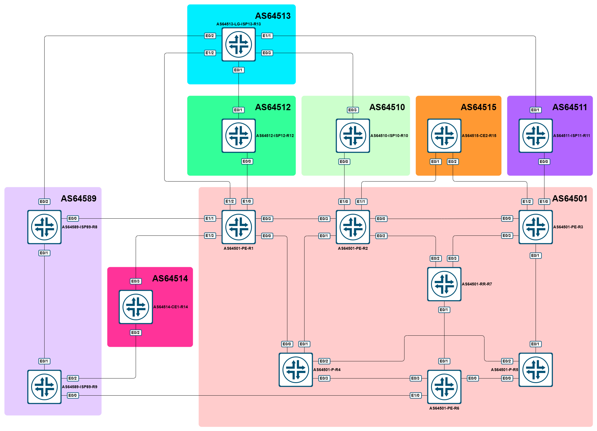

# LAB - Cisco - BGP Policies

- [LAB - Cisco - BGP Policies](#lab---cisco---bgp-policies)
  - [Топология](#топология)
  - [Задания](#задания)
  - [Информация об адресации](#информация-об-адресации)
  - [Cisco - BGP Policies](#cisco---bgp-policies)
    - [Cisco - BGP Policies - настройка CE1](#cisco---bgp-policies---настройка-ce1)
    - [Cisco - BGP Policies - настройка CE2](#cisco---bgp-policies---настройка-ce2)
    - [Cisco - BGP Policies - настройка AS64501](#cisco---bgp-policies---настройка-as64501)
      - [Cisco - BGP Policies - настройка AS64501 - interAS filtering](#cisco---bgp-policies---настройка-as64501---interas-filtering)
      - [Cisco - BGP Policies - настройка AS64501 - RTBH](#cisco---bgp-policies---настройка-as64501---rtbh)
      - [Cisco - BGP Policies - настройка AS64501 - prefix manipulation](#cisco---bgp-policies---настройка-as64501---prefix-manipulation)

## Топология



Используемые образы:

- IOL: `i86bi_LinuxL3-AdvEnterpriseK9-M2_157_3_May_2018.bin`

Топология для EVE-NG / PNETLab:

- EVE-NG CE: [eve_ng_topology_lab_cisco_bgp_policies.zip](./topologies/eve_ng_topology_lab_cisco_bgp_policies.zip)

## Задания

- CE1:
  1. Необходимо отфильтровать анонсы таким образом, чтобы перестать быть транзитной AS.
- CE2:
  1. Исходящий трафик должен балансироваться между обоими стыками.
  2. Входящий трафик должен проходить только через R2 <> R15.
- AS64501:
  1. На всех стыках inter-AS стыках необходимо фильтровать анонсы, не пропуская серую адресацию и префиксы более узкие, чем /24.
  2. Реализовать RTBH.
  3. Реализовать возможность управления клиентами метриками и анонсами в сторону других операторов:
      1. запрет анонсов за пределы AS64501:
         1. в сторону определенного оператора;
         2. полный запрет анонсов в сторону других операторов (не через no-export).
      2. выставление as-path-prepend (+2, +3, +4)
         1. в сторону определенного оператора;
         2. в сторону всех
      3. выставление local-preference в 300 (увеличение приоритета)

## Информация об адресации

| AS Number | Summary prefix |
| :-------: | :------------: |
|  AS64501  |   1.0.0.0/8    |
|  AS64589  |   89.0.0.0/8   |
|  AS64510  |  110.0.0.0/8   |
|  AS64511  |   11.0.0.0/8   |
|  AS64512  |   12.0.0.0/8   |
|  AS64513  |   13.0.0.0/8   |
|  AS64514  |  64.5.14.0/24  |
|  AS64515  |  64.5.15.0/24  |

| Device |  Interface  |  IP Address   |
| :----: | :---------: | :-----------: |
|   R1   | Ethernet0/0 |  10.1.4.1/24  |
|   R1   | Ethernet0/3 |  10.1.2.1/24  |
|   R1   | Ethernet1/0 |  1.1.0.0/31   |
|   R1   | Ethernet1/1 |  1.1.0.2/31   |
|   R1   | Ethernet1/2 |  13.1.0.3/31  |
|   R1   | Ethernet1/3 |  1.2.0.0/31   |
|   R1   |  Loopback0  |  1.0.0.1/32   |
|   R2   | Ethernet0/0 |  10.2.3.2/24  |
|   R2   | Ethernet0/1 |  10.2.4.2/24  |
|   R2   | Ethernet0/2 |  10.2.7.2/24  |
|   R2   | Ethernet0/3 |  10.1.2.2/24  |
|   R2   | Ethernet1/0 |  1.1.0.4/31   |
|   R2   | Ethernet1/1 |  1.2.0.2/31   |
|   R2   |  Loopback0  |  1.0.0.2/32   |
|   R3   | Ethernet0/0 |  10.2.3.3/24  |
|   R3   | Ethernet0/1 |  10.3.5.3/24  |
|   R3   | Ethernet0/3 |  10.3.7.3/24  |
|   R3   | Ethernet1/0 |  1.1.0.6/31   |
|   R3   | Ethernet1/2 |  1.2.0.4/31   |
|   R3   |  Loopback0  |  1.0.0.3/32   |
|   R4   | Ethernet0/0 |  10.1.4.4/24  |
|   R4   | Ethernet0/1 |  10.2.4.4/24  |
|   R4   | Ethernet0/2 |  10.4.5.4/24  |
|   R4   | Ethernet0/3 |  10.4.6.4/24  |
|   R4   |  Loopback0  |  1.0.0.4/32   |
|   R5   | Ethernet0/0 |  10.5.6.5/24  |
|   R5   | Ethernet0/1 |  10.3.5.5/24  |
|   R5   | Ethernet0/2 |  10.4.5.5/24  |
|   R5   |  Loopback0  |  1.0.0.5/32   |
|   R6   | Ethernet0/0 |  10.5.6.6/24  |
|   R6   | Ethernet0/1 |  10.6.7.6/24  |
|   R6   | Ethernet0/3 |  10.4.6.6/24  |
|   R6   | Ethernet1/0 |  1.1.0.8/31   |
|   R6   |  Loopback0  |  1.0.0.6/32   |
|   R7   | Ethernet0/1 |  10.6.7.7/24  |
|   R7   | Ethernet0/2 |  10.2.7.7/24  |
|   R7   | Ethernet0/3 |  10.3.7.7/24  |
|   R7   |  Loopback0  |  1.0.0.7/32   |
|   R8   | Ethernet0/0 |  1.1.0.3/31   |
|   R8   | Ethernet0/1 |  89.1.0.0/31  |
|   R8   | Ethernet0/2 |  13.1.0.1/31  |
|   R8   |  Loopback0  |  89.0.0.8/32  |
|   R9   | Ethernet0/0 |  1.1.0.9/31   |
|   R9   | Ethernet0/1 |  89.1.0.1/31  |
|   R9   | Ethernet0/2 |  89.2.0.0/31  |
|   R9   |  Loopback0  |  89.0.0.9/32  |
|  R10   | Ethernet0/0 |  1.1.0.5/31   |
|  R10   | Ethernet0/3 |  13.1.0.7/31  |
|  R10   |  Loopback0  | 110.0.0.10/32 |
|  R11   | Ethernet0/0 |  1.1.0.7/31   |
|  R11   | Ethernet0/1 |  13.1.0.9/31  |
|  R11   |  Loopback0  | 11.0.0.11/32  |
|  R12   | Ethernet0/0 |  1.1.0.1/31   |
|  R12   | Ethernet0/1 |  13.1.0.5/31  |
|  R12   |  Loopback0  | 12.0.0.12/32  |
|  R13   | Ethernet0/1 |  13.1.0.4/31  |
|  R13   | Ethernet0/2 |  13.1.0.0/31  |
|  R13   | Ethernet0/3 |  13.1.0.6/31  |
|  R13   | Ethernet1/1 |  13.1.0.8/31  |
|  R13   | Ethernet1/2 |  13.1.0.2/31  |
|  R13   |  Loopback0  | 13.0.0.13/32  |
|  R14   | Ethernet0/2 |  89.2.0.1/31  |
|  R14   | Ethernet0/3 |  1.2.0.1/31   |
|  R14   |  Loopback0  | 64.5.14.14/32 |
|  R15   | Ethernet0/1 |  1.2.0.3/31   |
|  R15   | Ethernet0/2 |  1.2.0.5/31   |
|  R15   |  Loopback0  | 64.5.15.15/32 |

## Cisco - BGP Policies

Итак, на начало работ у нас настроена вся адресация, настроены IGP, где необходимо (AS64501 и AS64589) и подняты все BGP-сессии (только сессии, без каких-либо дополнительных настроек).

### Cisco - BGP Policies - настройка CE1

Начнем с клиента CE1, а именно сделаем его обычным «клиентом», а не участником IP-транзита.

Для начала посмотрим, что у нас в наличии на CE1-R14:

**CE1-R14:**

```cisco
AS64514-CE1-R14#show bgp ipv4 unicast summary | b Neighbor
Neighbor        V           AS MsgRcvd MsgSent   TblVer  InQ OutQ Up/Down  State/PfxRcd
1.2.0.0         4        64501      16      20       26    0    0 00:04:13       14
89.2.0.0        4        64589      19      20       26    0    0 00:04:13       23
AS64514-CE1-R14#show bgp ipv4 unicast | b Network
     Network          Next Hop            Metric LocPrf Weight Path
 *    1.0.0.0          89.2.0.0                               0 64589 64501 i
 *>                    1.2.0.0                  0             0 64501 i
 *    1.0.0.1/32       89.2.0.0                               0 64589 64501 ?
 *>                    1.2.0.0                  0             0 64501 ?
 *>   1.0.0.2/32       89.2.0.0                               0 64589 64513 64510 64501 ?
 *>   1.0.0.3/32       89.2.0.0                               0 64589 64513 64511 64501 ?
 *>   1.0.0.6/32       89.2.0.0                               0 64589 64501 ?
 *    1.1.0.0/31       89.2.0.0                               0 64589 64501 ?
 *>                    1.2.0.0                  0             0 64501 ?
 *    1.1.0.2/31       89.2.0.0                               0 64589 64501 ?
 *>                    1.2.0.0                  0             0 64501 ?
 *>   1.1.0.4/31       89.2.0.0                               0 64589 64513 64510 64501 ?
 *>   1.1.0.6/31       89.2.0.0                               0 64589 64513 64511 64501 ?
 *>   1.1.0.8/31       89.2.0.0                               0 64589 64501 ?
 r    1.2.0.0/31       89.2.0.0                               0 64589 64501 ?
 r>                    1.2.0.0                  0             0 64501 ?
 *>   1.2.0.2/31       89.2.0.0                               0 64589 64513 64510 64501 ?
 *>   1.2.0.4/31       89.2.0.0                               0 64589 64513 64511 64501 ?
 *    11.0.0.0         89.2.0.0                               0 64589 64513 64511 i
 *>                    1.2.0.0                                0 64501 64513 64511 i
 *    12.0.0.0         89.2.0.0                               0 64589 64501 64512 i
 *>                    1.2.0.0                                0 64501 64512 i
 *    13.0.0.0         89.2.0.0                               0 64589 64513 i
 *>                    1.2.0.0                                0 64501 64513 i
 *>   64.5.14.0/24     0.0.0.0                  0         32768 i
 *>   64.5.15.0/24     89.2.0.0                               0 64589 64513 64511 64501 64515 i
 *    89.0.0.0         1.2.0.0                                0 64501 64589 i
 *>                    89.2.0.0                 0             0 64589 i
 *>   89.0.0.8/32      89.2.0.0                               0 64589 ?
 *                     1.2.0.0                                0 64501 64589 ?
 *    89.0.0.9/32      1.2.0.0                                0 64501 64589 ?
 *>                    89.2.0.0                 0             0 64589 ?
 *    89.1.0.0/31      1.2.0.0                                0 64501 64589 ?
 *>                    89.2.0.0                 0             0 64589 ?
 r    89.2.0.0/31      1.2.0.0                                0 64501 64589 ?
 r>                    89.2.0.0                 0             0 64589 ?
 *    110.0.0.0        89.2.0.0                               0 64589 64513 64510 i
 *>                    1.2.0.0                                0 64501 64513 64510 i
AS64514-CE1-R14#
```

Исходя из выводов выше, мы получаем по условному Full view от каждого из соседей (AS64589-R9 и AS64501-R1).

Посмотрим, что мы отдаем каждому из них:

**CE1-R14:**

```cisco
AS64514-CE1-R14#show bgp ipv4 unicast neighbor 1.2.0.0 advertised-route | b Network
     Network          Next Hop            Metric LocPrf Weight Path
 *>   1.0.0.0          1.2.0.0                  0             0 64501 i
 *>   1.0.0.1/32       1.2.0.0                  0             0 64501 ?
 *>   1.0.0.2/32       89.2.0.0                               0 64589 64513 64510 64501 ?
 *>   1.0.0.3/32       89.2.0.0                               0 64589 64513 64511 64501 ?
 *>   1.0.0.6/32       89.2.0.0                               0 64589 64501 ?
 *>   1.1.0.0/31       1.2.0.0                  0             0 64501 ?
 *>   1.1.0.2/31       1.2.0.0                  0             0 64501 ?
 *>   1.1.0.4/31       89.2.0.0                               0 64589 64513 64510 64501 ?
 *>   1.1.0.6/31       89.2.0.0                               0 64589 64513 64511 64501 ?
 *>   1.1.0.8/31       89.2.0.0                               0 64589 64501 ?
 r>   1.2.0.0/31       1.2.0.0                  0             0 64501 ?
 *>   1.2.0.2/31       89.2.0.0                               0 64589 64513 64510 64501 ?
 *>   1.2.0.4/31       89.2.0.0                               0 64589 64513 64511 64501 ?
 *>   11.0.0.0         1.2.0.0                                0 64501 64513 64511 i
 *>   12.0.0.0         1.2.0.0                                0 64501 64512 i
 *>   13.0.0.0         1.2.0.0                                0 64501 64513 i
 *>   64.5.14.0/24     0.0.0.0                  0         32768 i
 *>   64.5.15.0/24     89.2.0.0                               0 64589 64513 64511 64501 64515 i
 *>   89.0.0.0         89.2.0.0                 0             0 64589 i
 *>   89.0.0.8/32      89.2.0.0                               0 64589 ?
 *>   89.0.0.9/32      89.2.0.0                 0             0 64589 ?
 *>   89.1.0.0/31      89.2.0.0                 0             0 64589 ?
 r>   89.2.0.0/31      89.2.0.0                 0             0 64589 ?
 *>   110.0.0.0        1.2.0.0                                0 64501 64513 64510 i

Total number of prefixes 24
AS64514-CE1-R14#show bgp ipv4 unicast neighbor 89.2.0.0 advertised-route | b Network
     Network          Next Hop            Metric LocPrf Weight Path
 *>   1.0.0.0          1.2.0.0                  0             0 64501 i
 *>   1.0.0.1/32       1.2.0.0                  0             0 64501 ?
 *>   1.0.0.2/32       89.2.0.0                               0 64589 64513 64510 64501 ?
 *>   1.0.0.3/32       89.2.0.0                               0 64589 64513 64511 64501 ?
 *>   1.0.0.6/32       89.2.0.0                               0 64589 64501 ?
 *>   1.1.0.0/31       1.2.0.0                  0             0 64501 ?
 *>   1.1.0.2/31       1.2.0.0                  0             0 64501 ?
 *>   1.1.0.4/31       89.2.0.0                               0 64589 64513 64510 64501 ?
 *>   1.1.0.6/31       89.2.0.0                               0 64589 64513 64511 64501 ?
 *>   1.1.0.8/31       89.2.0.0                               0 64589 64501 ?
 r>   1.2.0.0/31       1.2.0.0                  0             0 64501 ?
 *>   1.2.0.2/31       89.2.0.0                               0 64589 64513 64510 64501 ?
 *>   1.2.0.4/31       89.2.0.0                               0 64589 64513 64511 64501 ?
 *>   11.0.0.0         1.2.0.0                                0 64501 64513 64511 i
 *>   12.0.0.0         1.2.0.0                                0 64501 64512 i
 *>   13.0.0.0         1.2.0.0                                0 64501 64513 i
 *>   64.5.14.0/24     0.0.0.0                  0         32768 i
 *>   64.5.15.0/24     89.2.0.0                               0 64589 64513 64511 64501 64515 i
 *>   89.0.0.0         89.2.0.0                 0             0 64589 i
 *>   89.0.0.8/32      89.2.0.0                               0 64589 ?
 *>   89.0.0.9/32      89.2.0.0                 0             0 64589 ?
 *>   89.1.0.0/31      89.2.0.0                 0             0 64589 ?
 r>   89.2.0.0/31      89.2.0.0                 0             0 64589 ?
 *>   110.0.0.0        1.2.0.0                                0 64501 64513 64510 i

Total number of prefixes 24
AS64514-CE1-R14#
```

Ожидаемо, мы, как и операторы, отдаем FV. Давайте это исправим.

Нам необходимо отдавать только свои префиксы в сторону обоих операторов. В данном случае, речь идет о префиксе 64.5.14.0/24.

Чтобы отдавать только его, воспользуемся следующими инструментами:

1. Prefix-list
2. Route-map
3. AS-PATH ACL

В сторону AS64589 отфильтруем только наши локальные префиксы на основе AS-PATH. Для этого сначала создадим AS-PATH ACL, которые настраиваются на основе регулярных выражений:

**CE1-R14:**

```cisco
ip as-path access-list 89 permit ^$
!
router bgp 64514
 address-family ipv4
  neighbor 89.2.0.0 filter-list 89 out
 exit-address-family
!
```

И, не забыв обновить, посмотрим, что получилось:

**CE1-R14:**

```cisco
AS64514-CE1-R14#clear bgp ipv4 unicast 89.2.0.0 out
AS64514-CE1-R14#show bgp ipv4 unicast neighbor 89.2.0.0 advertised-routes | b Network
     Network          Next Hop            Metric LocPrf Weight Path
 *>   64.5.14.0/24     0.0.0.0                  0         32768 i

Total number of prefixes 1
AS64514-CE1-R14#
```

Однако, данный фильтр не поможет нам ограничить отправку каких-либо маршрутов, которые мы не захотим отправлять. Для примера, временно создадим Loopback14 с адресом 10.14.14.14/32 и добавим его в процесс BGP:

**CE1-R14:**

```cisco
interface Loopback14
 ip address 10.14.14.14 255.255.255.255
!
router bgp 64514
 address-family ipv4
  network 10.14.14.14 mask 255.255.255.255
 exit-address-family
!
```

Теперь проверим:

**CE1-R14:**

```cisco
AS64514-CE1-R14#show bgp ipv4 unicast neighbor 89.2.0.0 advertised-routes | b Network
     Network          Next Hop            Metric LocPrf Weight Path
 *>   10.14.14.14/32   0.0.0.0                  0         32768 i
 *>   64.5.14.0/24     0.0.0.0                  0         32768 i

Total number of prefixes 2
```

Как и ожидалось, этот префикс появился в анонсах.

Давайте попробуем исправить эту досадную оплошность. Для этого создадим и применим префикс-лист.

**CE1-R14:**

```cisco
ip prefix-list PL_AS64514_NET permit 64.5.14.0/24
!
router bgp 64514
 address-family ipv4
  neighbor 89.2.0.0 prefix-list PL_AS64514_NET out
 exit-address-family
!
```

Проверяем:

**CE1-R14:**

```cisco
AS64514-CE1-R14#clear bgp ipv4 unicast * out
AS64514-CE1-R14#show bgp ipv4 unicast neighbor 89.2.0.0 advertised-routes | b Network
     Network          Next Hop            Metric LocPrf Weight Path
 *>   64.5.14.0/24     0.0.0.0                  0         32768 i

Total number of prefixes 1
AS64514-CE1-R14#
```

Посмотрим на текущую конфигурацию:

**CE1-R14:**

```cisco
AS64514-CE1-R14#show run part router bgp 64514 | b router
router bgp 64514
 bgp log-neighbor-changes
 neighbor 1.2.0.0 remote-as 64501
 neighbor 89.2.0.0 remote-as 64589
 !
 address-family ipv4
  network 10.14.14.14 mask 255.255.255.255
  network 64.5.14.0 mask 255.255.255.0
  neighbor 1.2.0.0 activate
  neighbor 89.2.0.0 activate
  neighbor 89.2.0.0 prefix-list PL_AS64514_NET out
  neighbor 89.2.0.0 filter-list 89 out
 exit-address-family
!
!
end
```

Мы видим то, что у нас применены и работают оба фильтра. Хотя, строго говоря, фильтрация по AS-PATH в данном случае избыточна, т.к. префикс-лист жестко фильтрует по самому префиксу.

Кстати, если удалить сам префикс-лист, без удаления из конфига BGP, то он просто не будет применяться:

**CE1-R14:**

```cisco
AS64514-CE1-R14(config)#no ip prefix-list PL_AS64514_NET
AS64514-CE1-R14(config)#^Z
AS64514-CE1-R14#clear b
*Jul 13 11:13:22.185: %SYS-5-CONFIG_I: Configured from console by console
AS64514-CE1-R14#clear bgp ipv4 unicast * out
AS64514-CE1-R14#show bgp ipv4 unicast neighbor 89.2.0.0 advertised-routes | b Network
     Network          Next Hop            Metric LocPrf Weight Path
 *>   10.14.14.14/32   0.0.0.0                  0         32768 i
 *>   64.5.14.0/24     0.0.0.0                  0         32768 i

Total number of prefixes 2
AS64514-CE1-R14#
```

Как мы видим, в анонсах снова появился 10.14.14.14/32.

С одним соседом мы разобрались, теперь давайте займемся стыком с AS64514.

Здесь мы воспользуемся уже более интересным инструментом, а именно полноценной политикой, которая на IOS/IOS-XE называется route-map.

Т.к. сейчас у нас стоит задача только отфильтровать нужные префиксы в сторону соседа, то создадим весьма простую политику и сразу же применим ее:

**CE1-R14:**

```cisco
route-map RM_BGP_AS64501_OUT permit 10
 match ip address prefix-list PL_AS64514_NET
!
router bgp 64514
 address-family ipv4
  neighbor 1.2.0.0 route-map RM_BGP_AS64501_OUT out
 !
```

Как видно, мы переиспользовали префикс-лист PL_AS64514_NET, указав в route-map что пропускаем только то, что попадает под него (т.е. 64.5.14.0/24).

Проверяем:

**CE1-R14:**

```cisco
AS64514-CE1-R14#clear bgp ipv4 unicast * out
AS64514-CE1-R14#show bgp ipv4 unicast neighbor 1.2.0.0 advertised-routes | b Network
     Network          Next Hop            Metric LocPrf Weight Path
 *>   64.5.14.0/24     0.0.0.0                  0         32768 i

Total number of prefixes 1
AS64514-CE1-R14#
```

Ура, получилось. А теперь давайте представим такую ситуацию: в какой-то момент, кто-то удалил настройки для соседа 89.2.0.0. Вы, конечно, само по себе соседство восстановили, но что там было прикручено из фильтров прямо сейчас не помните. Чтобы не давать и шанса возможности превратиться в транзитную AS, можно воспользоваться т.н. well-known community.

Well-known-communities (взято с <http://xgu.ru/wiki/BGP_community>):

- **no-export (0xFFFFFF01)** — Все маршруты, которые передаются с таким значением атрибута community не должны анонсироваться за пределы конфедерации (автономная система, которая не является частью конфедерации считается конфедерацией). То есть, маршруты не анонсируются EBGP-соседям, но анонсируются внешним соседям в конфедерации.
- **no-advertise (0xFFFFFF02)** — Все маршруты, которые передаются с таким значением атрибута community не должны анонсироваться другим BGP-соседям.
- **no-export-subconfed (0xFFFFFF03)** — Все маршруты, которые передаются с таким значением атрибута community не должны анонсироваться внешним BGP-соседям (ни внешним в конфедерации, ни настоящим внешним соседям). В Cisco это значение встречается и под названием local-as.

В нашем случае, нас будет интересовать коммьюнити no-advertise, т.к. в AS64514 только один маршрутизатор :) и политика будет выглядеть примерно так: на все входящие анонсы мы добавляем коммьюнити no-advertise:

**CE1-R14:**

```cisco
route-map RM_BGP_SET_NO_ADV_IN permit 10
 set community no-advertise
!
```

Давайте теперь отключим все фильтры исходящих анонсов в сторону 89.2.0.0:

**CE1-R14:**

```cisco
AS64514-CE1-R14(config)#router bgp 64514
AS64514-CE1-R14(config-router)# address-family ipv4
AS64514-CE1-R14(config-router-af)#no neighbor 89.2.0.0 prefix-list PL_AS64514_NET out
AS64514-CE1-R14(config-router-af)#no neighbor 89.2.0.0 filter-list 89 out
AS64514-CE1-R14(config-router-af)#end
AS64514-CE1-R14#clear bgp ipv4 unicast * out
AS64514-CE1-R14#show bgp ipv4 unicast neighbor 89.2.0.0 advertised-routes | b Network
     Network          Next Hop            Metric LocPrf Weight Path
 *>   1.0.0.0          1.2.0.0                  0             0 64501 i
 *>   1.0.0.1/32       1.2.0.0                  0             0 64501 ?
 *>   1.1.0.0/31       1.2.0.0                  0             0 64501 ?
 *>   1.1.0.2/31       1.2.0.0                  0             0 64501 ?
 r>   1.2.0.0/31       1.2.0.0                  0             0 64501 ?
 *>   10.14.14.14/32   0.0.0.0                  0         32768 i
 *>   11.0.0.0         1.2.0.0                                0 64501 64513 64511 i
 *>   12.0.0.0         1.2.0.0                                0 64501 64512 i
 *>   13.0.0.0         1.2.0.0                                0 64501 64513 i
 *>   64.5.14.0/24     0.0.0.0                  0         32768 i
 *>   110.0.0.0        1.2.0.0                                0 64501 64513 64510 i

Total number of prefixes 11
```

Теперь применим свежесозданную политику на входящие анонсы от 1.2.0.0:

**CE1-R14:**

```cisco
AS64514-CE1-R14(config)#router bgp 64514
AS64514-CE1-R14(config-router)#address-family ipv4
AS64514-CE1-R14(config-router-af)#neighbor 1.2.0.0 route-map RM_BGP_SET_NO_ADV_IN in
AS64514-CE1-R14(config-router-af)#end
AS64514-CE1-R14#clear bgp ipv4 uni * in
AS64514-CE1-R14#clear bgp ipv4 uni * out
AS64514-CE1-R14#show bgp ipv4 uni nei 89.2.0.0 advertised-routes | b Network
     Network          Next Hop            Metric LocPrf Weight Path
 *>   10.14.14.14/32   0.0.0.0                  0         32768 i
 *>   64.5.14.0/24     0.0.0.0                  0         32768 i

Total number of prefixes 2
AS64514-CE1-R14#
```

Здесь сделаю ремарку, и отмечу, что обновление анонсов может занять какое-то время.

Теперь имеет смысл применить эту политику и для 89.2.0.0 (и, заодно, вернем настройки исходящих фильтров):

**CE1-R14:**

```cisco
router bgp 64514
 address-family ipv4
  neighbor 1.2.0.0 route-map RM_BGP_SET_NO_ADV_IN in
  neighbor 89.2.0.0 route-map RM_BGP_SET_NO_ADV_IN in
  neighbor 89.2.0.0 prefix-list PL_AS64514_NET out
  neighbor 89.2.0.0 filter-list 89 out
 !
```

После применения, проверяем текущие настройки BGP и исходящие анонсы:

**CE1-R14:**

```cisco
AS64514-CE1-R14#clear bgp ipv4 uni * in
AS64514-CE1-R14#clear bgp ipv4 uni * out
AS64514-CE1-R14#show run part router bgp 64514 | b router
router bgp 64514
 bgp log-neighbor-changes
 neighbor 1.2.0.0 remote-as 64501
 neighbor 89.2.0.0 remote-as 64589
 !
 address-family ipv4
  network 10.14.14.14 mask 255.255.255.255
  network 64.5.14.0 mask 255.255.255.0
  neighbor 1.2.0.0 activate
  neighbor 1.2.0.0 route-map RM_BGP_SET_NO_ADV_IN in
  neighbor 1.2.0.0 route-map RM_BGP_AS64501_OUT out
  neighbor 89.2.0.0 activate
  neighbor 89.2.0.0 prefix-list PL_AS64514_NET out
  neighbor 89.2.0.0 route-map RM_BGP_SET_NO_ADV_IN in
  neighbor 89.2.0.0 filter-list 89 out
 exit-address-family
!
!
end

AS64514-CE1-R14#show bgp ipv4 uni nei 1.2.0.0 advertised-routes | b Network
     Network          Next Hop            Metric LocPrf Weight Path
 *>   64.5.14.0/24     0.0.0.0                  0         32768 i

Total number of prefixes 1
AS64514-CE1-R14#show bgp ipv4 uni nei 89.2.0.0 advertised-routes | b Network
     Network          Next Hop            Metric LocPrf Weight Path
 *>   64.5.14.0/24     0.0.0.0                  0         32768 i

Total number of prefixes 1
AS64514-CE1-R14#

AS64514-CE1-R14#show bgp ipv4 uni 1.0.0.0
BGP routing table entry for 1.0.0.0/8, version 59
Paths: (2 available, best #2, table default, not advertised to any peer)
  Not advertised to any peer
  Refresh Epoch 5
  64589 64501
    89.2.0.0 from 89.2.0.0 (89.0.0.9)
      Origin IGP, localpref 100, valid, external
      Community: no-advertise
      rx pathid: 0, tx pathid: 0
  Refresh Epoch 5
  64501
    1.2.0.0 from 1.2.0.0 (1.0.0.1)
      Origin IGP, metric 0, localpref 100, valid, external, best
      Community: no-advertise
      rx pathid: 0, tx pathid: 0x0
AS64514-CE1-R14#show bgp ipv4 uni 89.0.0.0
BGP routing table entry for 89.0.0.0/8, version 74
Paths: (2 available, best #1, table default, not advertised to any peer)
  Not advertised to any peer
  Refresh Epoch 5
  64589
    89.2.0.0 from 89.2.0.0 (89.0.0.9)
      Origin IGP, metric 0, localpref 100, valid, external, best
      Community: no-advertise
      rx pathid: 0, tx pathid: 0x0
  Refresh Epoch 5
  64501 64589
    1.2.0.0 from 1.2.0.0 (1.0.0.1)
      Origin IGP, localpref 100, valid, external
      Community: no-advertise
      rx pathid: 0, tx pathid: 0
AS64514-CE1-R14#
```

Как мы видим, у нас все прошло успешно: мы анонсируем в сторону обоих операторов только свой белый префикс и успешно на обоих стыках добавляем no-advertise на все входящие префиксы.

Если есть желание, то можете самостоятельно временно убрать все исходящие фильтры на обоих соседей и посмотреть, что в итоге получится.

На этом часть с CE1 считаем успешно выполненной.

### Cisco - BGP Policies - настройка CE2

Теперь перейдем ко второму клиенту – CE2, который подключен двумя стыками только к одному провайдеру.
Посмотрим, что сейчас у нас есть:

**CE2-R15:**

```cisco
AS64515-CE2-R15#show bgp ipv4 uni | b Network
     Network          Next Hop            Metric LocPrf Weight Path
 *>   1.0.0.0          1.2.0.2                  0             0 64501 i
 *                     1.2.0.4                  0             0 64501 i
 *>   1.0.0.1/32       1.2.0.2                                0 64501 ?
 *                     1.2.0.4                                0 64501 ?
 *>   1.0.0.2/32       1.2.0.2                  0             0 64501 ?
 *                     1.2.0.4                                0 64501 ?
 *>   1.0.0.3/32       1.2.0.2                                0 64501 ?
 *                     1.2.0.4                  0             0 64501 ?
 *>   1.0.0.4/32       1.2.0.2                                0 64501 ?
 *                     1.2.0.4                                0 64501 ?
 *>   1.0.0.5/32       1.2.0.2                                0 64501 ?
 *                     1.2.0.4                                0 64501 ?
 *>   1.0.0.6/32       1.2.0.2                                0 64501 ?
 *                     1.2.0.4                                0 64501 ?
 *>   1.0.0.7/32       1.2.0.2                                0 64501 ?
 *                     1.2.0.4                                0 64501 ?
 *>   1.1.0.0/31       1.2.0.2                                0 64501 ?
 *                     1.2.0.4                                0 64501 ?
 *>   1.1.0.2/31       1.2.0.2                                0 64501 ?
 *                     1.2.0.4                                0 64501 ?
 *>   1.1.0.4/31       1.2.0.2                  0             0 64501 ?
 *                     1.2.0.4                                0 64501 ?
 *>   1.1.0.6/31       1.2.0.2                                0 64501 ?
 *                     1.2.0.4                  0             0 64501 ?
 *>   1.1.0.8/31       1.2.0.2                                0 64501 ?
 *                     1.2.0.4                                0 64501 ?
 *>   1.2.0.0/31       1.2.0.2                                0 64501 ?
 *                     1.2.0.4                                0 64501 ?
 r>   1.2.0.2/31       1.2.0.2                  0             0 64501 ?
 r                     1.2.0.4                                0 64501 ?
 r>   1.2.0.4/31       1.2.0.2                                0 64501 ?
 r                     1.2.0.4                  0             0 64501 ?
 *    11.0.0.0         1.2.0.4                                0 64501 64511 i
 *>                    1.2.0.2                                0 64501 64511 i
 *    12.0.0.0         1.2.0.4                                0 64501 64512 i
 *>                    1.2.0.2                                0 64501 64512 i
 *    13.0.0.0         1.2.0.4                                0 64501 64513 i
 *>                    1.2.0.2                                0 64501 64513 i
 *    64.5.14.0/24     1.2.0.2                                0 64501 64514 i
 *>                    1.2.0.4                                0 64501 64514 i
 *>   64.5.15.0/24     0.0.0.0                  0         32768 i
 *    89.0.0.0         1.2.0.2                                0 64501 64589 i
 *>                    1.2.0.4                                0 64501 64589 i
 *    89.0.0.8/32      1.2.0.2                                0 64501 64589 ?
 *>                    1.2.0.4                                0 64501 64589 ?
 *    89.0.0.9/32      1.2.0.2                                0 64501 64589 ?
 *>                    1.2.0.4                                0 64501 64589 ?
 *    89.1.0.0/31      1.2.0.2                                0 64501 64589 ?
 *>                    1.2.0.4                                0 64501 64589 ?
 *    89.2.0.0/31      1.2.0.2                                0 64501 64589 ?
 *>                    1.2.0.4                                0 64501 64589 ?
 *    110.0.0.0        1.2.0.2                                0 64501 64510 i
 *>                    1.2.0.4                                0 64501 64510 i
AS64515-CE2-R15#
```

Мы видим, что опять прилетает условный FV, но без дефолта. Попросим оператора отправлять нам и его:

**R2:**

```cisco
router bgp 64501
 address-family ipv4
  neighbor 1.2.0.3 default-originate
 !
 ```

**R3:**

```cisco
 router bgp 64501
 address-family ipv4
  neighbor 1.2.0.5 default-originate
 !
```

Проверим:

**CE2-R15:**

```cisco
AS64515-CE2-R15#show bgp ipv4 uni 0.0.0.0/0
BGP routing table entry for 0.0.0.0/0, version 29
Paths: (2 available, best #2, table default)
  Advertised to update-groups:
     1
  Refresh Epoch 1
  64501
    1.2.0.2 from 1.2.0.2 (1.0.0.2)
      Origin IGP, localpref 100, valid, external
      rx pathid: 0, tx pathid: 0
  Refresh Epoch 1
  64501
    1.2.0.4 from 1.2.0.4 (1.0.0.3)
      Origin IGP, localpref 100, valid, external, best
      rx pathid: 0, tx pathid: 0x0
AS64515-CE2-R15#

Заодно посмотрим, что отдаем в одного из соседей:

AS64515-CE2-R15#show bgp ipv4 uni nei 1.2.0.4 adv | b Network
     Network          Next Hop            Metric LocPrf Weight Path
 *>   0.0.0.0          1.2.0.4                                0 64501 i
 *>   1.0.0.0          1.2.0.2                  0             0 64501 i
 *>   1.0.0.1/32       1.2.0.2                                0 64501 ?
 *>   1.0.0.2/32       1.2.0.2                  0             0 64501 ?
 *>   1.0.0.3/32       1.2.0.2                                0 64501 ?
 *>   1.0.0.4/32       1.2.0.2                                0 64501 ?
 *>   1.0.0.5/32       1.2.0.2                                0 64501 ?
 *>   1.0.0.6/32       1.2.0.2                                0 64501 ?
 *>   1.0.0.7/32       1.2.0.2                                0 64501 ?
 *>   1.1.0.0/31       1.2.0.2                                0 64501 ?
 *>   1.1.0.2/31       1.2.0.2                                0 64501 ?
 *>   1.1.0.4/31       1.2.0.2                  0             0 64501 ?
 *>   1.1.0.6/31       1.2.0.2                                0 64501 ?
 *>   1.1.0.8/31       1.2.0.2                                0 64501 ?
 *>   1.2.0.0/31       1.2.0.2                                0 64501 ?
 r>   1.2.0.2/31       1.2.0.2                  0             0 64501 ?
 r>   1.2.0.4/31       1.2.0.2                                0 64501 ?
 *>   11.0.0.0         1.2.0.2                                0 64501 64511 i
 *>   12.0.0.0         1.2.0.2                                0 64501 64512 i
 *>   13.0.0.0         1.2.0.2                                0 64501 64513 i
 *>   64.5.14.0/24     1.2.0.4                                0 64501 64514 i
 *>   64.5.15.0/24     0.0.0.0                  0         32768 i
 *>   89.0.0.0         1.2.0.4                                0 64501 64589 i
 *>   89.0.0.8/32      1.2.0.4                                0 64501 64589 ?
 *>   89.0.0.9/32      1.2.0.4                                0 64501 64589 ?
 *>   89.1.0.0/31      1.2.0.4                                0 64501 64589 ?
 *>   89.2.0.0/31      1.2.0.4                                0 64501 64589 ?
 *>   110.0.0.0        1.2.0.4                                0 64501 64510 i

Total number of prefixes 28
AS64515-CE2-R15#
```

Как и в прошлый раз, отдаем все, что получили от другого соседа. Т.к. оба стыка с одним и тем же оператором, нам достаточно будет получать только дефолт. Давайте отфильтруем входящие префиксы таким образом, чтобы получать только 0.0.0.0/0, и, при этом, не отдавать его обратно:

**CE2-R15:**

```cisco
ip prefix-list PL_DEFAULT permit 0.0.0.0/0
!
route-map RM_BGP_DEFAULT_IN permit 10
 match ip address prefix-list PL_DEFAULT
 set community no-advertise
!
router bgp 64515
 address-family ipv4
  neighbor 1.2.0.2 route-map RM_BGP_DEFAULT_IN in
  neighbor 1.2.0.4 route-map RM_BGP_DEFAULT_IN in
!
```

Проверяем:

**CE2-R15:**

```cisco
AS64515-CE2-R15#clear bgp ipv4 uni * in
AS64515-CE2-R15#show bgp ipv4 uni | b Network
     Network          Next Hop            Metric LocPrf Weight Path
 *    0.0.0.0          1.2.0.2                                0 64501 i
 *>                    1.2.0.4                                0 64501 i
 *>   64.5.15.0/24     0.0.0.0                  0         32768 i
AS64515-CE2-R15#show bgp ipv4 uni nei 1.2.0.2 adv | b Network
     Network          Next Hop            Metric LocPrf Weight Path
 *>   64.5.15.0/24     0.0.0.0                  0         32768 i

Total number of prefixes 1
AS64515-CE2-R15#show bgp ipv4 uni nei 1.2.0.4 adv | b Network
     Network          Next Hop            Metric LocPrf Weight Path
 *>   64.5.15.0/24     0.0.0.0                  0         32768 i

Total number of prefixes 1
AS64515-CE2-R15#
```

Ура, у нас получилось.

По заданию, исходящий трафик у нас должен балансироваться между обоими линками. Проверим, так ли это сейчас:

**CE2-R15:**

```cisco
AS64515-CE2-R15#show ip route | b Gateway
Gateway of last resort is 1.2.0.4 to network 0.0.0.0

B*    0.0.0.0/0 [20/0] via 1.2.0.4, 00:05:18
      1.0.0.0/8 is variably subnetted, 4 subnets, 2 masks
C        1.2.0.2/31 is directly connected, Ethernet0/1
L        1.2.0.3/32 is directly connected, Ethernet0/1
C        1.2.0.4/31 is directly connected, Ethernet0/2
L        1.2.0.5/32 is directly connected, Ethernet0/2
      64.0.0.0/8 is variably subnetted, 2 subnets, 2 masks
S        64.5.15.0/24 is directly connected, Null0
C        64.5.15.15/32 is directly connected, Loopback0
AS64515-CE2-R15#
```

Увы, но это не так, т.к. в отличии от реализации других протоколов маршрутизации, BGP по умолчанию не балансирует трафик. Поэтому исправим это:

**CE2-R15:**

```cisco
router bgp 64515
 address-family ipv4
  maximum-paths 2
!
```

Проверим:

**CE2-R15:**

```cisco
AS64515-CE2-R15#show ip route | b Gatew
Gateway of last resort is 1.2.0.4 to network 0.0.0.0

B*    0.0.0.0/0 [20/0] via 1.2.0.4, 00:01:31
                [20/0] via 1.2.0.2, 00:01:31
      1.0.0.0/8 is variably subnetted, 4 subnets, 2 masks
C        1.2.0.2/31 is directly connected, Ethernet0/1
L        1.2.0.3/32 is directly connected, Ethernet0/1
C        1.2.0.4/31 is directly connected, Ethernet0/2
L        1.2.0.5/32 is directly connected, Ethernet0/2
      64.0.0.0/8 is variably subnetted, 2 subnets, 2 masks
S        64.5.15.0/24 is directly connected, Null0
C        64.5.15.15/32 is directly connected, Loopback0
AS64515-CE2-R15#show bgp ipv4 unicast
BGP table version is 4, local router ID is 64.5.15.15
Status codes: s suppressed, d damped, h history, * valid, > best, i - internal,
              r RIB-failure, S Stale, m multipath, b backup-path, f RT-Filter,
              x best-external, a additional-path, c RIB-compressed,
              t secondary path,
Origin codes: i - IGP, e - EGP, ? - incomplete
RPKI validation codes: V valid, I invalid, N Not found

     Network          Next Hop            Metric LocPrf Weight Path
 *m   0.0.0.0          1.2.0.4                                0 64501 i
 *>                    1.2.0.2                                0 64501 i
 *>   64.5.15.0/24     0.0.0.0                  0         32768 i
AS64515-CE2-R15#show bgp ipv4 unicast 0.0.0.0/0
BGP routing table entry for 0.0.0.0/0, version 3
Paths: (2 available, best #2, table default, not advertised to any peer)
Multipath: eBGP
  Not advertised to any peer
  Refresh Epoch 1
  64501
    1.2.0.4 from 1.2.0.4 (1.0.0.3)
      Origin IGP, localpref 100, valid, external, multipath(oldest)
      Community: no-advertise
      rx pathid: 0, tx pathid: 0
  Refresh Epoch 2
  64501
    1.2.0.2 from 1.2.0.2 (1.0.0.2)
      Origin IGP, localpref 100, valid, external, multipath, best
      Community: no-advertise
      rx pathid: 0, tx pathid: 0x0
AS64515-CE2-R15#traceroute 1.0.0.7 source Lo0 probe 2
Type escape sequence to abort.
Tracing the route to 1.0.0.7
VRF info: (vrf in name/id, vrf out name/id)
  1 1.2.0.2 [AS 64501] 0 msec
    1.2.0.4 [AS 64501] 0 msec
  2 10.2.7.7 [AS 64501] 1 msec
    10.3.7.7 [AS 64501] 0 msec
AS64515-CE2-R15#
```

Видно, что исходящий трафик балансируется между двумя стыками.

Теперь перейдем к управлению входящим трафиком. Для начала проверим с R13, R11 и R10 как проходит у нас трафик:

**ISP13-R13:**

```cisco
AS64513-LG-ISP13-R13#traceroute 64.5.15.15 source Lo0 probe 2
Type escape sequence to abort.
Tracing the route to 64.5.15.15
VRF info: (vrf in name/id, vrf out name/id)
  1 13.1.0.3 1 msec 0 msec
  2 10.1.4.4 [MPLS: Label 40002 Exp 0] 1 msec 0 msec
  3 10.2.4.2 1 msec 0 msec
  4 1.2.0.3 [AS 64501] 1 msec *
AS64513-LG-ISP13-R13#
```

**ISP10-R10:**

```cisco
AS64510-ISP10-R10#traceroute 64.5.15.15 source Lo0 probe 2
Type escape sequence to abort.
Tracing the route to 64.5.15.15
VRF info: (vrf in name/id, vrf out name/id)
  1 1.1.0.4 [AS 64501] 0 msec 0 msec
  2 1.2.0.3 [AS 64501] 1 msec *
AS64510-ISP10-R10#
```

**ISP11-R11:**

```cisco
AS64511-ISP11-R11#traceroute 64.5.15.15 source Lo0 probe 2
Type escape sequence to abort.
Tracing the route to 64.5.15.15
VRF info: (vrf in name/id, vrf out name/id)
  1 1.1.0.6 [AS 64501] 0 msec 0 msec
  2 1.2.0.5 [AS 64501] 0 msec *
AS64511-ISP11-R11#
```

Здесь мы видим, что трафик от R13 и R10 проходит через R2, а вот трафик от R11 на R15 попадает через R3, что нас не устраивает.

На текущий момент у нас есть несколько доступных методов получить нужный нам результат: использовать AS-PATH prepend (более «сильный» способ) или Multi-exit discriminator (MED). Начнем, пожалуй, с конца, а именно с MED.

Т.к. речь идет про манипуляцию с атрибутами, без политик (route-map, в нашем случае) не обойдется. Давайте создадим ее и сразу применим:

**CE2-R15:**

```cisco
ip prefix-list PL_BGP_AS64501_R3_MED permit 64.5.15.0/24
!
route-map RM_BGP_AS64501_R3_OUT permit 10
 match ip address prefix-list PL_BGP_AS64501_R3_MED
 set metric 1000
!
router bgp 64515
 address-family ipv4
  neighbor 1.2.0.4 route-map RM_BGP_AS64501_R3_OUT out
!
```

Проверяем:

**PE-R2:**

```cisco
AS64501-PE-R2#show bgp ipv4 uni regexp ^64515_
BGP table version is 34, local router ID is 1.0.0.2
Status codes: s suppressed, d damped, h history, * valid, > best, i - internal,
              r RIB-failure, S Stale, m multipath, b backup-path, f RT-Filter,
              x best-external, a additional-path, c RIB-compressed,
              t secondary path,
Origin codes: i - IGP, e - EGP, ? - incomplete
RPKI validation codes: V valid, I invalid, N Not found

     Network          Next Hop            Metric LocPrf Weight Path
 *>   64.5.15.0/24     1.2.0.3                  0             0 64515 i
AS64501-PE-R2#
```

**PE-R3:**

```cisco
AS64501-PE-R3#show bgp ipv4 uni regexp ^64515_
BGP table version is 37, local router ID is 1.0.0.3
Status codes: s suppressed, d damped, h history, * valid, > best, i - internal,
              r RIB-failure, S Stale, m multipath, b backup-path, f RT-Filter,
              x best-external, a additional-path, c RIB-compressed,
              t secondary path,
Origin codes: i - IGP, e - EGP, ? - incomplete
RPKI validation codes: V valid, I invalid, N Not found

     Network          Next Hop            Metric LocPrf Weight Path
 *>i  64.5.15.0/24     1.0.0.2                  0    100      0 64515 i
 *                     1.2.0.5               1000             0 64515 i
```

В выводах выше мы видим, как  изменились записи на R3: на префиксе, полученном от 1.2.0.5 появилась метрика 1000, а наилучшим был выбран маршрут от R2 (полученный от RR-R7), т.к. его метрика меньше.

Проверим трейсом:

**ISP11-R11:**

```cisco
AS64511-ISP11-R11#traceroute 64.5.15.15 source Lo0 probe 2
Type escape sequence to abort.
Tracing the route to 64.5.15.15
VRF info: (vrf in name/id, vrf out name/id)
  1 1.1.0.6 [AS 64501] 0 msec 0 msec
  2 10.3.5.5 [MPLS: Label 50002 Exp 0] 1 msec 1 msec
  3 10.4.5.4 [MPLS: Label 40002 Exp 0] 0 msec 1 msec
  4 10.2.4.2 0 msec 0 msec
  5 1.2.0.3 [AS 64501] 1 msec *
AS64511-ISP11-R11#
```

Мы рассмотрели вариант с использованием MED. Теперь давайте попробуем еще и AS-Path prepend. Для этого добавим еще одну сеть на R15 – 64.5.150.0/24 и сразу добавим ее в анонсы.

**CE2-R15:**

```cisco
interface Loopback1
 ip address 64.5.150.15 255.255.255.255
!
ip route 64.5.150.0 255.255.255.0 Null0
!
router bgp 64515
 address-family ipv4
  network 64.5.150.0 mask 255.255.255.0
!
```

**PE-R2:**

```cisco
AS64501-PE-R2#show bgp ipv4 uni nei 1.2.0.3 route | b Network
     Network          Next Hop            Metric LocPrf Weight Path
 *>   64.5.15.0/24     1.2.0.3                  0             0 64515 i
 *>   64.5.150.0/24    1.2.0.3                  0             0 64515 i

Total number of prefixes 2
AS64501-PE-R2#
```

**PE-R3:**

```cisco
AS64501-PE-R3#show bgp ipv4 uni nei 1.2.0.5 routes | b Network
     Network          Next Hop            Metric LocPrf Weight Path
 *    64.5.15.0/24     1.2.0.5               1000             0 64515 i

Total number of prefixes 1
AS64501-PE-R3#
```

Здесь может возникнуть вопрос: а почему только R2 получил новый префикс? Все дело в том, что в политике в сторону R3 мы явно привязали выставление метрики к префикс-листу PL_BGP_AS64501_R3_MED.

Однако, прежде чем идти исправлять, давайте определимся что мы хотим получить: в данном случае, пускай новый префикс будет доступен по умолчанию через стык R3 <> R15. Что для этого необходимо:

1. Отдавать его через оба стыка.
2. «Ухудшить» путь через стык с R2.

Для начала дополним политику в сторону R3:

**CE2-R15:**

```cisco
ip prefix-list PL_BGP_AS64501_R3_NO_MED permit 64.5.150.0/24
!
route-map RM_BGP_AS64501_R3_OUT permit 20
 match ip address prefix-list PL_BGP_AS64501_R3_NO_MED
!
```

Проверяем:

**PE-R2:**

```cisco
AS64501-PE-R2#show bgp ipv4 uni nei 1.2.0.3 route | b Network
     Network          Next Hop            Metric LocPrf Weight Path
 *>   64.5.15.0/24     1.2.0.3                  0             0 64515 i
 *>   64.5.150.0/24    1.2.0.3                  0             0 64515 i

Total number of prefixes 2
```

**PE-R3:**

```cisco
AS64501-PE-R3#show bgp ipv4 uni nei 1.2.0.5 routes | b Network
     Network          Next Hop            Metric LocPrf Weight Path
 *    64.5.15.0/24     1.2.0.5               1000             0 64515 i
 *>   64.5.150.0/24    1.2.0.5                  0             0 64515 i

Total number of prefixes 2
```

Теперь давайте настроим политику для стыка с R2. И здесь главное случайно не запретить самим себе отдавать в этом стыке и префикс 64.5.15.0/24.

**CE2-R15:**

```cisco
ip prefix-list PL_BGP_AS64501_R2_NO_PREPEND permit 64.5.15.0/24
!
ip prefix-list PL_BGP_AS64501_R2_PREPEND permit 64.5.150.0/24
!
route-map RM_BGP_AS64501_R2_OUT permit 10
 match ip address prefix-list PL_BGP_AS64501_R2_PREPEND
 set as-path prepend 64515 64515 64515
!
route-map RM_BGP_AS64501_R2_OUT permit 20
 match ip address prefix-list PL_BGP_AS64501_R2_NO_PREPEND
!
router bgp 64515
 address-family ipv4
  neighbor 1.2.0.2 route-map RM_BGP_AS64501_R2_OUT out
!
```

Теперь убедимся в том, что мы сделали все верно:

**PE-R2:**

```cisco
AS64501-PE-R2#show bgp ipv4 uni nei 1.2.0.3 route | b Network
     Network          Next Hop            Metric LocPrf Weight Path
 *>   64.5.15.0/24     1.2.0.3                  0             0 64515 i
 *    64.5.150.0/24    1.2.0.3                  0             0 64515 64515 64515 64515 i

Total number of prefixes 2
```

**PE-R3:**

```cisco
AS64501-PE-R3#show bgp ipv4 uni nei 1.2.0.5 routes | b Network
     Network          Next Hop            Metric LocPrf Weight Path
 *    64.5.15.0/24     1.2.0.5               1000             0 64515 i
 *>   64.5.150.0/24    1.2.0.5                  0             0 64515 i

Total number of prefixes 2
AS64501-PE-R3#
```

**RR-R7:**

```cisco
AS64501-RR-R7#show bgp ipv4 uni regexp _64515$
BGP table version is 53, local router ID is 1.0.0.7
Status codes: s suppressed, d damped, h history, * valid, > best, i - internal,
              r RIB-failure, S Stale, m multipath, b backup-path, f RT-Filter,
              x best-external, a additional-path, c RIB-compressed,
              t secondary path,
Origin codes: i - IGP, e - EGP, ? - incomplete
RPKI validation codes: V valid, I invalid, N Not found

     Network          Next Hop            Metric LocPrf Weight Path
 *>i  64.5.15.0/24     1.0.0.2                  0    100      0 64515 i
 *>i  64.5.150.0/24    1.0.0.3                  0    100      0 64515 i
AS64501-RR-R7#
```

**ISP13-R13:**

```cisco
AS64513-LG-ISP13-R13#show bgp ipv4 unicast regexp _64515$
BGP table version is 51, local router ID is 13.0.0.13
Status codes: s suppressed, d damped, h history, * valid, > best, i - internal,
              r RIB-failure, S Stale, m multipath, b backup-path, f RT-Filter,
              x best-external, a additional-path, c RIB-compressed,
              t secondary path,
Origin codes: i - IGP, e - EGP, ? - incomplete
RPKI validation codes: V valid, I invalid, N Not found

     Network          Next Hop            Metric LocPrf Weight Path
 *    64.5.15.0/24     13.1.0.7                               0 64510 64501 64515 i
 *                     13.1.0.5                               0 64512 64501 64515 i
 *>                    13.1.0.3                               0 64501 64515 i
 *                     13.1.0.9                               0 64511 64501 64515 i
 *                     13.1.0.1                               0 64589 64501 64515 i
 *    64.5.150.0/24    13.1.0.7                               0 64510 64501 64515 i
 *                     13.1.0.5                               0 64512 64501 64515 i
 *                     13.1.0.1                               0 64589 64501 64515 i
 *                     13.1.0.9                               0 64511 64501 64515 i
 *>                    13.1.0.3                               0 64501 64515 i
AS64513-LG-ISP13-R13#show bgp ipv4 unicast regexp _64515$
```

В выводах выше мы видим, что на R2 поступает префикс 64.5.150.0/24 с препендом x3 (и всего 4 упоминания AS64515: 3 от препенда и одна по умолчанию). При этом стоит обратить внимание на то, что на за пределы AS64501 упоминания о префиксе с препендами не уходит.

**ISP10-R10:**

```cisco
AS64510-ISP10-R10#traceroute 64.5.15.15 source Lo0 probe 2
Type escape sequence to abort.
Tracing the route to 64.5.15.15
VRF info: (vrf in name/id, vrf out name/id)
  1 1.1.0.4 [AS 64501] 1 msec 0 msec
  2 1.2.0.3 [AS 64501] 0 msec *
AS64510-ISP10-R10#traceroute 64.5.150.15 source Lo0 probe 2
Type escape sequence to abort.
Tracing the route to 64.5.150.15
VRF info: (vrf in name/id, vrf out name/id)
  1 1.1.0.4 [AS 64501] 0 msec 1 msec
  2 10.2.4.4 [MPLS: Label 40004 Exp 0] 0 msec 0 msec
  3 10.4.5.5 [MPLS: Label 50004 Exp 0] 1 msec 0 msec
  4 10.3.5.3 0 msec 1 msec
  5 1.2.0.5 [AS 64501] 0 msec *
AS64510-ISP10-R10#
```

**ISP11-R11:**

```cisco
AS64511-ISP11-R11#traceroute 64.5.15.15 source Lo0 probe 2
Type escape sequence to abort.
Tracing the route to 64.5.15.15
VRF info: (vrf in name/id, vrf out name/id)
  1 1.1.0.6 [AS 64501] 0 msec 1 msec
  2 10.3.5.5 [MPLS: Label 50002 Exp 0] 0 msec 1 msec
  3 10.4.5.4 [MPLS: Label 40002 Exp 0] 0 msec 1 msec
  4 10.2.4.2 1 msec 0 msec
  5 1.2.0.3 [AS 64501] 1 msec *
AS64511-ISP11-R11#traceroute 64.5.150.15 source Lo0 probe 2
Type escape sequence to abort.
Tracing the route to 64.5.150.15
VRF info: (vrf in name/id, vrf out name/id)
  1 1.1.0.6 [AS 64501] 1 msec 0 msec
  2 1.2.0.5 [AS 64501] 0 msec *
AS64511-ISP11-R11#
```

Трейсы показывают нам, что трафик проходит именно так, как нужно: 64.5.15.0/24 через R2 и 64.5.150.0/24 через R3.

На этом часть CE2 считаем выполненной.

### Cisco - BGP Policies - настройка AS64501

Пришла пора самой интересной части, а именно настройки внутри AS64501.

#### Cisco - BGP Policies - настройка AS64501 - interAS filtering

Начнем с базовой фильтрации на interAS-стыках, а именно:

- R1 <> R14
- R1 <> R13
- R1 <> R12
- R2 <> R10
- R2 <> R15
- R3 <> R15
- R3 <> R11
- R6 <> R9

В задании указано следующее: «На всех стыках inter-AS стыках необходимо фильтровать анонсы, не пропускаю серую адресацию и префиксы более узкие, чем /24». Как это можно реализовать?

Ок, для начала давайте определимся что такое «серая адресация». В рамках данной лабораторной работы под серой адресацией мы примем только те диапазоны, которые указаны в RFC1918 (10.0.0.0/8, 172.16.0.0/12, 192.168.0.0/16), но в реальной жизни мы, скорее, будем фильтровать все bogon-маршруты (<https://ipinfo.io/bogon>).

Для начала создадим префикс-лист:

**R1 / R2 / R3 / R4 / R5 / R6 / R7:**

```cisco
ip prefix-list PL_RFC1918 permit 10.0.0.0/8 le 32
ip prefix-list PL_RFC1918 permit 172.16.0.0/12 le 32
ip prefix-list PL_RFC1918 permit 192.168.0.0/16 le 32
!
```

В данном листе мы указали, что отслеживаем любые префиксы, входящие в сети 10.0.0.0/8 (с длиной префикса от /32 до /8), 172.16.0.0/12 (с длиной префикса от /32 до /12) и 192.168.0.0/16 (с длиной префикса от /32 до /16).

Теперь давайте определим в отдельном префикс-листе требование «не пропуская <...> префиксы более узкие, чем /24»:

**R1 / R2 / R3 / R4 / R5 / R6 / R7:**

```cisco
ip prefix-list PL_WIDE_NETS permit 0.0.0.0/0 le 24
!
```

Здесь мы указали, что под фильтр будут попадать любые префиксы, длина которых находится в диапазоне от /24 до /0.

В общем-то, сейчас мы можем уже создать политику:

**R1 / R2 / R3 / R6:**

```cisco
route-map RM_BGP_INTERAS_IN deny 10
 match ip address prefix-list PL_RFC1918
!
route-map RM_BGP_INTERAS_IN permit 100
 match ip address prefix-list PL_WIDE_NETS
!
```

Давайте проверим на R1, только для полноты эксперимента на R8 временно добавим в анонсы маршрут 10.0.0.0/16:

**R8:**

```cisco
ip route 10.0.0.0 255.255.0.0 Null0
!
router bgp 64589
 address-family ipv4
  network 10.0.0.0 mask 255.255.0.0
!
```

Теперь посмотрим на R1, что мы получаем от R8:

**R1:**

```cisco
AS64501-PE-R1#show bgp ipv4 uni nei 1.1.0.3 ro | b Netw
     Network          Next Hop            Metric LocPrf Weight Path
 *>   10.0.0.0/16      1.1.0.3                  0             0 64589 i
 *    11.0.0.0         1.1.0.3                                0 64589 64513 64511 i
 *    12.0.0.0         1.1.0.3                                0 64589 64513 64512 i
 *    13.0.0.0         1.1.0.3                                0 64589 64513 i
 *    64.5.14.0/24     1.1.0.3                                0 64589 64514 i
 *>   89.0.0.0         1.1.0.3                  0             0 64589 i
 *>   89.0.0.8/32      1.1.0.3                  0             0 64589 ?
 *>   89.0.0.9/32      1.1.0.3                                0 64589 ?
 *>   89.1.0.0/31      1.1.0.3                  0             0 64589 ?
 *>   89.2.0.0/31      1.1.0.3                                0 64589 ?
 *    110.0.0.0        1.1.0.3                                0 64589 64513 64510 i

Total number of prefixes 11
```

Действительно, сейчас от R8 прилетает как серая сеть 10/16, так и мелкие, ненужные префиксы. Сейчас применим новую политику на вход к R8:

**R1:**

```cisco
router bgp 64501
 address-family ipv4
  neighbor 1.1.0.3 route-map RM_BGP_INTERAS_IN in
!
```

И проверим:

**R1:**

```cisco
AS64501-PE-R1#clear bgp ipv4 uni * in 
AS64501-PE-R1#show bgp ipv4 uni nei 1.1.0.3 ro | b Netw
     Network          Next Hop            Metric LocPrf Weight Path
 *    11.0.0.0         1.1.0.3                                0 64589 64513 64511 i
 *    12.0.0.0         1.1.0.3                                0 64589 64513 64512 i
 *    13.0.0.0         1.1.0.3                                0 64589 64513 i
 *    64.5.14.0/24     1.1.0.3                                0 64589 64514 i
 *>   89.0.0.0         1.1.0.3                  0             0 64589 i
 *    110.0.0.0        1.1.0.3                                0 64589 64513 64510 i

Total number of prefixes 6
```

Давайте применим ко всем соседям:

**R1:**

```cisco
router bgp 64501
 address-family ipv4
  neighbor  1.1.0.1 route-map RM_BGP_INTERAS_IN in
  neighbor  1.2.0.1 route-map RM_BGP_INTERAS_IN in
  neighbor 13.1.0.2 route-map RM_BGP_INTERAS_IN in
!
```

**R2:**

```cisco
router bgp 64501
 address-family ipv4
  neighbor 1.1.0.5 route-map RM_BGP_INTERAS_IN in
  neighbor 1.2.0.3 route-map RM_BGP_INTERAS_IN in
!
```

**R3:**

```cisco
router bgp 64501
 address-family ipv4
  neighbor 1.1.0.7 route-map RM_BGP_INTERAS_IN in
  neighbor 1.2.0.5 route-map RM_BGP_INTERAS_IN in
!
```

**R6:**

```cisco
router bgp 64501
 address-family ipv4
  neighbor 1.1.0.9 route-map RM_BGP_INTERAS_IN in
!
```

Если мы все сделали правильно, то на RR из «запрещенных» префиксов должны быть только те, что относятся к AS64501. Давайте проверим:

**R7:**

```cisco
AS64501-RR-R7#show bgp ipv4 uni | b Network
     Network          Next Hop            Metric LocPrf Weight Path
 * i  1.0.0.0          1.0.0.1                  0    100      0 i
 *>i                   1.0.0.2                  0    100      0 i
 * i                   1.0.0.6                  0    100      0 i
 * i                   1.0.0.3                  0    100      0 i
 r>i  1.0.0.1/32       1.0.0.1                  0    100      0 ?
 r>i  1.0.0.2/32       1.0.0.2                  0    100      0 ?
 r>i  1.0.0.3/32       1.0.0.3                  0    100      0 ?
 r>i  1.0.0.4/32       1.0.0.4                  0    100      0 ?
 r>i  1.0.0.5/32       1.0.0.5                  0    100      0 ?
 r>i  1.0.0.6/32       1.0.0.6                  0    100      0 ?
 *>   1.0.0.7/32       0.0.0.0                  0         32768 ?
 *>i  1.1.0.0/31       1.0.0.1                  0    100      0 ?
 *>i  1.1.0.2/31       1.0.0.1                  0    100      0 ?
 *>i  1.1.0.4/31       1.0.0.2                  0    100      0 ?
 *>i  1.1.0.6/31       1.0.0.3                  0    100      0 ?
 *>i  1.1.0.8/31       1.0.0.6                  0    100      0 ?
 *>i  1.2.0.0/31       1.0.0.1                  0    100      0 ?
 *>i  1.2.0.2/31       1.0.0.2                  0    100      0 ?
 *>i  1.2.0.4/31       1.0.0.3                  0    100      0 ?
 *>i  11.0.0.0         1.0.0.3                  0    100      0 64511 i
 *>i  12.0.0.0         1.0.0.1                  0    100      0 64512 i
 *>i  13.0.0.0         1.0.0.1                  0    100      0 64513 i
 *>i  64.5.14.0/24     1.0.0.1                  0    100      0 64514 i
 *>i  64.5.15.0/24     1.0.0.2                  0    100      0 64515 i
 *>i  64.5.150.0/24    1.0.0.3                  0    100      0 64515 i
 * i  89.0.0.0         1.0.0.1                  0    100      0 64589 i
 *>i                   1.0.0.6                  0    100      0 64589 i
 *>i  110.0.0.0        1.0.0.2                  0    100      0 64510 i
AS64501-RR-R7#
```

Как и ожидалось, внешние маршруты у нас только те, что попадают под задание.

#### Cisco - BGP Policies - настройка AS64501 - RTBH

Теперь перейдем к RTBH. Для начала стоит определиться, что это за зверь и с чем его едят.

***RTBH – Remotely triggered black hole*** – это механизм, позволяющий уменьшить влияния DoS/DDoS атак на сеть, посредством «блэкхоллинга», т.е. отброса, трафика, идущего на конкретные адреса.
В рамках данной лабораторной работы мы реализуем community-method вариант RTBH, который позволит клиентам самостоятельно управлять блэкхолллингом.
Указанный метод заключается в следующем:

1. на всех маршрутизаторах оператора настраивается статический маршрут в Null0 с одним и тем же адресом сети (например, 192.0.2.1/32);
2. на всех стыках с клиентами во входящих политиках добавляется правило, которое будет отслеживать префиксы с заранее определенным community (обычно, используют `$ASNUM:666`) и переназначать для таких префиксов next-hop на «зануленный» адрес;
3. полученный таким образом префикс распространяется по всей сети оператора, не пуская трафик к означенному хосту клиента

Из этого описания очевиден главный минус этой технологии: увы, но так или иначе, зачинщики DoS/DDoS-атаки на какое-то время достигают своей цели, а именно вывод из строя сервиса. Но при использовании данного механизма клиент убирает ненужный и опасный трафик со своего сервиса и может спокойно перенести его на другой IP-адрес, возобновив его работу в адекватные сроки.

Более подробно про RTBH можно почитать здесь: <https://www.cisco.com/c/dam/en_us/about/security/intelligence/blackhole.pdf>

Начнем с создания маршрута (создаем везде, т.к., хоть и не в данной лабораторной, но любой транзитный (P) маршрутизатор может подключить к себе клиента):

**R1 / R2 / R3 / R4 / R5 / R6 / R7:**

```cisco
ip route 192.0.2.1 255.255.255.255 Null0 tag 666
!
```

В качестве trigger-маршрутизатора мы будем использовать наш route-reflector. Для этого мы поднимем eBGP-multihop сессию между R14 и R7:

**R14:**

```cisco
router bgp 64514
 neighbor 1.0.0.7 remote-as 64501
 neighbor 1.0.0.7 update-source Ethernet0/3
 address-family ipv4
  neighbor 1.0.0.7 activate
!
```

**R7:**

```cisco
router bgp 64501
 neighbor 1.2.0.1 remote-as 64514
 neighbor 1.2.0.1 update-source Loopback0
 address-family ipv4
  neighbor 1.2.0.1 activate
!
```

Однако в текущем виде оба этих маршрутизатора будут обмениваться всеми префиксами, что нам не нужно, поэтому стоит позаботиться о политиках и т.п.

Начнем с R14: с политикой на вход все достаточно просто: мы не особо хотим получать оттуда какие-либо маршруты, поэтому просто отфильтруем все:

**R14:**

```cisco
route-map RM_BGP_DENY_ANY deny 10
! 
router bgp 64514
 address-family ipv4
  neighbor 1.0.0.7 route-map RM_BGP_DENY_ANY in
!
```

Теперь что касается политики на выход: мы можем решать эту задачу «в лоб» и просто отфильтровать префикс-листом нужные нам адреса и добавить коммьюнити. Однако давайте немного поразмыслим: у R14 два BGP-стыка с разными операторами и, теоретически, и ISP из AS64589 тоже может предоставлять RTBH-функционал, поэтому чтобы в будущем избежать излишней работы, мы можем поступить следующим образом:

1. Внутри AS64514 выделим отдельное community для префиксов, которые мы хотим блэкхолить. Пускай это будет 64514:666.
2. Подходящие анонсы мы будем разрешать именно по этому community. Для этого создадим community-list CL_BLACKHOLE.
3. В рамках политик для каждого отдельного оператора префиксам, попадающим под этот фильтр, будут переназначаться community, соответствующие этим операторам.

Переведем это в синтаксис, понятный маршрутизатору и применим на соседа:

**R14:**

```cisco
ip community-list standard CL_BLACKHOLE permit 64514:666
!
route-map RM_BGP_AS64514_RTBH_OUT permit 10
 match community CL_BLACKHOLE
 set community 64501:666
!
router bgp 64514
 address-family ipv4
  neighbor 1.0.0.7 route-map RM_BGP_AS64514_RTBH_OUT out
  neighbor 1.0.0.7 send-community
!
```

Важный момент: обязательно нужно не забыть указать send-community на соседа, т.к. в противном случае префикс будет отдаваться без этого атрибута и, соответственно, отфильтрован R7.

На R14 закончили подготовку, перейдем на R7: c политикой на выход, опять-таки, все просто: мы только принимаем, но ничего не отдаем, поэтому просто deny на все:

**R7:**

```cisco
route-map RM_BGP_DENY_ANY deny 10
! 
router bgp 64501
 address-family ipv4
  neighbor 1.2.0.1 route-map RM_BGP_DENY_ANY out
!
```

Здесь, конечно, может возникнуть вопрос: а зачем мы настроили две одинаковые политики на встречных направлениях в рамках одного соседства? Ответ незамысловат и прост: в реальности в лучшем случае для настройки будет доступна только одна сторона, а надеяться на здравомыслие и наличие фильтрации с другой стороны нельзя, поэтому во всех eBGP-стыках необходимо настраивать фильтры.

Теперь перейдем к самому интересному, а именно к политике, которая нам будет обеспечивать этот самый RTBH. Что именно она должна делать?

- Фильтровать анонсы так, чтобы проходили только /32-префиксы из белых сетей.
- Изменять next-hop на null0
- Выставлять бОльший приоритет, чем использующийся по умолчанию в нашей сети.

Начнем конфигурировать:

**R7:**

```cisco
ip prefix-list PL_RFC1918 permit 10.0.0.0/8 le 32
ip prefix-list PL_RFC1918 permit 172.16.0.0/12 le 32
ip prefix-list PL_RFC1918 permit 192.168.0.0/16 le 32
!
ip prefix-list PL_HOSTS permit 0.0.0.0/0 ge 32
!
ip community-list standard CL_RTBH permit 64501:666
!
route-map RM_BGP_RTBH_IN deny 10
 match ip address prefix-list PL_RFC1918
!
route-map RM_BGP_RTBH_IN permit 20
 match ip address prefix-list PL_HOSTS
 match community CL_RTBH
 set community no-export additive
 set ip next-hop 192.0.2.1
 set local-preference 400
!
router bgp 64501
 address-family ipv4
  neighbor 1.2.0.1 route-map RM_BGP_RTBH_IN in
  neighbor RRC send-community
!
```

Итак, что у нас получилось? В первом правиле мы запрещаем прием префиксов, попадающих под префикс-лист `PL_RFC1918`, т.е. отфильтровываем серые сети. Во втором правиле мы ищем префиксы, имеющие длину 32 бита, и, при этом, несущие в себе community 64501:666. Для таких префиксов мы добавляем community no-export, не перезаписывая blackhole-community, проставляем LP равным 400: мы нигде не меняли значение LP, которое по умолчанию равно 100, поэтому этот маршрут будет наиболее приоритетным. И, наконец, выставляем в качестве next-hop’а адрес 192.0.2.1, который, в свою очередь, на каждом нашем роутере резолвится в Null0 через прописанный статический маршрут.
Давайте проверим работу всей этой благодати. Для этого на R14 создадим еще один loopback, добавим на него IP-адрес, который захотим заблэкхолить, и анонсируем его в BGP:

**R14:**

```cisco
interface Loopback1415
 ip address 64.5.14.15 255.255.255.255
!
route-map RM_BGP_SET_BLACKHOLE permit 10
 set community 64514:666
!
router bgp 64514
 address-family ipv4
  network 64.5.14.15 mask 255.255.255.255 route-map RM_BGP_SET_BLACKHOLE
!
```

Здесь стоит обратить внимание на то, как мы анонсировали этот префикс: мы создали route-map `RM_BGP_SET_BLACKHOLE`, в которой указали, что добавляем community 64514:666, без какой-либо фильтрации.

Теперь проверим. Сначала посмотрим, что у нас видно на R14:

**R14:**

```cisco
AS64514-CE1-R14#show bgp ipv4 unicast 64.5.14.15/32
BGP routing table entry for 64.5.14.15/32, version 36
Paths: (1 available, best #1, table default)
  Advertised to update-groups:
     6
  Refresh Epoch 1
  Local
    0.0.0.0 from 0.0.0.0 (64.5.14.15)
      Origin IGP, metric 0, localpref 100, weight 32768, valid, sourced, local, best
      Community: 64514:666
      rx pathid: 0, tx pathid: 0x0
AS64514-CE1-R14#show bgp ipv4 unicast neighbors 1.0.0.7 advertised-routes | b Network
     Network          Next Hop            Metric LocPrf Weight Path
 *>   64.5.14.15/32    0.0.0.0                  0         32768 i

Total number of prefixes 1
AS64514-CE1-R14#
```

Теперь, что видно на RR/Trigger-router:

**R7:**

```cisco
AS64501-RR-R7#show bgp ipv4 unicast 64.5.14.15/32
BGP routing table entry for 64.5.14.15/32, version 32
Paths: (1 available, best #1, table default, not advertised to EBGP peer)
  Advertised to update-groups:
     6
  Refresh Epoch 2
  64514
    192.0.2.1 from 1.2.0.1 (64.5.14.15)
      Origin IGP, metric 0, localpref 400, valid, external, best
      Community: 64501:666 no-export
      rx pathid: 0, tx pathid: 0x0
AS64501-RR-R7#
```

И на паре PE-маршрутизаторов заодно проверим связность с доступным адресом и с фильтрующимся:

**R1:**

```cisco
AS64501-PE-R1#show bgp ipv4 uni 64.5.14.15/32 longer | b Netw
     Network          Next Hop            Metric LocPrf Weight Path
 *>i  64.5.14.15/32    192.0.2.1                0    400      0 64514 i
AS64501-PE-R1#ping 64.5.14.14 so Lo0 rep 2
Type escape sequence to abort.
Sending 2, 100-byte ICMP Echos to 64.5.14.14, timeout is 2 seconds:
Packet sent with a source address of 1.0.0.1
!!
Success rate is 100 percent (2/2), round-trip min/avg/max = 1/1/1 ms
AS64501-PE-R1#ping 64.5.14.15 so Lo0 rep 2
Type escape sequence to abort.
Sending 2, 100-byte ICMP Echos to 64.5.14.15, timeout is 2 seconds:
Packet sent with a source address of 1.0.0.1
..
Success rate is 0 percent (0/2)
AS64501-PE-R1#
```

**R2:**

```cisco
AS64501-PE-R2#show bgp ipv4 uni 64.5.14.15/32 longer | b Netw
     Network          Next Hop            Metric LocPrf Weight Path
 *>i  64.5.14.15/32    192.0.2.1                0    400      0 64514 i
AS64501-PE-R2#ping 64.5.14.14 so Lo0 rep 2
Type escape sequence to abort.
Sending 2, 100-byte ICMP Echos to 64.5.14.14, timeout is 2 seconds:
Packet sent with a source address of 1.0.0.2
!!
Success rate is 100 percent (2/2), round-trip min/avg/max = 1/1/1 ms
AS64501-PE-R2#ping 64.5.14.15 so Lo0 rep 2
Type escape sequence to abort.
Sending 2, 100-byte ICMP Echos to 64.5.14.15, timeout is 2 seconds:
Packet sent with a source address of 1.0.0.2
..
Success rate is 0 percent (0/2)
AS64501-PE-R2#
```

Замечательно, внутри «нашей» AS64501 нужный трафик блэкхолится. А что же извне? Для начала пойдем на R11 и проверим не только связность, но и трассировку:

**R11:**

```cisco
AS64511-ISP11-R11#ping 64.5.14.14 so Lo0 rep 2
Type escape sequence to abort.
Sending 2, 100-byte ICMP Echos to 64.5.14.14, timeout is 2 seconds:
Packet sent with a source address of 11.0.0.11
!!
Success rate is 100 percent (2/2), round-trip min/avg/max = 1/1/1 ms
AS64511-ISP11-R11#ping 64.5.14.15 so Lo0 rep 2
Type escape sequence to abort.
Sending 2, 100-byte ICMP Echos to 64.5.14.15, timeout is 2 seconds:
Packet sent with a source address of 11.0.0.11
U.
Success rate is 0 percent (0/2)
AS64511-ISP11-R11#traceroute 64.5.14.14 timeout 1 probe 2 source Lo0
Type escape sequence to abort.
Tracing the route to 64.5.14.14
VRF info: (vrf in name/id, vrf out name/id)
  1 1.1.0.6 [AS 64501] 0 msec 0 msec
  2 10.3.5.5 [MPLS: Label 50005 Exp 0] 1 msec 0 msec
  3 10.4.5.4 [MPLS: Label 40005 Exp 0] 1 msec 0 msec
  4 10.1.4.1 1 msec 0 msec
  5 1.2.0.1 [AS 64501] 1 msec *
AS64511-ISP11-R11#traceroute 64.5.14.15 timeout 1 probe 2 source Lo0
Type escape sequence to abort.
Tracing the route to 64.5.14.15
VRF info: (vrf in name/id, vrf out name/id)
  1 1.1.0.6 [AS 64501] 0 msec 0 msec
  2 1.1.0.6 [AS 64501] !H  *
AS64511-ISP11-R11#
```

Как видно, трейс до рабочего лупбэка проходит через AS64501 и доходит до R14, а вот до фильтруемого адреса оканчивается сразу на R3, который, в свою очередь, отправляет “destination host unreachable” (о чем говорит «!H» в трейсе).
Теперь идем на R13. Т.к. на R13 много стыков с разными AS, сначала посмотрим, что видно в LocRIB:

**R13:**

```cisco
AS64513-LG-ISP13-R13#show bgp ipv4 uni 64.5.14.0/24 longer | b Network
     Network          Next Hop            Metric LocPrf Weight Path
 *    64.5.14.0/24     13.1.0.9                               0 64511 64501 64514 i
 *                     13.1.0.1                               0 64589 64514 i
 *                     13.1.0.7                               0 64510 64501 64514 i
 *                     13.1.0.5                               0 64512 64501 64514 i
 *>                    13.1.0.3                               0 64501 64514 i
AS64513-LG-ISP13-R13#
```

Собственно, видно, что трафик до 64.5.14.0/24 пойдет через AS64501 и, скорее всего, результат будет устраивающим нас:

**R13:**

```cisco
AS64513-LG-ISP13-R13#ping 64.5.14.14 so Lo0 rep 2
Type escape sequence to abort.
Sending 2, 100-byte ICMP Echos to 64.5.14.14, timeout is 2 seconds:
Packet sent with a source address of 13.0.0.13
!!
Success rate is 100 percent (2/2), round-trip min/avg/max = 1/1/1 ms
AS64513-LG-ISP13-R13#ping 64.5.14.15 so Lo0 rep 2
Type escape sequence to abort.
Sending 2, 100-byte ICMP Echos to 64.5.14.15, timeout is 2 seconds:
Packet sent with a source address of 13.0.0.13
U.
Success rate is 0 percent (0/2)
AS64513-LG-ISP13-R13#traceroute 64.5.14.14 timeout 1 probe 2 source Lo0
Type escape sequence to abort.
Tracing the route to 64.5.14.14
VRF info: (vrf in name/id, vrf out name/id)
  1 13.1.0.3 1 msec 0 msec
  2 1.2.0.1 [AS 64501] 1 msec *
AS64513-LG-ISP13-R13#traceroute 64.5.14.15 timeout 1 probe 2 source Lo0
Type escape sequence to abort.
Tracing the route to 64.5.14.15
VRF info: (vrf in name/id, vrf out name/id)
  1 13.1.0.3 0 msec 0 msec
  2 13.1.0.3 !H  *
AS64513-LG-ISP13-R13#
```

Что и требовалось доказать. Однако, давайте временно сделаем наилучшим маршрут через AS64589. Для этого выставим weight 1000 на соседа 13.1.0.1:

**R13:**

```cisco
router bgp 64513
 address-family ipv4
  neighbor 13.1.0.1 weight 1000
 !
!
```

Применим измененный атрибут на маршруты, запросив route-refresh:

**R13:**

```cisco
clear bgp ipv4 unicast 13.1.0.1 in
```

**R13:**

```cisco
AS64513-LG-ISP13-R13#clear bgp ipv4 uni 13.1.0.1 in
AS64513-LG-ISP13-R13#show bgp ipv4 uni 64.5.14.0/24 longer | b Network
     Network          Next Hop            Metric LocPrf Weight Path
 *    64.5.14.0/24     13.1.0.9                               0 64511 64501 64514 i
 *>                    13.1.0.1                            1000 64589 64514 i
 *                     13.1.0.7                               0 64510 64501 64514 i
 *                     13.1.0.5                               0 64512 64501 64514 i
 *                     13.1.0.3                               0 64501 64514 i
AS64513-LG-ISP13-R13#ping 64.5.14.14 so Lo0 rep 2
Type escape sequence to abort.
Sending 2, 100-byte ICMP Echos to 64.5.14.14, timeout is 2 seconds:
Packet sent with a source address of 13.0.0.13
!!
Success rate is 100 percent (2/2), round-trip min/avg/max = 1/1/1 ms
AS64513-LG-ISP13-R13#ping 64.5.14.15 so Lo0 rep 2
Type escape sequence to abort.
Sending 2, 100-byte ICMP Echos to 64.5.14.15, timeout is 2 seconds:
Packet sent with a source address of 13.0.0.13
!!
Success rate is 100 percent (2/2), round-trip min/avg/max = 1/1/1 ms
AS64513-LG-ISP13-R13#traceroute 64.5.14.14 timeout 1 probe 2 source Lo0
Type escape sequence to abort.
Tracing the route to 64.5.14.14
VRF info: (vrf in name/id, vrf out name/id)
  1 13.1.0.1 1 msec 0 msec
  2 89.1.0.1 [AS 64589] 0 msec 1 msec
  3 89.2.0.1 [AS 64589] 0 msec *
AS64513-LG-ISP13-R13#traceroute 64.5.14.15 timeout 1 probe 2 source Lo0
Type escape sequence to abort.
Tracing the route to 64.5.14.15
VRF info: (vrf in name/id, vrf out name/id)
  1 13.1.0.1 0 msec 1 msec
  2 89.1.0.1 [AS 64589] 0 msec 1 msec
  3 89.2.0.1 [AS 64589] 0 msec *
AS64513-LG-ISP13-R13#
```

Сейчас картина изменилась: оба адреса доступны. Причина очевидна: блэкхолинг трафика происходит только внутри AS64501, поэтому, теоретически, часть вредного трафика все равно может достигать атакуемого хоста.

Не забываем вернуть настройки соседства к исходному состоянию:

**R13:**

```cisco
router bgp 64513
 address-family ipv4
  no neighbor 13.1.0.1 weight 1000
 !
!
```

На этом считаем, что часть с RTBH закончена.

#### Cisco - BGP Policies - настройка AS64501 - prefix manipulation

Что же, сейчас пришла пора реализовать возможность управления анонсами нашими клиентами, а именно:

- запрет анонсов за пределы AS64501
- в сторону определенного оператора
- полный запрет анонсов в сторону других операторов
- выставление as-path-prepend (+2, +3, +4)
- в сторону определенного оператора
- в сторону всех
- выставление local-preference в 300 (увеличение приоритета)

Как все это можно организовать? Ну, кроме обработки писем и звонков оператором :). Ответ лежит на поверхности: политики, основанные на определенных значениях community. Однако наобум и/или случайно распределять значения community как-то неправильно, поэтому давайте попробуем рассмотреть с кем из операторов мы пиримся и выработать правила выделения значений.

Для начала составим список «операторов»:

|  ISP  |   AS    | AS64501-Peer1 | AS64501-Peer2 |
| :---: | :-----: | :-----------: | :-----------: |
| ISP10 | AS64510 |      R2       |       -       |
| ISP11 | AS64511 |      R3       |       -       |
| ISP12 | AS64512 |      R1       |       -       |
| ISP13 | AS64513 |      R1       |       -       |
| ISP89 | AS64589 |      R1       |      R6       |

Что же касается правил выделения значений, то давайте использовать диапазон от 10000 до 59999.
Сами значения выделять по следующей схеме:

`64501:XYYZZ`, где:

- **`X`** – тип действия
- **`YY`** – модификатор (если применим, по умолчанию 00)
- **`ZZ`** – значение (если применимо, по умолчанию 00)

Типы действий (**`X`** ):

- 1 – do not advertise
- 2 – set as-path-prepend
- 3 – set intraAS attributes
- 4-5 – Reserved

Модификаторы (**`YY`**):

- Action: do not advertise (1):
  - 00 - все inter-AS стыки
  - 10 - ISP10
  - 11 - ISP11
  - 12 - ISP12
  - 13 - ISP13
  - 89 - ISP89
- Action: set as-path-prepend
  - 00 - все inter-AS стыки
  - 10 - ISP10
  - 11 - ISP11
  - 12 - ISP12
  - 13 - ISP13
  - 89 - ISP89
- Action: set intraAS attributes
  - 01 – Local preference
  - 02-99 – Reserved

Значения (**`ZZ`**):

- Action: do not advertise (1YY):
  - 00 – default
- Action: set as-path-prepend (2YY):
  - 02 – +2
  - 03 – +3
  - 04 – +4
- Action: set intraAS attributes (301):
  - 01 – LP == 100
  - 03 – LP == 300
  - 05 – LP == 500

В результате мы получаем следующий набор community для нашего ISP AS64501 (включая RTBH):

| Community   | Description                        | Community-list name  |
| :---------- | :--------------------------------- | :------------------- |
| 64501:666   | Blackhole community                | CL_RTBH              |
| 64501:10000 | Do not advertise outside AS64501   | CL_ANY_NOT_ADV       |
| 64501:11000 | Do not advertise to AS64510        | CL_AS64510_NOT_ADV   |
| 64501:11100 | Do not advertise to AS64511        | CL_AS64511_NOT_ADV   |
| 64501:11200 | Do not advertise to AS64512        | CL_AS64512_NOT_ADV   |
| 64501:11300 | Do not advertise to AS64513        | CL_AS64513_NOT_ADV   |
| 64501:18900 | Do not advertise to AS64589        | CL_AS64589_NOT_ADV   |
| 64501:20002 | Set as-path-prepend x2 to all ISPs | CL_ANY_PREPEND_2     |
| 64501:21002 | Set as-path-prepend x2 to AS64510  | CL_AS64510_PREPEND_2 |
| 64501:21102 | Set as-path-prepend x2 to AS64511  | CL_AS64511_PREPEND_2 |
| 64501:21202 | Set as-path-prepend x2 to AS64512  | CL_AS64512_PREPEND_2 |
| 64501:21302 | Set as-path-prepend x2 to AS64513  | CL_AS64513_PREPEND_2 |
| 64501:28902 | Set as-path-prepend x2 to AS64589  | CL_AS64589_PREPEND_2 |
| 64501:20003 | Set as-path-prepend x3 to all ISPs | CL_ANY_PREPEND_3     |
| 64501:21003 | Set as-path-prepend x3 to AS64510  | CL_AS64510_PREPEND_3 |
| 64501:21103 | Set as-path-prepend x3 to AS64511  | CL_AS64511_PREPEND_3 |
| 64501:21203 | Set as-path-prepend x3 to AS64512  | CL_AS64512_PREPEND_3 |
| 64501:21303 | Set as-path-prepend x3 to AS64513  | CL_AS64513_PREPEND_3 |
| 64501:28903 | Set as-path-prepend x3 to AS64589  | CL_AS64589_PREPEND_3 |
| 64501:20004 | Set as-path-prepend x4 to all ISPs | CL_ANY_PREPEND_4     |
| 64501:21004 | Set as-path-prepend x4 to AS64510  | CL_AS64510_PREPEND_4 |
| 64501:21104 | Set as-path-prepend x4 to AS64511  | CL_AS64511_PREPEND_4 |
| 64501:21204 | Set as-path-prepend x4 to AS64512  | CL_AS64512_PREPEND_4 |
| 64501:21304 | Set as-path-prepend x4 to AS64513  | CL_AS64513_PREPEND_4 |
| 64501:28904 | Set as-path-prepend x4 to AS64589  | CL_AS64589_PREPEND_4 |
| 64501:30101 | Set local-preference 100           | CL_SET_LP_100        |
| 64501:30103 | Set local-preference 300           | CL_SET_LP_300        |
| 64501:30105 | Set local-preference 500           | CL_SET_LP_500        |

Осталось дело за малым: реализовать это все на оборудовании. Поэтому для начала давайте прикинем, а где какие правила стоит реализовывать?
Local preference, очевидно, мы должны применять сразу на стыках с клиентами. А что же насчет остальных? Допустим правила, касающиеся всех операторов (`64501:10000`, `64501:2000[2-4]`) мы можем реализовать максимально близко к клиенту, но это не самое хорошее решение по нескольким причинам:

1. В случае модификации AS-Path мы можем ухудшить клиентский маршрут для самих себя и, соответственно, трафик к клиенту из нашей AS пойдет вместо прямого стыка через пиринг с другими операторами.
2. С точки зрения управления сетью, это не очень хорошо раскидывать однообразные модификации маршрутов по разным точкам сети.
3. Минорно, но все же: т.к. в реальности под каждого клиента будет создаваться своя политика, дублирование одних и тех же действий приведет к ненужному разрастанию конфига и, при этом, увеличивает вероятность человеческого фактора (с ростом автоматизации это, конечно, уходит в прошлое, но все-таки иметь в виду стоит).
Исход из этого, приходим к выводу, что все эти манипуляции мы будем производить на межоператорских стыках.

Ну что же, давайте настраивать и начнем с политик, устанавливающих значения Local preference. Клиенты у нас подключены к следующим устройствам: R1, R2, R3. Сама политика должна решать следующие задачи:

1. Выставлять значения Local Preference в зависимости от community.
2. Пропускать только разрешенные префиксы.

Для начала на каждом нашем роутере создадим community-list’ы для наших политик:

**R1 / R2 / R3 / R4 / R5 / R6 / R7:**

```cisco
ip community-list standard CL_RTBH permit 64501:666
ip community-list standard CL_ANY_NOT_ADV permit 64501:10000
ip community-list standard CL_AS64510_NOT_ADV permit 64501:11000
ip community-list standard CL_AS64511_NOT_ADV permit 64501:11100
ip community-list standard CL_AS64512_NOT_ADV permit 64501:11200
ip community-list standard CL_AS64513_NOT_ADV permit 64501:11300
ip community-list standard CL_AS64589_NOT_ADV permit 64501:18900
ip community-list standard CL_ANY_PREPEND_2 permit 64501:20002
ip community-list standard CL_AS64510_PREPEND_2 permit 64501:21002
ip community-list standard CL_AS64511_PREPEND_2 permit 64501:21102
ip community-list standard CL_AS64512_PREPEND_2 permit 64501:21202
ip community-list standard CL_AS64513_PREPEND_2 permit 64501:21302
ip community-list standard CL_AS64589_PREPEND_2 permit 64501:28902
ip community-list standard CL_ANY_PREPEND_3 permit 64501:20003
ip community-list standard CL_AS64510_PREPEND_3 permit 64501:21003
ip community-list standard CL_AS64511_PREPEND_3 permit 64501:21103
ip community-list standard CL_AS64512_PREPEND_3 permit 64501:21203
ip community-list standard CL_AS64513_PREPEND_3 permit 64501:21303
ip community-list standard CL_AS64589_PREPEND_3 permit 64501:28903
ip community-list standard CL_ANY_PREPEND_4 permit 64501:20004
ip community-list standard CL_AS64510_PREPEND_4 permit 64501:21004
ip community-list standard CL_AS64511_PREPEND_4 permit 64501:21104
ip community-list standard CL_AS64512_PREPEND_4 permit 64501:21204
ip community-list standard CL_AS64513_PREPEND_4 permit 64501:21304
ip community-list standard CL_AS64589_PREPEND_4 permit 64501:28904
ip community-list standard CL_SET_LP_100 permit 64501:30101
ip community-list standard CL_SET_LP_300 permit 64501:30103
ip community-list standard CL_SET_LP_500 permit 64501:30105
```

Теперь идем на R1:

**R1:**

```cisco
ip prefix-list PL_AS64514 permit 64.5.14.0/24
!
route-map RM_BGP_AS64514_IN deny 10
 match ip address prefix-list PL_RFC1918
!
route-map RM_BGP_AS64514_IN permit 20
 match community CL_SET_LP_100
 set local-preference 100
 continue
!
route-map RM_BGP_AS64514_IN permit 30
 match community CL_SET_LP_300
 set local-preference 300
 continue
!
route-map RM_BGP_AS64514_IN permit 40
 match community CL_SET_LP_500
 set local-preference 500
 continue
!
route-map RM_BGP_AS64514_IN permit 50
 match ip address prefix-list PL_AS64514
!
route-map RM_BGP_AS64514_IN deny 60
!
router bgp 64501
 address-family ipv4
  neighbor 1.2.0.0 route-map RM_BGP_AS64514_IN
!
```

Давайте разберемся, что здесь к чему: в 10 правиле мы сразу отфильтровываем серые сети и, соответственно, дальше их не обрабатываем. В правилах 20, 30 и 40 мы фильтруем префиксы на основании community и выставляем значение local-preference. Ключевой момент: мы используем инструкцию continue, которая говорит о том, что при попадании префикса в такое правило, его обработка в рамках данной route-map не прекращается, а переходит к следующему правилу. В 50 правиле мы отфильтровываем префикс клиента и в 60 в явном виде запрещаем все остальное. Последнее необходимо из-за того, что любой попавший префикс под правила 20, 30, 40 считается прошедшим проверку, и без правила 60 попадал бы в LocRib.

Теперь давайте проверим, пропускает ли в таком виде политика никак не отмеченные префиксы:

**R14:**

```cisco
AS64514-CE1-R14#show bgp ipv4 unicast community | i 64.5.14.0/24
AS64514-CE1-R14#show bgp ipv4 unicast neighbor 1.2.0.0 advertised-routes | b Network
     Network          Next Hop            Metric LocPrf Weight Path
 *>   64.5.14.0/24     0.0.0.0                  0         32768 i

Total number of prefixes 1
AS64514-CE1-R14#
```

**R1:**

```cisco
AS64501-PE-R1#show bgp ipv4 unicast neighbor 1.2.0.1 routes | b Network
     Network          Next Hop            Metric LocPrf Weight Path
 *>   64.5.14.0/24     1.2.0.1                  0             0 64514 i

Total number of prefixes 1
AS64501-PE-R1#
```

Для проверки временно создадим политику на R14, в которой разрешим как серые префиксы, так и собственные белые, причем всем им добавим community 64501:30105:

**R14:**

```cisco
ip prefix-list PL_AS64514_ANY seq 5 permit 64.5.14.0/24 le 32
ip prefix-list PL_AS64514_ANY seq 10 permit 10.0.0.0/8 le 32
!
route-map RM_BGP_TEST_AS64514_OUT permit 10
 match ip address prefix-list PL_AS64514_ANY
 set community 64501:30105
!
router bgp 64514
 address-family ipv4
  neighbor 1.2.0.0 route-map RM_BGP_TEST_AS64514_OUT out
 !
!
```

**R14:**

```cisco
AS64514-CE1-R14(config)#ip prefix-list PL_AS64514_ANY seq 5 permit 64.5.14.0/24 le 32
AS64514-CE1-R14(config)#ip prefix-list PL_AS64514_ANY seq 10 permit 10.0.0.0/8 le 32
AS64514-CE1-R14(config)#
AS64514-CE1-R14(config)#route-map RM_BGP_TEST_AS64514_OUT permit 10
AS64514-CE1-R14(config-route-map)#match ip address prefix-list PL_AS64514_ANY
AS64514-CE1-R14(config-route-map)#set community 64501:30105
AS64514-CE1-R14(config-route-map)#exit
AS64514-CE1-R14(config)#
AS64514-CE1-R14(config)#router bgp 64514
AS64514-CE1-R14(config-router)#address-family ipv4
AS64514-CE1-R14(config-router-af)#neighbor 1.2.0.0 route-map RM_BGP_TEST_AS64514_OUT out
AS64514-CE1-R14(config-router-af)#end
AS64514-CE1-R14#clear bgp ipv4 unicast 1.2.0.0 out
AS64514-CE1-R14#show bgp ipv4 unicast neighbor 1.2.0.0 advertised-routes | b Network
     Network          Next Hop            Metric LocPrf Weight Path
 *>   10.14.14.14/32   0.0.0.0                  0         32768 i
 *>   64.5.14.0/24     0.0.0.0                  0         32768 i
 *>   64.5.14.15/32    0.0.0.0                  0         32768 i

Total number of prefixes 3
AS64514-CE1-R14#
```

И посмотрим, что видно на R1:

**R1:**

```cisco
AS64501-PE-R1#show bgp ipv4 unicast neighbor 1.2.0.1 routes | b Network
     Network          Next Hop            Metric LocPrf Weight Path
 *>   64.5.14.0/24     1.2.0.1                  0    500      0 64514 i

Total number of prefixes 1
AS64501-PE-R1#show bgp ipv4 unicast 64.5.14.0/24
BGP routing table entry for 64.5.14.0/24, version 64
Paths: (2 available, best #2, table default)
  Advertised to update-groups:
     1          2
  Refresh Epoch 7
  64589 64514
    1.1.0.3 from 1.1.0.3 (89.0.0.8)
      Origin IGP, localpref 100, valid, external
      rx pathid: 0, tx pathid: 0
  Refresh Epoch 1
  64514
    1.2.0.1 from 1.2.0.1 (64.5.14.15)
      Origin IGP, metric 0, localpref 500, valid, external, best
      Community: 64501:30105
      rx pathid: 0, tx pathid: 0x0
AS64501-PE-R1#show bgp ipv4 unicast neighbor 1.2.0.1 | s Denied Prefixes
  Local Policy Denied Prefixes:    --------    -------
    route-map:                            0          2
    Well-known Community:                 9        n/a
    Total:                                9          2

AS64501-PE-R1#
```

Здесь может возникнуть вопрос: а что будет, если на R14 будет добавлено несколько разных community, устанавливающих local-preference. Давайте проверим:

**R14:**

```cisco
route-map RM_BGP_TEST_AS64514_OUT permit 10
 set community 64501:30105 64501:30103
!
```

**R14:**

```cisco
AS64514-CE1-R14(config)#route-map RM_BGP_TEST_AS64514_OUT permit 10
AS64514-CE1-R14(config-route-map)#set community 64501:30105 64501:30103
AS64514-CE1-R14(config-route-map)#end
AS64514-CE1-R14#show route-map RM_BGP_TEST_AS64514_OUT
route-map RM_BGP_TEST_AS64514_OUT, permit, sequence 10
  Match clauses:
    ip address prefix-lists: PL_AS64514_ANY
  Set clauses:
    community 64501:30103 64501:30105
  Policy routing matches: 0 packets, 0 bytes
AS64514-CE1-R14#clear bgp ipv4 unicast 1.2.0.0 out
```

**R1:**

```cisco
AS64501-PE-R1#show bgp ipv4 unicast 64.5.14.0/24 bestpath
BGP routing table entry for 64.5.14.0/24, version 65
Paths: (2 available, best #2, table default)
  Advertised to update-groups:
     1          2
  Refresh Epoch 3
  64514
    1.2.0.1 from 1.2.0.1 (64.5.14.15)
      Origin IGP, metric 0, localpref 500, valid, external, best
      Community: 64501:30103 64501:30105
      rx pathid: 0, tx pathid: 0x0
AS64501-PE-R1#
```

Давайте разбираться, что произошло. Посмотрим на route-map на R1:

**R1:**

```cisco
AS64501-PE-R1#show route-map RM_BGP_AS64514_IN
route-map RM_BGP_AS64514_IN, deny, sequence 10
  Match clauses:
    ip address prefix-lists: PL_RFC1918
  Set clauses:
  Policy routing matches: 0 packets, 0 bytes
route-map RM_BGP_AS64514_IN, permit, sequence 20
  Match clauses:
    community (community-list filter): CL_SET_LP_100
  Continue: to next entry 30
  Set clauses:
    local-preference 100
  Policy routing matches: 0 packets, 0 bytes
route-map RM_BGP_AS64514_IN, permit, sequence 30
  Match clauses:
    community (community-list filter): CL_SET_LP_300
  Continue: to next entry 40
  Set clauses:
    local-preference 300
  Policy routing matches: 0 packets, 0 bytes
route-map RM_BGP_AS64514_IN, permit, sequence 40
  Match clauses:
    community (community-list filter): CL_SET_LP_500
  Continue: to next entry 50
  Set clauses:
    local-preference 500
  Policy routing matches: 0 packets, 0 bytes
route-map RM_BGP_AS64514_IN, permit, sequence 50
  Match clauses:
    ip address prefix-lists: PL_AS64514
  Set clauses:
  Policy routing matches: 0 packets, 0 bytes
route-map RM_BGP_AS64514_IN, deny, sequence 60
  Match clauses:
  Set clauses:
  Policy routing matches: 0 packets, 0 bytes
AS64501-PE-R1#
```

Мы видим, что в нашей политике правила 20, 30, 40 переводят обработку на следующее правило (30, 40 и 50 соответственно). Таким образом, получается следующее: префикс 64.5.14.0/24 имеет два community –  `64501:30103` (правило 30) и `64501:30105` (правило 40), которые были обработаны последовательно: т.е. сначала по правилу 30 local-preference был выставлено в 300, а после был передан на обработку правилу 40, где, в свою очередь, для local-preference было назначено значение 500.

Подобного поведения можно избежать, если использовать инструкцию continue с явным указанием номера правила, к которому необходимо будет перейти. Давайте исправим это, указав, что переходить необходимо на правило 50:

**R1:**

```cisco
route-map RM_BGP_AS64514_IN permit 20
 continue 50
!
route-map RM_BGP_AS64514_IN permit 30
 continue 50
!
route-map RM_BGP_AS64514_IN permit 40
 continue 50
!
```

Проверяем:

**R1:**

```cisco
AS64501-PE-R1#show route-map RM_BGP_AS64514_IN
route-map RM_BGP_AS64514_IN, deny, sequence 10
  Match clauses:
    ip address prefix-lists: PL_RFC1918
  Set clauses:
  Policy routing matches: 0 packets, 0 bytes
route-map RM_BGP_AS64514_IN, permit, sequence 20
  Match clauses:
    community (community-list filter): CL_SET_LP_100
  Continue: sequence 50
  Set clauses:
    local-preference 100
  Policy routing matches: 0 packets, 0 bytes
route-map RM_BGP_AS64514_IN, permit, sequence 30
  Match clauses:
    community (community-list filter): CL_SET_LP_300
  Continue: sequence 50
  Set clauses:
    local-preference 300
  Policy routing matches: 0 packets, 0 bytes
route-map RM_BGP_AS64514_IN, permit, sequence 40
  Match clauses:
    community (community-list filter): CL_SET_LP_500
  Continue: sequence 50
  Set clauses:
    local-preference 500
  Policy routing matches: 0 packets, 0 bytes
route-map RM_BGP_AS64514_IN, permit, sequence 50
  Match clauses:
    ip address prefix-lists: PL_AS64514
  Set clauses:
  Policy routing matches: 0 packets, 0 bytes
route-map RM_BGP_AS64514_IN, deny, sequence 60
  Match clauses:
  Set clauses:
  Policy routing matches: 0 packets, 0 bytes
AS64501-PE-R1#clear bgp ipv4 unicast 1.2.0.1 in
AS64501-PE-R1#show bgp ipv4 unicast 64.5.14.0/24 bestpath
BGP routing table entry for 64.5.14.0/24, version 66
Paths: (2 available, best #2, table default)
  Advertised to update-groups:
     1          2
  Refresh Epoch 6
  64514
    1.2.0.1 from 1.2.0.1 (64.5.14.15)
      Origin IGP, metric 0, localpref 300, valid, external, best
      Community: 64501:30103 64501:30105
      rx pathid: 0, tx pathid: 0x0
AS64501-PE-R1#
```

Как мы видим, сейчас после первого совпадения по community для local-preference в правиле 30, обработка сразу перешла на правило 50 и значение local-preference равно 300.

***Замечание:***

На самом деле, эту политику можно написать и без использования инструкции continue. Получится как-то так:

**R1:**

```cisco
route-map RM_BGP_AS64514_VAR2_IN deny 10
 match ip address prefix-list PL_RFC1918
!
route-map RM_BGP_AS64514_VAR2_IN permit 20
 match ip address prefix-list PL_AS64514
 match community CL_SET_LP_100
 set local-preference 100
!
route-map RM_BGP_AS64514_VAR2_IN permit 20
 match ip address prefix-list PL_AS64514
 match community CL_SET_LP_300
 set local-preference 300
!
route-map RM_BGP_AS64514_VAR2_IN permit 30
 match ip address prefix-list PL_AS64514
 match community CL_SET_LP_500
 set local-preference 500
!
```

Удаляем настройки тестовой политики на R14 и перейдем к R2 и R3:

**R14:**

```cisco
no ip prefix-list PL_AS64514_ANY
no route-map RM_BGP_TEST_AS64514_OUT
!
router bgp 64514
 address-family ipv4
  neighbor 1.2.0.0 route-map RM_BGP_AS64501_OUT out
 !
!
clear bgp ipv4 unicast 1.2.0.0 out
```

Политики на R2 и R3 будут одинаковыми, т.к. клиент у нас один и тот же:

**R2 / R3:**

```cisco
ip prefix-list PL_AS64515 permit 64.5.15.0/24
ip prefix-list PL_AS64515 permit 64.5.150.0/24
!
route-map RM_BGP_AS64515_IN deny 10
 match ip address prefix-list PL_RFC1918
!
route-map RM_BGP_AS64515_IN permit 110
 match community CL_SET_LP_100
 set local-preference 100
 continue 300
!
route-map RM_BGP_AS64515_IN permit 120
 match community CL_SET_LP_300
 set local-preference 300
 continue 300
!
route-map RM_BGP_AS64515_IN permit 130
 match community CL_SET_LP_500
 set local-preference 500
 continue 300
!
route-map RM_BGP_AS64515_IN permit 300
 match ip address prefix-list PL_AS64515
!
route-map RM_BGP_AS64515_IN deny 1000
!
```

Перед применением посмотрим, что мы получаем:

**R2:**

```cisco
AS64501-PE-R2#show bgp ipv4 uni neighbors 1.2.0.3 ro | b Network
     Network          Next Hop            Metric LocPrf Weight Path
 *>   64.5.15.0/24     1.2.0.3                  0             0 64515 i
 *    64.5.150.0/24    1.2.0.3                  0             0 64515 64515 64515 64515 i

Total number of prefixes 2
```

**R3:**

```cisco
AS64501-PE-R3#show bgp ipv4 uni neighbors 1.2.0.5 ro | b Network
     Network          Next Hop            Metric LocPrf Weight Path
 *    64.5.15.0/24     1.2.0.5               1000             0 64515 i
 *>   64.5.150.0/24    1.2.0.5                  0             0 64515 i

Total number of prefixes 2
```

Применяем политики:

**R2:**

```cisco
router bgp 64501
 address-family ipv4
  neighbor 1.2.0.3 route-map RM_BGP_AS64515_IN in
!
```

**R3:**

```cisco
router bgp 64501
 address-family ipv4
  neighbor 1.2.0.5 route-map RM_BGP_AS64515_IN in
!
```

Применили и снова проверяем, что получаем от клиента:

**R2:**

```cisco
AS64501-PE-R2#show bgp ipv4 uni neighbors 1.2.0.3 ro | b Network
     Network          Next Hop            Metric LocPrf Weight Path
 *    64.5.15.0/24     1.2.0.3                  0             0 64515 i
 *    64.5.150.0/24    1.2.0.3                  0             0 64515 64515 64515 64515 i

Total number of prefixes 2
```

**R3:**

```cisco
AS64501-PE-R3#show bgp ipv4 uni neighbors 1.2.0.5 ro | b Network
     Network          Next Hop            Metric LocPrf Weight Path
 *    64.5.15.0/24     1.2.0.5               1000             0 64515 i
 *    64.5.150.0/24    1.2.0.5                  0             0 64515 i

Total number of prefixes 2
```

Перед тем, как проверять работу, давайте вспомним как у нас приходит трафик в обе клиентские сети:

**R13:**

```cisco
AS64513-LG-ISP13-R13#traceroute 64.5.15.15 source Lo0 timeout 1 probe 2
Type escape sequence to abort.
Tracing the route to 64.5.15.15
VRF info: (vrf in name/id, vrf out name/id)
  1 13.1.0.3 1 msec 0 msec
  2 10.1.4.4 [MPLS: Label 40000 Exp 0] 1 msec 0 msec
  3 10.2.4.2 1 msec 0 msec
  4 1.2.0.3 [AS 64501] 0 msec *
AS64513-LG-ISP13-R13#traceroute 64.5.150.15 source Lo0 timeout 1 probe 2
Type escape sequence to abort.
Tracing the route to 64.5.150.15
VRF info: (vrf in name/id, vrf out name/id)
  1 13.1.0.3 0 msec 0 msec
  2 10.1.4.4 [MPLS: Label 40003 Exp 0] 1 msec 1 msec
  3 10.4.5.5 [MPLS: Label 50000 Exp 0] 0 msec 1 msec
  4 10.3.5.3 0 msec 1 msec
  5 1.2.0.5 [AS 64501] 0 msec *
AS64513-LG-ISP13-R13#
```

А теперь давайте временно исправим существующие политики на R15: добавим community 64501:30105 для стыка с R2, для префиксов, которые получают prepend, и для стыка с R3 в правиле, добавляющем MED:

**R15:**

```cisco
route-map RM_BGP_AS64501_R2_OUT permit 10
 set community 64501:30105
!
route-map RM_BGP_AS64501_R3_OUT permit 10
 set community 64501:30105
!
router bgp 64515
 address-family ipv4
  neighbor 1.2.0.2 send-community
  neighbor 1.2.0.4 send-community
!
clear bgp ipv4 unicast * out
```

Смотрим на наших роутерах:

**R2:**

```cisco
AS64501-PE-R2#show bgp ipv4 uni neighbors 1.2.0.3 ro | b Network
     Network          Next Hop            Metric LocPrf Weight Path
 *    64.5.15.0/24     1.2.0.3                  0             0 64515 i
 *>   64.5.150.0/24    1.2.0.3                  0    500      0 64515 64515 64515 64515 i

Total number of prefixes 2
AS64501-PE-R2#
```

**R3:**

```cisco
AS64501-PE-R3#show bgp ipv4 uni neighbors 1.2.0.5 ro | b Network
     Network          Next Hop            Metric LocPrf Weight Path
 *>   64.5.15.0/24     1.2.0.5               1000    500      0 64515 i
 *    64.5.150.0/24    1.2.0.5                  0             0 64515 i

Total number of prefixes 2
AS64501-PE-R3#
```

И извне:

**R13:**

```cisco
AS64513-LG-ISP13-R13#show bgp ipv4 unicast regexp _64515$
BGP table version is 262, local router ID is 13.0.0.13
Status codes: s suppressed, d damped, h history, * valid, > best, i - internal,
              r RIB-failure, S Stale, m multipath, b backup-path, f RT-Filter,
              x best-external, a additional-path, c RIB-compressed,
              t secondary path,
Origin codes: i - IGP, e - EGP, ? - incomplete
RPKI validation codes: V valid, I invalid, N Not found

     Network          Next Hop            Metric LocPrf Weight Path
 *    64.5.15.0/24     13.1.0.9                               0 64511 64501 64515 i
 *                     13.1.0.7                               0 64510 64501 64515 i
 *                     13.1.0.5                               0 64512 64501 64515 i
 *                     13.1.0.1                               0 64589 64501 64515 i
 *>                    13.1.0.3                               0 64501 64515 i
 *    64.5.150.0/24    13.1.0.9                               0 64511 64501 64515 64515 64515 64515 i
 *                     13.1.0.7                               0 64510 64501 64515 64515 64515 64515 i
 *                     13.1.0.5                               0 64512 64501 64515 64515 64515 64515 i
 *                     13.1.0.1                               0 64589 64501 64515 64515 64515 64515 i
 *>                    13.1.0.3                               0 64501 64515 64515 64515 64515 i
AS64513-LG-ISP13-R13#
AS64513-LG-ISP13-R13#traceroute 64.5.15.15 source Lo0 timeout 1 probe 2
Type escape sequence to abort.
Tracing the route to 64.5.15.15
VRF info: (vrf in name/id, vrf out name/id)
  1 13.1.0.3 1 msec 0 msec
  2 10.1.4.4 [MPLS: Label 40003 Exp 0] 1 msec 0 msec
  3 10.4.5.5 [MPLS: Label 50000 Exp 0] 1 msec 1 msec
  4 10.3.5.3 0 msec 0 msec
  5 1.2.0.5 [AS 64501] 0 msec *
AS64513-LG-ISP13-R13#traceroute 64.5.150.15 source Lo0 timeout 1 probe 2
Type escape sequence to abort.
Tracing the route to 64.5.150.15
VRF info: (vrf in name/id, vrf out name/id)
  1 13.1.0.3 0 msec 0 msec
  2 10.1.4.4 [MPLS: Label 40000 Exp 0] 1 msec 0 msec
  3 10.2.4.2 0 msec 0 msec
  4 1.2.0.3 [AS 64501] 1 msec *
AS64513-LG-ISP13-R13#
```

Как мы убедились, управление через выставление значения local-preference на сети оператора вполне себе работает (и, заодно, что Local preference сильнее, чем AS-PATH :)). Поэтому давайте откатим изменения в старой политике на R15 и заодно напишем новую, которая для балансировки входящего трафика будет использовать уже LP:

**R15:**

```cisco
route-map RM_BGP_AS64501_R2_OUT permit 10
 no set community 64501:30105
!
route-map RM_BGP_AS64501_R3_OUT permit 10
 no set community 64501:30105
!
route-map RM_BGP_AS64501_LP_R2_OUT permit 10
 match ip address prefix-list PL_BGP_AS64501_R2_PREPEND
!
route-map RM_BGP_AS64501_LP_R2_OUT permit 20
 match ip address prefix-list PL_BGP_AS64501_R2_NO_PREPEND
 set community 64501:30105
!
route-map RM_BGP_AS64501_LP_R3_OUT permit 10
 match ip address prefix-list PL_BGP_AS64501_R3_MED
!
route-map RM_BGP_AS64501_LP_R3_OUT permit 20
 match ip address prefix-list PL_BGP_AS64501_R3_NO_MED
 set community 64501:30105
!
router bgp 64515
 address-family ipv4
  neighbor 1.2.0.2 send-community
  neighbor 1.2.0.2 route-map RM_BGP_AS64501_LP_R2_OUT out
  neighbor 1.2.0.4 send-community
  neighbor 1.2.0.4 route-map RM_BGP_AS64501_LP_R3_OUT out
!
```

И проверим:

**R2:**

```cisco
AS64501-PE-R2#show bgp ipv4 uni neighbors 1.2.0.3 ro | b Network
     Network          Next Hop            Metric LocPrf Weight Path
 *>   64.5.15.0/24     1.2.0.3                  0    500      0 64515 i
 *    64.5.150.0/24    1.2.0.3                  0             0 64515 i

Total number of prefixes 2
```

**R3:**

```cisco
AS64501-PE-R3#show bgp ipv4 uni neighbors 1.2.0.5 ro | b Network
     Network          Next Hop            Metric LocPrf Weight Path
 *    64.5.15.0/24     1.2.0.5                  0             0 64515 i
 *>   64.5.150.0/24    1.2.0.5                  0    500      0 64515 i

Total number of prefixes 2
```

**R13:**

```cisco
AS64513-LG-ISP13-R13#traceroute 64.5.15.15 source Lo0 timeout 1 probe 2
Type escape sequence to abort.
Tracing the route to 64.5.15.15
VRF info: (vrf in name/id, vrf out name/id)
  1 13.1.0.3 0 msec 0 msec
  2 10.1.4.4 [MPLS: Label 40000 Exp 0] 1 msec 0 msec
  3 10.2.4.2 1 msec 0 msec
  4 1.2.0.3 [AS 64501] 1 msec *
AS64513-LG-ISP13-R13#traceroute 64.5.150.15 source Lo0 timeout 1 probe 2
Type escape sequence to abort.
Tracing the route to 64.5.150.15
VRF info: (vrf in name/id, vrf out name/id)
  1 13.1.0.3 0 msec 0 msec
  2 10.1.4.4 [MPLS: Label 40003 Exp 0] 1 msec 1 msec
  3 10.4.5.5 [MPLS: Label 50000 Exp 0] 0 msec 1 msec
  4 10.3.5.3 0 msec 1 msec
  5 1.2.0.5 [AS 64501] 0 msec *
AS64513-LG-ISP13-R13#
```

Все, как мы и хотели.

На этом эпизод с local-preference закончен, переходим к политикам на стыках с операторами.

Для начала, если вдруг еще не сделали, то стоит на каждом роутере внутри AS64501 для iBGP-соседей включить отправку community:

**R1 / R2 / R3 / R4 / R5 / R6:**

```cisco
router bgp 64501
 address-family ipv4
  neighbor RR send-community
!
```

**R7:**

```cisco
router bgp 64501
 address-family ipv4
  neighbor RRC send-community
!
```

Т.к. правила для каждого межоператорского стыка у нас одинаковые, то мы можем набросать шаблон такого вида, где YY – это идентификатор AS оператора (и, по совместительству, последние две цифры номера AS):

```cisco
route-map RM_BGP_AS645YY_OUT deny 10
 match ip address prefix-list PL_RFC1918
!
route-map RM_BGP_AS645YY_OUT deny 20
 match community CL_ANY_NOT_ADV
!
route-map RM_BGP_AS645YY_OUT deny 30
 match community CL_AS645YY_NOT_ADV
!
route-map RM_BGP_AS645YY_OUT permit 110
 match ip address prefix-list PL_WIDE_NETS
 match community CL_ANY_PREPEND_2
 set as-path prepend last-as 2
!
route-map RM_BGP_AS645YY_OUT permit 120
 match ip address prefix-list PL_WIDE_NETS
 match community CL_ANY_PREPEND_3
 set as-path prepend last-as 3
!
route-map RM_BGP_AS645YY_OUT permit 140
 match ip address prefix-list PL_WIDE_NETS
 match community CL_ANY_PREPEND_4
 set as-path prepend last-as 4
!
route-map RM_BGP_AS645YY_OUT permit 150
 match ip address prefix-list PL_WIDE_NETS
 match community CL_AS645YY_PREPEND_2
 set as-path prepend last-as 2
!
route-map RM_BGP_AS645YY_OUT permit 160
 match ip address prefix-list PL_WIDE_NETS
 match community CL_AS645YY_PREPEND_3
 set as-path prepend last-as 3
!
route-map RM_BGP_AS645YY_OUT permit 170
 match ip address prefix-list PL_WIDE_NETS
 match community CL_AS645YY_PREPEND_4
 set as-path prepend last-as 4
!
route-map RM_BGP_AS645YY_OUT permit 310
 match ip address prefix-list PL_WIDE_NETS
!
```

Таким образом мы получим следующие политики:

**AS64510:**

```cisco
route-map RM_BGP_AS64510_OUT deny 10
 match ip address prefix-list PL_RFC1918
!
route-map RM_BGP_AS64510_OUT deny 20
 match community CL_ANY_NOT_ADV
!
route-map RM_BGP_AS64510_OUT deny 30
 match community CL_AS64510_NOT_ADV
!
route-map RM_BGP_AS64510_OUT permit 110
 match ip address prefix-list PL_WIDE_NETS
 match community CL_ANY_PREPEND_2
 set as-path prepend last-as 2
!
route-map RM_BGP_AS64510_OUT permit 120
 match ip address prefix-list PL_WIDE_NETS
 match community CL_ANY_PREPEND_3
 set as-path prepend last-as 3
!
route-map RM_BGP_AS64510_OUT permit 140
 match ip address prefix-list PL_WIDE_NETS
 match community CL_ANY_PREPEND_4
 set as-path prepend last-as 4
!
route-map RM_BGP_AS64510_OUT permit 150
 match ip address prefix-list PL_WIDE_NETS
 match community CL_AS64510_PREPEND_2
 set as-path prepend last-as 2
!
route-map RM_BGP_AS64510_OUT permit 160
 match ip address prefix-list PL_WIDE_NETS
 match community CL_AS64510_PREPEND_3
 set as-path prepend last-as 3
!
route-map RM_BGP_AS64510_OUT permit 170
 match ip address prefix-list PL_WIDE_NETS
 match community CL_AS64510_PREPEND_4
 set as-path prepend last-as 4
!
route-map RM_BGP_AS64510_OUT permit 310
 match ip address prefix-list PL_WIDE_NETS
!
```

**AS64511:**

```cisco
route-map RM_BGP_AS64511_OUT deny 10
 match ip address prefix-list PL_RFC1918
!
route-map RM_BGP_AS64511_OUT deny 20
 match community CL_ANY_NOT_ADV
!
route-map RM_BGP_AS64511_OUT deny 30
 match community CL_AS64511_NOT_ADV
!
route-map RM_BGP_AS64511_OUT permit 110
 match ip address prefix-list PL_WIDE_NETS
 match community CL_ANY_PREPEND_2
 set as-path prepend last-as 2
!
route-map RM_BGP_AS64511_OUT permit 120
 match ip address prefix-list PL_WIDE_NETS
 match community CL_ANY_PREPEND_3
 set as-path prepend last-as 3
!
route-map RM_BGP_AS64511_OUT permit 140
 match ip address prefix-list PL_WIDE_NETS
 match community CL_ANY_PREPEND_4
 set as-path prepend last-as 4
!
route-map RM_BGP_AS64511_OUT permit 150
 match ip address prefix-list PL_WIDE_NETS
 match community CL_AS64511_PREPEND_2
 set as-path prepend last-as 2
!
route-map RM_BGP_AS64511_OUT permit 160
 match ip address prefix-list PL_WIDE_NETS
 match community CL_AS64511_PREPEND_3
 set as-path prepend last-as 3
!
route-map RM_BGP_AS64511_OUT permit 170
 match ip address prefix-list PL_WIDE_NETS
 match community CL_AS64511_PREPEND_4
 set as-path prepend last-as 4
!
route-map RM_BGP_AS64511_OUT permit 310
 match ip address prefix-list PL_WIDE_NETS
!
```

**AS64512:**

```cisco
route-map RM_BGP_AS64512_OUT deny 10
 match ip address prefix-list PL_RFC1918
!
route-map RM_BGP_AS64512_OUT deny 20
 match community CL_ANY_NOT_ADV
!
route-map RM_BGP_AS64512_OUT deny 30
 match community CL_AS64512_NOT_ADV
!
route-map RM_BGP_AS64512_OUT permit 110
 match ip address prefix-list PL_WIDE_NETS
 match community CL_ANY_PREPEND_2
 set as-path prepend last-as 2
!
route-map RM_BGP_AS64512_OUT permit 120
 match ip address prefix-list PL_WIDE_NETS
 match community CL_ANY_PREPEND_3
 set as-path prepend last-as 3
!
route-map RM_BGP_AS64512_OUT permit 140
 match ip address prefix-list PL_WIDE_NETS
 match community CL_ANY_PREPEND_4
 set as-path prepend last-as 4
!
route-map RM_BGP_AS64512_OUT permit 150
 match ip address prefix-list PL_WIDE_NETS
 match community CL_AS64512_PREPEND_2
 set as-path prepend last-as 2
!
route-map RM_BGP_AS64512_OUT permit 160
 match ip address prefix-list PL_WIDE_NETS
 match community CL_AS64512_PREPEND_3
 set as-path prepend last-as 3
!
route-map RM_BGP_AS64512_OUT permit 170
 match ip address prefix-list PL_WIDE_NETS
 match community CL_AS64512_PREPEND_4
 set as-path prepend last-as 4
!
route-map RM_BGP_AS64512_OUT permit 310
 match ip address prefix-list PL_WIDE_NETS
!
```

**AS64513:**

```cisco
route-map RM_BGP_AS64513_OUT deny 10
 match ip address prefix-list PL_RFC1918
!
route-map RM_BGP_AS64513_OUT deny 20
 match community CL_ANY_NOT_ADV
!
route-map RM_BGP_AS64513_OUT deny 30
 match community CL_AS64513_NOT_ADV
!
route-map RM_BGP_AS64513_OUT permit 110
 match ip address prefix-list PL_WIDE_NETS
 match community CL_ANY_PREPEND_2
 set as-path prepend last-as 2
!
route-map RM_BGP_AS64513_OUT permit 120
 match ip address prefix-list PL_WIDE_NETS
 match community CL_ANY_PREPEND_3
 set as-path prepend last-as 3
!
route-map RM_BGP_AS64513_OUT permit 140
 match ip address prefix-list PL_WIDE_NETS
 match community CL_ANY_PREPEND_4
 set as-path prepend last-as 4
!
route-map RM_BGP_AS64513_OUT permit 150
 match ip address prefix-list PL_WIDE_NETS
 match community CL_AS64513_PREPEND_2
 set as-path prepend last-as 2
!
route-map RM_BGP_AS64513_OUT permit 160
 match ip address prefix-list PL_WIDE_NETS
 match community CL_AS64513_PREPEND_3
 set as-path prepend last-as 3
!
route-map RM_BGP_AS64513_OUT permit 170
 match ip address prefix-list PL_WIDE_NETS
 match community CL_AS64513_PREPEND_4
 set as-path prepend last-as 4
!
route-map RM_BGP_AS64513_OUT permit 310
 match ip address prefix-list PL_WIDE_NETS
!
```

**AS64589:**

```cisco
route-map RM_BGP_AS64589_OUT deny 10
 match ip address prefix-list PL_RFC1918
!
route-map RM_BGP_AS64589_OUT deny 20
 match community CL_ANY_NOT_ADV
!
route-map RM_BGP_AS64589_OUT deny 30
 match community CL_AS64589_NOT_ADV
!
route-map RM_BGP_AS64589_OUT permit 110
 match ip address prefix-list PL_WIDE_NETS
 match community CL_ANY_PREPEND_2
 set as-path prepend last-as 2
!
route-map RM_BGP_AS64589_OUT permit 120
 match ip address prefix-list PL_WIDE_NETS
 match community CL_ANY_PREPEND_3
 set as-path prepend last-as 3
!
route-map RM_BGP_AS64589_OUT permit 140
 match ip address prefix-list PL_WIDE_NETS
 match community CL_ANY_PREPEND_4
 set as-path prepend last-as 4
!
route-map RM_BGP_AS64589_OUT permit 150
 match ip address prefix-list PL_WIDE_NETS
 match community CL_AS64589_PREPEND_2
 set as-path prepend last-as 2
!
route-map RM_BGP_AS64589_OUT permit 160
 match ip address prefix-list PL_WIDE_NETS
 match community CL_AS64589_PREPEND_3
 set as-path prepend last-as 3
!
route-map RM_BGP_AS64589_OUT permit 170
 match ip address prefix-list PL_WIDE_NETS
 match community CL_AS64589_PREPEND_4
 set as-path prepend last-as 4
!
route-map RM_BGP_AS64589_OUT permit 310
 match ip address prefix-list PL_WIDE_NETS
!
```

Проверим на R14, R1 и R13. Для начала посмотрим, что прямо сейчас анонсирует R1 в сторону R13:

**R1:**

```cisco
AS64501-PE-R1#show bgp ipv4 uni neighbors 13.1.0.2 advertised-routes | b Network
     Network          Next Hop            Metric LocPrf Weight Path
 *>   1.0.0.0          0.0.0.0                  0         32768 i
 *>   1.0.0.1/32       0.0.0.0                  0         32768 ?
 r>i  1.0.0.2/32       1.0.0.2                  0    100      0 ?
 r>i  1.0.0.3/32       1.0.0.3                  0    100      0 ?
 r>i  1.0.0.4/32       1.0.0.4                  0    100      0 ?
 r>i  1.0.0.5/32       1.0.0.5                  0    100      0 ?
 r>i  1.0.0.6/32       1.0.0.6                  0    100      0 ?
 r>i  1.0.0.7/32       1.0.0.7                  0    100      0 ?
 *>   1.1.0.0/31       0.0.0.0                  0         32768 ?
 *>   1.1.0.2/31       0.0.0.0                  0         32768 ?
 *>i  1.1.0.4/31       1.0.0.2                  0    100      0 ?
 *>i  1.1.0.6/31       1.0.0.3                  0    100      0 ?
 *>i  1.1.0.8/31       1.0.0.6                  0    100      0 ?
 *>   1.2.0.0/31       0.0.0.0                  0         32768 ?
 *>i  1.2.0.2/31       1.0.0.2                  0    100      0 ?
 *>i  1.2.0.4/31       1.0.0.3                  0    100      0 ?
 *>i  11.0.0.0         1.0.0.3                  0    100      0 64511 i
 *>   12.0.0.0         1.1.0.1                  0             0 64512 i
 *>   13.0.0.0         13.1.0.2                 0             0 64513 i
 *>   64.5.14.0/24     1.2.0.1                  0             0 64514 i
 *>i  64.5.15.0/24     1.0.0.2                  0    500      0 64515 i
 *>i  64.5.150.0/24    1.0.0.3                  0    500      0 64515 i
 *>   89.0.0.0         1.1.0.3                  0             0 64589 i
 *>i  110.0.0.0        1.0.0.2                  0    100      0 64510 i

Total number of prefixes 24
AS64501-PE-R1#
```

Применим политику. "Узкие" префиксы должны исчезнуть:

**R1:**

```cisco
AS64501-PE-R1(config)#router bgp 64501
AS64501-PE-R1(config-router)#address-family ipv4
AS64501-PE-R1(config-router-af)#neighbor 13.1.0.2 route-map RM_BGP_AS64513_OUT out
AS64501-PE-R1(config-router-af)#end
AS64501-PE-R1#clear bgp ipv4 uni 13.1.0.2 out
AS64501-PE-R1#show bgp ipv4 uni neighbors 13.1.0.2 advertised-routes | b Network
     Network          Next Hop            Metric LocPrf Weight Path
 *>   1.0.0.0          0.0.0.0                  0         32768 i
 *>i  11.0.0.0         1.0.0.3                  0    100      0 64511 i
 *>   12.0.0.0         1.1.0.1                  0             0 64512 i
 *>   64.5.14.0/24     1.2.0.1                  0             0 64514 i
 *>i  64.5.15.0/24     1.0.0.2                  0    500      0 64515 i
 *>i  64.5.150.0/24    1.0.0.3                  0    500      0 64515 i
 *>   89.0.0.0         1.1.0.3                  0             0 64589 i
 *>i  110.0.0.0        1.0.0.2                  0    100      0 64510 i

Total number of prefixes 8
```

Для проверки работы на R14 будем править политику RM_BGP_AS64501_OUT. Начнем с полного запрета анонсов (64501:10000):

**R14:**

```cisco
AS64514-CE1-R14(config)#route-map RM_BGP_AS64501_OUT permit 10
AS64514-CE1-R14(config-route-map)#set community 64501:10000
AS64514-CE1-R14(config-route-map)#end
AS64514-CE1-R14#clear bgp ipv4 uni 1.2.0.0 out
```

**R1:**

```cisco
AS64501-PE-R1#show bgp ipv4 uni neighbors 13.1.0.2 advertised-routes | b Network
     Network          Next Hop            Metric LocPrf Weight Path
 *>   1.0.0.0          0.0.0.0                  0         32768 i
 *>i  11.0.0.0         1.0.0.3                  0    100      0 64511 i
 *>   12.0.0.0         1.1.0.1                  0             0 64512 i
 *>i  64.5.15.0/24     1.0.0.2                  0    500      0 64515 i
 *>i  64.5.150.0/24    1.0.0.3                  0    500      0 64515 i
 *>   89.0.0.0         1.1.0.3                  0             0 64589 i
 *>i  110.0.0.0        1.0.0.2                  0    100      0 64510 i

Total number of prefixes 7
AS64501-PE-R1#
```

Префикс пропал. Уберем выставление community и снова проверим:

**R14:**

```cisco
AS64514-CE1-R14(config)#route-map RM_BGP_AS64501_OUT permit 10
AS64514-CE1-R14(config-route-map)#no set community 64501:10000
AS64514-CE1-R14(config-route-map)#end
AS64514-CE1-R14#clear bgp ipv4 uni 1.2.0.0 out
```

**R1:**

```cisco
AS64501-PE-R1#show bgp ipv4 uni neighbors 13.1.0.2 advertised-routes | b Network
     Network          Next Hop            Metric LocPrf Weight Path
 *>   1.0.0.0          0.0.0.0                  0         32768 i
 *>i  11.0.0.0         1.0.0.3                  0    100      0 64511 i
 *>   12.0.0.0         1.1.0.1                  0             0 64512 i
 *>   64.5.14.0/24     1.2.0.1                  0             0 64514 i
 *>i  64.5.15.0/24     1.0.0.2                  0    500      0 64515 i
 *>i  64.5.150.0/24    1.0.0.3                  0    500      0 64515 i
 *>   89.0.0.0         1.1.0.3                  0             0 64589 i
 *>i  110.0.0.0        1.0.0.2                  0    100      0 64510 i

Total number of prefixes 8
AS64501-PE-R1#
```

Теперь запретим анонсы только в сторону AS64513 (community `64501:11300`):

**R14:**

```cisco
AS64514-CE1-R14(config)#route-map RM_BGP_AS64501_OUT permit 10
AS64514-CE1-R14(config-route-map)#set community 64501:11300
AS64514-CE1-R14(config-route-map)#end
AS64514-CE1-R14#clear bgp ipv4 uni 1.2.0.0 out
```

**R1:**

```cisco
AS64501-PE-R1#show bgp ipv4 uni neighbors 13.1.0.2 advertised-routes | b Network
     Network          Next Hop            Metric LocPrf Weight Path
 *>   1.0.0.0          0.0.0.0                  0         32768 i
 *>i  11.0.0.0         1.0.0.3                  0    100      0 64511 i
 *>   12.0.0.0         1.1.0.1                  0             0 64512 i
 *>i  64.5.15.0/24     1.0.0.2                  0    500      0 64515 i
 *>i  64.5.150.0/24    1.0.0.3                  0    500      0 64515 i
 *>   89.0.0.0         1.1.0.3                  0             0 64589 i
 *>i  110.0.0.0        1.0.0.2                  0    100      0 64510 i

Total number of prefixes 7
AS64501-PE-R1#
```

Префикс в анонсах отсутствует, значит работает. Откатим, и выставим запрет на анонсы в сторону AS64589 (64501:18900):

**R14:**

```cisco
AS64514-CE1-R14(config)#route-map RM_BGP_AS64501_OUT permit 10
AS64514-CE1-R14(config-route-map)#no set community 64501:11300
AS64514-CE1-R14(config-route-map)#set community 64501:18900
AS64514-CE1-R14(config-route-map)#end
AS64514-CE1-R14#clear bgp ipv4 uni 1.2.0.0 out
```

**R1:**

```cisco
AS64501-PE-R1#show bgp ipv4 uni neighbors 13.1.0.2 advertised-routes | b Network
     Network          Next Hop            Metric LocPrf Weight Path
 *>   1.0.0.0          0.0.0.0                  0         32768 i
 *>i  11.0.0.0         1.0.0.3                  0    100      0 64511 i
 *>   12.0.0.0         1.1.0.1                  0             0 64512 i
 *>   64.5.14.0/24     1.2.0.1                  0             0 64514 i
 *>i  64.5.15.0/24     1.0.0.2                  0    500      0 64515 i
 *>i  64.5.150.0/24    1.0.0.3                  0    500      0 64515 i
 *>   89.0.0.0         1.1.0.3                  0             0 64589 i
 *>i  110.0.0.0        1.0.0.2                  0    100      0 64510 i

Total number of prefixes 8
AS64501-PE-R1#
```

Замечательно, префикс в анонсах в сторону AS64513 есть, т.е. все работает, как и задумали. Откатим и перейдем к тестам с prepend. Для начала выставим prepend x3 для всех (`64501:20003`):

**R14:**

```cisco
AS64514-CE1-R14(config)#route-map RM_BGP_AS64501_OUT permit 10
AS64514-CE1-R14(config-route-map)#no set community 64501:18900
AS64514-CE1-R14(config-route-map)#set community 64501:20003
AS64514-CE1-R14(config-route-map)#end
AS64514-CE1-R14#clear bgp ipv4 uni 1.2.0.0 out
```

**R1:**

```cisco
AS64501-PE-R1#show bgp ipv4 uni neighbors 13.1.0.2 advertised-routes | b Network
     Network          Next Hop            Metric LocPrf Weight Path
 *>   1.0.0.0          0.0.0.0                  0         32768 i
 *>i  11.0.0.0         1.0.0.3                  0    100      0 64511 i
 *>   12.0.0.0         1.1.0.1                  0             0 64512 i
 *>   64.5.14.0/24     1.2.0.1                  0             0 64514 i
 *>i  64.5.15.0/24     1.0.0.2                  0    500      0 64515 i
 *>i  64.5.150.0/24    1.0.0.3                  0    500      0 64515 i
 *>   89.0.0.0         1.1.0.3                  0             0 64589 i
 *>i  110.0.0.0        1.0.0.2                  0    100      0 64510 i

Total number of prefixes 8
```

**R13:**

```cisco
AS64513-LG-ISP13-R13#show bgp ipv4 uni nei 13.1.0.3 routes | b Network
     Network          Next Hop            Metric LocPrf Weight Path
 *>   1.0.0.0          13.1.0.3                 0             0 64501 i
 *    11.0.0.0         13.1.0.3                               0 64501 64511 i
 *    12.0.0.0         13.1.0.3                               0 64501 64512 i
 *    64.5.14.0/24     13.1.0.3                               0 64501 64514 64514 64514 64514 i
 *>   64.5.15.0/24     13.1.0.3                               0 64501 64515 i
 *>   64.5.150.0/24    13.1.0.3                               0 64501 64515 i
 *    89.0.0.0         13.1.0.3                               0 64501 64589 i
 *    110.0.0.0        13.1.0.3                               0 64501 64510 i

Total number of prefixes 8
AS64513-LG-ISP13-R13#
```

Замечательно, на R13 мы видим весь необходимый as-path-prepend. Откатим и выставим prepend x2 для AS64589 (64501:28902):

**R14:**

```cisco
AS64514-CE1-R14(config)#route-map RM_BGP_AS64501_OUT permit 10
AS64514-CE1-R14(config-route-map)#no set community 64501:20003
AS64514-CE1-R14(config-route-map)#set community 64501:28902
AS64514-CE1-R14(config-route-map)#end
AS64514-CE1-R14#clear bgp ipv4 uni 1.2.0.0 out
```

**R1:**

```cisco
AS64501-PE-R1#show bgp ipv4 uni neighbors 13.1.0.2 advertised-routes | b Network
     Network          Next Hop            Metric LocPrf Weight Path
 *>   1.0.0.0          0.0.0.0                  0         32768 i
 *>i  11.0.0.0         1.0.0.3                  0    100      0 64511 i
 *>   12.0.0.0         1.1.0.1                  0             0 64512 i
 *>   64.5.14.0/24     1.2.0.1                  0             0 64514 i
 *>i  64.5.15.0/24     1.0.0.2                  0    500      0 64515 i
 *>i  64.5.150.0/24    1.0.0.3                  0    500      0 64515 i
 *>   89.0.0.0         1.1.0.3                  0             0 64589 i
 *>i  110.0.0.0        1.0.0.2                  0    100      0 64510 i

Total number of prefixes 8
AS64501-PE-R1#
```

**R13:**

```cisco
AS64513-LG-ISP13-R13#show bgp ipv4 uni nei 13.1.0.3 routes | b Network
     Network          Next Hop            Metric LocPrf Weight Path
 *>   1.0.0.0          13.1.0.3                 0             0 64501 i
 *    11.0.0.0         13.1.0.3                               0 64501 64511 i
 *    12.0.0.0         13.1.0.3                               0 64501 64512 i
 *    64.5.14.0/24     13.1.0.3                               0 64501 64514 i
 *>   64.5.15.0/24     13.1.0.3                               0 64501 64515 i
 *>   64.5.150.0/24    13.1.0.3                               0 64501 64515 i
 *    89.0.0.0         13.1.0.3                               0 64501 64589 i
 *    110.0.0.0        13.1.0.3                               0 64501 64510 i

Total number of prefixes 8
AS64513-LG-ISP13-R13#
```

Как и ожидалось, prepend в as-path отсутствует, т.к. мы его устанавливали для другого оператора. Откатим и выставим prepend x4 конкретно для AS64513 (64501:21304):

**R14:**

```cisco
AS64514-CE1-R14(config)#route-map RM_BGP_AS64501_OUT permit 10
AS64514-CE1-R14(config-route-map)#no set community 64501:28902
AS64514-CE1-R14(config-route-map)#set community 64501:21304
AS64514-CE1-R14(config-route-map)#end
AS64514-CE1-R14#clear bgp ipv4 uni 1.2.0.0 out
```

**R1:**

```cisco
AS64501-PE-R1#show bgp ipv4 uni neighbors 13.1.0.2 advertised-routes | b Network
     Network          Next Hop            Metric LocPrf Weight Path
 *>   1.0.0.0          0.0.0.0                  0         32768 i
 *>i  11.0.0.0         1.0.0.3                  0    100      0 64511 i
 *>   12.0.0.0         1.1.0.1                  0             0 64512 i
 *>   64.5.14.0/24     1.2.0.1                  0             0 64514 i
 *>i  64.5.15.0/24     1.0.0.2                  0    500      0 64515 i
 *>i  64.5.150.0/24    1.0.0.3                  0    500      0 64515 i
 *>   89.0.0.0         1.1.0.3                  0             0 64589 i
 *>i  110.0.0.0        1.0.0.2                  0    100      0 64510 i

Total number of prefixes 8
```

**R13:**

```cisco
AS64513-LG-ISP13-R13#show bgp ipv4 uni nei 13.1.0.3 routes | b Network
     Network          Next Hop            Metric LocPrf Weight Path
 *>   1.0.0.0          13.1.0.3                 0             0 64501 i
 *    11.0.0.0         13.1.0.3                               0 64501 64511 i
 *    12.0.0.0         13.1.0.3                               0 64501 64512 i
 *    64.5.14.0/24     13.1.0.3                               0 64501 64514 64514 64514 64514 64514 i
 *>   64.5.15.0/24     13.1.0.3                               0 64501 64515 i
 *>   64.5.150.0/24    13.1.0.3                               0 64501 64515 i
 *    89.0.0.0         13.1.0.3                               0 64501 64589 i
 *    110.0.0.0        13.1.0.3                               0 64501 64510 i

Total number of prefixes 8
AS64513-LG-ISP13-R13#
```

Итак, основные проверки пройдены, теперь раскатаем все политики на маршрутизаторах в AS64501 и начнем их применять на межоператорских стыках:

**R1:**

```cisco
router bgp 64501
 address-family ipv4
  neighbor 1.1.0.1 route-map RM_BGP_AS64512_OUT out
  neighbor 1.1.0.3 route-map RM_BGP_AS64589_OUT out
  neighbor 13.1.0.2 route-map RM_BGP_AS64513_OUT out
!
```

**R2:**

```cisco
router bgp 64501
 address-family ipv4
  neighbor 1.1.0.5 route-map RM_BGP_AS64510_OUT out
!
```

**R3:**

```cisco
router bgp 64501
 address-family ipv4
  neighbor 1.1.0.7 route-map RM_BGP_AS64511_OUT out
!
```

**R6:**

```cisco
router bgp 64501
 address-family ipv4
  neighbor 1.1.0.9 route-map RM_BGP_AS64589_OUT out
!
```

Откатим настройки в политике на R14 и посмотрим, что отдается и принимается:

***R1 <> R12:***

**R1:**

```cisco
AS64501-PE-R1#show bgp ipv4 uni neighbors 1.1.0.1 advertised-routes | b Network
     Network          Next Hop            Metric LocPrf Weight Path
 *>   1.0.0.0          0.0.0.0                  0         32768 i
 *>i  11.0.0.0         1.0.0.3                  0    100      0 64511 i
 *>   13.0.0.0         13.1.0.2                 0             0 64513 i
 *>   64.5.14.0/24     1.2.0.1                  0             0 64514 i
 *>i  64.5.15.0/24     1.0.0.2                  0    500      0 64515 i
 *>i  64.5.150.0/24    1.0.0.3                  0    500      0 64515 i
 *>   89.0.0.0         1.1.0.3                  0             0 64589 i
 *>i  110.0.0.0        1.0.0.2                  0    100      0 64510 i

Total number of prefixes 8
```

**R12:**

```cisco
AS64512-ISP12-R12#show bgp ipv4 uni neighbors 1.1.0.0 routes | b Network
     Network          Next Hop            Metric LocPrf Weight Path
 *>   1.0.0.0          1.1.0.0                  0             0 64501 i
 *    11.0.0.0         1.1.0.0                                0 64501 64511 i
 *    13.0.0.0         1.1.0.0                                0 64501 64513 i
 *>   64.5.14.0/24     1.1.0.0                                0 64501 64514 i
 *>   64.5.15.0/24     1.1.0.0                                0 64501 64515 i
 *>   64.5.150.0/24    1.1.0.0                                0 64501 64515 i
 *    89.0.0.0         1.1.0.0                                0 64501 64589 i
 *    110.0.0.0        1.1.0.0                                0 64501 64510 i

Total number of prefixes 8
```

***R1 <> R13:***

**R1:**

```cisco
AS64501-PE-R1#show bgp ipv4 uni neighbors 13.1.0.2 advertised-routes | b Network
     Network          Next Hop            Metric LocPrf Weight Path
 *>   1.0.0.0          0.0.0.0                  0         32768 i
 *>i  11.0.0.0         1.0.0.3                  0    100      0 64511 i
 *>   12.0.0.0         1.1.0.1                  0             0 64512 i
 *>   64.5.14.0/24     1.2.0.1                  0             0 64514 i
 *>i  64.5.15.0/24     1.0.0.2                  0    500      0 64515 i
 *>i  64.5.150.0/24    1.0.0.3                  0    500      0 64515 i
 *>   89.0.0.0         1.1.0.3                  0             0 64589 i
 *>i  110.0.0.0        1.0.0.2                  0    100      0 64510 i

Total number of prefixes 8
```

**R13:**

```cisco
AS64513-LG-ISP13-R13#show bgp ipv4 uni nei 13.1.0.3 routes | b Network
     Network          Next Hop            Metric LocPrf Weight Path
 *>   1.0.0.0          13.1.0.3                 0             0 64501 i
 *    11.0.0.0         13.1.0.3                               0 64501 64511 i
 *    12.0.0.0         13.1.0.3                               0 64501 64512 i
 *>   64.5.14.0/24     13.1.0.3                               0 64501 64514 i
 *>   64.5.15.0/24     13.1.0.3                               0 64501 64515 i
 *>   64.5.150.0/24    13.1.0.3                               0 64501 64515 i
 *    89.0.0.0         13.1.0.3                               0 64501 64589 i
 *    110.0.0.0        13.1.0.3                               0 64501 64510 i

Total number of prefixes 8
```

***R1 <> R8:***

**R1:**

```cisco
AS64501-PE-R1#show bgp ipv4 uni neighbors 1.1.0.3 advertised-routes | b Network
     Network          Next Hop            Metric LocPrf Weight Path
 *>   1.0.0.0          0.0.0.0                  0         32768 i
 *>i  11.0.0.0         1.0.0.3                  0    100      0 64511 i
 *>   12.0.0.0         1.1.0.1                  0             0 64512 i
 *>   13.0.0.0         13.1.0.2                 0             0 64513 i
 *>   64.5.14.0/24     1.2.0.1                  0             0 64514 i
 *>i  64.5.15.0/24     1.0.0.2                  0    500      0 64515 i
 *>i  64.5.150.0/24    1.0.0.3                  0    500      0 64515 i
 *>i  110.0.0.0        1.0.0.2                  0    100      0 64510 i

Total number of prefixes 8
```

**R8:**

```cisco
AS64589-ISP89-R8#show bgp ipv4 uni neighbors 1.1.0.2 routes | b Network
     Network          Next Hop            Metric LocPrf Weight Path
 *>   1.0.0.0          1.1.0.2                  0             0 64501 i
 *    11.0.0.0         1.1.0.2                                0 64501 64511 i
 *    12.0.0.0         1.1.0.2                                0 64501 64512 i
 *    13.0.0.0         1.1.0.2                                0 64501 64513 i
 *    64.5.14.0/24     1.1.0.2                                0 64501 64514 i
 *>   64.5.15.0/24     1.1.0.2                                0 64501 64515 i
 *>   64.5.150.0/24    1.1.0.2                                0 64501 64515 i
 *    110.0.0.0        1.1.0.2                                0 64501 64510 i

Total number of prefixes 8
```

***R2 <> R10:***

**R2:**

```cisco
AS64501-PE-R2#show bgp ipv4 uni nei 1.1.0.5 advertised-routes | b Network
     Network          Next Hop            Metric LocPrf Weight Path
 *>   1.0.0.0          0.0.0.0                  0         32768 i
 *>i  11.0.0.0         1.0.0.3                  0    100      0 64511 i
 *>i  12.0.0.0         1.0.0.1                  0    100      0 64512 i
 *>i  13.0.0.0         1.0.0.1                  0    100      0 64513 i
 *>i  64.5.14.0/24     1.0.0.1                  0    100      0 64514 i
 *>   64.5.15.0/24     1.2.0.3                  0    500      0 64515 i
 *>i  64.5.150.0/24    1.0.0.3                  0    500      0 64515 i
 *>i  89.0.0.0         1.0.0.6                  0    100      0 64589 i

Total number of prefixes 8
```

**R10:**

```cisco
AS64510-ISP10-R10#show bgp ipv4 uni nei 1.1.0.4 routes | b Network
     Network          Next Hop            Metric LocPrf Weight Path
 *>   1.0.0.0          1.1.0.4                  0             0 64501 i
 *    11.0.0.0         1.1.0.4                                0 64501 64511 i
 *    12.0.0.0         1.1.0.4                                0 64501 64512 i
 *    13.0.0.0         1.1.0.4                                0 64501 64513 i
 *>   64.5.14.0/24     1.1.0.4                                0 64501 64514 i
 *>   64.5.15.0/24     1.1.0.4                                0 64501 64515 i
 *>   64.5.150.0/24    1.1.0.4                                0 64501 64515 i
 *    89.0.0.0         1.1.0.4                                0 64501 64589 i

Total number of prefixes 8
```

***R3 <> R11:***

**R3:**

```cisco
AS64501-PE-R3#show bgp ipv4 uni nei 1.1.0.7 advertised-routes | b Network
     Network          Next Hop            Metric LocPrf Weight Path
 *>   1.0.0.0          0.0.0.0                  0         32768 i
 *>i  12.0.0.0         1.0.0.1                  0    100      0 64512 i
 *>i  13.0.0.0         1.0.0.1                  0    100      0 64513 i
 *>i  64.5.14.0/24     1.0.0.1                  0    100      0 64514 i
 *>i  64.5.15.0/24     1.0.0.2                  0    500      0 64515 i
 *>   64.5.150.0/24    1.2.0.5                  0    500      0 64515 i
 *>i  89.0.0.0         1.0.0.6                  0    100      0 64589 i
 *>i  110.0.0.0        1.0.0.2                  0    100      0 64510 i

Total number of prefixes 8
```

**R11:**

```cisco
AS64511-ISP11-R11#show bgp ipv4 uni nei 1.1.0.6 routes | b Network
     Network          Next Hop            Metric LocPrf Weight Path
 *>   1.0.0.0          1.1.0.6                  0             0 64501 i
 *    12.0.0.0         1.1.0.6                                0 64501 64512 i
 *    13.0.0.0         1.1.0.6                                0 64501 64513 i
 *>   64.5.14.0/24     1.1.0.6                                0 64501 64514 i
 *>   64.5.15.0/24     1.1.0.6                                0 64501 64515 i
 *>   64.5.150.0/24    1.1.0.6                                0 64501 64515 i
 *    89.0.0.0         1.1.0.6                                0 64501 64589 i
 *    110.0.0.0        1.1.0.6                                0 64501 64510 i

Total number of prefixes 8
```

***R6 <> R9:***

**R6:**

```cisco
AS64501-PE-R6#show bgp ipv4 uni neighbors 1.1.0.9 advertised-routes | b Network
     Network          Next Hop            Metric LocPrf Weight Path
 *>   1.0.0.0          0.0.0.0                  0         32768 i
 *>i  11.0.0.0         1.0.0.3                  0    100      0 64511 i
 *>i  12.0.0.0         1.0.0.1                  0    100      0 64512 i
 *>i  13.0.0.0         1.0.0.1                  0    100      0 64513 i
 *>i  64.5.14.0/24     1.0.0.1                  0    100      0 64514 i
 *>i  64.5.15.0/24     1.0.0.2                  0    500      0 64515 i
 *>i  64.5.150.0/24    1.0.0.3                  0    500      0 64515 i
 *>i  110.0.0.0        1.0.0.2                  0    100      0 64510 i

Total number of prefixes 8
```

**R9:**

```cisco
AS64589-ISP89-R9#show bgp ipv4 uni nei 1.1.0.8 routes | b Network
     Network          Next Hop            Metric LocPrf Weight Path
 *>   1.0.0.0          1.1.0.8                  0             0 64501 i
 *>   11.0.0.0         1.1.0.8                                0 64501 64511 i
 *>   12.0.0.0         1.1.0.8                                0 64501 64512 i
 *    13.0.0.0         1.1.0.8                                0 64501 64513 i
 *    64.5.14.0/24     1.1.0.8                                0 64501 64514 i
 *>   64.5.15.0/24     1.1.0.8                                0 64501 64515 i
 *>   64.5.150.0/24    1.1.0.8                                0 64501 64515 i
 *>   110.0.0.0        1.1.0.8                                0 64501 64510 i

Total number of prefixes 8
```

Теперь добавим сразу несколько community на R14:

- AS64510 – no advertise (`64501:11000`)
- AS64511 – prepend x4 (`64501:21104`)
- AS64512 – prepend x3 (`64501:21203`)
- AS64513 – prepend x2 (`64501:21302`)
- AS64589 – no advertise (`64501:18900`)

Настроим:

**R14:**

```cisco
route-map RM_BGP_AS64501_OUT permit 10
 match ip address prefix-list PL_AS64514_NET
 set community 64501:11000 64501:21104 64501:21203 64501:21302 64501:18900
!
```

И проверим:

***AS64510:***

**R2:**

```cisco
AS64501-PE-R2#show bgp ipv4 uni nei 1.1.0.5 advertised-routes | b Network
     Network          Next Hop            Metric LocPrf Weight Path
 *>   1.0.0.0          0.0.0.0                  0         32768 i
 *>i  11.0.0.0         1.0.0.3                  0    100      0 64511 i
 *>i  12.0.0.0         1.0.0.1                  0    100      0 64512 i
 *>i  13.0.0.0         1.0.0.1                  0    100      0 64513 i
 *>   64.5.15.0/24     1.2.0.3                  0    500      0 64515 i
 *>i  64.5.150.0/24    1.0.0.3                  0    500      0 64515 i
 *>i  89.0.0.0         1.0.0.6                  0    100      0 64589 i

Total number of prefixes 7
```

**R10:**

```cisco
AS64510-ISP10-R10#show bgp ipv4 uni 64.5.14.0/24 longer-prefixes | b Network
     Network          Next Hop            Metric LocPrf Weight Path
 *>   64.5.14.0/24     13.1.0.6                               0 64513 64589 64514 i
AS64510-ISP10-R10#
```

***AS64511:***

**R11:**

```cisco
AS64511-ISP11-R11#show bgp ipv4 uni nei 1.1.0.6 routes | b Network
     Network          Next Hop            Metric LocPrf Weight Path
 *>   1.0.0.0          1.1.0.6                  0             0 64501 i
 *    12.0.0.0         1.1.0.6                                0 64501 64512 i
 *    13.0.0.0         1.1.0.6                                0 64501 64513 i
 *    64.5.14.0/24     1.1.0.6                                0 64501 64514 64514 64514 64514 64514 i
 *>   64.5.15.0/24     1.1.0.6                                0 64501 64515 i
 *>   64.5.150.0/24    1.1.0.6                                0 64501 64515 i
 *    89.0.0.0         1.1.0.6                                0 64501 64589 i
 *    110.0.0.0        1.1.0.6                                0 64501 64510 i

Total number of prefixes 8
AS64511-ISP11-R11#show bgp ipv4 uni 64.5.14.0/24 longer | b Network
     Network          Next Hop            Metric LocPrf Weight Path
 *>   64.5.14.0/24     13.1.0.8                               0 64513 64589 64514 i
 *                     1.1.0.6                                0 64501 64514 64514 64514 64514 64514 i
AS64511-ISP11-R11#
```

***AS64512:***

**R12:**

```cisco
AS64512-ISP12-R12#show bgp ipv4 uni neighbors 1.1.0.0 routes | b Network
     Network          Next Hop            Metric LocPrf Weight Path
 *>   1.0.0.0          1.1.0.0                  0             0 64501 i
 *    11.0.0.0         1.1.0.0                                0 64501 64511 i
 *    13.0.0.0         1.1.0.0                                0 64501 64513 i
 *    64.5.14.0/24     1.1.0.0                                0 64501 64514 64514 64514 64514 i
 *>   64.5.15.0/24     1.1.0.0                                0 64501 64515 i
 *>   64.5.150.0/24    1.1.0.0                                0 64501 64515 i
 *    89.0.0.0         1.1.0.0                                0 64501 64589 i
 *    110.0.0.0        1.1.0.0                                0 64501 64510 i

Total number of prefixes 8
AS64512-ISP12-R12#show bgp ipv4 uni 64.5.14.0/24 longer | b Network
     Network          Next Hop            Metric LocPrf Weight Path
 *>   64.5.14.0/24     13.1.0.4                               0 64513 64589 64514 i
 *                     1.1.0.0                                0 64501 64514 64514 64514 64514 i
AS64512-ISP12-R12#
```

***AS64513:***

**R13:**

```cisco
AS64513-LG-ISP13-R13#show bgp ipv4 uni nei 13.1.0.3 routes | b Network
     Network          Next Hop            Metric LocPrf Weight Path
 *>   1.0.0.0          13.1.0.3                 0             0 64501 i
 *    11.0.0.0         13.1.0.3                               0 64501 64511 i
 *    12.0.0.0         13.1.0.3                               0 64501 64512 i
 *    64.5.14.0/24     13.1.0.3                               0 64501 64514 64514 64514 i
 *>   64.5.15.0/24     13.1.0.3                               0 64501 64515 i
 *>   64.5.150.0/24    13.1.0.3                               0 64501 64515 i
 *    89.0.0.0         13.1.0.3                               0 64501 64589 i
 *    110.0.0.0        13.1.0.3                               0 64501 64510 i

Total number of prefixes 8
AS64513-LG-ISP13-R13#show bgp ipv4 uni 64.5.14.0/24 longer | b Network
     Network          Next Hop            Metric LocPrf Weight Path
 *>   64.5.14.0/24     13.1.0.1                               0 64589 64514 i
 *                     13.1.0.3                               0 64501 64514 64514 64514 i
AS64513-LG-ISP13-R13#
```

***AS64589:***

**R1:**

```cisco
AS64501-PE-R1#show bgp ipv4 uni nei 1.1.0.3 advertised-routes | b Network
     Network          Next Hop            Metric LocPrf Weight Path
 *>   1.0.0.0          0.0.0.0                  0         32768 i
 *>i  11.0.0.0         1.0.0.3                  0    100      0 64511 i
 *>   12.0.0.0         1.1.0.1                  0             0 64512 i
 *>   13.0.0.0         13.1.0.2                 0             0 64513 i
 *>i  64.5.15.0/24     1.0.0.2                  0    500      0 64515 i
 *>i  64.5.150.0/24    1.0.0.3                  0    500      0 64515 i
 *>i  110.0.0.0        1.0.0.2                  0    100      0 64510 i

Total number of prefixes 7
```

**R8:**

```cisco
AS64589-ISP89-R8#show bgp ipv4 uni 64.5.14.0/24 longer | b Network
     Network          Next Hop            Metric LocPrf Weight Path
 *>i  64.5.14.0/24     89.0.0.9                 0    100      0 64514 i
AS64589-ISP89-R8#
```

**R6:**

```cisco
AS64501-PE-R6#show bgp ipv4 uni neighbors 1.1.0.9 advertised-routes | b Network
     Network          Next Hop            Metric LocPrf Weight Path
 *>   1.0.0.0          0.0.0.0                  0         32768 i
 *>i  11.0.0.0         1.0.0.3                  0    100      0 64511 i
 *>i  12.0.0.0         1.0.0.1                  0    100      0 64512 i
 *>i  13.0.0.0         1.0.0.1                  0    100      0 64513 i
 *>i  64.5.15.0/24     1.0.0.2                  0    500      0 64515 i
 *>i  64.5.150.0/24    1.0.0.3                  0    500      0 64515 i
 *>i  110.0.0.0        1.0.0.2                  0    100      0 64510 i

Total number of prefixes 7
```

**R9:**

```cisco
AS64589-ISP89-R9#show bgp ipv4 uni 64.5.14.0/24 longer | b Network
     Network          Next Hop            Metric LocPrf Weight Path
 *>   64.5.14.0/24     89.2.0.1                 0             0 64514 i
AS64589-ISP89-R9#
```

Как видно, все работает именно так, как мы и хотели.

На этом выполнение лабораторной завершено.
