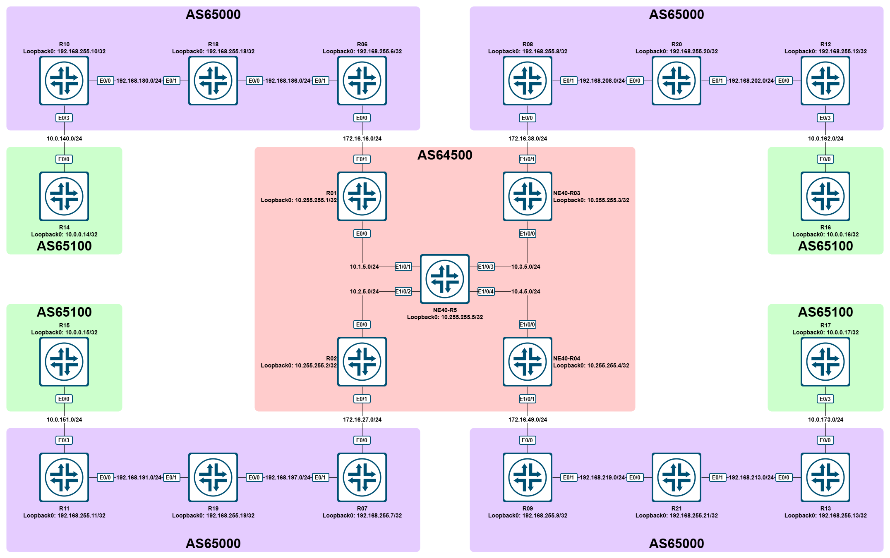
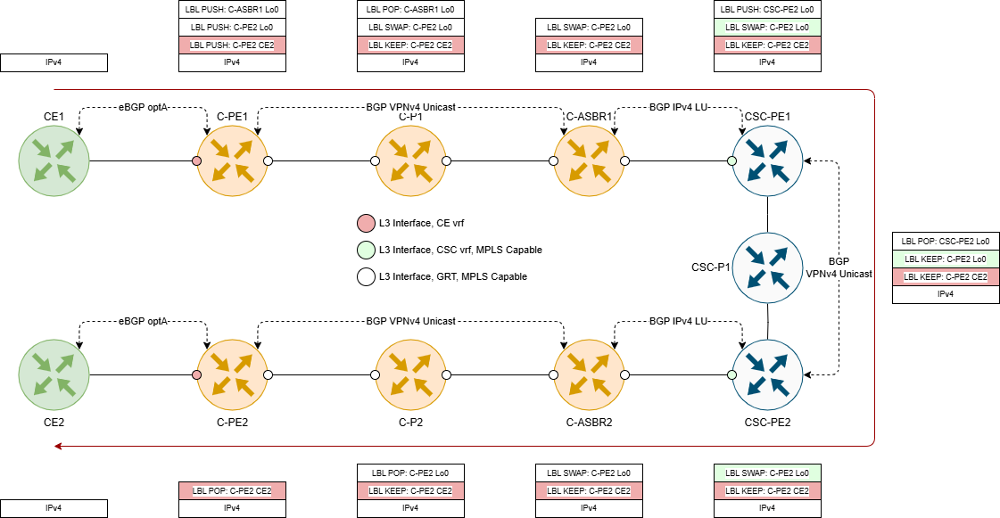
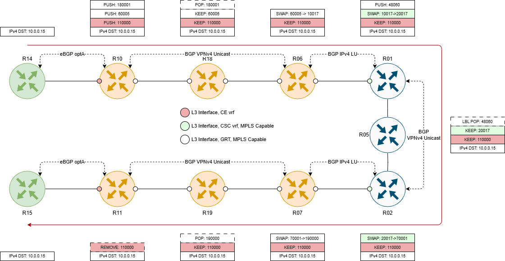

# LAB - Cisco / Huawei - Carrier supports Carrier - BGP LU

## Содержание

- [LAB - Cisco / Huawei - Carrier supports Carrier - BGP LU](#lab---cisco--huawei---carrier-supports-carrier---bgp-lu)
  - [Содержание](#содержание)
  - [Топология](#топология)
  - [Описание](#описание)
  - [Настройка](#настройка)
    - [AS64500 - VRF CSC\_1 - PE-CE connect - R01-R06-R10-R18](#as64500---vrf-csc_1---pe-ce-connect---r01-r06-r10-r18)
    - [AS64500 - VRF CSC\_1 - PE-CE connect - R02-R07-R11-R19](#as64500---vrf-csc_1---pe-ce-connect---r02-r07-r11-r19)
    - [AS64500 - VRF CSC\_1 - Check R10-R11](#as64500---vrf-csc_1---check-r10-r11)
    - [AS65000 - GRT - PE-PE RR connect - R06-R07](#as65000---grt---pe-pe-rr-connect---r06-r07)
    - [AS65100 - Check 1](#as65100---check-1)
    - [AS64500 - VRF CSC\_1 - PE-CE connect - R03-R08-R12-R20](#as64500---vrf-csc_1---pe-ce-connect---r03-r08-r12-r20)
    - [AS64500 - VRF CSC\_1 - PE-CE connect - R04-R09-R13-R21](#as64500---vrf-csc_1---pe-ce-connect---r04-r09-r13-r21)
    - [AS65100 - Check 2](#as65100---check-2)

## Топология



Используемые образы:

- R3, R4, R5 - `Huawei NE40 Version 8.180`
- R1-R2, R6-R17 - `Cisco IOL, i86bi_LinuxL3-AdvEnterpriseK9-M2_15.bin`

Файлы топологии для EVE-NG / PNETLab:

- EVE-NG: [eve_ng_topology_lab_cisco_huawei_carrier_support_carrier.zip](./topology/eve_ng_topology_lab_cisco_huawei_carrier_support_carrier.zip)

## Описание

В рамках данной лабораторной работы необходимо будет обеспечить связность между устройствами в AS65100 (R14, R15, R16, R17). Для этого необходимо будет организовать связность между устройствами из AS65000 посредством механизма CsC (Carrier support Carrier).

Что такое CsC - Carrier support Carrier - это набор технологий, позволяющий одному оператору (C-SP) организовывать свои VPN-сервисы поверх сети другого оператора (CSC-SP). Для этого между C- и CSC- устройствами организуются MPLS-стыки по одному из двух вариантов:

1. C-ASBR, GRT < IGP + LDP > CSC-PE, vrf CSC
2. C-ASBR, GRT < BGP Labeled Unicast > CSC-PE, vrf CSC

На рисунке ниже представлена схема организации подобного сервиса:



Фактически, все сводится к тому, чтобы CSC-SP пропускал MPLS-пакеты с Label stack, собранным на уровне C-SP.

В исходной лабораторной все устройства преднастроены:

- AS64500:
  - Настроены IGP (OSPFv2), LDP и MP-BGP.
  - R5 - Huawei NE40 - настроен как route-reflector в VPNv4 Unicast для R1 (Cisco IOL), R2 (Cisco IOL), R3 (Huawei NE40), R4 (Huawei NE40).
  - На PE - R1-R4 - создан vrf CSC_1 (RD: Lo0:100, RT BOTH: 64500:100).
- AS65000:
  - Настроены IGP (OSPFv2), LDP и MP-BGP.
  - ASBR в каждом сегменте (R6, R7, R8, R9) настроен как RR для нижестоящего роутера (R10, R11, R12, R13 соответственно).
  - На PE созданы клиентские vrf CE1 и настроены BGP optA-стыки.
- AS65100:
  - Настроены BGP-сессии.

## Настройка

### AS64500 - VRF CSC_1 - PE-CE connect - R01-R06-R10-R18

Сначала займемся "левой" частью нашей топологии и начнем с настройки связности между CSC-PE (R01) и CSC-CE (R06):

На R01 настроим eBGP-стык с R06 в IPv4 Labeled Unicast. Никаких политик фильтрации применять не будем:

**R01:**

```cisco
!
router bgp 64500
 !
 address-family ipv4 vrf CSC_1
  neighbor 172.16.16.6 remote-as 65000
  neighbor 172.16.16.6 update-source Ethernet0/1
  neighbor 172.16.16.6 activate
  neighbor 172.16.16.6 send-label
  neighbor 172.16.16.6 send-community
 exit-address-family
!
```

Теперь настроим и R06. Здесь, правда, конфигурации будет больше:

**R06:**

```cisco
ip prefix-list PL_AS65000_LOOPBACKS permit 192.168.255.0/24 ge 32
!
!
route-map RM_BGP_AS64500_IN permit 10
 match ip address prefix-list PL_AS65000_LOOPBACKS
!
route-map RM_BGP_AS64500_OUT permit 10
 match ip address prefix-list PL_AS65000_LOOPBACKS
 set mpls-label
!
router bgp 65000
 neighbor 172.16.16.1 remote-as 64500
 neighbor 172.16.16.1 update-source Ethernet0/0
 !
 address-family ipv4
  network 192.168.255.6 mask 255.255.255.255
  neighbor RRC send-community
  neighbor RRC next-hop-self
  neighbor RRC route-reflector-client
  neighbor RRC send-label
  neighbor 172.16.16.1 activate
  neighbor 172.16.16.1 allowas-in 1
  neighbor 172.16.16.1 route-map RM_BGP_AS64500_IN in
  neighbor 172.16.16.1 route-map RM_BGP_AS64500_OUT out
  neighbor 172.16.16.1 send-label
  neighbor 192.168.255.10 activate
  neighbor 192.168.255.18 activate
 exit-address-family
 !
```

Что и зачем мы сделали? В первую очередь, мы создали префикс-лист PL_AS65000_LOOPBACKS, который отфильтровывает только IPv4-адреса лупбэков AS65000. Его, в свою очередь, мы используем в route-map как для входящих анонсов (RM_BGP_AS64500_IN), так и для исходящих (RM_BGP_AS64500_OUT).

В секции настроек BGP мы выполнили несколько задач:

1. Мы создали и активировали соседство с R01 (172.16.16.1) в IPv4 Labeled Unicast (за это отвечает `neighbor 172.16.16.1 send-label`).
2. Также для R01 мы в явном виде разрешили прием префиксов с единичным указанием AS65000 в AS-PATH (`neighbor 172.16.16.1 allowas-in 1`) - это необходимо для получения префиксов лупбэков удаленных точек.
3. Мы также активировали соседство с R10 и R18 в IPv4 Labeled Unicast.

> Стоит отметить один важный момент: если сравнить конфигурацию R01 и R06, то можно увидеть, что в route-map на выход на R06 мы в явном виде указываем проставление MPLS-меток, а на R01 такого нет. Может возникнуть вопрос: почему? Все дело в том, что по умолчанию, выставление `send-label` на Cisco IOS/IOS-XE автоматически включает отправку меток. Однако, использование route-map на выход неочевидным образом меняет это поведение: сессия устанавливается в IPv4 LU, однако префиксы отдаются без выставленных меток. Для исправления подобной ситуации и была использована инструкция `set mpls-label` в route-map на выход.

Кстати, после того, как поднимется соседство между R06 и R01, на их p2p-интерфейсах автоматически включится MPLS:

**R01:**

```cisco
R01# show mpls interfaces vrf CSC_1
Interface              IP            Tunnel   BGP Static Operational

VRF CSC_1:
Ethernet0/1            No            No       Yes No     Yes
!
interface Ethernet0/1
 vrf forwarding CSC_1
 ip address 172.16.16.1 255.255.255.0
 duplex auto
 mpls bgp forwarding
end

R01#
```

**R06:**

```cisco
R06#show mpls interfaces
Interface              IP            Tunnel   BGP Static Operational
Ethernet0/0            No            No       Yes No     Yes
Ethernet0/1            Yes (ldp)     No       No  No     Yes
R06#show run int Ethernet0/0
Building configuration...

Current configuration : 101 bytes
!
interface Ethernet0/0
 ip address 172.16.16.6 255.255.255.0
 duplex auto
 mpls bgp forwarding
end

R06#
```

И, раз уж мы на R06 поправили настройки соседства с R10 и R18, давайте скорректируем аналогично конфигурацию и на них:

**R10:**

```cisco
router bgp 65000
 !
 address-family ipv4
  network 192.168.255.10 mask 255.255.255.255
  neighbor 192.168.255.6 activate
  neighbor 192.168.255.6 send-community
  neighbor 192.168.255.6 send-label
 exit-address-family
 !
```

**R18:**

```cisco
router bgp 65000
 !
 address-family ipv4
  network 192.168.255.18 mask 255.255.255.255
  neighbor 192.168.255.6 activate
  neighbor 192.168.255.6 send-community
  neighbor 192.168.255.6 send-label
 exit-address-family
 !
```

### AS64500 - VRF CSC_1 - PE-CE connect - R02-R07-R11-R19

Теперь проведем аналогичное "упражнение" и для R02, R07, R11 и R19. Настройки идентичны предыдущим:

**R02:**

```cisco
!
router bgp 64500
 !
 address-family ipv4 vrf CSC_1
  neighbor 172.16.27.7 remote-as 65000
  neighbor 172.16.27.7 update-source Ethernet0/1
  neighbor 172.16.27.7 activate
  neighbor 172.16.27.7 send-label
  neighbor 172.16.27.7 send-community
 exit-address-family
!
```

**R07:**

```cisco
ip prefix-list PL_AS65000_LOOPBACKS permit 192.168.255.0/24 ge 32
!
!
route-map RM_BGP_AS64500_IN permit 10
 match ip address prefix-list PL_AS65000_LOOPBACKS
!
route-map RM_BGP_AS64500_OUT permit 10
 match ip address prefix-list PL_AS65000_LOOPBACKS
 set mpls-label
!
router bgp 65000
 neighbor 172.16.27.2 remote-as 64500
 neighbor 172.16.27.2 update-source Ethernet0/0
 !
 address-family ipv4
  network 192.168.255.7 mask 255.255.255.255
  neighbor RRC send-community
  neighbor RRC next-hop-self
  neighbor RRC route-reflector-client
  neighbor RRC send-label
  neighbor 172.16.27.2 activate
  neighbor 172.16.27.2 allowas-in 1
  neighbor 172.16.27.2 route-map RM_BGP_AS64500_IN in
  neighbor 172.16.27.2 route-map RM_BGP_AS64500_OUT out
  neighbor 172.16.27.2 send-label
  neighbor 192.168.255.11 activate
  neighbor 192.168.255.19 activate
 exit-address-family
 !
```

**R11:**

```cisco
router bgp 65000
 !
 address-family ipv4
  network 192.168.255.11 mask 255.255.255.255
  neighbor 192.168.255.7 activate
  neighbor 192.168.255.7 send-community
  neighbor 192.168.255.7 send-label
 exit-address-family
 !
```

**R19:**

```cisco
router bgp 65000
 !
 address-family ipv4
  network 192.168.255.19 mask 255.255.255.255
  neighbor 192.168.255.7 activate
  neighbor 192.168.255.7 send-community
  neighbor 192.168.255.7 send-label
 exit-address-family
 !
```

### AS64500 - VRF CSC_1 - Check R10-R11

Настройки в "левой" части топологии завершены, поэтому можно проверить связность между R10 и R11. Запустим traceroute на R10:

```cisco
R10#traceroute 192.168.255.11 source 192.168.255.10
Type escape sequence to abort.
Tracing the route to 192.168.255.11
VRF info: (vrf in name/id, vrf out name/id)
  1 192.168.180.18 [MPLS: Labels 180001/60005 Exp 0] 2 msec 1 msec 1 msec
  2 192.168.186.6 [MPLS: Label 60005 Exp 0] 1 msec 1 msec 1 msec
  3 172.16.16.1 [MPLS: Label 10017 Exp 0] 1 msec 1 msec 1 msec
  4 10.1.5.5 [MPLS: Labels 48060/20017 Exp 0] 4 msec 1 msec 1 msec
  5 172.16.27.2 [MPLS: Label 20017 Exp 0] 1 msec 1 msec 1 msec
  6 172.16.27.7 [MPLS: Label 70001 Exp 0] 1 msec 1 msec 0 msec
  7 192.168.197.19 [MPLS: Label 190000 Exp 0] 1 msec 1 msec 1 msec
  8 192.168.191.11 1 msec *  2 msec
R10#
```

Трейс прошел успешно. Давайте попробуем подробно его разобрать:

На первом хопе - R18 - мы видим Label stack из двух меток: 180001 и 60005. Заглянем в LIB:

```cisco
R10#show mpls ip binding remote-label 180001
  192.168.255.6/32
        out label:    180001    lsr: 192.168.255.18:0 inuse
R10#show mpls ip binding remote-label 60005
R10#
```

Метка 180001 соответствует префиксу 192.168.255.6/32, а вот метки 60005 почему-то не видно. Давайте посмотрим в BGP:

```cisco
R10#show bgp ipv4 unicast labels
   Network          Next Hop      In label/Out label
   192.168.255.6/32 192.168.255.6   nolabel/imp-null
   192.168.255.7/32 192.168.255.6   nolabel/60004
   192.168.255.10/32
                    0.0.0.0         imp-null/nolabel
   192.168.255.11/32
                    192.168.255.6   nolabel/60005
   192.168.255.18/32
                    192.168.255.18  nolabel/imp-null
   192.168.255.19/32
                    192.168.255.6   nolabel/60006

R10#
```

А вот и нашлась 60005 - она, очевидно, относится к 192.168.255.11/32. Т.е., сейчас используются две метки: одна напрямую указывает на "целевой" префикс 192.168.255.11/32 (60005) и, в некотором роде, ее можно назвать "сервисной", а вторая (180001) указывает на 192.168.255.6/32, т.е. на роутер, который выпустил "сервисную" метку - грубо говоря, эту метку можно назвать "транспортной".

Судя по второй записи - `2 192.168.186.6 [MPLS: Label 60005 Exp 0] 1 msec 1 msec 1 msec` - на R18 произошел PHP (Penultimate hop popping) и в сторону R06 пакет отправился только с меткой 60005. Давайте посмотрим:

```cisco
R18#show mpls forwarding-table labels 180001
Local      Outgoing   Prefix           Bytes Label   Outgoing   Next Hop
Label      Label      or Tunnel Id     Switched      interface
180001     Pop Label  192.168.255.6/32 90385         Et0/0      192.168.186.6
R18#
```

Так и есть, происходит `pop label` - т.е. снятие верхней метки из стека.

А вот на R06, судя по третьей записи `3 172.16.16.1 [MPLS: Label 10017 Exp 0]`, произошел swap метки 60005 на 10017. Проверяем:

```cisco
R06#show mpls forwarding-table labels 60005
Local      Outgoing   Prefix           Bytes Label   Outgoing   Next Hop
Label      Label      or Tunnel Id     Switched      interface
60005      10017      192.168.255.11/32   \
                                       1578          Et0/0      172.16.16.1
R06#show bgp ipv4 unicast labels
   Network          Next Hop      In label/Out label
   192.168.255.6/32 0.0.0.0         imp-null/nolabel
   192.168.255.7/32 172.16.16.1     60004/10016
   192.168.255.10/32
                    192.168.255.10  60001/imp-null
   192.168.255.11/32
                    172.16.16.1     60005/10017
   192.168.255.18/32
                    192.168.255.18  60000/imp-null
   192.168.255.19/32
                    172.16.16.1     60006/10018

R06#
```

На R01, исходя из `4 10.1.5.5 [MPLS: Labels 48060/20017 Exp 0]`, произошло несколько событий: сервисная метка 10017 была изменена на 20017, а сверху была добавлена транспортная метка 48060:

```cisco
R01#show mpls forwarding-table labels 10017 detail
Local      Outgoing   Prefix           Bytes Label   Outgoing   Next Hop
Label      Label      or Tunnel Id     Switched      interface
10017      20017      192.168.255.11/32[V]   \
                                       2052          Et0/0      10.1.5.5
        MAC/Encaps=14/22, MRU=1496, Label Stack{48060 20017}
        3842033ED601AABBCC0010008847 0BBBC00004E31000
        VPN route: CSC_1
        No output feature configured
R01#show mpls ip binding remote-label 48060
  10.255.255.2/32
        out label:    48060     lsr: 10.255.255.5:0   inuse
R01#show bgp vpnv4 uni vrf CSC_1 labels
   Network          Next Hop      In label/Out label
Route Distinguisher: 10.255.255.1:100 (CSC_1)
   172.16.16.0/24   0.0.0.0         10007/nolabel(CSC_1)
   172.16.16.6/32   0.0.0.0         10011/nolabel
   172.16.27.0/24   10.255.255.2    10008/20007
   172.16.27.7/32   10.255.255.2    10015/20015
   172.16.38.0/24   10.255.255.3    10009/48064
   172.16.49.0/24   10.255.255.4    10010/48064
   192.168.255.6/32 172.16.16.6     10012/imp-null
   192.168.255.7/32 10.255.255.2    10016/20018
   192.168.255.10/32
                    172.16.16.6     10013/60001
   192.168.255.11/32
                    10.255.255.2    10017/20017
   192.168.255.18/32
                    172.16.16.6     10014/60000
   192.168.255.19/32
                    10.255.255.2    10018/20016

R01#
```

Так и есть: 20017 - это сервисная метка, выпущенная R02 (10.255.255.2), соответствующая префиксу 192.168.255.11/32. А метка 48060 - это транспортная метка, выпущенная R05, до префикса 10.255.255.2/32.

`5 172.16.27.2 [MPLS: Label 20017 Exp 0]` - судя по этой записи, на R05 произешел PHP и транспортная метка была снята:

```huawei
<NE40-R05>display mpls lsp include 10.255.255.2 32
Flag after Out IF: (I) - RLFA Iterated LSP, (I*) - Normal and RLFA Iterated LSP
Flag after LDP FRR: (L) - Logic FRR LSP
-------------------------------------------------------------------------------
                 LSP Information: LDP LSP
-------------------------------------------------------------------------------
FEC                In/Out Label    In/Out IF                      Vrf Name
10.255.255.2/32    NULL/3          -/Eth1/0/2
10.255.255.2/32    48060/3         -/Eth1/0/2
<NE40-R05>display mpls lsp include 10.255.255.2 32 verbose
-------------------------------------------------------------------------------
                 LSP Information: LDP LSP
-------------------------------------------------------------------------------
  No                  :  1
  VrfIndex            :
  Fec                 :  10.255.255.2/32
  Nexthop             :  10.2.5.2
  In-Label            :  NULL
  Out-Label           :  3
  In-Interface        :  ----------
  Out-Interface       :  Ethernet1/0/2
  LspIndex            :  5000002
  Type                :  Primary
  OutSegmentIndex     :  5000001
  LsrType             :  Ingress
  Outgoing TunnelType :  ------
  Outgoing TunnelID   :  0x0
  Label Operation     :  PUSH
  Mpls-Mtu            :  1500
  LspAge              :  37397 sec
  Ingress-ELC         :  Disable

  No                  :  2
  VrfIndex            :
  Fec                 :  10.255.255.2/32
  Nexthop             :  10.2.5.2
  In-Label            :  48060
  Out-Label           :  3
  In-Interface        :  ----------
  Out-Interface       :  Ethernet1/0/2
  LspIndex            :  5000002
  Type                :  Primary
  OutSegmentIndex     :  5000001
  LsrType             :  Transit
  Outgoing TunnelType :  ------
  Outgoing TunnelID   :  0x0
  Label Operation     :  SWAP
  Mpls-Mtu            :  1500
  LspAge              :  37397 sec
  Ingress-ELC         :  ------

<NE40-R05>
```

`Out-Label: 3` говорит как раз о pop-действии. Метка 3 - это одна из зарезервированных меток (0-16), которая используется для сигнализации о необходимости снятия верхней метки.

`172.16.27.7 [MPLS: Label 70001 Exp 0]` - на R02 произошла смена метки 20017 на 70001:

```cisco
R02#show mpls forwarding-table labels 20017
Local      Outgoing   Prefix           Bytes Label   Outgoing   Next Hop
Label      Label      or Tunnel Id     Switched      interface
20017      70001      192.168.255.11/32[V]   \
                                       2760          Et0/1      172.16.27.7
R02#show bgp vpnv4 uni vrf CSC_1 192.168.255.11/32
BGP routing table entry for 10.255.255.2:100:192.168.255.11/32, version 19
Paths: (1 available, best #1, table CSC_1)
  Advertised to update-groups:
     1
  Refresh Epoch 1
  65000
    172.16.27.7 (via vrf CSC_1) from 172.16.27.7 (192.168.255.7)
      Origin IGP, localpref 100, valid, external, best
      Extended Community: RT:64500:100
      mpls labels in/out 20017/70001
      rx pathid: 0, tx pathid: 0x0
R02#
```

`192.168.197.19 [MPLS: Label 190000 Exp 0]` говорит о том, что на R07 произошел очередной swap:

```cisco
R07#show mpls forwarding-table labels 70001
Local      Outgoing   Prefix           Bytes Label   Outgoing   Next Hop
Label      Label      or Tunnel Id     Switched      interface
70001      190000     192.168.255.11/32   \
                                       3150          Et0/1      192.168.197.19
R07#show mpls ip binding remote-label 190000 detail
  192.168.255.11/32, rev 12, chkpt: none
        out label:    190000    lsr: 192.168.255.19:0 inuse
```

А последняя запись - `8 192.168.191.1` - показывает, что на R19 произошло снятие метки и чистый IP-пакет был отправлен в сторону R11:

```cisco
R19#show mpls forwarding-table labels 190000
Local      Outgoing   Prefix           Bytes Label   Outgoing   Next Hop
Label      Label      or Tunnel Id     Switched      interface
190000     Pop Label  192.168.255.11/32   \
                                       96079         Et0/1      192.168.191.11
R19#
```

### AS65000 - GRT - PE-PE RR connect - R06-R07

Теперь давайте настроим связность между R14 и R15. Для этого нам необходим обмен VPNv4-маршрутами между секциями R10-R18-R06 и R11-R19-R07. Учитывая, что R06, R07, R08 и R09 являются route-reflector'ами в своих сегментах, связность мы будем поднимать через них. При этом, чтобы не делать full-mesh связность между RR, мы сделаем R06 рефлектором и для других рефлекторов.

На R06 сразу настроим соседства со всеми RR, чтобы потом не возвращаться к этому:

**R06:**

```cisco
router bgp 65000
 neighbor RRS peer-group
 neighbor RRS remote-as 65000
 neighbor RRS update-source Loopback0
 neighbor 192.168.255.7 peer-group RRS
 neighbor 192.168.255.8 peer-group RRS
 neighbor 192.168.255.9 peer-group RRS
 !
 address-family vpnv4
  neighbor RRS send-community both
  neighbor RRS route-reflector-client
  neighbor 192.168.255.7 activate
  neighbor 192.168.255.8 activate
  neighbor 192.168.255.9 activate
 exit-address-family
!
```

На R07 настроим соседство с R06:

**R07:**

```cisco
router bgp 65000
 neighbor 192.168.255.6 remote-as 65000
 neighbor 192.168.255.6 update-source Loopback0
 address-family vpnv4
  neighbor 192.168.255.6 activate
  neighbor 192.168.255.6 send-community both
 exit-address-family
!
```

Теперь проверим наличие маршрутов в vrf CE1 на R10, R11, R14 и R15:

**R10:**

```cisco
R10#show ip route vrf CE1 | b Gateway
Gateway of last resort is not set

      10.0.0.0/8 is variably subnetted, 5 subnets, 2 masks
B        10.0.0.14/32 [20/0] via 10.0.140.14, 11:17:04
B        10.0.0.15/32 [200/0] via 192.168.255.11, 00:06:36
C        10.0.140.0/24 is directly connected, Ethernet0/3
L        10.0.140.10/32 is directly connected, Ethernet0/3
B        10.0.151.0/24 [200/0] via 192.168.255.11, 00:06:36
R10#
```

**R11:**

```cisco
R11#show ip route vrf CE1 | b Gateway
Gateway of last resort is not set

      10.0.0.0/8 is variably subnetted, 5 subnets, 2 masks
B        10.0.0.14/32 [200/0] via 192.168.255.10, 00:07:19
B        10.0.0.15/32 [20/0] via 10.0.151.15, 11:17:37
B        10.0.140.0/24 [200/0] via 192.168.255.10, 00:07:19
C        10.0.151.0/24 is directly connected, Ethernet0/3
L        10.0.151.11/32 is directly connected, Ethernet0/3
R11#
```

Здесь есть, а вот на R14 и R15 они отсутствуют:

**R14:**

```cisco
R14#show ip route | b Gateway
Gateway of last resort is not set

      10.0.0.0/8 is variably subnetted, 4 subnets, 2 masks
C        10.0.0.14/32 is directly connected, Loopback0
C        10.0.140.0/24 is directly connected, Ethernet0/0
L        10.0.140.14/32 is directly connected, Ethernet0/0
B        10.0.151.0/24 [20/0] via 10.0.140.10, 00:08:21
R14#
```

**R15:**

```cisco
R15#show ip route | b Gateway
Gateway of last resort is not set

      10.0.0.0/8 is variably subnetted, 4 subnets, 2 masks
C        10.0.0.15/32 is directly connected, Loopback0
B        10.0.140.0/24 [20/0] via 10.0.151.11, 00:08:47
C        10.0.151.0/24 is directly connected, Ethernet0/0
L        10.0.151.15/32 is directly connected, Ethernet0/0
R15#
```

При этом connected-маршруты с удаленных PE в наличии. Проверим повнимательнее:

**R10:**

```cisco
R10#show bgp vpnv4 unicast vrf CE1 neighbor 10.0.140.14 advertised-routes | b Network
     Network          Next Hop            Metric LocPrf Weight Path
Route Distinguisher: 192.168.255.10:100 (default for vrf CE1)
 *>i  10.0.0.15/32     192.168.255.11           0    100      0 65100 i
 *>   10.0.140.0/24    0.0.0.0                  0         32768 ?
 *>i  10.0.151.0/24    192.168.255.11           0    100      0 ?

Total number of prefixes 3
R10#
```

Здесь мы видим, что в сторону R14 отправляется три префикса, в т.ч. и префикс для лупбэка с R15.

**R14:**

```cisco
R14#show bgp ipv4 uni nei 10.0.140.10 | s Denied Prefixes
  Local Policy Denied Prefixes:    --------    -------
    AS_PATH loop:                       n/a          1
    Bestpath from this peer:              2        n/a
    Total:                                2          1

R14#
```

Здесь мы видим, что у нас есть один отброшенный префикс из-за AS_PATH loop. Это, в общем-то, ожидаемо, т.к. ни в AS65100, ни в AS65000 мы не предприняли никаких действий, чтобы избежать этого. А в AS_PATH для 10.0.0.15/32 есть AS65100.

Чтобы исправить это у нас есть пара вариантов:

1. В явном виде разрешить на роутерах в AS65100 прием префиксов с собственной AS в AS-PATH.
2. Заменить вхождения AS65100 в AS-PATH на PE-роутерах в AS65000.

Т.к. первый вариант мы использовали на стыках AS65000 <> AS64500 (`neighbor X.X.X.X allowas-in 1`), воспользуемся вариантом номер 2. Для этого настроим на R10, R11, R12, R13 функционал `as-override`:

**R10:**

```cisco
router bgp 65000
 !
 address-family ipv4 vrf CE1
  neighbor 10.0.140.14 as-override
 exit-address-family
!
```

**R11:**

```cisco
router bgp 65000
 !
 address-family ipv4 vrf CE1
  neighbor 10.0.151.15 as-override
 exit-address-family
!
```

**R12:**

```cisco
router bgp 65000
 !
 address-family ipv4 vrf CE1
  neighbor 10.0.162.16 as-override
 exit-address-family
!
```

**R13:**

```cisco
router bgp 65000
 !
 address-family ipv4 vrf CE1
  neighbor 10.0.173.17 as-override
 exit-address-family
!
```

После того, как применили настройки не забываем обновить анонсы на R10-R13:

```cisco
clear bgp vrf CE1 ipv4 unicast * out
```

И проверяем:

```cisco
R14#show ip route | b Gateway
Gateway of last resort is not set

      10.0.0.0/8 is variably subnetted, 5 subnets, 2 masks
C        10.0.0.14/32 is directly connected, Loopback0
B        10.0.0.15/32 [20/0] via 10.0.140.10, 00:09:27
C        10.0.140.0/24 is directly connected, Ethernet0/0
L        10.0.140.14/32 is directly connected, Ethernet0/0
B        10.0.151.0/24 [20/0] via 10.0.140.10, 00:42:25
R14#
```

### AS65100 - Check 1

Теперь запустим трейс с R14 на R15:

**R14:**

```cisco
R14#traceroute 10.0.0.15 source 10.0.0.14
Type escape sequence to abort.
Tracing the route to 10.0.0.15
VRF info: (vrf in name/id, vrf out name/id)
  1 10.0.140.10 [AS 65000] 0 msec 0 msec 1 msec
  2 192.168.180.18 [MPLS: Labels 180001/60005/110000 Exp 0] 2 msec 1 msec 1 msec
  3 192.168.186.6 [MPLS: Labels 60005/110000 Exp 0] 1 msec 1 msec 1 msec
  4 172.16.16.1 [MPLS: Labels 10017/110000 Exp 0] 1 msec 1 msec 1 msec
  5 10.1.5.5 [MPLS: Labels 48060/20017/110000 Exp 0] 3 msec 1 msec 1 msec
  6 172.16.27.2 [MPLS: Labels 20017/110000 Exp 0] 2 msec 1 msec 1 msec
  7 172.16.27.7 [MPLS: Labels 70001/110000 Exp 0] 1 msec 1 msec 1 msec
  8 192.168.197.19 [MPLS: Labels 190000/110000 Exp 0] 1 msec 2 msec 1 msec
  9 10.0.151.11 [AS 65000] [MPLS: Label 110000 Exp 0] 1 msec 1 msec 1 msec
 10 10.0.151.15 [AS 65000] 1 msec *  2 msec
R14#
```

Как видно, полученный результат не сильно отличается от ранее разобранного трейса между R10 и R11. Главное отличие, кроме очевидных дополнительных хопов - это наличие еще одной сервисной метки 110000, находящейся в самой глубине стека меток. Эта метка сгенерирована R11:

```cisco
R11#show mpls forwarding-table labels 110000 detail
Local      Outgoing   Prefix           Bytes Label   Outgoing   Next Hop
Label      Label      or Tunnel Id     Switched      interface
110000     No Label   10.0.0.15/32[V]  4056          Et0/3      10.0.151.15
        MAC/Encaps=14/14, MRU=1504, Label Stack{}
        AABBCC00F000AABBCC00B0300800
        VPN route: CE1
        No output feature configured
R11#
```

### AS64500 - VRF CSC_1 - PE-CE connect - R03-R08-R12-R20

Теперь повторим все наши действия уже в "правой" части топологии.

**R03:**

```huawei
#
route-policy RP_BGP_SEND_LABELED permit node 10
 apply mpls-label
#
bgp 64500
 #
 ipv4-family vpn-instance CSC_1
  import-route direct
  peer 172.16.38.8 as-number 65000
  peer 172.16.38.8 connect-interface Ethernet1/0/1
  peer 172.16.38.8 route-policy RP_BGP_SEND_LABELED export
  peer 172.16.38.8 label-route-capability
  peer 172.16.38.8 advertise-community
#
```

R03 - это Huawei NE40 (ну, почти :)), поэтому давайте посмотрим, что именно мы здесь делаем. А делаем мы, за единственным исключением, тоже самое, что и на Cisco: настраиваем соседство, указываем, что оно должно быть в IPv4 Labeled Unicast. Главное отличие: в отличии от Cisco IOS/IOS-XE, указать, что соседство должно быть в IPv4 LU не является достаточным условием для появления метки в NLRI - необходимо через политику в явном виде добавлять их. Именно поэтому создана и используется политика RP_BGP_SEND_LABELED.

Настройки для R08, R20 и R15 аналогичны предыдущим, разве что на R08 мы сразу поднимем соседство с R06 в VPNv4 Unicast:

**R08:**

```cisco
ip prefix-list PL_AS65000_LOOPBACKS permit 192.168.255.0/24 ge 32
!
!
route-map RM_BGP_AS64500_IN permit 10
 match ip address prefix-list PL_AS65000_LOOPBACKS
!
route-map RM_BGP_AS64500_OUT permit 10
 match ip address prefix-list PL_AS65000_LOOPBACKS
 set mpls-label
!
router bgp 65000
 neighbor 172.16.38.3 remote-as 64500
 neighbor 172.16.38.3 update-source Ethernet0/0
 neighbor 192.168.255.6 remote-as 65000
 neighbor 192.168.255.6 update-source Loopback0
 !
 address-family ipv4
  network 192.168.255.8 mask 255.255.255.255
  neighbor RRC send-community
  neighbor RRC next-hop-self
  neighbor RRC send-label
  neighbor 172.16.38.3 activate
  neighbor 172.16.38.3 allowas-in 1
  neighbor 172.16.38.3 route-map RM_BGP_AS64500_IN in
  neighbor 172.16.38.3 route-map RM_BGP_AS64500_OUT out
  neighbor 172.16.38.3 send-label
  neighbor 192.168.255.12 activate
 exit-address-family
 !
 address-family vpnv4
  neighbor 192.168.255.6 activate
  neighbor 192.168.255.6 send-community both
 exit-address-family
!
```

**R12:**

```cisco
router bgp 65000
 !
 address-family ipv4
  network 192.168.255.12 mask 255.255.255.255
  neighbor 192.168.255.8 activate
  neighbor 192.168.255.8 send-community
  neighbor 192.168.255.8 send-label
 exit-address-family
 !
```

**R20:**

```cisco
router bgp 65000
 !
 address-family ipv4
  network 192.168.255.20 mask 255.255.255.255
  neighbor 192.168.255.8 activate
  neighbor 192.168.255.8 send-community
  neighbor 192.168.255.8 send-label
 exit-address-family
 !
```

И аналогичное упражнение для оставшегося сегмента:

### AS64500 - VRF CSC_1 - PE-CE connect - R04-R09-R13-R21

**R04:**

```huawei
#
route-policy RP_BGP_SEND_LABELED permit node 10
 apply mpls-label
#
bgp 64500
 #
 ipv4-family vpn-instance CSC_1
  import-route direct
  peer 172.16.49.9 as-number 65000
  peer 172.16.49.9 connect-interface Ethernet1/0/1
  peer 172.16.49.9 route-policy RP_BGP_SEND_LABELED export
  peer 172.16.49.9 label-route-capability
  peer 172.16.49.9 advertise-community
#
```

**R09:**

```cisco
ip prefix-list PL_AS65000_LOOPBACKS permit 192.168.255.0/24 ge 32
!
!
route-map RM_BGP_AS64500_IN permit 10
 match ip address prefix-list PL_AS65000_LOOPBACKS
!
route-map RM_BGP_AS64500_OUT permit 10
 match ip address prefix-list PL_AS65000_LOOPBACKS
 set mpls-label
!
router bgp 65000
 neighbor 172.16.49.4 remote-as 64500
 neighbor 172.16.49.4 update-source Ethernet0/0
 neighbor 192.168.255.6 remote-as 65000
 neighbor 192.168.255.6 update-source Loopback0
 !
 address-family ipv4
  network 192.168.255.9 mask 255.255.255.255
  neighbor RRC send-community
  neighbor RRC next-hop-self
  neighbor RRC send-label
  neighbor 172.16.49.4 activate
  neighbor 172.16.49.4 allowas-in 1
  neighbor 172.16.49.4 route-map RM_BGP_AS64500_IN in
  neighbor 172.16.49.4 route-map RM_BGP_AS64500_OUT out
  neighbor 172.16.49.4 send-label
  neighbor 192.168.255.13 activate
 exit-address-family
 !
 address-family vpnv4
  neighbor 192.168.255.6 activate
  neighbor 192.168.255.6 send-community both
 exit-address-family
!
```

**R13:**

```cisco
router bgp 65000
 !
 address-family ipv4
  network 192.168.255.13 mask 255.255.255.255
  neighbor 192.168.255.9 activate
  neighbor 192.168.255.9 send-community
  neighbor 192.168.255.9 send-label
 exit-address-family
 !
```

**R21:**

```cisco
router bgp 65000
 !
 address-family ipv4
  network 192.168.255.21 mask 255.255.255.255
  neighbor 192.168.255.9 activate
  neighbor 192.168.255.9 send-community
  neighbor 192.168.255.9 send-label
 exit-address-family
 !
```

### AS65100 - Check 2

После того, как мы все настроили, давайте проверим связность между всеми CE-устройствами. В качестве проверки воспользуемся следующим набором команд.

```cisco
show ip route bgp | b Gateway
tclsh
foreach IP {
10.0.0.14
10.0.0.15
10.0.0.16
10.0.0.17
} { puts "\n=============================\nTrace to $IP:"; traceroute $IP source Lo0 probe 1 timeout 1 ttl 0 12 }
```

Начнем с R14:

**R14:**

```cisco
R14#show ip route bgp | b Gateway
Gateway of last resort is not set

      10.0.0.0/8 is variably subnetted, 9 subnets, 2 masks
B        10.0.0.15/32 [20/0] via 10.0.140.10, 00:02:52
B        10.0.0.16/32 [20/0] via 10.0.140.10, 00:02:52
B        10.0.0.17/32 [20/0] via 10.0.140.10, 00:02:52
B        10.0.151.0/24 [20/0] via 10.0.140.10, 00:02:52
B        10.0.162.0/24 [20/0] via 10.0.140.10, 00:02:52
B        10.0.173.0/24 [20/0] via 10.0.140.10, 00:02:52
R14#tclsh
R14(tcl)#foreach IP {
+>10.0.0.14
+>10.0.0.15
+>10.0.0.16
+>10.0.0.17
+>} { puts "\n=============================\nTrace to $IP:"; traceroute $IP source Lo0 probe 1 timeout 1 ttl 0 12                                                                                                                        }
=============================
Trace to 10.0.0.14:

Type escape sequence to abort.
Tracing the route to 10.0.0.14
VRF info: (vrf in name/id, vrf out name/id)
  0 10.0.0.14 0 msec
=============================
Trace to 10.0.0.15:

Type escape sequence to abort.
Tracing the route to 10.0.0.15
VRF info: (vrf in name/id, vrf out name/id)
  0 10.0.140.10 [AS 65000] 0 msec
  1 10.0.140.10 [AS 65000] 0 msec
  2 192.168.180.18 [MPLS: Labels 180001/60005/110000 Exp 0] 2 msec
  3 192.168.186.6 [MPLS: Labels 60005/110000 Exp 0] 2 msec
  4 172.16.16.1 [MPLS: Labels 10017/110000 Exp 0] 1 msec
  5 10.1.5.5 [MPLS: Labels 48060/20017/110000 Exp 0] 2 msec
  6 172.16.27.2 [MPLS: Labels 20017/110000 Exp 0] 2 msec
  7 172.16.27.7 [MPLS: Labels 70001/110000 Exp 0] 1 msec
  8 192.168.197.19 [MPLS: Labels 190000/110000 Exp 0] 1 msec
  9 10.0.151.11 [AS 65000] [MPLS: Label 110000 Exp 0] 1 msec
 10 10.0.151.15 [AS 65000] 1 msec
=============================
Trace to 10.0.0.16:

Type escape sequence to abort.
Tracing the route to 10.0.0.16
VRF info: (vrf in name/id, vrf out name/id)
  0 10.0.140.10 [AS 65000] 1 msec
  1 10.0.140.10 [AS 65000] 0 msec
  2 192.168.180.18 [MPLS: Labels 180001/60008/120000 Exp 0] 1 msec
  3 192.168.186.6 [MPLS: Labels 60008/120000 Exp 0] 1 msec
  4 172.16.16.1 [MPLS: Labels 10020/120000 Exp 0] 2 msec
  5 10.1.5.5 [MPLS: Labels 48061/48078/120000 Exp 0] 2 msec
  6 10.3.5.3 [MPLS: Labels 48078/120000 Exp 0] 3 msec
  7 172.16.38.8 [MPLS: Labels 80002/120000 Exp 0] 2 msec
  8 192.168.208.20 [MPLS: Labels 200001/120000 Exp 0] 1 msec
  9 10.0.162.12 [AS 65000] [MPLS: Label 120000 Exp 0] 2 msec
 10 10.0.162.16 [AS 65000] 1 msec
=============================
Trace to 10.0.0.17:

Type escape sequence to abort.
Tracing the route to 10.0.0.17
VRF info: (vrf in name/id, vrf out name/id)
  0 10.0.140.10 [AS 65000] 0 msec
  1 10.0.140.10 [AS 65000] 0 msec
  2 192.168.180.18 [MPLS: Labels 180001/60010/130000 Exp 0] 2 msec
  3 192.168.186.6 [MPLS: Labels 60010/130000 Exp 0] 2 msec
  4 172.16.16.1 [MPLS: Labels 10022/130000 Exp 0] 1 msec
  5 10.1.5.5 [MPLS: Labels 48063/48080/130000 Exp 0] 3 msec
  6 10.4.5.4 [MPLS: Labels 48080/130000 Exp 0] 3 msec
  7 172.16.49.9 [MPLS: Labels 90002/130000 Exp 0] 2 msec
  8 192.168.219.21 [MPLS: Labels 210001/130000 Exp 0] 2 msec
  9 10.0.173.13 [AS 65000] [MPLS: Label 130000 Exp 0] 1 msec
 10 10.0.173.17 [AS 65000] 2 msec
R14(tcl)#
```

**R15:**

```cisco
R15#show ip route bgp | b Gateway
Gateway of last resort is not set

      10.0.0.0/8 is variably subnetted, 9 subnets, 2 masks
B        10.0.0.14/32 [20/0] via 10.0.151.11, 00:02:52
B        10.0.0.16/32 [20/0] via 10.0.151.11, 00:20:47
B        10.0.0.17/32 [20/0] via 10.0.151.11, 00:12:00
B        10.0.140.0/24 [20/0] via 10.0.151.11, 01:30:40
B        10.0.162.0/24 [20/0] via 10.0.151.11, 00:20:47
B        10.0.173.0/24 [20/0] via 10.0.151.11, 00:12:00
R15#tclsh
R15(tcl)#foreach IP {
+>10.0.0.14
+>10.0.0.15
+>10.0.0.16
+>10.0.0.17
+>} { puts "\n=============================\nTrace to $IP:"; traceroute $IP source Lo0 probe 1 timeout 1 ttl 0 12                                                                                                                        }
=============================
Trace to 10.0.0.14:

Type escape sequence to abort.
Tracing the route to 10.0.0.14
VRF info: (vrf in name/id, vrf out name/id)
  0 10.0.151.11 [AS 65000] 0 msec
  1 10.0.151.11 [AS 65000] 0 msec
  2 192.168.191.19 [MPLS: Labels 190001/70005/100005 Exp 0] 2 msec
  3 192.168.197.7 [MPLS: Labels 70005/100005 Exp 0] 1 msec
  4 172.16.27.2 [MPLS: Labels 20013/100005 Exp 0] 2 msec
  5 10.2.5.5 [MPLS: Labels 48062/10013/100005 Exp 0] 2 msec
  6 172.16.16.1 [MPLS: Labels 10013/100005 Exp 0] 1 msec
  7 172.16.16.6 [MPLS: Labels 60001/100005 Exp 0] 1 msec
  8 192.168.186.18 [MPLS: Labels 180000/100005 Exp 0] 1 msec
  9 10.0.140.10 [AS 65000] [MPLS: Label 100005 Exp 0] 1 msec
 10 10.0.140.14 [AS 65000] 2 msec
=============================
Trace to 10.0.0.15:

Type escape sequence to abort.
Tracing the route to 10.0.0.15
VRF info: (vrf in name/id, vrf out name/id)
  0 10.0.0.15 4 msec
=============================
Trace to 10.0.0.16:

Type escape sequence to abort.
Tracing the route to 10.0.0.16
VRF info: (vrf in name/id, vrf out name/id)
  0 10.0.151.11 [AS 65000] 0 msec
  1 10.0.151.11 [AS 65000] 0 msec
  2 192.168.191.19 [MPLS: Labels 190001/70008/120000 Exp 0] 2 msec
  3 192.168.197.7 [MPLS: Labels 70008/120000 Exp 0] 2 msec
  4 172.16.27.2 [MPLS: Labels 20020/120000 Exp 0] 1 msec
  5 10.2.5.5 [MPLS: Labels 48061/48078/120000 Exp 0] 2 msec
  6 10.3.5.3 [MPLS: Labels 48078/120000 Exp 0] 2 msec
  7 172.16.38.8 [MPLS: Labels 80002/120000 Exp 0] 1 msec
  8 192.168.208.20 [MPLS: Labels 200001/120000 Exp 0] 1 msec
  9 10.0.162.12 [AS 65000] [MPLS: Label 120000 Exp 0] 2 msec
 10 10.0.162.16 [AS 65000] 1 msec
=============================
Trace to 10.0.0.17:

Type escape sequence to abort.
Tracing the route to 10.0.0.17
VRF info: (vrf in name/id, vrf out name/id)
  0 10.0.151.11 [AS 65000] 1 msec
  1 10.0.151.11 [AS 65000] 0 msec
  2 192.168.191.19 [MPLS: Labels 190001/70010/130000 Exp 0] 2 msec
  3 192.168.197.7 [MPLS: Labels 70010/130000 Exp 0] 1 msec
  4 172.16.27.2 [MPLS: Labels 20022/130000 Exp 0] 2 msec
  5 10.2.5.5 [MPLS: Labels 48063/48080/130000 Exp 0] 2 msec
  6 10.4.5.4 [MPLS: Labels 48080/130000 Exp 0] 1 msec
  7 172.16.49.9 [MPLS: Labels 90002/130000 Exp 0] 2 msec
  8 192.168.219.21 [MPLS: Labels 210001/130000 Exp 0] 1 msec
  9 10.0.173.13 [AS 65000] [MPLS: Label 130000 Exp 0] 1 msec
 10 10.0.173.17 [AS 65000] 1 msec
R15(tcl)#
```

**R16:**

```cisco
R16#show ip route bgp | b Gateway
Gateway of last resort is not set

      10.0.0.0/8 is variably subnetted, 9 subnets, 2 masks
B        10.0.0.14/32 [20/0] via 10.0.162.12, 00:02:52
B        10.0.0.15/32 [20/0] via 10.0.162.12, 00:20:47
B        10.0.0.17/32 [20/0] via 10.0.162.12, 00:12:00
B        10.0.140.0/24 [20/0] via 10.0.162.12, 00:20:47
B        10.0.151.0/24 [20/0] via 10.0.162.12, 00:20:47
B        10.0.173.0/24 [20/0] via 10.0.162.12, 00:12:00
R16#tclsh
R16(tcl)#foreach IP {
+>10.0.0.14
+>10.0.0.15
+>10.0.0.16
+>10.0.0.17
+>} { puts "\n=============================\nTrace to $IP:"; traceroute $IP source Lo0 probe 1 timeout 1 ttl 0 12                                                                                                                        }
=============================
Trace to 10.0.0.14:

Type escape sequence to abort.
Tracing the route to 10.0.0.14
VRF info: (vrf in name/id, vrf out name/id)
  0 10.0.162.12 [AS 65000] 1 msec
  1 10.0.162.12 [AS 65000] 0 msec
  2 192.168.202.20 [MPLS: Labels 200000/80006/100005 Exp 0] 2 msec
  3 192.168.208.8 [MPLS: Labels 80006/100005 Exp 0] 2 msec
  4 172.16.38.3 [MPLS: Labels 48073/100005 Exp 0] 4 msec
  5 10.3.5.5 [MPLS: Labels 48062/10013/100005 Exp 0] 2 msec
  6 172.16.16.1 [MPLS: Labels 10013/100005 Exp 0] 2 msec
  7 172.16.16.6 [MPLS: Labels 60001/100005 Exp 0] 1 msec
  8 192.168.186.18 [MPLS: Labels 180000/100005 Exp 0] 1 msec
  9 10.0.140.10 [AS 65000] [MPLS: Label 100005 Exp 0] 1 msec
 10 10.0.140.14 [AS 65000] 1 msec
=============================
Trace to 10.0.0.15:

Type escape sequence to abort.
Tracing the route to 10.0.0.15
VRF info: (vrf in name/id, vrf out name/id)
  0 10.0.162.12 [AS 65000] 0 msec
  1 10.0.162.12 [AS 65000] 0 msec
  2 192.168.202.20 [MPLS: Labels 200000/80007/110000 Exp 0] 2 msec
  3 192.168.208.8 [MPLS: Labels 80007/110000 Exp 0] 1 msec
  4 172.16.38.3 [MPLS: Labels 48074/110000 Exp 0] 4 msec
  5 10.3.5.5 [MPLS: Labels 48060/20017/110000 Exp 0] 2 msec
  6 172.16.27.2 [MPLS: Labels 20017/110000 Exp 0] 1 msec
  7 172.16.27.7 [MPLS: Labels 70001/110000 Exp 0] 2 msec
  8 192.168.197.19 [MPLS: Labels 190000/110000 Exp 0] 1 msec
  9 10.0.151.11 [AS 65000] [MPLS: Label 110000 Exp 0] 1 msec
 10 10.0.151.15 [AS 65000] 2 msec
=============================
Trace to 10.0.0.16:

Type escape sequence to abort.
Tracing the route to 10.0.0.16
VRF info: (vrf in name/id, vrf out name/id)
  0 10.0.0.16 3 msec
=============================
Trace to 10.0.0.17:

Type escape sequence to abort.
Tracing the route to 10.0.0.17
VRF info: (vrf in name/id, vrf out name/id)
  0 10.0.162.12 [AS 65000] 0 msec
  1 10.0.162.12 [AS 65000] 0 msec
  2 192.168.202.20 [MPLS: Labels 200000/80011/130000 Exp 0] 2 msec
  3 192.168.208.8 [MPLS: Labels 80011/130000 Exp 0] 2 msec
  4 172.16.38.3 [MPLS: Labels 48080/130000 Exp 0] 3 msec
  5 10.3.5.5 [MPLS: Labels 48063/48080/130000 Exp 0] 2 msec
  6 10.4.5.4 [MPLS: Labels 48080/130000 Exp 0] 2 msec
  7 172.16.49.9 [MPLS: Labels 90002/130000 Exp 0] 2 msec
  8 192.168.219.21 [MPLS: Labels 210001/130000 Exp 0] 1 msec
  9 10.0.173.13 [AS 65000] [MPLS: Label 130000 Exp 0] 2 msec
 10 10.0.173.17 [AS 65000] 2 msec
R16(tcl)#
```

**R17:**

```cisco
R17#show ip route bgp | b Gateway
Gateway of last resort is not set

      10.0.0.0/8 is variably subnetted, 9 subnets, 2 masks
B        10.0.0.14/32 [20/0] via 10.0.173.13, 00:02:53
B        10.0.0.15/32 [20/0] via 10.0.173.13, 00:12:25
B        10.0.0.16/32 [20/0] via 10.0.173.13, 00:12:25
B        10.0.140.0/24 [20/0] via 10.0.173.13, 00:12:25
B        10.0.151.0/24 [20/0] via 10.0.173.13, 00:12:25
B        10.0.162.0/24 [20/0] via 10.0.173.13, 00:12:25
R17#tclsh
R17(tcl)#foreach IP {
+>10.0.0.14
+>10.0.0.15
+>10.0.0.16
+>10.0.0.17
+>} { puts "\n=============================\nTrace to $IP:"; traceroute $IP source Lo0 probe 1 timeout 1 ttl 0 12                                                                                                                        }
=============================
Trace to 10.0.0.14:

Type escape sequence to abort.
Tracing the route to 10.0.0.14
VRF info: (vrf in name/id, vrf out name/id)
  0 10.0.173.13 [AS 65000] 0 msec
  1 10.0.173.13 [AS 65000] 0 msec
  2 192.168.213.21 [MPLS: Labels 210000/90007/100005 Exp 0] 2 msec
  3 192.168.219.9 [MPLS: Labels 90007/100005 Exp 0] 2 msec
  4 172.16.49.4 [MPLS: Labels 48074/100005 Exp 0] 4 msec
  5 10.4.5.5 [MPLS: Labels 48062/10013/100005 Exp 0] 2 msec
  6 172.16.16.1 [MPLS: Labels 10013/100005 Exp 0] 2 msec
  7 172.16.16.6 [MPLS: Labels 60001/100005 Exp 0] 1 msec
  8 192.168.186.18 [MPLS: Labels 180000/100005 Exp 0] 3 msec
  9 10.0.140.10 [AS 65000] [MPLS: Label 100005 Exp 0] 2 msec
 10 10.0.140.14 [AS 65000] 1 msec
=============================
Trace to 10.0.0.15:

Type escape sequence to abort.
Tracing the route to 10.0.0.15
VRF info: (vrf in name/id, vrf out name/id)
  0 10.0.173.13 [AS 65000] 0 msec
  1 10.0.173.13 [AS 65000] 0 msec
  2 192.168.213.21 [MPLS: Labels 210000/90008/110000 Exp 0] 1 msec
  3 192.168.219.9 [MPLS: Labels 90008/110000 Exp 0] 2 msec
  4 172.16.49.4 [MPLS: Labels 48075/110000 Exp 0] 3 msec
  5 10.4.5.5 [MPLS: Labels 48060/20017/110000 Exp 0] 3 msec
  6 172.16.27.2 [MPLS: Labels 20017/110000 Exp 0] 2 msec
  7 172.16.27.7 [MPLS: Labels 70001/110000 Exp 0] 1 msec
  8 192.168.197.19 [MPLS: Labels 190000/110000 Exp 0] 2 msec
  9 10.0.151.11 [AS 65000] [MPLS: Label 110000 Exp 0] 2 msec
 10 10.0.151.15 [AS 65000] 2 msec
=============================
Trace to 10.0.0.16:

Type escape sequence to abort.
Tracing the route to 10.0.0.16
VRF info: (vrf in name/id, vrf out name/id)
  0 10.0.173.13 [AS 65000] 1 msec
  1 10.0.173.13 [AS 65000] 0 msec
  2 192.168.213.21 [MPLS: Labels 210000/90009/120000 Exp 0] 3 msec
  3 192.168.219.9 [MPLS: Labels 90009/120000 Exp 0] 2 msec
  4 172.16.49.4 [MPLS: Labels 48076/120000 Exp 0] 5 msec
  5 10.4.5.5 [MPLS: Labels 48061/48078/120000 Exp 0] 3 msec
  6 10.3.5.3 [MPLS: Labels 48078/120000 Exp 0] 3 msec
  7 172.16.38.8 [MPLS: Labels 80002/120000 Exp 0] 2 msec
  8 192.168.208.20 [MPLS: Labels 200001/120000 Exp 0] 2 msec
  9 10.0.162.12 [AS 65000] [MPLS: Label 120000 Exp 0] 1 msec
 10 10.0.162.16 [AS 65000] 2 msec
=============================
Trace to 10.0.0.17:

Type escape sequence to abort.
Tracing the route to 10.0.0.17
VRF info: (vrf in name/id, vrf out name/id)
  0 10.0.0.17 4 msec
R17(tcl)#
```

Как мы видим, связность между все CE имеется, а значит, что задание лабораторной работы мы выполнили.

Также, для наглядности, диаграмма движения пакета от R14 к R15:


