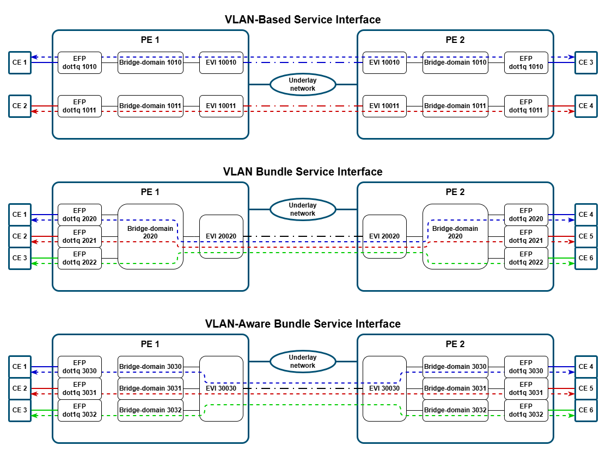
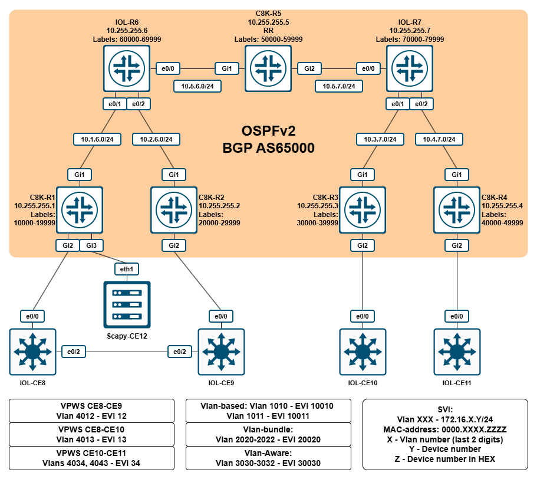
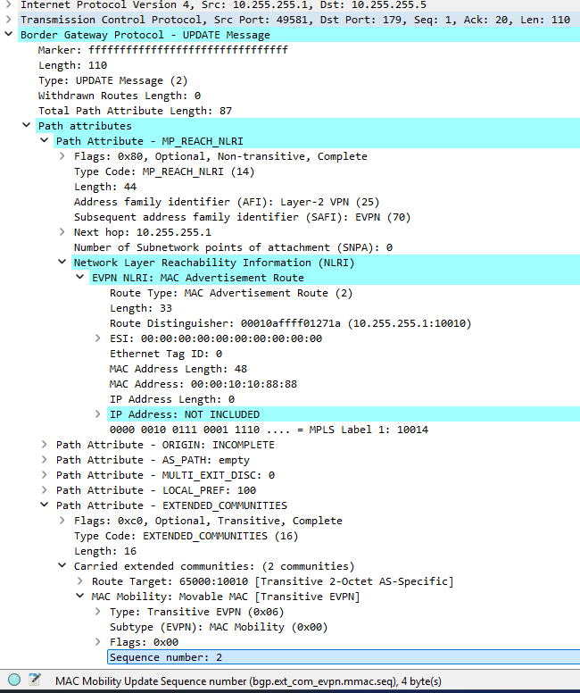

# LAB - Cisco IOS-XE - L2VPN EVPN Singlehome

## Содержание

- [LAB - Cisco IOS-XE - L2VPN EVPN Singlehome](#lab---cisco-ios-xe---l2vpn-evpn-singlehome)
  - [Содержание](#содержание)
  - [Описание](#описание)
    - [Описание - типы сервисных интерфейсов](#описание---типы-сервисных-интерфейсов)
    - [Описание - типы маршрутов](#описание---типы-маршрутов)
  - [Топология](#топология)
  - [Базовая конфигурация](#базовая-конфигурация)
  - [Настройка BGP](#настройка-bgp)
  - [EVPN VPWS](#evpn-vpws)
    - [EVPN VPWS - EVI 12](#evpn-vpws---evi-12)
    - [EVPN VPWS - EVI 13](#evpn-vpws---evi-13)
    - [EVPN VPWS - EVI 34](#evpn-vpws---evi-34)
  - [EVPN EVI VLAN-BASED](#evpn-evi-vlan-based)
    - [EVPN EVI VLAN-BASED - MAC-MOVE](#evpn-evi-vlan-based---mac-move)
  - [EVPN EVI VLAN-BUNDLE](#evpn-evi-vlan-bundle)
  - [EVPN EVI VLAN-AWARE](#evpn-evi-vlan-aware)

## Описание

- RFC 7432: <https://datatracker.ietf.org/doc/html/rfc7432>
- RFC 8214: <https://datatracker.ietf.org/doc/html/rfc8214>
- Доп информация: <https://www.ciscolive.com/c/dam/r/ciscolive/global-event/docs/2023/pdf/BRKMPL-2143.pdf>

### Описание - типы сервисных интерфейсов

RFC 7432 определяет три типа сервисных интерфейсов:

1. **VLAN-Based Service Interface** - в данном случае один EVI состоит только из одного широковещательного домена (т.е. из одного влана). Т.е., грубо говоря, один влан - один MAC-VRF. Ethernet Tag в этом случае обязан состоять из одних только нулей.
2. **VLAN Bundle Service Interface** - в данном случае, к одному EVI относится несколько широковещательных доменов (т.е. несколько вланов), но, при этом, к MAC-VRF относится только одна таблица коммутации (т.е. один bridge-domain) для всех этих вланов. Это, в свою очередь, приводит к требованию, что все MAC-адреса должны быть уникальными в пределах всех вланов, относящихся к этому EVI. Ethernet Tag в этом случае обязан состоять из одних только нулей.
3. **VLAN-Aware Bundle Service Interface** - в данном случае, к одному EVI относится несколько широковещательных доменов (т.е. несколько вланов), и, при этом, каждый влан имеет свою собственную таблицу коммутации (т.е. один влан - один bridge-domain). Важное отличие от VLAN Bundle - это то, что BUM-трафик из EVI отправляется только на те СE, которые относятся к конкретному широковещательному сегменту. В Ethernet Tag во всех EVPN-маршрутах должно быть проставлено значение VID.

Ниже представлена схема, наглядно показывающая разницу между этими типами сервисных интерфейсов.



### Описание - типы маршрутов

RFC 7432 определяет следующие типы маршрутов:

- Type 1 - Ethernet Auto-Discovery (A-D) route
- Type 2 - MAC/IP Advertisement route
- Type 3 - Inclusive Multicast Ethernet Tag route
- Type 4 - Ethernet Segment route

## Топология



Используемые образы

- **C8K-Rx** - Cisco Catalyst 8000v, 17.16.1a - `c8000v-26.01.01`
- **IOL-Rx** - Cisco IOL L3, 17.16.1a - `x86_64_crb_linux_iol-xe-17-16-01a-adventerprisek9-ms.bin`
- **IOL-CEx** - Cisco IOL L2, 17.16.1a - `x86_64_crb_linux_ioll2-xe-17-16-01a-adventerprisek9-ms.bin`

Файлы топологии для EVE-NG / PNETLab:

- EVE-NG: [eveng_topology_cisco_evpn_l2vpn_singlehome_mpls_v2.zip](./topologies/eveng_topology_cisco_evpn_l2vpn_singlehome_mpls_v2.zip)
- PNETLab: [pnetlab_topology_cisco_evpn_l2vpn_singlehome_mpls_v2.zip](./topologies/pnetlab_topology_cisco_evpn_l2vpn_singlehome_mpls_v2.zip)

## Базовая конфигурация

Сначала на всех C8K-Rx необходимо изменить уровень лицензии на `network-premier`, чтобы получить доступ к функционалу MPLS и EVPN, с последующими сохранением конфигурации и перезагрузкой:

**C8K-R1 / C8K-R2 / C8K-R3 / C8K-R4 / C8K-R5:**

```cisco
configure terminal
license boot level network-premier addon dna-premier
exit
write memory
reload
```

В рамках базовой конфигурации будут выполнены следующие настройки:

- IGP: OSPFv2.
- MPLS: LDP.
- Диапазоны меток: по 10000 меток в диапазоне X0000 - X9999, где X - это номер маршрутизатора.
- Созданы L3-интерфейсы.
- Инфраструктурные настройки.

Какой-то сложной конфигурации здесь нет: просто включается OSPFv2 для всех интерфейсов с адресами из сети 10.0.0.0/8, и на всех OSPFv2-capable интерфейсах автоматически включается LDP.

На CE (**IOL-CEx**) создадим вланы, добавив их на интерфейсы в режиме trunk, SVI и MAC-адреса к ним. Листинги конфигурации в архиве `startup_configs`.

На машине со Scapy сделаны следующие настройки:

**Scapy-CE12:**

```bash
[2026-07-29 10:38:38] lab@deb-scapy-vm:~$ cat /etc/network/interfaces.d/static_interfaces
auto eth1
iface eth1 inet manual
        pre-up ip link set dev eth1 address 00:e1:00:00:cc:cc
        pre-up ip link set dev eth1 up

auto eth1.1010
iface eth1.1010 inet static
        address 172.16.10.12/24
        pre-up ip link set dev eth1.1010 address 00:e1:10:10:cc:cc
        pre-up ip link set dev eth1.1010 up

auto eth1.1011
iface eth1.1011 inet static
        address 172.16.11.12/24
        pre-up ip link set dev eth1.1011 address 00:e1:10:11:cc:cc
        pre-up ip link set dev eth1.1011 up

auto eth1.2020
iface eth1.2020 inet static
        address 172.16.20.12/24
        pre-up ip link set dev eth1.2020 address 00:e1:20:20:cc:cc
        pre-up ip link set dev eth1.2020 up

auto eth1.2021
iface eth1.2021 inet static
        address 172.16.21.12/24
        pre-up ip link set dev eth1.2021 address 00:e1:20:21:cc:cc
        pre-up ip link set dev eth1.2021 up

auto eth1.2022
iface eth1.2022 inet static
        address 172.16.22.12/24
        pre-up ip link set dev eth1.2022 address 00:e1:20:22:cc:cc
        pre-up ip link set dev eth1.2022 up

auto eth1.3030
iface eth1.3030 inet static
        address 172.16.30.12/24
        pre-up ip link set dev eth1.3030 address 00:e1:30:30:cc:cc
        pre-up ip link set dev eth1.3030 up

auto eth1.3031
iface eth1.3031 inet static
        address 172.16.31.12/24
        pre-up ip link set dev eth1.3031 address 00:e1:30:31:cc:cc
        pre-up ip link set dev eth1.3031 up

auto eth1.3032
iface eth1.3032 inet static
        address 172.16.32.12/24
        pre-up ip link set dev eth1.3032 address 00:e1:30:32:cc:cc
        pre-up ip link set dev eth1.3032 up

auto eth2
iface eth2 inet manual
        pre-up ip link set dev eth2 address 00:e2:00:00:cc:cc
        pre-up ip link set dev eth2 up

[2026-07-29 10:38:41] lab@deb-scapy-vm:~$ cat /etc/modules
# /etc/modules is obsolete and has been replaced by /etc/modules-load.d/.
# Please see modules-load.d(5) and modprobe.d(5) for details.
#
# Updating this file still works, but it is undocumented and unsupported.
8021q
[2026-07-29 10:39:08] lab@deb-scapy-vm:~$
```

## Настройка BGP

Прежде чем приступать к настройке сервисов, необходимо настроить BGP в L2VPN EVPN.

В рамках данной лабораторной работы будет использоваться iBGP в AS65000. Все PE (R1-R4) будут являться route-reflector-client'ами для RR - **C8K-R5**.

Начнем с настройки route-reflector:

**C8K-R5:**

```wbos
router bgp 65000
 bgp log-neighbor-changes
 no bgp default ipv4-unicast
 neighbor PG_RRC peer-group
 neighbor PG_RRC remote-as 65000
 neighbor PG_RRC update-source Loopback0
 neighbor 10.255.255.1 peer-group PG_RRC
 neighbor 10.255.255.2 peer-group PG_RRC
 neighbor 10.255.255.3 peer-group PG_RRC
 neighbor 10.255.255.4 peer-group PG_RRC
 !
 address-family ipv4
 exit-address-family
 !        
 address-family l2vpn evpn
  neighbor PG_RRC send-community both
  neighbor PG_RRC route-reflector-client
  neighbor 10.255.255.1 activate
  neighbor 10.255.255.2 activate
  neighbor 10.255.255.3 activate
  neighbor 10.255.255.4 activate
 exit-address-family
!
```

Здесь мы сделали следующее:

- В явном виде запретили автоматическое включение семейства IPv4 Unicast для всех создаваемых в GRT BGP-сессиях (инструкция `no bgp default ipv4-unicast`).
- Создали peer-group PG_RRC для упрощения конфигурации и добавили в нее все 4 PE-устройства.
- Активировали PE-устройства в семействе L2VPN EVPN.
- Указали, что все устройства из группы PG_RRC являются RR-клиентами и всем им необходимо отправлять community (как стандартные, так и расширенные).

Для всех PE-устройств настройки будут одинаковыми и во многом совпадать с настройкам RR:

**C8K-R1 / C8K-R2 / C8K-R3 / C8K-R4:**

```cisco
router bgp 65000
 bgp log-neighbor-changes
 no bgp default ipv4-unicast
 neighbor PG_RR peer-group
 neighbor PG_RR remote-as 65000
 neighbor PG_RR update-source Loopback0
 neighbor 10.255.255.5 peer-group PG_RR
 !
 address-family ipv4
 exit-address-family
 !        
 address-family l2vpn evpn
  neighbor PG_RR send-community both
  neighbor 10.255.255.5 activate
 exit-address-family
!
```

Проверим состояние BGP-сессий на RR:

**C8K-R5:**

```cisco
C8K-R5#show bgp l2vpn evpn summary 
BGP router identifier 10.255.255.5, local AS number 65000
BGP table version is 1, main routing table version 1

Neighbor        V           AS MsgRcvd MsgSent   TblVer  InQ OutQ Up/Down  State/PfxRcd
10.255.255.1    4        65000       2       2        1    0    0 00:00:41        0
10.255.255.2    4        65000       2       2        1    0    0 00:00:46        0
10.255.255.3    4        65000       2       2        1    0    0 00:00:45        0
10.255.255.4    4        65000       2       2        1    0    0 00:00:46        0
C8K-R5#
```

Как видно, сессии подняты, но никаких анонсов ожидаемо пока нет.

## EVPN VPWS

### EVPN VPWS - EVI 12

Для начала настроим **VPWS** (Virtual Private Wire Service) между R1 и R2 в влане 12 на R1 и R2:

**C8K-R1:**

```cisco
interface GigabitEthernet2
 service instance 4012 ethernet
  encapsulation dot1q 4012
 !
!
l2vpn evpn
 replication-type ingress
 router-id Loopback0
!
l2vpn evpn instance 12 point-to-point
 route-target export 65000:12
 route-target import 65000:12
 vpws context EVI12
  service target 990012 source 990012
  member GigabitEthernet2 service-instance 4012
!
```

Что здесь сделано:

- Внутри интерфейса, к которому подключен CE, был создан EFP (Ethernet Flow Point) 12, которые отслеживают трафик с dot1q-меткой 12.
- Глобально для EVPN указан Ingress replication как тип доставки BUM-трафика по умолчанию и в качестве router-id выставлен Loopback0 (т.е. 10.255.255.x) - это нужно для автоматической генерации RD.
- Создан EVPN Instance (EVI) типа point-to-point (VPWS) с номером 12.
- В созданном EVI выполнены следующие настройки:
  - заданы RT для импорта и экспорта (`65000:12`);
  - создан VPWS контекст с именем `EVI12`;
  - к vpws привязан созданный ранее EFP;
  - заданы локальный и удаленный идентификаторы сервиса (`990012`).

После создания EVI на **C8K-R1**, в BGP RIB появился маршрут 1-го типа:

**C8K-R1:**

```cisco
C8K-R1#show bgp l2vpn evpn | b Network
     Network          Next Hop            Metric LocPrf Weight Path
Route Distinguisher: 10.255.255.1:12
 *>   [1][10.255.255.1:12][00000000000000000000][990012]/23
                      ::                                 32768 ?
C8K-R1#show bgp l2vpn evpn detail     

Route Distinguisher: 10.255.255.1:12
BGP routing table entry for [1][10.255.255.1:12][00000000000000000000][990012]/23, version 8
  Paths: (1 available, best #1, table evi_12)
  Advertised to update-groups:
     1         
  Refresh Epoch 1
  Local
    :: (via default) from 0.0.0.0 (10.255.255.1)
      Origin incomplete, localpref 100, weight 32768, valid, sourced, local, best
      Rcvd Label: None, Local Label: 10011
      Extended Community: RT:65000:12
      rx pathid: 0, tx pathid: 0x0
      Updated on Jul 28 2026 19:10:06 MSK
C8K-R1#
```

Сначала разберем запись `[1][10.255.255.1:12][00000000000000000000][990012]/23`:

- `[1]` - тип маршрута;
- `[10.255.255.1:12]` - значение RD;
- `[00000000000000000000]` - номер ESI-сегмента (все нули, т.к. у нас singlehome включение);
- `[990012]` - Ethernet Tag. Здесь сейчас записан локальный номер сервиса;
- `/23` - размера маршрута в байтах

Настроим ответную часть:

**C8K-R2:**

```cisco
interface GigabitEthernet2
 service instance 4012 ethernet
  encapsulation dot1q 4012
 !
!
l2vpn evpn
 replication-type ingress
 router-id Loopback0
!
l2vpn evpn instance 12 point-to-point
 route-target export 65000:12
 route-target import 65000:12
 vpws context EVI12
  service target 990012 source 990012
  member GigabitEthernet2 service-instance 4012
!
```

Теперь проверим на обоих роутерах:

**C8K-Rxxx:**

```cisco
show bgp l2vpn evpn | b Network
show bgp l2vpn evpn detail
show l2route evpn ead per-evi
show l2route evpn ead per-evi detail
show l2vpn evpn evi 12 detail
show l2vpn evpn vpws vc all
show l2vpn evpn vpws vc id 12 detail
show mpls forwarding labels $LOCAL_LABEL detail
```

**C8K-R1:**

```cisco
C8K-R1#show bgp l2vpn evpn | b Network
     Network          Next Hop            Metric LocPrf Weight Path
Route Distinguisher: 10.255.255.1:12
 *mi  [1][10.255.255.1:12][00000000000000000000][990012]/23
                      10.255.255.2             0    100      0 ?
 *>                    ::                                 32768 ?
Route Distinguisher: 10.255.255.2:12
 *>i  [1][10.255.255.2:12][00000000000000000000][990012]/23
                      10.255.255.2             0    100      0 ?
C8K-R1#show bgp l2vpn evpn detail

Route Distinguisher: 10.255.255.1:12
BGP routing table entry for [1][10.255.255.1:12][00000000000000000000][990012]/23, version 10
  Paths: (2 available, best #2, table evi_12)
  Advertised to update-groups:
     1         
  Refresh Epoch 4
  Local, imported path from [1][10.255.255.2:12][00000000000000000000][990012]/23 (global)
    10.255.255.2 (metric 12) (via default) from 10.255.255.5 (10.255.255.5)
      Origin incomplete, metric 0, localpref 100, valid, internal, multipath(oldest)
      Rcvd Label: 24011, Local Label: None
      Extended Community: RT:65000:12
      Originator: 10.255.255.2, Cluster list: 10.255.255.5
      rx pathid: 0, tx pathid: 0
      Updated on Jul 28 2026 19:11:59 MSK
  Refresh Epoch 1
  Local
    :: (via default) from 0.0.0.0 (10.255.255.1)
      Origin incomplete, localpref 100, weight 32768, valid, sourced, local, multipath, best
      Rcvd Label: None, Local Label: 10011
      Extended Community: RT:65000:12
      rx pathid: 0, tx pathid: 0x0
      Updated on Jul 28 2026 19:10:06 MSK

Route Distinguisher: 10.255.255.2:12
BGP routing table entry for [1][10.255.255.2:12][00000000000000000000][990012]/23, version 9
  Paths: (1 available, best #1, table EVPN-BGP-Table)
  Not advertised to any peer
  Refresh Epoch 4
  Local
    10.255.255.2 (metric 12) (via default) from 10.255.255.5 (10.255.255.5)
      Origin incomplete, metric 0, localpref 100, valid, internal, best
      Rcvd Label: 24011, Local Label: None
      Extended Community: RT:65000:12
      Originator: 10.255.255.2, Cluster list: 10.255.255.5
      rx pathid: 0, tx pathid: 0x0
      Updated on Jul 28 2026 19:11:59 MSK
C8K-R1#show l2route evpn ead per-evi
  EVI       ETag   Prod                      ESI                             Next Hop(s)   Label
----- ---------- ------ ------------------------ --------------------------------------- -------
   12     990012 L2VPN                      N/A                                     N/A   10011
   12     990012    BGP 0000.0000.0000.0000.0000                            10.255.255.2   24011

C8K-R1#show l2route evpn ead per-evi detail
EVPN Instance:            12    
Ethernet Tag:             990012     
Producer Name:            L2VPN
ESI:                      N/A                     
Local Label:              10011   

EVPN Instance:            12    
Ethernet Tag:             990012     
Producer Name:            BGP   
ESI:                      0000.0000.0000.0000.0000
Next Hop(s):              L:24011 10.255.255.2 

C8K-R1#show l2vpn evpn evi 12 detail
EVPN instance: 12 (point-to-point)
  RD: 10.255.255.1:12 (auto)
  Import-RTs: 65000:12 65000:12 
  Export-RTs: 65000:12 65000:12 
  Total VCs: 1
    1 up, 0 down, 0 admin-down, 0 hot-standby, 0 other

C8K-R1#show l2vpn evpn vpws vc all
EVPN ID Source   Target   Type   Name/Interface                   Status
------- -------- -------- ------ -------------------------------- ----------
12      990012   990012   p2p    EVI12                            up
                                 Gi2:4012                         up
C8K-R1#show l2vpn evpn vpws vc id 12 detail
EVPN name: EVI12, state: up, type: point-to-point
  EVPN ID: 12
  VPWS Service Instance ID: Source 990012, Target 990012
  Labels: Local 10011, Remote 24011
  Next Hop Address: 10.255.255.2
  Associated member interface Gi2 up, Gi2:4012 status is up
  Output interface: Gi1, imposed label stack {60007 24011}
  Preferred path: not configured  
  Default path: active
  Dataplane:
    SSM segment/switch IDs: 4101/4100 (used), PWID: 2
  Rx Counters
    0 input transit packets, 0 bytes
    0 drops
  Tx Counters
    0 output transit packets, 0 bytes
    0 drops
  5 VC FSM state transitions, Last 5 shown
    Prov: Idle -> Prov, Tue Jul 28 19:10:06.179 (00:03:34 ago)
    EviUp: Prov -> LocWait, Tue Jul 28 19:10:06.180 (00:03:34 ago)
    LocUp: LocWait -> RemWait, Tue Jul 28 19:10:06.180 (00:03:34 ago)
    RemUp: RemWait -> Act, Tue Jul 28 19:11:59.900 (00:01:40 ago)
    DpUp: Act -> Est, Tue Jul 28 19:11:59.906 (00:01:40 ago)

C8K-R1#show mpls forwarding labels 10011 detail
Local      Outgoing   Prefix           Bytes Label   Outgoing   Next Hop    
Label      Label      or Tunnel Id     Switched      interface              
10011      No Label   l2ckt(2)         0             Gi2        point2point 
        MAC/Encaps=0/0, MRU=0, Label Stack{}
        No output feature configured
C8K-R1#
```

**C8K-R2:**

```cisco
C8K-R2#show bgp l2vpn evpn | b Network
     Network          Next Hop            Metric LocPrf Weight Path
Route Distinguisher: 10.255.255.1:12
 *>i  [1][10.255.255.1:12][00000000000000000000][990012]/23
                      10.255.255.1             0    100      0 ?
Route Distinguisher: 10.255.255.2:12
 *mi  [1][10.255.255.2:12][00000000000000000000][990012]/23
                      10.255.255.1             0    100      0 ?
 *>                    ::                                 32768 ?
C8K-R2#show bgp l2vpn evpn detail

Route Distinguisher: 10.255.255.1:12
BGP routing table entry for [1][10.255.255.1:12][00000000000000000000][990012]/23, version 9
  Paths: (1 available, best #1, table EVPN-BGP-Table)
  Not advertised to any peer
  Refresh Epoch 4
  Local
    10.255.255.1 (metric 12) (via default) from 10.255.255.5 (10.255.255.5)
      Origin incomplete, metric 0, localpref 100, valid, internal, best
      Rcvd Label: 10011, Local Label: None
      Extended Community: RT:65000:12
      Originator: 10.255.255.1, Cluster list: 10.255.255.5
      rx pathid: 0, tx pathid: 0x0
      Updated on Jul 28 2026 19:12:00 MSK

Route Distinguisher: 10.255.255.2:12
BGP routing table entry for [1][10.255.255.2:12][00000000000000000000][990012]/23, version 10
  Paths: (2 available, best #2, table evi_12)
  Advertised to update-groups:
     1         
  Refresh Epoch 4
  Local, imported path from [1][10.255.255.1:12][00000000000000000000][990012]/23 (global)
    10.255.255.1 (metric 12) (via default) from 10.255.255.5 (10.255.255.5)
      Origin incomplete, metric 0, localpref 100, valid, internal, multipath(oldest)
      Rcvd Label: 10011, Local Label: None
      Extended Community: RT:65000:12
      Originator: 10.255.255.1, Cluster list: 10.255.255.5
      rx pathid: 0, tx pathid: 0
      Updated on Jul 28 2026 19:12:00 MSK
  Refresh Epoch 1
  Local
    :: (via default) from 0.0.0.0 (10.255.255.2)
      Origin incomplete, localpref 100, weight 32768, valid, sourced, local, multipath, best
      Rcvd Label: None, Local Label: 24011
      Extended Community: RT:65000:12
      rx pathid: 0, tx pathid: 0x0
      Updated on Jul 28 2026 19:11:59 MSK
C8K-R2#show l2route evpn ead per-evi
  EVI       ETag   Prod                      ESI                             Next Hop(s)   Label
----- ---------- ------ ------------------------ --------------------------------------- -------
   12     990012 L2VPN                      N/A                                     N/A   24011
   12     990012    BGP 0000.0000.0000.0000.0000                            10.255.255.1   10011

C8K-R2#show l2route evpn ead per-evi detail
EVPN Instance:            12    
Ethernet Tag:             990012     
Producer Name:            L2VPN
ESI:                      N/A                     
Local Label:              24011   

EVPN Instance:            12    
Ethernet Tag:             990012     
Producer Name:            BGP   
ESI:                      0000.0000.0000.0000.0000
Next Hop(s):              L:10011 10.255.255.1 

C8K-R2#show l2vpn evpn evi 12 detail
EVPN instance: 12 (point-to-point)
  RD: 10.255.255.2:12 (auto)
  Import-RTs: 65000:12 65000:12 
  Export-RTs: 65000:12 65000:12 
  Total VCs: 1
    1 up, 0 down, 0 admin-down, 0 hot-standby, 0 other

C8K-R2#show l2vpn evpn vpws vc all
EVPN ID Source   Target   Type   Name/Interface                   Status
------- -------- -------- ------ -------------------------------- ----------
12      990012   990012   p2p    EVI12                            up
                                 Gi2:4012                         up
C8K-R2#show l2vpn evpn vpws vc id 12 detail
EVPN name: EVI12, state: up, type: point-to-point
  EVPN ID: 12
  VPWS Service Instance ID: Source 990012, Target 990012
  Labels: Local 24011, Remote 10011
  Next Hop Address: 10.255.255.1
  Associated member interface Gi2 up, Gi2:4012 status is up
  Output interface: Gi1, imposed label stack {60008 10011}
  Preferred path: not configured  
  Default path: active
  Dataplane:
    SSM segment/switch IDs: 4100/4099 (used), PWID: 1
  Rx Counters
    0 input transit packets, 0 bytes
    0 drops
  Tx Counters
    0 output transit packets, 0 bytes
    0 drops
  5 VC FSM state transitions, Last 5 shown
    Prov: Idle -> Prov, Tue Jul 28 19:11:59.898 (00:01:40 ago)
    EviUp: Prov -> LocWait, Tue Jul 28 19:11:59.898 (00:01:40 ago)
    LocUp: LocWait -> RemWait, Tue Jul 28 19:11:59.899 (00:01:40 ago)
    RemUp: RemWait -> Act, Tue Jul 28 19:12:00.085 (00:01:40 ago)
    DpUp: Act -> Est, Tue Jul 28 19:12:00.093 (00:01:40 ago)

C8K-R2#show mpls forwarding labels 24011 detail
Local      Outgoing   Prefix           Bytes Label   Outgoing   Next Hop    
Label      Label      or Tunnel Id     Switched      interface              
24011      No Label   l2ckt(1)         0             Gi2        point2point 
        MAC/Encaps=0/0, MRU=0, Label Stack{}
        No output feature configured
C8K-R2#
```

На IOL-CE8 и IOL-CE9 добавим влан 12 на Ethernet0/0:

**IOL-CE8 / IOL-CE9:**

```cisco
interface Ethernet0
 switchport trunk allowed vlan add 12
!
```

Теперь включим снятие дампа на C8K-R1, Gi1 и запустим пинг с CE8 на CE9:

**IOL-CE8:**

```cisco
IOL-CE8#ping 172.16.12.9
Type escape sequence to abort.
Sending 5, 100-byte ICMP Echos to 172.16.12.9, timeout is 2 seconds:
.!!!!
Success rate is 80 percent (4/5), round-trip min/avg/max = 1/2/7 ms
IOL-CE8#
```

Пинг прошел успешно: 4 из 5, т.к. первый был потерян на ARP.

Проверим BGP RIB: вдруг что-то новое появилось? :)

**C8K-R1:**

```cisco
C8K-R1#show bgp l2vpn evpn | b Network
     Network          Next Hop            Metric LocPrf Weight Path
Route Distinguisher: 10.255.255.1:12
 *mi  [1][10.255.255.1:12][00000000000000000000][990012]/23
                      10.255.255.2             0    100      0 ?
 *>                    ::                                 32768 ?
Route Distinguisher: 10.255.255.2:12
 *>i  [1][10.255.255.2:12][00000000000000000000][990012]/23
                      10.255.255.2             0    100      0 ?
C8K-R1#
```

Ожидаемо, ничего не появилось.

Если посмотрим в дамп (`01_vpws_evi_12_ping.pcapng`), то можно будет увидеть, что и ARP-запрос, и ICMP Request используют одну и ту же сервисную метку:

```powershell
[2026-07-28 19:55:42] ► [modemfux] ► C:\Users\modemfux\REPO\netlearningstuff\Cisco\Unfinished\LAB - MPLS L2VPN EVPN v2\dumps ▼
►►► tshark -r .\01_vpws_evi_12_ping.pcapng -T fields -E separator=/t -E header=y -E quote=s -E aggregator="|" -e eth.src -e eth.dst -e mpls.label -e vlan.id -e vlan.etype -e ip.src -e ip.dst -e _ws.col.info
eth.src eth.dst mpls.label      vlan.id vlan.etype      ip.src  ip.dst  _ws.col.info
'50:89:b1:00:01:00|00:00:40:12:88:88'   'aa:bb:cc:00:01:10|ff:ff:ff:ff:ff:ff'   '60007|24011'   '0|4012'        '0x8100|0x0806'                 'Who has 172.16.12.9? Tell 172.16.12.8'
'aa:bb:cc:00:01:10|00:00:40:12:99:99'   '50:89:b1:00:01:00|00:00:40:12:88:88'   '0|10011'       '0|4012'        '0x8100|0x0806'                 '172.16.12.9 is at 00:00:40:12:99:99'
'50:89:b1:00:01:00|00:00:40:12:88:88'   'aa:bb:cc:00:01:10|00:00:40:12:99:99'   '60007|24011'   '0|4012'        '0x8100|0x0800' '172.16.12.8'   '172.16.12.9'   'Echo (ping) request  id=0x0000, seq=1/256, ttl=255'
'aa:bb:cc:00:01:10|00:00:40:12:99:99'   '50:89:b1:00:01:00|00:00:40:12:88:88'   '0|10011'       '0|4012'        '0x8100|0x0800' '172.16.12.9'   '172.16.12.8'   'Echo (ping) reply    id=0x0000, seq=1/256, ttl=255 (request in 3)'
'50:89:b1:00:01:00|00:00:40:12:88:88'   'aa:bb:cc:00:01:10|00:00:40:12:99:99'   '60007|24011'   '0|4012'        '0x8100|0x0800' '172.16.12.8'   '172.16.12.9'   'Echo (ping) request  id=0x0000, seq=2/512, ttl=255'
'aa:bb:cc:00:01:10|00:00:40:12:99:99'   '50:89:b1:00:01:00|00:00:40:12:88:88'   '0|10011'       '0|4012'        '0x8100|0x0800' '172.16.12.9'   '172.16.12.8'   'Echo (ping) reply    id=0x0000, seq=2/512, ttl=255 (request in 5)'
'50:89:b1:00:01:00|00:00:40:12:88:88'   'aa:bb:cc:00:01:10|00:00:40:12:99:99'   '60007|24011'   '0|4012'        '0x8100|0x0800' '172.16.12.8'   '172.16.12.9'   'Echo (ping) request  id=0x0000, seq=3/768, ttl=255'
'aa:bb:cc:00:01:10|00:00:40:12:99:99'   '50:89:b1:00:01:00|00:00:40:12:88:88'   '0|10011'       '0|4012'        '0x8100|0x0800' '172.16.12.9'   '172.16.12.8'   'Echo (ping) reply    id=0x0000, seq=3/768, ttl=255 (request in 7)'
'50:89:b1:00:01:00|00:00:40:12:88:88'   'aa:bb:cc:00:01:10|00:00:40:12:99:99'   '60007|24011'   '0|4012'        '0x8100|0x0800' '172.16.12.8'   '172.16.12.9'   'Echo (ping) request  id=0x0000, seq=4/1024, ttl=255'
'aa:bb:cc:00:01:10|00:00:40:12:99:99'   '50:89:b1:00:01:00|00:00:40:12:88:88'   '0|10011'       '0|4012'        '0x8100|0x0800' '172.16.12.9'   '172.16.12.8'   'Echo (ping) reply    id=0x0000, seq=4/1024, ttl=255 (request in 9)'
[2026-07-28 19:55:58] ► [modemfux] ► C:\Users\modemfux\REPO\netlearningstuff\Cisco\Unfinished\LAB - MPLS L2VPN EVPN v2\dumps ▼
►►►
```

Также стоит обратить внимание на то, что "сверху" к кадрам были добавлены 802.1q-теги с VID == 0.

Добавим в настройки EFP для 12 влана снятие тега:

**C8K-R1 / C8K-R2:**

```cisco
interface GigabitEthernet2
 service instance 4012 ethernet
  rewrite ingress tag pop 1 symmetric
!
```

Снова включим дамп и запустим пинг:

**IOL-CE8:**

```cisco
IOL-CE8#ping 172.16.12.9    
Type escape sequence to abort.
Sending 5, 100-byte ICMP Echos to 172.16.12.9, timeout is 2 seconds:
!!!!!
Success rate is 100 percent (5/5), round-trip min/avg/max = 1/1/2 ms
IOL-CE8#
```

Посмотрим дамп (`02_vpws_evi_12_ping_with_rewrite.pcapng`):

```powershell
[2026-07-28 19:55:58] ► [modemfux] ► C:\Users\modemfux\REPO\netlearningstuff\Cisco\Unfinished\LAB - MPLS L2VPN EVPN v2\dumps ▼
►►► tshark -r .\02_vpws_evi_12_ping_with_rewrite.pcapng -T fields -E separator=/t -E header=y -E quote=s -E aggregator="|" -e eth.src -e eth.dst -e mpls.label -e vlan.id -e vlan.etype -e ip.src -e ip.dst -e _ws.col.info
eth.src eth.dst mpls.label      vlan.id vlan.etype      ip.src  ip.dst  _ws.col.info
'50:89:b1:00:01:00|00:00:40:12:88:88'   'aa:bb:cc:00:01:10|00:00:40:12:99:99'   '60007|24011'   '0'     '0x0806'                        'Who has 172.16.12.9? Tell 172.16.12.8'
'aa:bb:cc:00:01:10|00:00:40:12:99:99'   '50:89:b1:00:01:00|00:00:40:12:88:88'   '0|10011'       '0'     '0x0806'                        'Who has 172.16.12.8? Tell 172.16.12.9'
'50:89:b1:00:01:00|00:00:40:12:88:88'   'aa:bb:cc:00:01:10|00:00:40:12:99:99'   '60007|24011'   '0'     '0x0806'                        '172.16.12.8 is at 00:00:40:12:88:88'
'aa:bb:cc:00:01:10|00:00:40:12:99:99'   '50:89:b1:00:01:00|00:00:40:12:88:88'   '0|10011'       '0'     '0x0806'                        '172.16.12.9 is at 00:00:40:12:99:99'
'50:89:b1:00:01:00|00:00:40:12:88:88'   'aa:bb:cc:00:01:10|00:00:40:12:99:99'   '60007|24011'   '0'     '0x0800'        '172.16.12.8'   '172.16.12.9'   'Echo (ping) request  id=0x0001, seq=0/0, ttl=255'
'aa:bb:cc:00:01:10|00:00:40:12:99:99'   '50:89:b1:00:01:00|00:00:40:12:88:88'   '0|10011'       '0'     '0x0800'        '172.16.12.9'   '172.16.12.8'   'Echo (ping) reply    id=0x0001, seq=0/0, ttl=255 (request in 5)'
'50:89:b1:00:01:00|00:00:40:12:88:88'   'aa:bb:cc:00:01:10|00:00:40:12:99:99'   '60007|24011'   '0'     '0x0800'        '172.16.12.8'   '172.16.12.9'   'Echo (ping) request  id=0x0001, seq=1/256, ttl=255'
'aa:bb:cc:00:01:10|00:00:40:12:99:99'   '50:89:b1:00:01:00|00:00:40:12:88:88'   '0|10011'       '0'     '0x0800'        '172.16.12.9'   '172.16.12.8'   'Echo (ping) reply    id=0x0001, seq=1/256, ttl=255 (request in 7)'
'50:89:b1:00:01:00|00:00:40:12:88:88'   'aa:bb:cc:00:01:10|00:00:40:12:99:99'   '60007|24011'   '0'     '0x0800'        '172.16.12.8'   '172.16.12.9'   'Echo (ping) request  id=0x0001, seq=2/512, ttl=255'
'aa:bb:cc:00:01:10|00:00:40:12:99:99'   '50:89:b1:00:01:00|00:00:40:12:88:88'   '0|10011'       '0'     '0x0800'        '172.16.12.9'   '172.16.12.8'   'Echo (ping) reply    id=0x0001, seq=2/512, ttl=255 (request in 9)'
'50:89:b1:00:01:00|00:00:40:12:88:88'   'aa:bb:cc:00:01:10|00:00:40:12:99:99'   '60007|24011'   '0'     '0x0800'        '172.16.12.8'   '172.16.12.9'   'Echo (ping) request  id=0x0001, seq=3/768, ttl=255'
'aa:bb:cc:00:01:10|00:00:40:12:99:99'   '50:89:b1:00:01:00|00:00:40:12:88:88'   '0|10011'       '0'     '0x0800'        '172.16.12.9'   '172.16.12.8'   'Echo (ping) reply    id=0x0001, seq=3/768, ttl=255 (request in 11)'
'50:89:b1:00:01:00|00:00:40:12:88:88'   'aa:bb:cc:00:01:10|00:00:40:12:99:99'   '60007|24011'   '0'     '0x0800'        '172.16.12.8'   '172.16.12.9'   'Echo (ping) request  id=0x0001, seq=4/1024, ttl=255'
'aa:bb:cc:00:01:10|00:00:40:12:99:99'   '50:89:b1:00:01:00|00:00:40:12:88:88'   '0|10011'       '0'     '0x0800'        '172.16.12.9'   '172.16.12.8'   'Echo (ping) reply    id=0x0001, seq=4/1024, ttl=255 (request in 13)'
[2026-07-28 20:10:34] ► [modemfux] ► C:\Users\modemfux\REPO\netlearningstuff\Cisco\Unfinished\LAB - MPLS L2VPN EVPN v2\dumps ▼
►►►
```

Как видно, "нулевой" тег все равно добавляется.

### EVPN VPWS - EVI 13

Сейчас настроим VPWS между R1 и R3 для влана 13, но на этот раз используем разные номера сервиса:

**C8K-R1:**

```cisco
interface GigabitEthernet2
 service instance 4013 ethernet
  encapsulation dot1q 4013
  rewrite ingress tag pop 1 symmetric
 !
l2vpn evpn instance 13 point-to-point
 route-target export 65000:13
 route-target import 65000:13
 vpws context CE8-CE10
  service target 991310 source 991308
  member GigabitEthernet2 service-instance 4013
 !
```

**C8K-R3:**

```cisco
interface GigabitEthernet2
 service instance 4013 ethernet
  encapsulation dot1q 4013
  rewrite ingress tag pop 1 symmetric
 !
l2vpn evpn instance 13 point-to-point
 route-target export 65000:13
 route-target import 65000:13
 vpws context CE8-CE10
  service target 991308 source 991310
  member GigabitEthernet2 service-instance 4013
 !
```

Проверим состояние:

```cisco
show bgp l2vpn evpn | i 13
show bgp l2vpn evpn evi 13 | b Network
show bgp l2vpn evpn evi 13 detail
show l2route evpn ead per-evi topology 13
show l2route evpn ead per-evi topology 13 detail
show l2vpn evpn evi 13 detail
show l2vpn evpn vpws vc all
show l2vpn evpn vpws vc id 13 detail
show mpls forwarding labels $LOCAL_LABEL detail
```

**C8K-R1:**

```cisco

C8K-R1#show bgp l2vpn evpn | i 13
Route Distinguisher: 10.255.255.1:13
 *>   [1][10.255.255.1:13][00000000000000000000][991308]/23
 *>i  [1][10.255.255.1:13][00000000000000000000][991310]/23
Route Distinguisher: 10.255.255.3:13
 *>i  [1][10.255.255.3:13][00000000000000000000][991310]/23
C8K-R1#show bgp l2vpn evpn evi 13 | b Network
     Network          Next Hop            Metric LocPrf Weight Path
Route Distinguisher: 10.255.255.1:13
 *>   [1][10.255.255.1:13][00000000000000000000][991308]/23
                      ::                                 32768 ?
 *>i  [1][10.255.255.1:13][00000000000000000000][991310]/23
                      10.255.255.3             0    100      0 ?
C8K-R1#show bgp l2vpn evpn evi 13 detail

Route Distinguisher: 10.255.255.1:13
BGP routing table entry for [1][10.255.255.1:13][00000000000000000000][991308]/23, version 21
  Paths: (1 available, best #1, table evi_13)
  Advertised to update-groups:
     2         
  Refresh Epoch 1
  Local
    :: (via default) from 0.0.0.0 (10.255.255.1)
      Origin incomplete, localpref 100, weight 32768, valid, sourced, local, best
      Rcvd Label: None, Local Label: 10012
      Extended Community: RT:65000:13
      rx pathid: 0, tx pathid: 0x0
      Updated on Jul 28 2026 20:16:46 MSK
BGP routing table entry for [1][10.255.255.1:13][00000000000000000000][991310]/23, version 27
  Paths: (1 available, best #1, table evi_13)
  Flag: 0x100
  Not advertised to any peer
  Refresh Epoch 6
  Local, imported path from [1][10.255.255.3:13][00000000000000000000][991310]/23 (global)
    10.255.255.3 (metric 23) (via default) from 10.255.255.5 (10.255.255.5)
      Origin incomplete, metric 0, localpref 100, valid, internal, best
      Rcvd Label: 30011, Local Label: None
      Extended Community: RT:65000:13
      Originator: 10.255.255.3, Cluster list: 10.255.255.5
      rx pathid: 0, tx pathid: 0x0
      Updated on Jul 28 2026 20:37:39 MSK
C8K-R1#show l2route evpn ead per-evi topology 13
  EVI       ETag   Prod                      ESI                             Next Hop(s)   Label
----- ---------- ------ ------------------------ --------------------------------------- -------
   13     991308 L2VPN                      N/A                                     N/A   10012
   13     991310    BGP 0000.0000.0000.0000.0000                            10.255.255.3   30011

C8K-R1#show l2route evpn ead per-evi topology 13 detail
EVPN Instance:            13    
Ethernet Tag:             991308     
Producer Name:            L2VPN
ESI:                      N/A                     
Local Label:              10012   

EVPN Instance:            13    
Ethernet Tag:             991310     
Producer Name:            BGP   
ESI:                      0000.0000.0000.0000.0000
Next Hop(s):              L:30011 10.255.255.3 

C8K-R1#show l2vpn evpn evi 13 detail
EVPN instance: 13 (point-to-point)
  RD: 10.255.255.1:13 (auto)
  Import-RTs: 65000:13 65000:13 
  Export-RTs: 65000:13 65000:13 
  Total VCs: 1
    1 up, 0 down, 0 admin-down, 0 hot-standby, 0 other

C8K-R1#show l2vpn evpn vpws vc all
EVPN ID Source   Target   Type   Name/Interface                   Status
------- -------- -------- ------ -------------------------------- ----------
13      991308   991310   p2p    CE8-CE10                         up
                                 Gi2:4013                         up
12      990012   990012   p2p    EVI12                            up
                                 Gi2:4012                         up
C8K-R1#show l2vpn evpn vpws vc id 13 detail
EVPN name: CE8-CE10, state: up, type: point-to-point
  EVPN ID: 13
  VPWS Service Instance ID: Source 991308, Target 991310
  Labels: Local 10012, Remote 30011
  Next Hop Address: 10.255.255.3
  Associated member interface Gi2 up, Gi2:4013 status is up
  Output interface: Gi1, imposed label stack {60006 30011}
  Preferred path: not configured  
  Default path: active
  Dataplane:
    SSM segment/switch IDs: 12302/8203 (used), PWID: 3
  Rx Counters
    5 input transit packets, 666 bytes
    0 drops
  Tx Counters
    10 output transit packets, 1116 bytes
    0 drops
  8 VC FSM state transitions, Last 8 shown
    Prov: Idle -> Prov, Tue Jul 28 20:16:46.139 (00:27:52 ago)
    EviUp: Prov -> LocWait, Tue Jul 28 20:16:46.140 (00:27:52 ago)
    LocUp: LocWait -> RemWait, Tue Jul 28 20:16:46.140 (00:27:52 ago)
    RemUp: RemWait -> Act, Tue Jul 28 20:16:55.518 (00:27:42 ago)
    DpUp: Act -> Est, Tue Jul 28 20:16:55.523 (00:27:42 ago)
    RemDn: Est -> RemWait, Tue Jul 28 20:37:02.713 (00:07:35 ago)
    RemUp: RemWait -> Act, Tue Jul 28 20:37:39.106 (00:06:59 ago)
    DpUp: Act -> Est, Tue Jul 28 20:37:39.108 (00:06:59 ago)

C8K-R1#show mpls forwarding labels 10012 P2Q
C8K-R1#show mpls forwarding labels 10012 detail
Local      Outgoing   Prefix           Bytes Label   Outgoing   Next Hop    
Label      Label      or Tunnel Id     Switched      interface              
10012      No Label   l2ckt(3)         666           Gi2        point2point 
        MAC/Encaps=0/0, MRU=0, Label Stack{}
        No output feature configured
C8K-R1#
```

**C8K-R3:**

```cisco
C8K-R3#show bgp l2vpn evpn | i 13
Route Distinguisher: 10.255.255.1:13
 *>i  [1][10.255.255.1:13][00000000000000000000][991308]/23
Route Distinguisher: 10.255.255.3:13
 *>i  [1][10.255.255.3:13][00000000000000000000][991308]/23
 *>   [1][10.255.255.3:13][00000000000000000000][991310]/23
C8K-R3#show bgp l2vpn evpn evi 13 | b Network
     Network          Next Hop            Metric LocPrf Weight Path
Route Distinguisher: 10.255.255.3:13
 *>i  [1][10.255.255.3:13][00000000000000000000][991308]/23
                      10.255.255.1             0    100      0 ?
 *>   [1][10.255.255.3:13][00000000000000000000][991310]/23
                      ::                                 32768 ?
C8K-R3#show bgp l2vpn evpn evi 13 detail

Route Distinguisher: 10.255.255.3:13
BGP routing table entry for [1][10.255.255.3:13][00000000000000000000][991308]/23, version 4
  Paths: (1 available, best #1, table evi_13)
  Flag: 0x100
  Not advertised to any peer
  Refresh Epoch 2
  Local, imported path from [1][10.255.255.1:13][00000000000000000000][991308]/23 (global)
    10.255.255.1 (metric 23) (via default) from 10.255.255.5 (10.255.255.5)
      Origin incomplete, metric 0, localpref 100, valid, internal, best
      Rcvd Label: 10012, Local Label: None
      Extended Community: RT:65000:13
      Originator: 10.255.255.1, Cluster list: 10.255.255.5
      rx pathid: 0, tx pathid: 0x0
      Updated on Jul 28 2026 20:37:39 MSK
BGP routing table entry for [1][10.255.255.3:13][00000000000000000000][991310]/23, version 2
  Paths: (1 available, best #1, table evi_13)
  Advertised to update-groups:
     1         
  Refresh Epoch 1
  Local
    :: (via default) from 0.0.0.0 (10.255.255.3)
      Origin incomplete, localpref 100, weight 32768, valid, sourced, local, best
      Rcvd Label: None, Local Label: 30011
      Extended Community: RT:65000:13
      rx pathid: 0, tx pathid: 0x0
      Updated on Jul 28 2026 20:37:39 MSK
C8K-R3#show l2route evpn ead per-evi topology 13
  EVI       ETag   Prod                      ESI                             Next Hop(s)   Label
----- ---------- ------ ------------------------ --------------------------------------- -------
   13     991308    BGP 0000.0000.0000.0000.0000                            10.255.255.1   10012
   13     991310 L2VPN                      N/A                                     N/A   30011

C8K-R3#show l2route evpn ead per-evi topology 13 detail
EVPN Instance:            13    
Ethernet Tag:             991308     
Producer Name:            BGP   
ESI:                      0000.0000.0000.0000.0000
Next Hop(s):              L:10012 10.255.255.1 

EVPN Instance:            13    
Ethernet Tag:             991310     
Producer Name:            L2VPN
ESI:                      N/A                     
Local Label:              30011   

C8K-R3#show l2vpn evpn evi 13 detail
EVPN instance: 13 (point-to-point)
  RD: 10.255.255.3:13 (auto)
  Import-RTs: 65000:13 65000:13 
  Export-RTs: 65000:13 65000:13 
  Total VCs: 1
    1 up, 0 down, 0 admin-down, 0 hot-standby, 0 other

C8K-R3#show l2vpn evpn vpws vc all
EVPN ID Source   Target   Type   Name/Interface                   Status
------- -------- -------- ------ -------------------------------- ----------
13      991310   991308   p2p    CE8-CE10                         up
                                 Gi2:4013                         up
C8K-R3#show l2vpn evpn vpws vc id 13 detail
EVPN name: CE8-CE10, state: up, type: point-to-point
  EVPN ID: 13
  VPWS Service Instance ID: Source 991310, Target 991308
  Labels: Local 30011, Remote 10012
  Next Hop Address: 10.255.255.1
  Associated member interface Gi2 up, Gi2:4013 status is up
  Output interface: Gi1, imposed label stack {70008 10012}
  Preferred path: not configured  
  Default path: active
  Dataplane:
    SSM segment/switch IDs: 4097/4096 (used), PWID: 1
  Rx Counters
    5 input transit packets, 666 bytes
    0 drops
  Tx Counters
    5 output transit packets, 666 bytes
    0 drops
  5 VC FSM state transitions, Last 5 shown
    Prov: Idle -> Prov, Tue Jul 28 20:37:39.053 (00:08:59 ago)
    EviUp: Prov -> LocWait, Tue Jul 28 20:37:39.068 (00:08:59 ago)
    LocUp: LocWait -> RemWait, Tue Jul 28 20:37:39.081 (00:08:58 ago)
    RemUp: RemWait -> Act, Tue Jul 28 20:37:39.447 (00:08:58 ago)
    DpUp: Act -> Est, Tue Jul 28 20:37:39.511 (00:08:58 ago)

C8K-R3#show mpls forwarding labels 30011 detail
Local      Outgoing   Prefix           Bytes Label   Outgoing   Next Hop    
Label      Label      or Tunnel Id     Switched      interface              
30011      No Label   l2ckt(1)         666           Gi2        point2point 
        MAC/Encaps=0/0, MRU=0, Label Stack{}
        No output feature configured
C8K-R3#
```

Как видно, в Ethernet-Tag каждый роутер прописал свое значение номера сервиса (т.е. 991308 на R1 и 991310 на R3).

Добавим на IOL-CE8 и IOL-CE10 влан 4013 на Ethernet0/0:

**IOL-CE8 / IOL-CE10:**

```wbos
interface Ethernet0/0
 switchport trunk allowed vlan add 4013
!
```

Включим запись дампа на C8K-R1, Gi1 и запустим пинг на IOL-CE8 сначала в 4012 влане, потом в 4013:

**IOL-CE8:**

```cisco
IOL-CE8#ping 172.16.12.9 
Type escape sequence to abort.
Sending 5, 100-byte ICMP Echos to 172.16.12.9, timeout is 2 seconds:
!!!!!
Success rate is 100 percent (5/5), round-trip min/avg/max = 1/1/1 ms
IOL-CE8#ping 172.16.13.10
Type escape sequence to abort.
Sending 5, 100-byte ICMP Echos to 172.16.13.10, timeout is 2 seconds:
.!!!!
Success rate is 80 percent (4/5), round-trip min/avg/max = 1/2/5 ms
IOL-CE8#
```

В дампе (`03_vpws_evi_13_ping.pcapng`) видно следующее:

```powershell
[2026-07-28 20:42:58] ► [modemfux] ► C:\Users\modemfux\REPO\netlearningstuff\Cisco\Unfinished\LAB - MPLS L2VPN EVPN v2\dumps ▼
►►► tshark -r .\03_vpws_evi_13_ping.pcapng -T fields -E separator=/t -E header=y -E quote=s -E aggregator="|" -e eth.src -e eth.dst -e mpls.label -e vlan.id -e vlan.etype -e ip.src -e ip.dst -e _ws.col.info
eth.src eth.dst mpls.label      vlan.id vlan.etype      ip.src  ip.dst  _ws.col.info
'50:89:b1:00:01:00|00:00:40:12:88:88'   'aa:bb:cc:00:01:10|00:00:40:12:99:99'   '60007|24011'   '0'     '0x0800'        '172.16.12.8'   '172.16.12.9'   'Echo (ping) request  id=0x0004, seq=0/0, ttl=255'
'aa:bb:cc:00:01:10|00:00:40:12:99:99'   '50:89:b1:00:01:00|00:00:40:12:88:88'   '0|10011'       '0'     '0x0800'        '172.16.12.9'   '172.16.12.8'   'Echo (ping) reply    id=0x0004, seq=0/0, ttl=255 (request in 1)'
'50:89:b1:00:01:00|00:00:40:12:88:88'   'aa:bb:cc:00:01:10|00:00:40:12:99:99'   '60007|24011'   '0'     '0x0800'        '172.16.12.8'   '172.16.12.9'   'Echo (ping) request  id=0x0004, seq=1/256, ttl=255'
'aa:bb:cc:00:01:10|00:00:40:12:99:99'   '50:89:b1:00:01:00|00:00:40:12:88:88'   '0|10011'       '0'     '0x0800'        '172.16.12.9'   '172.16.12.8'   'Echo (ping) reply    id=0x0004, seq=1/256, ttl=255 (request in 3)'
'50:89:b1:00:01:00|00:00:40:12:88:88'   'aa:bb:cc:00:01:10|00:00:40:12:99:99'   '60007|24011'   '0'     '0x0800'        '172.16.12.8'   '172.16.12.9'   'Echo (ping) request  id=0x0004, seq=2/512, ttl=255'
'aa:bb:cc:00:01:10|00:00:40:12:99:99'   '50:89:b1:00:01:00|00:00:40:12:88:88'   '0|10011'       '0'     '0x0800'        '172.16.12.9'   '172.16.12.8'   'Echo (ping) reply    id=0x0004, seq=2/512, ttl=255 (request in 5)'
'50:89:b1:00:01:00|00:00:40:12:88:88'   'aa:bb:cc:00:01:10|00:00:40:12:99:99'   '60007|24011'   '0'     '0x0800'        '172.16.12.8'   '172.16.12.9'   'Echo (ping) request  id=0x0004, seq=3/768, ttl=255'
'aa:bb:cc:00:01:10|00:00:40:12:99:99'   '50:89:b1:00:01:00|00:00:40:12:88:88'   '0|10011'       '0'     '0x0800'        '172.16.12.9'   '172.16.12.8'   'Echo (ping) reply    id=0x0004, seq=3/768, ttl=255 (request in 7)'
'50:89:b1:00:01:00|00:00:40:12:88:88'   'aa:bb:cc:00:01:10|00:00:40:12:99:99'   '60007|24011'   '0'     '0x0800'        '172.16.12.8'   '172.16.12.9'   'Echo (ping) request  id=0x0004, seq=4/1024, ttl=255'
'aa:bb:cc:00:01:10|00:00:40:12:99:99'   '50:89:b1:00:01:00|00:00:40:12:88:88'   '0|10011'       '0'     '0x0800'        '172.16.12.9'   '172.16.12.8'   'Echo (ping) reply    id=0x0004, seq=4/1024, ttl=255 (request in 9)'
'50:89:b1:00:01:00|00:00:40:13:88:88'   'aa:bb:cc:00:01:10|ff:ff:ff:ff:ff:ff'   '60006|30011'   '0'     '0x0806'                        'Who has 172.16.13.10? Tell 172.16.13.8'
'aa:bb:cc:00:01:10|00:00:40:13:aa:aa'   '50:89:b1:00:01:00|00:00:40:13:88:88'   '0|10012'       '0'     '0x0806'                        '172.16.13.10 is at 00:00:40:13:aa:aa'
'50:89:b1:00:01:00|00:00:40:13:88:88'   'aa:bb:cc:00:01:10|00:00:40:13:aa:aa'   '60006|30011'   '0'     '0x0800'        '172.16.13.8'   '172.16.13.10'  'Echo (ping) request  id=0x0005, seq=1/256, ttl=255'
'aa:bb:cc:00:01:10|00:00:40:13:aa:aa'   '50:89:b1:00:01:00|00:00:40:13:88:88'   '0|10012'       '0'     '0x0800'        '172.16.13.10'  '172.16.13.8'   'Echo (ping) reply    id=0x0005, seq=1/256, ttl=255 (request in 13)'
'50:89:b1:00:01:00|00:00:40:13:88:88'   'aa:bb:cc:00:01:10|00:00:40:13:aa:aa'   '60006|30011'   '0'     '0x0800'        '172.16.13.8'   '172.16.13.10'  'Echo (ping) request  id=0x0005, seq=2/512, ttl=255'
'aa:bb:cc:00:01:10|00:00:40:13:aa:aa'   '50:89:b1:00:01:00|00:00:40:13:88:88'   '0|10012'       '0'     '0x0800'        '172.16.13.10'  '172.16.13.8'   'Echo (ping) reply    id=0x0005, seq=2/512, ttl=255 (request in 15)'
'50:89:b1:00:01:00|00:00:40:13:88:88'   'aa:bb:cc:00:01:10|00:00:40:13:aa:aa'   '60006|30011'   '0'     '0x0800'        '172.16.13.8'   '172.16.13.10'  'Echo (ping) request  id=0x0005, seq=3/768, ttl=255'
'aa:bb:cc:00:01:10|00:00:40:13:aa:aa'   '50:89:b1:00:01:00|00:00:40:13:88:88'   '0|10012'       '0'     '0x0800'        '172.16.13.10'  '172.16.13.8'   'Echo (ping) reply    id=0x0005, seq=3/768, ttl=255 (request in 17)'
'50:89:b1:00:01:00|00:00:40:13:88:88'   'aa:bb:cc:00:01:10|00:00:40:13:aa:aa'   '60006|30011'   '0'     '0x0800'        '172.16.13.8'   '172.16.13.10'  'Echo (ping) request  id=0x0005, seq=4/1024, ttl=255'
'aa:bb:cc:00:01:10|00:00:40:13:aa:aa'   '50:89:b1:00:01:00|00:00:40:13:88:88'   '0|10012'       '0'     '0x0800'        '172.16.13.10'  '172.16.13.8'   'Echo (ping) reply    id=0x0005, seq=4/1024, ttl=255 (request in 19)'
[2026-07-28 20:43:08] ► [modemfux] ► C:\Users\modemfux\REPO\netlearningstuff\Cisco\Unfinished\LAB - MPLS L2VPN EVPN v2\dumps ▼
►►►
```

### EVPN VPWS - EVI 34

Сейчас мы настроим два VPWS в рамках одного EVI.

Для этого сначала на C8K-R3 и C8K-R4 создадим по 2 EFP, в 4034 и 4043 вланах:

**C8K-R3 / C8K-R4:**

```cisco
interface GigabitEthernet2
 service instance 4034 ethernet
  encapsulation dot1q 4034
  rewrite ingress tag pop 1 symmetric
 !
 service instance 4043 ethernet
  encapsulation dot1q 4043
  rewrite ingress tag pop 1 symmetric
!
```

Теперь создадим сервис:

**C8K-R3 / C8K-R4:**

```cisco
l2vpn evpn instance 34 point-to-point
 route-target export 65000:34
 route-target import 65000:34
 vpws context EVI_34_vlan4034
  service target 990034 source 990034
  member GigabitEthernet2 service-instance 4034
 !
 vpws context EVI_34_vlan4043
  service target 990043 source 990043
  member GigabitEthernet2 service-instance 4043
 !
```

Проверим состояние:

**C8K-Rxxx:**

```cisco
show bgp l2vpn evpn | b Network
show bgp l2vpn evpn evi 34 | b Network
show bgp l2vpn evpn evi 34 detail
show l2route evpn ead per-evi topology 34
show l2route evpn ead per-evi topology 34 detail
show l2vpn evpn evi 34 detail
show l2vpn evpn vpws vc all
show l2vpn evpn vpws vc id 34 detail
show mpls forwarding labels $LOCAL_LABEL detail
```

**C8K-R3:**

```cisco

C8K-R3#show bgp l2vpn evpn | b Network
     Network          Next Hop            Metric LocPrf Weight Path
Route Distinguisher: 10.255.255.1:13
 *>i  [1][10.255.255.1:13][00000000000000000000][991308]/23
                      10.255.255.1             0    100      0 ?
Route Distinguisher: 10.255.255.3:13
 *>i  [1][10.255.255.3:13][00000000000000000000][991308]/23
                      10.255.255.1             0    100      0 ?
 *>   [1][10.255.255.3:13][00000000000000000000][991310]/23
                      ::                                 32768 ?
Route Distinguisher: 10.255.255.3:34
 *mi  [1][10.255.255.3:34][00000000000000000000][990034]/23
                      10.255.255.4             0    100      0 ?
 *>                    ::                                 32768 ?
 *mi  [1][10.255.255.3:34][00000000000000000000][990043]/23
                      10.255.255.4             0    100      0 ?
 *>                    ::                                 32768 ?
Route Distinguisher: 10.255.255.4:34
 *>i  [1][10.255.255.4:34][00000000000000000000][990034]/23
                      10.255.255.4             0    100      0 ?
 *>i  [1][10.255.255.4:34][00000000000000000000][990043]/23
                      10.255.255.4             0    100      0 ?
C8K-R3#show bgp l2vpn evpn evi 34 | b Network
     Network          Next Hop            Metric LocPrf Weight Path
Route Distinguisher: 10.255.255.3:34
 *mi  [1][10.255.255.3:34][00000000000000000000][990034]/23
                      10.255.255.4             0    100      0 ?
 *>                    ::                                 32768 ?
 *mi  [1][10.255.255.3:34][00000000000000000000][990043]/23
                      10.255.255.4             0    100      0 ?
 *>                    ::                                 32768 ?
C8K-R3#show bgp l2vpn evpn evi 34 detail

Route Distinguisher: 10.255.255.3:34
BGP routing table entry for [1][10.255.255.3:34][00000000000000000000][990034]/23, version 9
  Paths: (2 available, best #2, table evi_34)
  Flag: 0x20000000100
  Advertised to update-groups:
     1         
  Refresh Epoch 2
  Local, imported path from [1][10.255.255.4:34][00000000000000000000][990034]/23 (global)
    10.255.255.4 (metric 12) (via default) from 10.255.255.5 (10.255.255.5)
      Origin incomplete, metric 0, localpref 100, valid, internal, multipath(oldest)
      Rcvd Label: 40011, Local Label: None
      Extended Community: RT:65000:34
      Originator: 10.255.255.4, Cluster list: 10.255.255.5
      rx pathid: 0, tx pathid: 0
      Updated on Jul 29 2026 09:50:27 MSK
  Refresh Epoch 1
  Local
    :: (via default) from 0.0.0.0 (10.255.255.3)
      Origin incomplete, localpref 100, weight 32768, valid, sourced, local, multipath, best
      Rcvd Label: None, Local Label: 30012
      Extended Community: RT:65000:34
      rx pathid: 0, tx pathid: 0x0
      Updated on Jul 29 2026 09:49:53 MSK
BGP routing table entry for [1][10.255.255.3:34][00000000000000000000][990043]/23, version 10
  Paths: (2 available, best #2, table evi_34)
  Flag: 0x20000000100
  Advertised to update-groups:
     1         
  Refresh Epoch 2
  Local, imported path from [1][10.255.255.4:34][00000000000000000000][990043]/23 (global)
    10.255.255.4 (metric 12) (via default) from 10.255.255.5 (10.255.255.5)
      Origin incomplete, metric 0, localpref 100, valid, internal, multipath(oldest)
      Rcvd Label: 40012, Local Label: None
      Extended Community: RT:65000:34
      Originator: 10.255.255.4, Cluster list: 10.255.255.5
      rx pathid: 0, tx pathid: 0
      Updated on Jul 29 2026 09:50:27 MSK
  Refresh Epoch 1
  Local
    :: (via default) from 0.0.0.0 (10.255.255.3)
      Origin incomplete, localpref 100, weight 32768, valid, sourced, local, multipath, best
      Rcvd Label: None, Local Label: 30013
      Extended Community: RT:65000:34
      rx pathid: 0, tx pathid: 0x0
      Updated on Jul 29 2026 09:49:53 MSK
C8K-R3#show l2route evpn ead per-evi topology 34
  EVI       ETag   Prod                      ESI                             Next Hop(s)   Label
----- ---------- ------ ------------------------ --------------------------------------- -------
   34     990034 L2VPN                      N/A                                     N/A   30012
   34     990034    BGP 0000.0000.0000.0000.0000                            10.255.255.4   40011
   34     990043 L2VPN                      N/A                                     N/A   30013
   34     990043    BGP 0000.0000.0000.0000.0000                            10.255.255.4   40012

C8K-R3#show l2route evpn ead per-evi topology 34 detail
EVPN Instance:            34    
Ethernet Tag:             990034     
Producer Name:            L2VPN
ESI:                      N/A                     
Local Label:              30012   

EVPN Instance:            34    
Ethernet Tag:             990034     
Producer Name:            BGP   
ESI:                      0000.0000.0000.0000.0000
Next Hop(s):              L:40011 10.255.255.4 

EVPN Instance:            34    
Ethernet Tag:             990043     
Producer Name:            L2VPN
ESI:                      N/A                     
Local Label:              30013   

EVPN Instance:            34    
Ethernet Tag:             990043     
Producer Name:            BGP   
ESI:                      0000.0000.0000.0000.0000
Next Hop(s):              L:40012 10.255.255.4 
          
C8K-R3#show l2vpn evpn evi 34 detail
EVPN instance: 34 (point-to-point)
  RD: 10.255.255.3:34 (auto)
  Import-RTs: 65000:34 65000:34 
  Export-RTs: 65000:34 65000:34 
  Total VCs: 2
    2 up, 0 down, 0 admin-down, 0 hot-standby, 0 other

C8K-R3#show l2vpn evpn vpws vc all
EVPN ID Source   Target   Type   Name/Interface                   Status
------- -------- -------- ------ -------------------------------- ----------
13      991310   991308   p2p    CE8-CE10                         up
                                 Gi2:4013                         up
34      990034   990034   p2p    EVI_34_vlan4034                  up
                                 Gi2:4034                         up
34      990043   990043   p2p    EVI_34_vlan4043                  up
                                 Gi2:4043                         up
C8K-R3#show l2vpn evpn vpws vc id 34 detail
EVPN name: EVI_34_vlan4034, state: up, type: point-to-point
  EVPN ID: 34
  VPWS Service Instance ID: Source 990034, Target 990034
  Labels: Local 30012, Remote 40011
  Next Hop Address: 10.255.255.4
  Associated member interface Gi2 up, Gi2:4034 status is up
  Output interface: Gi1, imposed label stack {70006 40011}
  Preferred path: not configured  
  Default path: active
  Dataplane:
    SSM segment/switch IDs: 12293/8195 (used), PWID: 2
  Rx Counters
    0 input transit packets, 0 bytes
    0 drops
  Tx Counters
    0 output transit packets, 0 bytes
    0 drops
  5 VC FSM state transitions, Last 5 shown
    Prov: Idle -> Prov, Wed Jul 29 09:49:50.826 (00:07:43 ago)
    EviUp: Prov -> LocWait, Wed Jul 29 09:49:53.541 (00:07:40 ago)
    LocUp: LocWait -> RemWait, Wed Jul 29 09:49:53.546 (00:07:40 ago)
    RemUp: RemWait -> Act, Wed Jul 29 09:50:27.179 (00:07:06 ago)
    DpUp: Act -> Est, Wed Jul 29 09:50:27.226 (00:07:06 ago)
          
EVPN name: EVI_34_vlan4043, state: up, type: point-to-point
  EVPN ID: 34
  VPWS Service Instance ID: Source 990043, Target 990043
  Labels: Local 30013, Remote 40012
  Next Hop Address: 10.255.255.4
  Associated member interface Gi2 up, Gi2:4043 status is up
  Output interface: Gi1, imposed label stack {70006 40012}
  Preferred path: not configured  
  Default path: active
  Dataplane:
    SSM segment/switch IDs: 16390/12292 (used), PWID: 3
  Rx Counters
    0 input transit packets, 0 bytes
    0 drops
  Tx Counters
    0 output transit packets, 0 bytes
    0 drops
  5 VC FSM state transitions, Last 5 shown
    Prov: Idle -> Prov, Wed Jul 29 09:49:53.532 (00:07:40 ago)
    EviUp: Prov -> LocWait, Wed Jul 29 09:49:53.547 (00:07:40 ago)
    LocUp: LocWait -> RemWait, Wed Jul 29 09:49:53.547 (00:07:40 ago)
    RemUp: RemWait -> Act, Wed Jul 29 09:50:27.181 (00:07:06 ago)
    DpUp: Act -> Est, Wed Jul 29 09:50:27.227 (00:07:06 ago)

C8K-R3#show mpls forwarding labels 30012 detail       
Local      Outgoing   Prefix           Bytes Label   Outgoing   Next Hop    
Label      Label      or Tunnel Id     Switched      interface              
30012      No Label   l2ckt(2)         0             Gi2        point2point 
        MAC/Encaps=0/0, MRU=0, Label Stack{}
        No output feature configured
C8K-R3#show mpls forwarding labels 30013 detail
Local      Outgoing   Prefix           Bytes Label   Outgoing   Next Hop    
Label      Label      or Tunnel Id     Switched      interface              
30013      No Label   l2ckt(3)         0             Gi2        point2point 
        MAC/Encaps=0/0, MRU=0, Label Stack{}
        No output feature configured
C8K-R3#
```

**C8K-R4:**

```cisco

C8K-R4#show bgp l2vpn evpn | b Network
     Network          Next Hop            Metric LocPrf Weight Path
Route Distinguisher: 10.255.255.3:34
 *>i  [1][10.255.255.3:34][00000000000000000000][990034]/23
                      10.255.255.3             0    100      0 ?
 *>i  [1][10.255.255.3:34][00000000000000000000][990043]/23
                      10.255.255.3             0    100      0 ?
Route Distinguisher: 10.255.255.4:34
 *mi  [1][10.255.255.4:34][00000000000000000000][990034]/23
                      10.255.255.3             0    100      0 ?
 *>                    ::                                 32768 ?
 *mi  [1][10.255.255.4:34][00000000000000000000][990043]/23
                      10.255.255.3             0    100      0 ?
 *>                    ::                                 32768 ?
C8K-R4#show bgp l2vpn evpn evi 34 | b Network
     Network          Next Hop            Metric LocPrf Weight Path
Route Distinguisher: 10.255.255.4:34
 *mi  [1][10.255.255.4:34][00000000000000000000][990034]/23
                      10.255.255.3             0    100      0 ?
 *>                    ::                                 32768 ?
 *mi  [1][10.255.255.4:34][00000000000000000000][990043]/23
                      10.255.255.3             0    100      0 ?
 *>                    ::                                 32768 ?
C8K-R4#show bgp l2vpn evpn evi 34 detail

Route Distinguisher: 10.255.255.4:34
BGP routing table entry for [1][10.255.255.4:34][00000000000000000000][990034]/23, version 6
  Paths: (2 available, best #2, table evi_34)
  Flag: 0x20000000100
  Advertised to update-groups:
     1         
  Refresh Epoch 2
  Local, imported path from [1][10.255.255.3:34][00000000000000000000][990034]/23 (global)
    10.255.255.3 (metric 12) (via default) from 10.255.255.5 (10.255.255.5)
      Origin incomplete, metric 0, localpref 100, valid, internal, multipath(oldest)
      Rcvd Label: 30012, Local Label: None
      Extended Community: RT:65000:34
      Originator: 10.255.255.3, Cluster list: 10.255.255.5
      rx pathid: 0, tx pathid: 0
      Updated on Jul 29 2026 09:50:27 MSK
  Refresh Epoch 1
  Local
    :: (via default) from 0.0.0.0 (10.255.255.4)
      Origin incomplete, localpref 100, weight 32768, valid, sourced, local, multipath, best
      Rcvd Label: None, Local Label: 40011
      Extended Community: RT:65000:34
      rx pathid: 0, tx pathid: 0x0
      Updated on Jul 29 2026 09:50:27 MSK
BGP routing table entry for [1][10.255.255.4:34][00000000000000000000][990043]/23, version 7
  Paths: (2 available, best #2, table evi_34)
  Flag: 0x20000000100
  Advertised to update-groups:
     1         
  Refresh Epoch 2
  Local, imported path from [1][10.255.255.3:34][00000000000000000000][990043]/23 (global)
    10.255.255.3 (metric 12) (via default) from 10.255.255.5 (10.255.255.5)
      Origin incomplete, metric 0, localpref 100, valid, internal, multipath(oldest)
      Rcvd Label: 30013, Local Label: None
      Extended Community: RT:65000:34
      Originator: 10.255.255.3, Cluster list: 10.255.255.5
      rx pathid: 0, tx pathid: 0
      Updated on Jul 29 2026 09:50:27 MSK
  Refresh Epoch 1
  Local
    :: (via default) from 0.0.0.0 (10.255.255.4)
      Origin incomplete, localpref 100, weight 32768, valid, sourced, local, multipath, best
      Rcvd Label: None, Local Label: 40012
      Extended Community: RT:65000:34
      rx pathid: 0, tx pathid: 0x0
      Updated on Jul 29 2026 09:50:27 MSK
C8K-R4#show l2route evpn ead per-evi topology 34
  EVI       ETag   Prod                      ESI                             Next Hop(s)   Label
----- ---------- ------ ------------------------ --------------------------------------- -------
   34     990034 L2VPN                      N/A                                     N/A   40011
   34     990034    BGP 0000.0000.0000.0000.0000                            10.255.255.3   30012
   34     990043 L2VPN                      N/A                                     N/A   40012
   34     990043    BGP 0000.0000.0000.0000.0000                            10.255.255.3   30013

C8K-R4#show l2route evpn ead per-evi topology 34 detail
EVPN Instance:            34    
Ethernet Tag:             990034     
Producer Name:            L2VPN
ESI:                      N/A                     
Local Label:              40011   

EVPN Instance:            34    
Ethernet Tag:             990034     
Producer Name:            BGP   
ESI:                      0000.0000.0000.0000.0000
Next Hop(s):              L:30012 10.255.255.3 

EVPN Instance:            34    
Ethernet Tag:             990043     
Producer Name:            L2VPN
ESI:                      N/A                     
Local Label:              40012   

EVPN Instance:            34    
Ethernet Tag:             990043     
Producer Name:            BGP   
ESI:                      0000.0000.0000.0000.0000
Next Hop(s):              L:30013 10.255.255.3 
          
C8K-R4#show l2vpn evpn evi 34 detail
EVPN instance: 34 (point-to-point)
  RD: 10.255.255.4:34 (auto)
  Import-RTs: 65000:34 65000:34 
  Export-RTs: 65000:34 65000:34 
  Total VCs: 2
    2 up, 0 down, 0 admin-down, 0 hot-standby, 0 other

C8K-R4#show l2vpn evpn vpws vc all
EVPN ID Source   Target   Type   Name/Interface                   Status
------- -------- -------- ------ -------------------------------- ----------
34      990034   990034   p2p    EVI_34_vlan4034                  up
                                 Gi2:4034                         up
34      990043   990043   p2p    EVI_34_vlan4043                  up
                                 Gi2:4043                         up
C8K-R4#show l2vpn evpn vpws vc id 34 detail
EVPN name: EVI_34_vlan4034, state: up, type: point-to-point
  EVPN ID: 34
  VPWS Service Instance ID: Source 990034, Target 990034
  Labels: Local 40011, Remote 30012
  Next Hop Address: 10.255.255.3
  Associated member interface Gi2 up, Gi2:4034 status is up
  Output interface: Gi1, imposed label stack {70007 30012}
  Preferred path: not configured  
  Default path: active
  Dataplane:
    SSM segment/switch IDs: 4098/4096 (used), PWID: 1
  Rx Counters
    0 input transit packets, 0 bytes
    0 drops
  Tx Counters
    0 output transit packets, 0 bytes
    0 drops
  5 VC FSM state transitions, Last 5 shown
    Prov: Idle -> Prov, Wed Jul 29 09:50:18.019 (00:07:15 ago)
    EviUp: Prov -> LocWait, Wed Jul 29 09:50:27.097 (00:07:06 ago)
    LocUp: LocWait -> RemWait, Wed Jul 29 09:50:27.113 (00:07:06 ago)
    RemUp: RemWait -> Act, Wed Jul 29 09:50:27.651 (00:07:06 ago)
    DpUp: Act -> Est, Wed Jul 29 09:50:27.762 (00:07:06 ago)
          
EVPN name: EVI_34_vlan4043, state: up, type: point-to-point
  EVPN ID: 34
  VPWS Service Instance ID: Source 990043, Target 990043
  Labels: Local 40012, Remote 30013
  Next Hop Address: 10.255.255.3
  Associated member interface Gi2 up, Gi2:4043 status is up
  Output interface: Gi1, imposed label stack {70007 30013}
  Preferred path: not configured  
  Default path: active
  Dataplane:
    SSM segment/switch IDs: 8195/8193 (used), PWID: 2
  Rx Counters
    0 input transit packets, 0 bytes
    0 drops
  Tx Counters
    0 output transit packets, 0 bytes
    0 drops
  5 VC FSM state transitions, Last 5 shown
    Prov: Idle -> Prov, Wed Jul 29 09:50:27.079 (00:07:06 ago)
    EviUp: Prov -> LocWait, Wed Jul 29 09:50:27.120 (00:07:06 ago)
    LocUp: LocWait -> RemWait, Wed Jul 29 09:50:27.121 (00:07:06 ago)
    RemUp: RemWait -> Act, Wed Jul 29 09:50:27.662 (00:07:06 ago)
    DpUp: Act -> Est, Wed Jul 29 09:50:27.762 (00:07:06 ago)

C8K-R4#show mpls forwarding labels 40011 detail       
Local      Outgoing   Prefix           Bytes Label   Outgoing   Next Hop    
Label      Label      or Tunnel Id     Switched      interface              
40011      No Label   l2ckt(1)         0             Gi2        point2point 
        MAC/Encaps=0/0, MRU=0, Label Stack{}
        No output feature configured
C8K-R4#show mpls forwarding labels 40012 detail
Local      Outgoing   Prefix           Bytes Label   Outgoing   Next Hop    
Label      Label      or Tunnel Id     Switched      interface              
40012      No Label   l2ckt(2)         0             Gi2        point2point 
        MAC/Encaps=0/0, MRU=0, Label Stack{}
        No output feature configured
C8K-R4#
```

Добавим вланы 4034 и 4043 на выходные IOL-CE10 и IOL-CE11:

**IOL-CE10 / IOL-CE11:**

```cisco
interface Ethernet0/0
 switchport trunk allowed vlan add 4034,4043
!
```

Включаем запись дампа на C8K-R3, Gi1 и запускаем пинг с IOL-CE10 к IOL-CE11:

**IOL-CE10:**

```cisco
IOL-CE10#ping 172.16.34.11
Type escape sequence to abort.
Sending 5, 100-byte ICMP Echos to 172.16.34.11, timeout is 2 seconds:
.!!!!
Success rate is 80 percent (4/5), round-trip min/avg/max = 1/2/8 ms
IOL-CE10#ping 172.16.43.11
Type escape sequence to abort.
Sending 5, 100-byte ICMP Echos to 172.16.43.11, timeout is 2 seconds:
.!!!!
Success rate is 80 percent (4/5), round-trip min/avg/max = 1/1/1 ms
IOL-CE10#
```

В дампе (`04_vpws_evi_34_ping.pcapng`) видно следующее:

```powershell
[2026-07-29 10:17:38] ► [modemfux] ► C:\Users\modemfux\REPO\netlearningstuff\Cisco\Unfinished\LAB - MPLS L2VPN EVPN v2\dumps ▼
►►► tshark -r .\04_vpws_evi_34_ping.pcapng -T fields -E separator=/t -E header=y -E quote=s -E aggregator="|" -e eth.src -e eth.dst -e eth.type -e mpls.label -e vlan.id -e vlan.etype -e ip.src -e ip.dst -e _ws.col.protocol
eth.src eth.dst eth.type        mpls.label      vlan.id vlan.etype      ip.src  ip.dst  _ws.col.protocol
'50:46:6a:00:03:00|00:00:40:34:aa:aa'   'aa:bb:cc:00:02:10|ff:ff:ff:ff:ff:ff'   '0x8847|0x8100' '70006|40011'   '0'     '0x0806'               'ARP'
'aa:bb:cc:00:02:10|00:00:40:34:bb:bb'   '50:46:6a:00:03:00|00:00:40:34:aa:aa'   '0x8847|0x8100' '0|30012'       '0'     '0x0806'               'ARP'
'50:46:6a:00:03:00|00:00:40:34:aa:aa'   'aa:bb:cc:00:02:10|00:00:40:34:bb:bb'   '0x8847|0x8100' '70006|40011'   '0'     '0x0800'        '172.16.34.10'  '172.16.34.11'  'ICMP'
'aa:bb:cc:00:02:10|00:00:40:34:bb:bb'   '50:46:6a:00:03:00|00:00:40:34:aa:aa'   '0x8847|0x8100' '0|30012'       '0'     '0x0800'        '172.16.34.11'  '172.16.34.10'  'ICMP'
'50:46:6a:00:03:00|00:00:40:34:aa:aa'   'aa:bb:cc:00:02:10|00:00:40:34:bb:bb'   '0x8847|0x8100' '70006|40011'   '0'     '0x0800'        '172.16.34.10'  '172.16.34.11'  'ICMP'
'aa:bb:cc:00:02:10|00:00:40:34:bb:bb'   '50:46:6a:00:03:00|00:00:40:34:aa:aa'   '0x8847|0x8100' '0|30012'       '0'     '0x0800'        '172.16.34.11'  '172.16.34.10'  'ICMP'
'50:46:6a:00:03:00|00:00:40:34:aa:aa'   'aa:bb:cc:00:02:10|00:00:40:34:bb:bb'   '0x8847|0x8100' '70006|40011'   '0'     '0x0800'        '172.16.34.10'  '172.16.34.11'  'ICMP'
'aa:bb:cc:00:02:10|00:00:40:34:bb:bb'   '50:46:6a:00:03:00|00:00:40:34:aa:aa'   '0x8847|0x8100' '0|30012'       '0'     '0x0800'        '172.16.34.11'  '172.16.34.10'  'ICMP'
'50:46:6a:00:03:00|00:00:40:34:aa:aa'   'aa:bb:cc:00:02:10|00:00:40:34:bb:bb'   '0x8847|0x8100' '70006|40011'   '0'     '0x0800'        '172.16.34.10'  '172.16.34.11'  'ICMP'
'aa:bb:cc:00:02:10|00:00:40:34:bb:bb'   '50:46:6a:00:03:00|00:00:40:34:aa:aa'   '0x8847|0x8100' '0|30012'       '0'     '0x0800'        '172.16.34.11'  '172.16.34.10'  'ICMP'
'50:46:6a:00:03:00|00:00:40:43:aa:aa'   'aa:bb:cc:00:02:10|ff:ff:ff:ff:ff:ff'   '0x8847|0x8100' '70006|40012'   '0'     '0x0806'               'ARP'
'aa:bb:cc:00:02:10|00:00:40:43:bb:bb'   '50:46:6a:00:03:00|00:00:40:43:aa:aa'   '0x8847|0x8100' '0|30013'       '0'     '0x0806'               'ARP'
'50:46:6a:00:03:00|00:00:40:43:aa:aa'   'aa:bb:cc:00:02:10|00:00:40:43:bb:bb'   '0x8847|0x8100' '70006|40012'   '0'     '0x0800'        '172.16.43.10'  '172.16.43.11'  'ICMP'
'aa:bb:cc:00:02:10|00:00:40:43:bb:bb'   '50:46:6a:00:03:00|00:00:40:43:aa:aa'   '0x8847|0x8100' '0|30013'       '0'     '0x0800'        '172.16.43.11'  '172.16.43.10'  'ICMP'
'50:46:6a:00:03:00|00:00:40:43:aa:aa'   'aa:bb:cc:00:02:10|00:00:40:43:bb:bb'   '0x8847|0x8100' '70006|40012'   '0'     '0x0800'        '172.16.43.10'  '172.16.43.11'  'ICMP'
'aa:bb:cc:00:02:10|00:00:40:43:bb:bb'   '50:46:6a:00:03:00|00:00:40:43:aa:aa'   '0x8847|0x8100' '0|30013'       '0'     '0x0800'        '172.16.43.11'  '172.16.43.10'  'ICMP'
'50:46:6a:00:03:00|00:00:40:43:aa:aa'   'aa:bb:cc:00:02:10|00:00:40:43:bb:bb'   '0x8847|0x8100' '70006|40012'   '0'     '0x0800'        '172.16.43.10'  '172.16.43.11'  'ICMP'
'aa:bb:cc:00:02:10|00:00:40:43:bb:bb'   '50:46:6a:00:03:00|00:00:40:43:aa:aa'   '0x8847|0x8100' '0|30013'       '0'     '0x0800'        '172.16.43.11'  '172.16.43.10'  'ICMP'
'50:46:6a:00:03:00|00:00:40:43:aa:aa'   'aa:bb:cc:00:02:10|00:00:40:43:bb:bb'   '0x8847|0x8100' '70006|40012'   '0'     '0x0800'        '172.16.43.10'  '172.16.43.11'  'ICMP'
'aa:bb:cc:00:02:10|00:00:40:43:bb:bb'   '50:46:6a:00:03:00|00:00:40:43:aa:aa'   '0x8847|0x8100' '0|30013'       '0'     '0x0800'        '172.16.43.11'  '172.16.43.10'  'ICMP'
[2026-07-29 10:18:09] ► [modemfux] ► C:\Users\modemfux\REPO\netlearningstuff\Cisco\Unfinished\LAB - MPLS L2VPN EVPN v2\dumps ▼
►►►
```

## EVPN EVI VLAN-BASED

Начнем настройку сервиса для влана 1010 на C8K-R1. Сначала создадим EFP на Gi2 и Gi3:

**C8K-R1:**

```cisco
interface GigabitEthernet2
 service instance 1010 ethernet
  encapsulation dot1q 1010
 !
interface GigabitEthernet3
 service instance 1010 ethernet
  encapsulation dot1q 1010
 !
```

Теперь создадим bridge-domain и добавим туда созданные EFP:

**C8K-R1:**

```cisco
bridge-domain 1010 
 member GigabitEthernet2 service-instance 1010
 member GigabitEthernet3 service-instance 1010
!
```

Теперь создадим EVI 10010 типа vlan-based:

**C8K-R1:**

```cisco
l2vpn evpn instance 10010 vlan-based
 route-target export 65000:10010
 route-target import 65000:10010
 ip local-learning disable
!
```

Здесь кроме route-target мы в явном виде выключили изучение IP-адресов, т.к. на данный момент мы рассматриваем только чистые L2-сервисы.

Посмотрим на полученный EVI:

**C8K-R1:**

```cisco
C8K-R1#show l2vpn evpn evi 10010
EVI   BD    Ether Tag  BUM Label Unicast Label Pseudoport
----- ----- ---------- --------- ------------- ------------------
10010 none  none       none      none          none

C8K-R1#show l2vpn evpn evi 10010 detail
EVPN instance:              10010 (VLAN Based)
  RD:                       10.255.255.1:10010 (auto)
  Import-RTs:               65000:10010 65000:10010 
  Export-RTs:               65000:10010 65000:10010 
  Per-EVI Label:            none
  State:                    Established
  Replication Type:         Ingress (global)
  Encapsulation:            mpls
  Multihoming Aliasing:     Enabled (global)
  Multihoming Proxy MAC/IP: Enabled (global)
  IP Local Learn:           Disabled
  Adv. Def. Gateway:        Disabled (global)
  AR Flood Suppress:        Enabled (global)
  Adv. MAC Only:            Enabled (global)

C8K-R1#
```

Сейчас привяжем EVI к бриджу:

**C8K-R1:**

```cisco
bridge-domain 1010
 member evpn-instance 10010
!
```

Проверим, что получилось:

**C8K-R1:**

```cisco
C8K-R1#show bgp l2vpn evpn evi 10010
BGP table version is 8, local router ID is 10.255.255.1
Status codes: s suppressed, d damped, h history, * valid, > best, i - internal, 
              r RIB-failure, S Stale, m multipath, b backup-path, f RT-Filter, 
              x best-external, a additional-path, c RIB-compressed, 
              t secondary path, L long-lived-stale,
Origin codes: i - IGP, e - EGP, ? - incomplete
RPKI validation codes: V valid, I invalid, N Not found

     Network          Next Hop            Metric LocPrf Weight Path
Route Distinguisher: 10.255.255.1:10010
 *>   [3][10.255.255.1:10010][0][32][10.255.255.1]/17
                      ::                                 32768 ?
C8K-R1#show bgp l2vpn evpn evi 10010 detail

Route Distinguisher: 10.255.255.1:10010
BGP routing table entry for [3][10.255.255.1:10010][0][32][10.255.255.1]/17, version 8
  Paths: (1 available, best #1, table evi_10010)
  Advertised to update-groups:
     1         
  Refresh Epoch 1
  Local
    :: (via default) from 0.0.0.0 (10.255.255.1)
      Origin incomplete, localpref 100, weight 32768, valid, sourced, local, best
      Extended Community: RT:65000:10010
      PMSI Attribute: Flags:0x0, Tunnel type:IR, length 4, label:10013, tunnel identifier: 0000 0000
      rx pathid: 0, tx pathid: 0x0
      Updated on Jul 29 2026 10:55:07 MSK
C8K-R1#
```

Давайте разибрать, что здесь видно:

1. `[3]` - тип маршрута;
2. `[10.255.255.1:10010]` - RD (8 байт);
3. `[0]` - Ethernet Tag (4 байта);
4. `[32]` - длина IP-адреса (1 байт);
5. `[10.255.255.1]` - IP-адрес маршрутизатора, выпустившего NLRI (4 байта);
6. `/17` - размер маршрута в байтах (всего 17 байт).

Сразу после добавления EVI к bridge-domain был сгенерирован маршрут типа 3, при помощи которого R1 распространяет метку для BUM-трафика (10013). Также указан тип PMSI (Provider Multicast Service Interface) - IR (Ingress Replication).

Посмотрим на EVI:

**C8K-R1:**

```cisco
C8K-R1#show l2vpn evpn evi 10010
EVI   BD    Ether Tag  BUM Label Unicast Label Pseudoport
----- ----- ---------- --------- ------------- ------------------
10010 1010  0          10013     10014         Gi2:1010
                                               Gi3:1010

C8K-R1#show l2vpn evpn evi 10010 detail
EVPN instance:              10010 (VLAN Based)
  RD:                       10.255.255.1:10010 (auto)
  Import-RTs:               65000:10010 65000:10010 
  Export-RTs:               65000:10010 65000:10010 
  Per-EVI Label:            none
  State:                    Established
  Replication Type:         Ingress (global)
  Encapsulation:            mpls
  Multihoming Aliasing:     Enabled (global)
  Multihoming Proxy MAC/IP: Enabled (global)
  IP Local Learn:           Disabled
  Adv. Def. Gateway:        Disabled (global)
  AR Flood Suppress:        Enabled (global)
  Adv. MAC Only:            Enabled (global)
  Bridge Domain:            1010
    Ethernet-Tag:           0
    BUM Label:              10013
    Per-BD Label:           10014
    BDI Label:              none
    State:                  Established
    Flood Suppress:         Detached
    Access If:              
    Pseudoports:
      GigabitEthernet2 service instance 1010
        Routes: 0 MAC, 0 MAC/IP
      GigabitEthernet3 service instance 1010
        Routes: 0 MAC, 0 MAC/IP

C8K-R1# 
```

Здесь можно увдиеть, что было выделено две метки:

- 10013 - это BUM-метка, т.е. метка, которая используется, чтобы доставить на этот PE BUM-трафик.
- 10014 - это Unicast-метка, т.е. метка, которая используется, чтобы доставить на этот PE Unicast-трафик.

Применим аналогичные настройки на оставшихся PE:

**C8K-R2 / C8K-R3 / C8K-R4:**

```cisco
interface GigabitEthernet2
 service instance 1010 ethernet
  encapsulation dot1q 1010
  exit
 exit
!
l2vpn evpn
 logging vpws vc-state
 replication-type ingress
 router-id Loopback0
!
l2vpn evpn instance 10010 vlan-based
 route-target export 65000:10010
 route-target import 65000:10010
 ip local-learning disable
!
!
bridge-domain 1010 
 member GigabitEthernet2 service-instance 1010
 member evpn-instance 10010
!
```

Теперь посмотрим на C8K-R1 состояние BGP Loc-RIB для EVI 10010 и информацию об этом EVI:

**C8K-R1:**

```cisco
C8K-R1#show bgp l2vpn evpn evi 10010
BGP table version is 14, local router ID is 10.255.255.1
Status codes: s suppressed, d damped, h history, * valid, > best, i - internal, 
              r RIB-failure, S Stale, m multipath, b backup-path, f RT-Filter, 
              x best-external, a additional-path, c RIB-compressed, 
              t secondary path, L long-lived-stale,
Origin codes: i - IGP, e - EGP, ? - incomplete
RPKI validation codes: V valid, I invalid, N Not found

     Network          Next Hop            Metric LocPrf Weight Path
Route Distinguisher: 10.255.255.1:10010
 *>   [3][10.255.255.1:10010][0][32][10.255.255.1]/17
                      ::                                 32768 ?
 *>i  [3][10.255.255.1:10010][0][32][10.255.255.2]/17
                      10.255.255.2             0    100      0 ?
 *>i  [3][10.255.255.1:10010][0][32][10.255.255.3]/17
                      10.255.255.3             0    100      0 ?
 *>i  [3][10.255.255.1:10010][0][32][10.255.255.4]/17
                      10.255.255.4             0    100      0 ?
C8K-R1#show l2vpn evpn evi 10010 
EVI   BD    Ether Tag  BUM Label Unicast Label Pseudoport
----- ----- ---------- --------- ------------- ------------------
10010 1010  0          10013     10014         Gi2:1010
                                               Gi3:1010

C8K-R1#show l2vpn evpn evi 10010 detail 
EVPN instance:              10010 (VLAN Based)
  RD:                       10.255.255.1:10010 (auto)
  Import-RTs:               65000:10010 65000:10010 
  Export-RTs:               65000:10010 65000:10010 
  Per-EVI Label:            none
  State:                    Established
  Replication Type:         Ingress (global)
  Encapsulation:            mpls
  Multihoming Aliasing:     Enabled (global)
  Multihoming Proxy MAC/IP: Enabled (global)
  IP Local Learn:           Disabled
  Adv. Def. Gateway:        Disabled (global)
  AR Flood Suppress:        Enabled (global)
  Adv. MAC Only:            Enabled (global)
  Bridge Domain:            1010
    Ethernet-Tag:           0
    BUM Label:              10013
    Per-BD Label:           10014
    BDI Label:              none
    State:                  Established
    Flood Suppress:         Detached
    Access If:              
    Pseudoports:
      GigabitEthernet2 service instance 1010
        Routes: 0 MAC, 0 MAC/IP
      GigabitEthernet3 service instance 1010
        Routes: 0 MAC, 0 MAC/IP
    Peers:
      10.255.255.2
        Routes: 0 MAC, 0 MAC/IP, 1 IMET, 0 EAD, 0 SMET, 0 JOIN-SYNC, 0 LEAVE-SYNC
      10.255.255.3
        Routes: 0 MAC, 0 MAC/IP, 1 IMET, 0 EAD, 0 SMET, 0 JOIN-SYNC, 0 LEAVE-SYNC
      10.255.255.4
        Routes: 0 MAC, 0 MAC/IP, 1 IMET, 0 EAD, 0 SMET, 0 JOIN-SYNC, 0 LEAVE-SYNC

C8K-R1# 
```

Как видно из вывода BGP Loc-RIB, каждый PE сгенерировал маршрут типа 3. Эти маршруты необходимы для распространения BUM-label - т.е. метки, которая используется для распространения BUM-трафика в рамках одного EVI. А из вывода детальной информации о EVI, можно увидеть следующее:

- RD и наборы RT;
- номер привязанного bridge-домена;
- MPLS-метку для BUM-трафика - 10013;
- MPLS-метку для Unicast-трафика для bridge-домена - 10014;
- список пиров для EVI.

Если посмотреть на детальную информацию, то можно увидеть все BUM-метки, полученные в рамках EVI:

**C8K-R1:**

```cisco
C8K-R1#show bgp l2vpn evpn evi 10010 route-type 3 | include entry|label
BGP routing table entry for [3][10.255.255.1:10010][0][32][10.255.255.1]/17, version 8
      PMSI Attribute: Flags:0x0, Tunnel type:IR, length 4, label:10013, tunnel identifier: 0000 0000
BGP routing table entry for [3][10.255.255.1:10010][0][32][10.255.255.2]/17, version 10
      PMSI Attribute: Flags:0x0, Tunnel type:IR, length 4, label:24012, tunnel identifier: < Tunnel Endpoint: 10.255.255.2 >
BGP routing table entry for [3][10.255.255.1:10010][0][32][10.255.255.3]/17, version 14
      PMSI Attribute: Flags:0x0, Tunnel type:IR, length 4, label:30014, tunnel identifier: < Tunnel Endpoint: 10.255.255.3 >
BGP routing table entry for [3][10.255.255.1:10010][0][32][10.255.255.4]/17, version 12
      PMSI Attribute: Flags:0x0, Tunnel type:IR, length 4, label:40013, tunnel identifier: < Tunnel Endpoint: 10.255.255.4 >
C8K-R1#
```

Сейчас проведем аналогичные действия для влана 1011 и EVI 10011:

**C8K-R1 / C8K-R2 / C8K-R3 / C8K-R4:**

```cisco
interface GigabitEthernet2
 service instance 1011 ethernet
  encapsulation dot1q 1011
  exit
 exit
!
l2vpn evpn instance 10011 vlan-based
 route-target export 65000:10011
 route-target import 65000:10011
 ip local-learning disable
!
!
bridge-domain 1011 
 member GigabitEthernet2 service-instance 1011
 member evpn-instance 10011
!
```

Проверим на C8K-R1:

**C8K-R1:**

```cisco
show bgp l2vpn evpn evi 10011
show bgp l2vpn evpn evi 10011 route-type 3 | include entry|label
show l2vpn evpn evi 10011
show l2vpn evpn evi 10011 detail
```

```cisco
C8K-R1#show bgp l2vpn evpn evi 10011
BGP table version is 22, local router ID is 10.255.255.1
Status codes: s suppressed, d damped, h history, * valid, > best, i - internal, 
              r RIB-failure, S Stale, m multipath, b backup-path, f RT-Filter, 
              x best-external, a additional-path, c RIB-compressed, 
              t secondary path, L long-lived-stale,
Origin codes: i - IGP, e - EGP, ? - incomplete
RPKI validation codes: V valid, I invalid, N Not found

     Network          Next Hop            Metric LocPrf Weight Path
Route Distinguisher: 10.255.255.1:10011
 *>   [3][10.255.255.1:10011][0][32][10.255.255.1]/17
                      ::                                 32768 ?
 *>i  [3][10.255.255.1:10011][0][32][10.255.255.2]/17
                      10.255.255.2             0    100      0 ?
 *>i  [3][10.255.255.1:10011][0][32][10.255.255.3]/17
                      10.255.255.3             0    100      0 ?
 *>i  [3][10.255.255.1:10011][0][32][10.255.255.4]/17
                      10.255.255.4             0    100      0 ?
C8K-R1#show bgp l2vpn evpn evi 10011 route-type 3 | include entry|label
BGP routing table entry for [3][10.255.255.1:10011][0][32][10.255.255.1]/17, version 16
      PMSI Attribute: Flags:0x0, Tunnel type:IR, length 4, label:10015, tunnel identifier: 0000 0000
BGP routing table entry for [3][10.255.255.1:10011][0][32][10.255.255.2]/17, version 18
      PMSI Attribute: Flags:0x0, Tunnel type:IR, length 4, label:24014, tunnel identifier: < Tunnel Endpoint: 10.255.255.2 >
BGP routing table entry for [3][10.255.255.1:10011][0][32][10.255.255.3]/17, version 22
      PMSI Attribute: Flags:0x0, Tunnel type:IR, length 4, label:30016, tunnel identifier: < Tunnel Endpoint: 10.255.255.3 >
BGP routing table entry for [3][10.255.255.1:10011][0][32][10.255.255.4]/17, version 20
      PMSI Attribute: Flags:0x0, Tunnel type:IR, length 4, label:40015, tunnel identifier: < Tunnel Endpoint: 10.255.255.4 >
C8K-R1#show l2vpn evpn evi 10011       
EVI   BD    Ether Tag  BUM Label Unicast Label Pseudoport
----- ----- ---------- --------- ------------- ------------------
10011 1011  0          10015     10016         Gi2:1011

C8K-R1#show l2vpn evpn evi 10011 detail
EVPN instance:              10011 (VLAN Based)
  RD:                       10.255.255.1:10011 (auto)
  Import-RTs:               65000:10011 65000:10011 
  Export-RTs:               65000:10011 65000:10011 
  Per-EVI Label:            none
  State:                    Established
  Replication Type:         Ingress (global)
  Encapsulation:            mpls
  Multihoming Aliasing:     Enabled (global)
  Multihoming Proxy MAC/IP: Enabled (global)
  IP Local Learn:           Disabled
  Adv. Def. Gateway:        Disabled (global)
  AR Flood Suppress:        Enabled (global)
  Adv. MAC Only:            Enabled (global)
  Bridge Domain:            1011
    Ethernet-Tag:           0
    BUM Label:              10015
    Per-BD Label:           10016
    BDI Label:              none
    State:                  Established
    Flood Suppress:         Detached
    Access If:              
    Pseudoports:
      GigabitEthernet2 service instance 1011
        Routes: 0 MAC, 0 MAC/IP
    Peers:
      10.255.255.2
        Routes: 0 MAC, 0 MAC/IP, 1 IMET, 0 EAD, 0 SMET, 0 JOIN-SYNC, 0 LEAVE-SYNC
      10.255.255.3
        Routes: 0 MAC, 0 MAC/IP, 1 IMET, 0 EAD, 0 SMET, 0 JOIN-SYNC, 0 LEAVE-SYNC
      10.255.255.4
        Routes: 0 MAC, 0 MAC/IP, 1 IMET, 0 EAD, 0 SMET, 0 JOIN-SYNC, 0 LEAVE-SYNC

C8K-R1#
```

Как видно, для этого EVI используются отдельные метки.

Запустим со Scapy-CE12 пинг на несуществующий адрес:

**Scapy-CE12:**

```bash
[2026-05-16 18:28:36] lab@deb-scapy-vm:~$ ping -c 1 172.16.10.123
PING 172.16.10.123 (172.16.10.123) 56(84) bytes of data.
From 172.16.10.12 icmp_seq=1 Destination Host Unreachable

--- 172.16.10.123 ping statistics ---
1 packets transmitted, 0 received, +1 errors, 100% packet loss, time 0ms

[2026-05-16 18:28:47] lab@deb-scapy-vm:~$
```

Что произошло?

В дебаге можно увидеть такое:

**C8K-R1:**

```cisco
C8K-R1#debug l2vpn evpn event 
C8K-R1#debug l2vpn evpn event detail 
C8K-R1#debug bridge-domain 1010 mac table events 
C8K-R1#debug bgp l2vpn evpn evi event 
C8K-R1#
*Jul 29 2026 11:31:26.342 MSK: DEBUG-MAT-EVT:{ (bridge-domain 1010)}: Request to learn unknown MAC address 00e1.1010.cccc
*Jul 29 2026 11:31:26.343 MSK: DEBUG-MAT-EVT:{ (bridge-domain 1010)}: Dequeued 00e1.1010.cccc for "learn" processing
*Jul 29 2026 11:31:26.343 MSK: EVPN[10010, 1010, Gi3:1010, 00e1.1010.cccc]: Local MAC learn notification
*Jul 29 2026 11:31:26.343 MSK: EVPN[10010, 1010, Gi3:1010, 00e1.1010.cccc]: Received local MAC learn evi 10010 bd 1010
*Jul 29 2026 11:31:26.343 MSK: EVPN[10010, 1010, Gi3:1010, 00e1.1010.cccc]: Adding MAC address
*Jul 29 2026 11:31:26.343 MSK: EVPN[10010, 1010, Gi3:1010, 00e1.1010.cccc]: L2RIB: Send MAC address 00e1.1010.cccc seq 0
C8K-R1#
*Jul 29 2026 11:31:26.344 MSK: EVPN: Received and Processed event 19: EVPN_MGR_MSG_TYPE_LOCAL_MAC_LEARN duration 1
*Jul 29 2026 11:31:26.344 MSK: BGP-L2: L2VPN E-VPN:BGP L2RIB callback message
*Jul 29 2026 11:31:26.344 MSK: BGP-L2: L2VPN E-VPN:Send ADD MAC Route (flags:3) for TOPO:(EVI:10010 ETAG:0) RD:10.255.255.1:10010 ESI: 0000:0000.0000.0000:0000 MAC:00E1.1010.CCCC IP:0.0.0.0 Label:10014 size(42-35)
*Jul 29 2026 11:31:26.344 MSK: BGP-L2: L2VPN E-VPN:Successfully added MAC route for evpn id 10010, with mpls encap
C8K-R1#
```

**C8K-R2:**

```cisco
C8K-R2#
*Jul 29 2026 11:31:26.351 MSK: BGP-L2: L2VPN E-VPN:BGP EVPN L2RIB route type 2 length(36) nlri_len(36) sense(1) reason: path add or update
*Jul 29 2026 11:31:26.351 MSK: BGP-L2: L2VPN E-VPN:RECV ADD MACIP Route: RD:10.255.255.2:10010 ESI:0000:0000.0000.0000:0000 EthTag:0 MAC:00E1.1010.CCCC IP:0.0.0.0 
*Jul 29 2026 11:31:26.351 MSK: BGP-L2: L2VPN E-VPN:topo-id hash found. bucket 1818, hashp 0x80007A437825BD28
*Jul 29 2026 11:31:26.351 MSK: BGP-L2: L2VPN E-VPN:Path update to L2RIB, etree leaf flag not set
*Jul 29 2026 11:31:26.351 MSK: BGP-L2: L2VPN E-VPN:Successfully add MAC route for topo (EVI:10010 ETAG:0)to L2RIB IP:10.255.255.2
*Jul 29 2026 11:31:26.351 MSK: BGP-L2: L2VPN E-VPN:ESI: 0000:0000.0000.0000:0000 next-hop: 10.255.255.1, label: 10014
*Jul 29 2026 11:31:26.353 MSK: EVPN[10010, 00e1.1010.cccc]: L2RIB: Receive add MAC tag 0 seq 0 first next hop 10.255.255.1
*Jul 29 2026 11:31:26.353 MSK: EVPN[10010]: L2RIB: Receive 10.255.255.1 PEER update etag:0
*Jul 29 2026 11:31:26.353 MSK: EVPN[10010]: L2RIB: .PEER counters mac:1 macip:0
*Jul 29 2026 11:31:26.353 MSK: EVPN[10010]: L2RIB: .PEER counters imet:1 ead:0 es:0 
*Jul 29 2026 11:31:26.353 MSK: EVPN[10010]: L2RIB: .PEER counters smet:0 join-sync:0 leave-sync:0
*Jul 29 2026 11:31:26.354 MSK: EVPN[10010]: L2RIB: .PEER label 10014
C8K-R2#
*Jul 29 2026 11:31:26.358 MSK: EVPN[10010, 1010, 00e1.1010.cccc]: Received remote MAC learn seq 0 label 10014 next hop 10.255.255.1
*Jul 29 2026 11:31:26.359 MSK: EVPN[10010, 1010, 00e1.1010.cccc]: Adding MAC address
*Jul 29 2026 11:31:26.361 MSK: EVPN: Received and Processed event 31: EVPN_MGR_MSG_TYPE_REMOTE_MAC_LEARN duration 2
*Jul 29 2026 11:31:26.361 MSK: EVPN[10010, 1010]: Received add peer 10.255.255.1 encap mpls label 10014
*Jul 29 2026 11:31:26.361 MSK: EVPN: Received and Processed event 43: EVPN_MGR_MSG_TYPE_PEER_UPDATE duration 0
C8K-R2#
```

Т.е. MAC-адрес `00e1.1010.cccc`, соответствующий `eth1.1010` на CE12, был изучен, добавлен в L2RIB и был отправлен по BGP, с меткйо 10014.

Проверим информацию по EVI 10010:

```cisco
show bridge-domain 1010
show bgp l2vpn evpn evi 10010 | b Network
show l2vpn evpn evi 10010 detail
show l2vpn evpn mac
show l2route evpn mac detail
```

**C8K-R1:**

```cisco
C8K-R1#show bridge-domain 1010
Bridge-domain 1010 (3 ports in all)
State: UP                    Mac learning: Enabled
Aging-Timer: 300 second(s)
Unknown Unicast Flooding Suppression: Disabled
Maximum address limit: 65536
    GigabitEthernet2 service instance 1010
    GigabitEthernet3 service instance 1010
    EVPN Instance 10010
   AED MAC address    Policy  Tag       Age  Pseudoport
   -----------------------------------------------------------------------------
   -   00E1.1010.CCCC forward dynamic_c 283  GigabitEthernet3.EFP1010

C8K-R1#show bgp l2vpn evpn evi 10010 | b Network
     Network          Next Hop            Metric LocPrf Weight Path
Route Distinguisher: 10.255.255.1:10010
 *>   [2][10.255.255.1:10010][0][48][00E11010CCCC][0][*]/20
                      ::                                 32768 ?
 *>   [3][10.255.255.1:10010][0][32][10.255.255.1]/17
                      ::                                 32768 ?
 *>i  [3][10.255.255.1:10010][0][32][10.255.255.2]/17
                      10.255.255.2             0    100      0 ?
 *>i  [3][10.255.255.1:10010][0][32][10.255.255.3]/17
                      10.255.255.3             0    100      0 ?
 *>i  [3][10.255.255.1:10010][0][32][10.255.255.4]/17
                      10.255.255.4             0    100      0 ?
C8K-R1#show l2vpn evpn evi 10010 detail
EVPN instance:              10010 (VLAN Based)
  RD:                       10.255.255.1:10010 (auto)
  Import-RTs:               65000:10010 65000:10010 
  Export-RTs:               65000:10010 65000:10010 
  Per-EVI Label:            none
  State:                    Established
  Replication Type:         Ingress (global)
  Encapsulation:            mpls
  Multihoming Aliasing:     Enabled (global)
  Multihoming Proxy MAC/IP: Enabled (global)
  IP Local Learn:           Disabled
  Adv. Def. Gateway:        Disabled (global)
  AR Flood Suppress:        Enabled (global)
  Adv. MAC Only:            Enabled (global)
  Bridge Domain:            1010
    Ethernet-Tag:           0
    BUM Label:              10013
    Per-BD Label:           10014
    BDI Label:              none
    State:                  Established
    Flood Suppress:         Detached
    Access If:              
    Pseudoports:
      GigabitEthernet2 service instance 1010
        Routes: 0 MAC, 0 MAC/IP
      GigabitEthernet3 service instance 1010
        Routes: 1 MAC, 0 MAC/IP
    Peers:
      10.255.255.2
        Routes: 0 MAC, 0 MAC/IP, 1 IMET, 0 EAD, 0 SMET, 0 JOIN-SYNC, 0 LEAVE-SYNC
      10.255.255.3
        Routes: 0 MAC, 0 MAC/IP, 1 IMET, 0 EAD, 0 SMET, 0 JOIN-SYNC, 0 LEAVE-SYNC
      10.255.255.4
        Routes: 0 MAC, 0 MAC/IP, 1 IMET, 0 EAD, 0 SMET, 0 JOIN-SYNC, 0 LEAVE-SYNC

C8K-R1#show l2vpn evpn mac              
MAC Address    EVI   BD    ESI                      Ether Tag  Next Hop(s)
-------------- ----- ----- ------------------------ ---------- ---------------
00e1.1010.cccc 10010 1010  0000.0000.0000.0000.0000 0          Gi3:1010

C8K-R1#show l2route evpn mac detail 
EVPN Instance:            10010 
Ethernet Tag:             0          
Producer Name:            L2VPN  
MAC Address:              00e1.1010.cccc
Num of MAC IP Route(s):   0 
Sequence Number:          0          
ESI:                      0000.0000.0000.0000.0000
Flags:                    B()
Next Hop(s):              Gi3:1010

C8K-R1#
```

**C8K-R2:**

```cisco
C8K-R2#show bridge-domain 1010
Bridge-domain 1010 (2 ports in all)
State: UP                    Mac learning: Enabled
Aging-Timer: 300 second(s)
Unknown Unicast Flooding Suppression: Disabled
Maximum address limit: 65536
    GigabitEthernet2 service instance 1010
    EVPN Instance 10010
   AED MAC address    Policy  Tag       Age  Pseudoport
   -----------------------------------------------------------------------------
   -   00E1.1010.CCCC forward static_r  0    EFI10010.1010.4210706, EVPN

C8K-R2#show bgp l2vpn evpn evi 10010 | b Network
     Network          Next Hop            Metric LocPrf Weight Path
Route Distinguisher: 10.255.255.2:10010
 *>i  [2][10.255.255.2:10010][0][48][00E11010CCCC][0][*]/20
                      10.255.255.1             0    100      0 ?
 *>i  [3][10.255.255.2:10010][0][32][10.255.255.1]/17
                      10.255.255.1             0    100      0 ?
 *>   [3][10.255.255.2:10010][0][32][10.255.255.2]/17
                      ::                                 32768 ?
 *>i  [3][10.255.255.2:10010][0][32][10.255.255.3]/17
                      10.255.255.3             0    100      0 ?
 *>i  [3][10.255.255.2:10010][0][32][10.255.255.4]/17
                      10.255.255.4             0    100      0 ?
C8K-R2#show l2vpn evpn evi 10010 detail
EVPN instance:              10010 (VLAN Based)
  RD:                       10.255.255.2:10010 (auto)
  Import-RTs:               65000:10010 65000:10010 
  Export-RTs:               65000:10010 65000:10010 
  Per-EVI Label:            none
  State:                    Established
  Replication Type:         Ingress (global)
  Encapsulation:            mpls
  Multihoming Aliasing:     Enabled (global)
  Multihoming Proxy MAC/IP: Enabled (global)
  IP Local Learn:           Disabled
  Adv. Def. Gateway:        Disabled (global)
  AR Flood Suppress:        Enabled (global)
  Adv. MAC Only:            Enabled (global)
  Bridge Domain:            1010
    Ethernet-Tag:           0
    BUM Label:              24012
    Per-BD Label:           24013
    BDI Label:              none
    State:                  Established
    Flood Suppress:         Detached
    Access If:              
    Pseudoports:
      GigabitEthernet2 service instance 1010
        Routes: 0 MAC, 0 MAC/IP
    Peers:
      10.255.255.1
        Routes: 1 MAC, 0 MAC/IP, 1 IMET, 0 EAD, 0 SMET, 0 JOIN-SYNC, 0 LEAVE-SYNC
      10.255.255.3
        Routes: 0 MAC, 0 MAC/IP, 1 IMET, 0 EAD, 0 SMET, 0 JOIN-SYNC, 0 LEAVE-SYNC
      10.255.255.4
        Routes: 0 MAC, 0 MAC/IP, 1 IMET, 0 EAD, 0 SMET, 0 JOIN-SYNC, 0 LEAVE-SYNC

C8K-R2#show l2vpn evpn mac
MAC Address    EVI   BD    ESI                      Ether Tag  Next Hop(s)
-------------- ----- ----- ------------------------ ---------- ---------------
00e1.1010.cccc 10010 1010  0000.0000.0000.0000.0000 0          10.255.255.1

C8K-R2#show l2route evpn mac detail 
EVPN Instance:            10010 
Ethernet Tag:             0          
Producer Name:            BGP    
MAC Address:              00e1.1010.cccc
Num of MAC IP Route(s):   0 
Sequence Number:          0          
ESI:                      0000.0000.0000.0000.0000
Flags:                    B()
Next Hop(s):              L:10014 10.255.255.1

C8K-R2#  
```

Подождав 5 минут, в дебаге увидим информацию об удалении MAC-адреса CE12:

**C8K-R1:**

```cisco
C8K-R1#
*Jul 29 2026 11:36:27.263 MSK: DEBUG-MAT-EVT:{ (bridge-domain 1010)}: Request to age-out MAC address 00e1.1010.cccc
*Jul 29 2026 11:36:27.263 MSK: DEBUG-MAT-EVT:{ (bridge-domain 1010)}: Dequeued 00e1.1010.cccc for "age-out" processing
*Jul 29 2026 11:36:27.263 MSK: DEBUG-MAT-EVT:{ (bridge-domain 1010)}: entry 0x8000773008FEB710, bd_next 0x0 bd_prev 0x0,pp_next 0x0, pp_prev 0x0
*Jul 29 2026 11:36:27.263 MSK: EVPN[10010, 1010, Gi3:1010, 00e1.1010.cccc]: Local MAC delete notification, Address has aged out
*Jul 29 2026 11:36:27.263 MSK: EVPN[10010, 1010, Gi3:1010, 00e1.1010.cccc]: Received local MAC delete evi 10010 bd 1010
*Jul 29 2026 11:36:27.263 MSK: EVPN[10010, 1010, Gi3:1010, 00e1.1010.cccc]: L2RIB: Withdraw MAC address 00e1.1010.cccc seq 0
*Jul 29 2026 11:36:27.264 MSK: EVPN[10010, 1010, Gi3:1010, 00e1.1010.cccc]: Deleting MAC address
*Jul 29 2026 11:36:27.264 MSK: EVPN: Received and Processed event 20: EVPN_MGR_MSG_TYPE_LOCAL_MAC_DELETE duration 0
*Jul 29 2026 11:36:27.264 MSK: BGP-L2: L2VPN E-VPN:BGP L2RIB callback message
*Jul 29 2026 11:36:27.264 MSK: BGP-L2: L2VPN E-VPN:Send DELETE MAC Route (flags:3) for TOPO:(EVI:10010 ETAG:0) RD:10.255.255.1:10010 ESI: 0000:0000.0000.0000:0000 MAC:00E1.1010.CCCC IP:0.0.0.0 Label:10014 size(42-35)
C8K-R1#
```

**C8K-R2:**

```cisco
C8K-R2#
*Jul 29 2026 11:36:27.260 MSK: BGP-L2: L2VPN E-VPN:BGP EVPN L2RIB route type 2 length(36) nlri_len(36) sense(0) reason: best path delete
*Jul 29 2026 11:36:27.260 MSK: BGP-L2: L2VPN E-VPN:RECV DELETE MACIP Route: RD:10.255.255.1:10010 ESI:0000:0000.0000.0000:0000 EthTag:0 MAC:00E1.1010.CCCC IP:0.0.0.0 
*Jul 29 2026 11:36:27.260 MSK: BGP-L2: L2VPN E-VPN:Invalid Topo-ID: (EVI:0 ETAG:0)
*Jul 29 2026 11:36:27.260 MSK: BGP-L2: L2VPN E-VPN:BGP failed in topo id hash find
*Jul 29 2026 11:36:27.261 MSK: BGP-L2: L2VPN E-VPN:BGP EVPN L2RIB route type 2 length(36) nlri_len(36) sense(0) reason: best path delete
*Jul 29 2026 11:36:27.261 MSK: BGP-L2: L2VPN E-VPN:RECV DELETE MACIP Route: RD:10.255.255.2:10010 ESI:0000:0000.0000.0000:0000 EthTag:0 MAC:00E1.1010.CCCC IP:0.0.0.0 
*Jul 29 2026 11:36:27.261 MSK: BGP-L2: L2VPN E-VPN:topo-id hash found. bucket 1818, hashp 0x80007A437825BD28
*Jul 29 2026 11:36:27.261 MSK: BGP-L2: L2VPN E-VPN:Successfully delete MAC route for topo (EVI:10010 ETAG:0)to L2RIB IP:10.255.255.2
*Jul 29 2026 11:36:27.261 MSK: EVPN[10010, 00e1.1010.cccc]: L2RIB: Receive delete MAC tag 0 seq 0 first next hop 10.255.255.1
*Jul 29 2026 11:36:27.261 MSK: EVPN[10010]: L2RIB: Receive 10.255.255.1 PEER update etag:0
*Jul 29 2026 11:36:27.262 MSK: EVPN[10010]: L2RIB: .PEER counters mac:0 macip:0
*Jul 29 2026 11:36:27.262 MSK: EVPN[10010]: L2RIB: .PEER counters imet:1 ead:0 es:0 
*Jul 29 2026 11:36:27.262 MSK: EVPN[10010]: L2RIB: .PEER counters smet:0 join-sync:0 leave-sync:0
*Jul 29 2026 11:36:27.262 MSK: EVPN[10010]: L2RIB: .PEER label 10014
*Jul 29 2026 11:36:27.262 MSK: BGP-L2: L2VPN E-VPN:BGP EVPN L2RIB route type 2 length(36) nlri_len(36) sense(0) reason: no bestpath
*Jul 29 2026 11:36:27.262 MSK: BGP-L2: L2VPN E-VPN:RECV DELETE MACIP Route: RD:10.255.255.2:10010 ESI:0000:0000.0000.0000:0000 EthTag:0 MAC:00E1.1010.CCCC IP:0.0.0.0 
*Jul 29 2026 11:36:27.262 MSK: BGP-L2: L2VPN E-VPN:topo-id hash found. bucket 1818, hashp 0x80007A437825BD28
*Jul 29 2026 11:36:27.262 MSK: BGP-L2: L2VPN E-VPN:Successfully delete MAC route for topo (EVI:10010 ETAG:0)to L2RIB IP:0.0.0.0
*Jul 29 2026 11:36:27.262 MSK: EVPN[10010, 1010, 00e1.1010.cccc]: Received remote MAC delete next hop 10.255.255.1
*Jul 29 2026 11:36:27.262 MSK: EVPN[10010, 1010, 00e1.1010.cccc]: Deleting MAC address
*Jul 29 2026 11:36:27.262 MSK: EVPN: Received and Processed event 32: EVPN_MGR_MSG_TYPE_REMOTE_MAC_DELETE duration 0
*Jul 29 2026 11:36:27.263 MSK: EVPN[10010, 1010]: Received add peer 10.255.255.1 encap mpls label 10014
C8K-R2#
*Jul 29 2026 11:36:27.263 MSK: EVPN: Received and Processed event 43: EVPN_MGR_MSG_TYPE_PEER_UPDATE duration 0
C8K-R2#
```

Добавим на CE8-CE11 вланы 1010 и 1011 на исходящие интерфейсы:

**IOL-CE8 / IOL-CE9 / IOL-CE10 / IOL-CE11:**

```cisco
interface Ethernet0/0
 switchport trunk allowed vlan add 1010,1011
!
```

Включим снятие дампа трафика на C8K-R1, Gi1 и запустим c IOL-CE8 пинги к остальным CE в вланах 1010 и 1011:

**IOL-CE8:**

```cisco
IOL-CE8#ping 172.16.10.9
Type escape sequence to abort.
Sending 5, 100-byte ICMP Echos to 172.16.10.9, timeout is 2 seconds:
.!!!!
Success rate is 80 percent (4/5), round-trip min/avg/max = 1/2/8 ms
IOL-CE8#ping 172.16.10.10
Type escape sequence to abort.
Sending 5, 100-byte ICMP Echos to 172.16.10.10, timeout is 2 seconds:
.!!!!
Success rate is 80 percent (4/5), round-trip min/avg/max = 1/1/3 ms
IOL-CE8#ping 172.16.10.11
Type escape sequence to abort.
Sending 5, 100-byte ICMP Echos to 172.16.10.11, timeout is 2 seconds:
.!!!!
Success rate is 80 percent (4/5), round-trip min/avg/max = 1/1/2 ms
IOL-CE8#ping 172.16.10.12
Type escape sequence to abort.
Sending 5, 100-byte ICMP Echos to 172.16.10.12, timeout is 2 seconds:
.!!!!
Success rate is 80 percent (4/5), round-trip min/avg/max = 1/1/1 ms
IOL-CE8#ping 172.16.11.9 
Type escape sequence to abort.
Sending 5, 100-byte ICMP Echos to 172.16.11.9, timeout is 2 seconds:
.!!!!
Success rate is 80 percent (4/5), round-trip min/avg/max = 1/1/1 ms
IOL-CE8#ping 172.16.11.10
Type escape sequence to abort.
Sending 5, 100-byte ICMP Echos to 172.16.11.10, timeout is 2 seconds:
.!!!!
Success rate is 80 percent (4/5), round-trip min/avg/max = 1/1/2 ms
IOL-CE8#ping 172.16.11.11
Type escape sequence to abort.
Sending 5, 100-byte ICMP Echos to 172.16.11.11, timeout is 2 seconds:
.!!!!
Success rate is 80 percent (4/5), round-trip min/avg/max = 1/1/2 ms
IOL-CE8#
```

В дампе (`05_evi_vlan_based_ping.pcapng`) видно следующее:

```powershell
[2026-07-29 12:25:58] ► [modemfux] ► C:\Users\modemfux\REPO\netlearningstuff\Cisco\Unfinished\LAB - MPLS L2VPN EVPN v2\dumps ▼
►►► tshark -r .\05_evi_vlan_based_ping.pcapng -T fields -E separator=/t -E header=y -E quote=s -E aggregator="|" -e eth.src -e eth.dst -e eth.type -e mpls.label -e vlan.id -e vlan.etype -e ip.src -e ip.dst -e _ws.col.protocol -e _ws.col.info
eth.src eth.dst eth.type        mpls.label      vlan.id vlan.etype      ip.src  ip.dst  _ws.col.protocol        _ws.col.info
'50:89:b1:00:01:00|00:00:10:10:88:88'   'aa:bb:cc:00:01:10|ff:ff:ff:ff:ff:ff'   '0x8847|0x8100' '60006|24012'   '1010'  '0x0806'                        'ARP'   'Who has 172.16.10.9? Tell 172.16.10.8'
'50:89:b1:00:01:00|00:00:10:10:88:88'   'aa:bb:cc:00:01:10|ff:ff:ff:ff:ff:ff'   '0x8847|0x8100' '60007|40013'   '1010'  '0x0806'                        'ARP'   'Who has 172.16.10.9? Tell 172.16.10.8'
'50:89:b1:00:01:00|00:00:10:10:88:88'   'aa:bb:cc:00:01:10|ff:ff:ff:ff:ff:ff'   '0x8847|0x8100' '60008|30014'   '1010'  '0x0806'                        'ARP'   'Who has 172.16.10.9? Tell 172.16.10.8'
'aa:bb:cc:00:01:10|00:00:10:10:99:99'   '50:89:b1:00:01:00|00:00:10:10:88:88'   '0x8847|0x8100' '0|10013'       '1010'  '0x0806'                        'ARP'   '172.16.10.9 is at 00:00:10:10:99:99'
'aa:bb:cc:00:01:10|00:00:10:10:99:99'   '50:89:b1:00:01:00|00:00:10:10:88:88'   '0x8847|0x8100' '0|10014'       '1010'  '0x0806'                        'ARP'   '172.16.10.9 is at 00:00:10:10:99:99'
'50:89:b1:00:01:00|00:00:10:10:88:88'   'aa:bb:cc:00:01:10|00:00:10:10:99:99'   '0x8847|0x8100' '60006|24013'   '1010'  '0x0800'        '172.16.10.8'   '172.16.10.9'   'ICMP'  'Echo (ping) request  id=0x0000, seq=1/256, ttl=255'
'aa:bb:cc:00:01:10|00:00:10:10:99:99'   '50:89:b1:00:01:00|00:00:10:10:88:88'   '0x8847|0x8100' '0|10014'       '1010'  '0x0800'        '172.16.10.9'   '172.16.10.8'   'ICMP'  'Echo (ping) reply    id=0x0000, seq=1/256, ttl=255 (request in 6)'
'50:89:b1:00:01:00|00:00:10:10:88:88'   'aa:bb:cc:00:01:10|00:00:10:10:99:99'   '0x8847|0x8100' '60006|24013'   '1010'  '0x0800'        '172.16.10.8'   '172.16.10.9'   'ICMP'  'Echo (ping) request  id=0x0000, seq=2/512, ttl=255'
'aa:bb:cc:00:01:10|00:00:10:10:99:99'   '50:89:b1:00:01:00|00:00:10:10:88:88'   '0x8847|0x8100' '0|10014'       '1010'  '0x0800'        '172.16.10.9'   '172.16.10.8'   'ICMP'  'Echo (ping) reply    id=0x0000, seq=2/512, ttl=255 (request in 8)'
'50:89:b1:00:01:00|00:00:10:10:88:88'   'aa:bb:cc:00:01:10|00:00:10:10:99:99'   '0x8847|0x8100' '60006|24013'   '1010'  '0x0800'        '172.16.10.8'   '172.16.10.9'   'ICMP'  'Echo (ping) request  id=0x0000, seq=3/768, ttl=255'
'aa:bb:cc:00:01:10|00:00:10:10:99:99'   '50:89:b1:00:01:00|00:00:10:10:88:88'   '0x8847|0x8100' '0|10014'       '1010'  '0x0800'        '172.16.10.9'   '172.16.10.8'   'ICMP'  'Echo (ping) reply    id=0x0000, seq=3/768, ttl=255 (request in 10)'
'50:89:b1:00:01:00|00:00:10:10:88:88'   'aa:bb:cc:00:01:10|00:00:10:10:99:99'   '0x8847|0x8100' '60006|24013'   '1010'  '0x0800'        '172.16.10.8'   '172.16.10.9'   'ICMP'  'Echo (ping) request  id=0x0000, seq=4/1024, ttl=255'
'aa:bb:cc:00:01:10|00:00:10:10:99:99'   '50:89:b1:00:01:00|00:00:10:10:88:88'   '0x8847|0x8100' '0|10014'       '1010'  '0x0800'        '172.16.10.9'   '172.16.10.8'   'ICMP'  'Echo (ping) reply    id=0x0000, seq=4/1024, ttl=255 (request in 12)'
'50:89:b1:00:01:00|00:00:10:10:88:88'   'aa:bb:cc:00:01:10|ff:ff:ff:ff:ff:ff'   '0x8847|0x8100' '60006|24012'   '1010'  '0x0806'                        'ARP'   'Who has 172.16.10.10? Tell 172.16.10.8'
'50:89:b1:00:01:00|00:00:10:10:88:88'   'aa:bb:cc:00:01:10|ff:ff:ff:ff:ff:ff'   '0x8847|0x8100' '60007|40013'   '1010'  '0x0806'                        'ARP'   'Who has 172.16.10.10? Tell 172.16.10.8'
'50:89:b1:00:01:00|00:00:10:10:88:88'   'aa:bb:cc:00:01:10|ff:ff:ff:ff:ff:ff'   '0x8847|0x8100' '60008|30014'   '1010'  '0x0806'                        'ARP'   'Who has 172.16.10.10? Tell 172.16.10.8'
'aa:bb:cc:00:01:10|00:00:10:10:aa:aa'   '50:89:b1:00:01:00|00:00:10:10:88:88'   '0x8847|0x8100' '0|10014'       '1010'  '0x0806'                        'ARP'   '172.16.10.10 is at 00:00:10:10:aa:aa'
'50:89:b1:00:01:00|00:00:10:10:88:88'   'aa:bb:cc:00:01:10|00:00:10:10:aa:aa'   '0x8847|0x8100' '60008|30015'   '1010'  '0x0800'        '172.16.10.8'   '172.16.10.10'  'ICMP'  'Echo (ping) request  id=0x0001, seq=1/256, ttl=255'
'aa:bb:cc:00:01:10|00:00:10:10:aa:aa'   '50:89:b1:00:01:00|00:00:10:10:88:88'   '0x8847|0x8100' '0|10014'       '1010'  '0x0800'        '172.16.10.10'  '172.16.10.8'   'ICMP'  'Echo (ping) reply    id=0x0001, seq=1/256, ttl=255 (request in 18)'
'50:89:b1:00:01:00|00:00:10:10:88:88'   'aa:bb:cc:00:01:10|00:00:10:10:aa:aa'   '0x8847|0x8100' '60008|30015'   '1010'  '0x0800'        '172.16.10.8'   '172.16.10.10'  'ICMP'  'Echo (ping) request  id=0x0001, seq=2/512, ttl=255'
'aa:bb:cc:00:01:10|00:00:10:10:aa:aa'   '50:89:b1:00:01:00|00:00:10:10:88:88'   '0x8847|0x8100' '0|10014'       '1010'  '0x0800'        '172.16.10.10'  '172.16.10.8'   'ICMP'  'Echo (ping) reply    id=0x0001, seq=2/512, ttl=255 (request in 20)'
'50:89:b1:00:01:00|00:00:10:10:88:88'   'aa:bb:cc:00:01:10|00:00:10:10:aa:aa'   '0x8847|0x8100' '60008|30015'   '1010'  '0x0800'        '172.16.10.8'   '172.16.10.10'  'ICMP'  'Echo (ping) request  id=0x0001, seq=3/768, ttl=255'
'aa:bb:cc:00:01:10|00:00:10:10:aa:aa'   '50:89:b1:00:01:00|00:00:10:10:88:88'   '0x8847|0x8100' '0|10014'       '1010'  '0x0800'        '172.16.10.10'  '172.16.10.8'   'ICMP'  'Echo (ping) reply    id=0x0001, seq=3/768, ttl=255 (request in 22)'
'50:89:b1:00:01:00|00:00:10:10:88:88'   'aa:bb:cc:00:01:10|00:00:10:10:aa:aa'   '0x8847|0x8100' '60008|30015'   '1010'  '0x0800'        '172.16.10.8'   '172.16.10.10'  'ICMP'  'Echo (ping) request  id=0x0001, seq=4/1024, ttl=255'
'aa:bb:cc:00:01:10|00:00:10:10:aa:aa'   '50:89:b1:00:01:00|00:00:10:10:88:88'   '0x8847|0x8100' '0|10014'       '1010'  '0x0800'        '172.16.10.10'  '172.16.10.8'   'ICMP'  'Echo (ping) reply    id=0x0001, seq=4/1024, ttl=255 (request in 24)'
'50:89:b1:00:01:00|00:00:10:10:88:88'   'aa:bb:cc:00:01:10|ff:ff:ff:ff:ff:ff'   '0x8847|0x8100' '60006|24012'   '1010'  '0x0806'                        'ARP'   'Who has 172.16.10.11? Tell 172.16.10.8'
'50:89:b1:00:01:00|00:00:10:10:88:88'   'aa:bb:cc:00:01:10|ff:ff:ff:ff:ff:ff'   '0x8847|0x8100' '60007|40013'   '1010'  '0x0806'                        'ARP'   'Who has 172.16.10.11? Tell 172.16.10.8'
'50:89:b1:00:01:00|00:00:10:10:88:88'   'aa:bb:cc:00:01:10|ff:ff:ff:ff:ff:ff'   '0x8847|0x8100' '60008|30014'   '1010'  '0x0806'                        'ARP'   'Who has 172.16.10.11? Tell 172.16.10.8'
'aa:bb:cc:00:01:10|00:00:10:10:bb:bb'   '50:89:b1:00:01:00|00:00:10:10:88:88'   '0x8847|0x8100' '0|10014'       '1010'  '0x0806'                        'ARP'   '172.16.10.11 is at 00:00:10:10:bb:bb'
'50:89:b1:00:01:00|00:00:10:10:88:88'   'aa:bb:cc:00:01:10|00:00:10:10:bb:bb'   '0x8847|0x8100' '60007|40014'   '1010'  '0x0800'        '172.16.10.8'   '172.16.10.11'  'ICMP'  'Echo (ping) request  id=0x0002, seq=1/256, ttl=255'
'aa:bb:cc:00:01:10|00:00:10:10:bb:bb'   '50:89:b1:00:01:00|00:00:10:10:88:88'   '0x8847|0x8100' '0|10014'       '1010'  '0x0800'        '172.16.10.11'  '172.16.10.8'   'ICMP'  'Echo (ping) reply    id=0x0002, seq=1/256, ttl=255 (request in 30)'
'50:89:b1:00:01:00|00:00:10:10:88:88'   'aa:bb:cc:00:01:10|00:00:10:10:bb:bb'   '0x8847|0x8100' '60007|40014'   '1010'  '0x0800'        '172.16.10.8'   '172.16.10.11'  'ICMP'  'Echo (ping) request  id=0x0002, seq=2/512, ttl=255'
'aa:bb:cc:00:01:10|00:00:10:10:bb:bb'   '50:89:b1:00:01:00|00:00:10:10:88:88'   '0x8847|0x8100' '0|10014'       '1010'  '0x0800'        '172.16.10.11'  '172.16.10.8'   'ICMP'  'Echo (ping) reply    id=0x0002, seq=2/512, ttl=255 (request in 32)'
'50:89:b1:00:01:00|00:00:10:10:88:88'   'aa:bb:cc:00:01:10|00:00:10:10:bb:bb'   '0x8847|0x8100' '60007|40014'   '1010'  '0x0800'        '172.16.10.8'   '172.16.10.11'  'ICMP'  'Echo (ping) request  id=0x0002, seq=3/768, ttl=255'
'aa:bb:cc:00:01:10|00:00:10:10:bb:bb'   '50:89:b1:00:01:00|00:00:10:10:88:88'   '0x8847|0x8100' '0|10014'       '1010'  '0x0800'        '172.16.10.11'  '172.16.10.8'   'ICMP'  'Echo (ping) reply    id=0x0002, seq=3/768, ttl=255 (request in 34)'
'50:89:b1:00:01:00|00:00:10:10:88:88'   'aa:bb:cc:00:01:10|00:00:10:10:bb:bb'   '0x8847|0x8100' '60007|40014'   '1010'  '0x0800'        '172.16.10.8'   '172.16.10.11'  'ICMP'  'Echo (ping) request  id=0x0002, seq=4/1024, ttl=255'
'aa:bb:cc:00:01:10|00:00:10:10:bb:bb'   '50:89:b1:00:01:00|00:00:10:10:88:88'   '0x8847|0x8100' '0|10014'       '1010'  '0x0800'        '172.16.10.11'  '172.16.10.8'   'ICMP'  'Echo (ping) reply    id=0x0002, seq=4/1024, ttl=255 (request in 36)'
'50:89:b1:00:01:00|00:00:10:10:88:88'   'aa:bb:cc:00:01:10|ff:ff:ff:ff:ff:ff'   '0x8847|0x8100' '60006|24012'   '1010'  '0x0806'                        'ARP'   'Who has 172.16.10.12? Tell 172.16.10.8'
'50:89:b1:00:01:00|00:00:10:10:88:88'   'aa:bb:cc:00:01:10|ff:ff:ff:ff:ff:ff'   '0x8847|0x8100' '60007|40013'   '1010'  '0x0806'                        'ARP'   'Who has 172.16.10.12? Tell 172.16.10.8'
'50:89:b1:00:01:00|00:00:10:10:88:88'   'aa:bb:cc:00:01:10|ff:ff:ff:ff:ff:ff'   '0x8847|0x8100' '60008|30014'   '1010'  '0x0806'                        'ARP'   'Who has 172.16.10.12? Tell 172.16.10.8'
'50:89:b1:00:01:00|00:00:10:11:88:88'   'aa:bb:cc:00:01:10|ff:ff:ff:ff:ff:ff'   '0x8847|0x8100' '60006|24014'   '1011'  '0x0806'                        'ARP'   'Who has 172.16.11.9? Tell 172.16.11.8'
'50:89:b1:00:01:00|00:00:10:11:88:88'   'aa:bb:cc:00:01:10|ff:ff:ff:ff:ff:ff'   '0x8847|0x8100' '60007|40015'   '1011'  '0x0806'                        'ARP'   'Who has 172.16.11.9? Tell 172.16.11.8'
'50:89:b1:00:01:00|00:00:10:11:88:88'   'aa:bb:cc:00:01:10|ff:ff:ff:ff:ff:ff'   '0x8847|0x8100' '60008|30016'   '1011'  '0x0806'                        'ARP'   'Who has 172.16.11.9? Tell 172.16.11.8'
'aa:bb:cc:00:01:10|00:00:10:11:99:99'   '50:89:b1:00:01:00|00:00:10:11:88:88'   '0x8847|0x8100' '0|10015'       '1011'  '0x0806'                        'ARP'   '172.16.11.9 is at 00:00:10:11:99:99'
'50:89:b1:00:01:00|00:00:10:11:88:88'   'aa:bb:cc:00:01:10|00:00:10:11:99:99'   '0x8847|0x8100' '60006|24015'   '1011'  '0x0800'        '172.16.11.8'   '172.16.11.9'   'ICMP'  'Echo (ping) request  id=0x0004, seq=1/256, ttl=255'
'aa:bb:cc:00:01:10|00:00:10:11:99:99'   '50:89:b1:00:01:00|00:00:10:11:88:88'   '0x8847|0x8100' '0|10016'       '1011'  '0x0800'        '172.16.11.9'   '172.16.11.8'   'ICMP'  'Echo (ping) reply    id=0x0004, seq=1/256, ttl=255 (request in 45)'
'50:89:b1:00:01:00|00:00:10:11:88:88'   'aa:bb:cc:00:01:10|00:00:10:11:99:99'   '0x8847|0x8100' '60006|24015'   '1011'  '0x0800'        '172.16.11.8'   '172.16.11.9'   'ICMP'  'Echo (ping) request  id=0x0004, seq=2/512, ttl=255'
'aa:bb:cc:00:01:10|00:00:10:11:99:99'   '50:89:b1:00:01:00|00:00:10:11:88:88'   '0x8847|0x8100' '0|10016'       '1011'  '0x0800'        '172.16.11.9'   '172.16.11.8'   'ICMP'  'Echo (ping) reply    id=0x0004, seq=2/512, ttl=255 (request in 47)'
'50:89:b1:00:01:00|00:00:10:11:88:88'   'aa:bb:cc:00:01:10|00:00:10:11:99:99'   '0x8847|0x8100' '60006|24015'   '1011'  '0x0800'        '172.16.11.8'   '172.16.11.9'   'ICMP'  'Echo (ping) request  id=0x0004, seq=3/768, ttl=255'
'aa:bb:cc:00:01:10|00:00:10:11:99:99'   '50:89:b1:00:01:00|00:00:10:11:88:88'   '0x8847|0x8100' '0|10016'       '1011'  '0x0800'        '172.16.11.9'   '172.16.11.8'   'ICMP'  'Echo (ping) reply    id=0x0004, seq=3/768, ttl=255 (request in 49)'
'50:89:b1:00:01:00|00:00:10:11:88:88'   'aa:bb:cc:00:01:10|00:00:10:11:99:99'   '0x8847|0x8100' '60006|24015'   '1011'  '0x0800'        '172.16.11.8'   '172.16.11.9'   'ICMP'  'Echo (ping) request  id=0x0004, seq=4/1024, ttl=255'
'aa:bb:cc:00:01:10|00:00:10:11:99:99'   '50:89:b1:00:01:00|00:00:10:11:88:88'   '0x8847|0x8100' '0|10016'       '1011'  '0x0800'        '172.16.11.9'   '172.16.11.8'   'ICMP'  'Echo (ping) reply    id=0x0004, seq=4/1024, ttl=255 (request in 51)'
'50:89:b1:00:01:00|00:00:10:11:88:88'   'aa:bb:cc:00:01:10|ff:ff:ff:ff:ff:ff'   '0x8847|0x8100' '60006|24014'   '1011'  '0x0806'                        'ARP'   'Who has 172.16.11.10? Tell 172.16.11.8'
'50:89:b1:00:01:00|00:00:10:11:88:88'   'aa:bb:cc:00:01:10|ff:ff:ff:ff:ff:ff'   '0x8847|0x8100' '60007|40015'   '1011'  '0x0806'                        'ARP'   'Who has 172.16.11.10? Tell 172.16.11.8'
'50:89:b1:00:01:00|00:00:10:11:88:88'   'aa:bb:cc:00:01:10|ff:ff:ff:ff:ff:ff'   '0x8847|0x8100' '60008|30016'   '1011'  '0x0806'                        'ARP'   'Who has 172.16.11.10? Tell 172.16.11.8'
'aa:bb:cc:00:01:10|00:00:10:11:aa:aa'   '50:89:b1:00:01:00|00:00:10:11:88:88'   '0x8847|0x8100' '0|10016'       '1011'  '0x0806'                        'ARP'   '172.16.11.10 is at 00:00:10:11:aa:aa'
'50:89:b1:00:01:00|00:00:10:11:88:88'   'aa:bb:cc:00:01:10|00:00:10:11:aa:aa'   '0x8847|0x8100' '60008|30017'   '1011'  '0x0800'        '172.16.11.8'   '172.16.11.10'  'ICMP'  'Echo (ping) request  id=0x0005, seq=1/256, ttl=255'
'aa:bb:cc:00:01:10|00:00:10:11:aa:aa'   '50:89:b1:00:01:00|00:00:10:11:88:88'   '0x8847|0x8100' '0|10016'       '1011'  '0x0800'        '172.16.11.10'  '172.16.11.8'   'ICMP'  'Echo (ping) reply    id=0x0005, seq=1/256, ttl=255 (request in 57)'
'50:89:b1:00:01:00|00:00:10:11:88:88'   'aa:bb:cc:00:01:10|00:00:10:11:aa:aa'   '0x8847|0x8100' '60008|30017'   '1011'  '0x0800'        '172.16.11.8'   '172.16.11.10'  'ICMP'  'Echo (ping) request  id=0x0005, seq=2/512, ttl=255'
'aa:bb:cc:00:01:10|00:00:10:11:aa:aa'   '50:89:b1:00:01:00|00:00:10:11:88:88'   '0x8847|0x8100' '0|10016'       '1011'  '0x0800'        '172.16.11.10'  '172.16.11.8'   'ICMP'  'Echo (ping) reply    id=0x0005, seq=2/512, ttl=255 (request in 59)'
'50:89:b1:00:01:00|00:00:10:11:88:88'   'aa:bb:cc:00:01:10|00:00:10:11:aa:aa'   '0x8847|0x8100' '60008|30017'   '1011'  '0x0800'        '172.16.11.8'   '172.16.11.10'  'ICMP'  'Echo (ping) request  id=0x0005, seq=3/768, ttl=255'
'aa:bb:cc:00:01:10|00:00:10:11:aa:aa'   '50:89:b1:00:01:00|00:00:10:11:88:88'   '0x8847|0x8100' '0|10016'       '1011'  '0x0800'        '172.16.11.10'  '172.16.11.8'   'ICMP'  'Echo (ping) reply    id=0x0005, seq=3/768, ttl=255 (request in 61)'
'50:89:b1:00:01:00|00:00:10:11:88:88'   'aa:bb:cc:00:01:10|00:00:10:11:aa:aa'   '0x8847|0x8100' '60008|30017'   '1011'  '0x0800'        '172.16.11.8'   '172.16.11.10'  'ICMP'  'Echo (ping) request  id=0x0005, seq=4/1024, ttl=255'
'aa:bb:cc:00:01:10|00:00:10:11:aa:aa'   '50:89:b1:00:01:00|00:00:10:11:88:88'   '0x8847|0x8100' '0|10016'       '1011'  '0x0800'        '172.16.11.10'  '172.16.11.8'   'ICMP'  'Echo (ping) reply    id=0x0005, seq=4/1024, ttl=255 (request in 63)'
'50:89:b1:00:01:00|00:00:10:11:88:88'   'aa:bb:cc:00:01:10|ff:ff:ff:ff:ff:ff'   '0x8847|0x8100' '60006|24014'   '1011'  '0x0806'                        'ARP'   'Who has 172.16.11.11? Tell 172.16.11.8'
'50:89:b1:00:01:00|00:00:10:11:88:88'   'aa:bb:cc:00:01:10|ff:ff:ff:ff:ff:ff'   '0x8847|0x8100' '60007|40015'   '1011'  '0x0806'                        'ARP'   'Who has 172.16.11.11? Tell 172.16.11.8'
'50:89:b1:00:01:00|00:00:10:11:88:88'   'aa:bb:cc:00:01:10|ff:ff:ff:ff:ff:ff'   '0x8847|0x8100' '60008|30016'   '1011'  '0x0806'                        'ARP'   'Who has 172.16.11.11? Tell 172.16.11.8'
'aa:bb:cc:00:01:10|00:00:10:11:bb:bb'   '50:89:b1:00:01:00|00:00:10:11:88:88'   '0x8847|0x8100' '0|10016'       '1011'  '0x0806'                        'ARP'   '172.16.11.11 is at 00:00:10:11:bb:bb'
'50:89:b1:00:01:00|00:00:10:11:88:88'   'aa:bb:cc:00:01:10|00:00:10:11:bb:bb'   '0x8847|0x8100' '60007|40016'   '1011'  '0x0800'        '172.16.11.8'   '172.16.11.11'  'ICMP'  'Echo (ping) request  id=0x0006, seq=1/256, ttl=255'
'aa:bb:cc:00:01:10|00:00:10:11:bb:bb'   '50:89:b1:00:01:00|00:00:10:11:88:88'   '0x8847|0x8100' '0|10016'       '1011'  '0x0800'        '172.16.11.11'  '172.16.11.8'   'ICMP'  'Echo (ping) reply    id=0x0006, seq=1/256, ttl=255 (request in 69)'
'50:89:b1:00:01:00|00:00:10:11:88:88'   'aa:bb:cc:00:01:10|00:00:10:11:bb:bb'   '0x8847|0x8100' '60007|40016'   '1011'  '0x0800'        '172.16.11.8'   '172.16.11.11'  'ICMP'  'Echo (ping) request  id=0x0006, seq=2/512, ttl=255'
'aa:bb:cc:00:01:10|00:00:10:11:bb:bb'   '50:89:b1:00:01:00|00:00:10:11:88:88'   '0x8847|0x8100' '0|10016'       '1011'  '0x0800'        '172.16.11.11'  '172.16.11.8'   'ICMP'  'Echo (ping) reply    id=0x0006, seq=2/512, ttl=255 (request in 71)'
'50:89:b1:00:01:00|00:00:10:11:88:88'   'aa:bb:cc:00:01:10|00:00:10:11:bb:bb'   '0x8847|0x8100' '60007|40016'   '1011'  '0x0800'        '172.16.11.8'   '172.16.11.11'  'ICMP'  'Echo (ping) request  id=0x0006, seq=3/768, ttl=255'
'aa:bb:cc:00:01:10|00:00:10:11:bb:bb'   '50:89:b1:00:01:00|00:00:10:11:88:88'   '0x8847|0x8100' '0|10016'       '1011'  '0x0800'        '172.16.11.11'  '172.16.11.8'   'ICMP'  'Echo (ping) reply    id=0x0006, seq=3/768, ttl=255 (request in 73)'
'50:89:b1:00:01:00|00:00:10:11:88:88'   'aa:bb:cc:00:01:10|00:00:10:11:bb:bb'   '0x8847|0x8100' '60007|40016'   '1011'  '0x0800'        '172.16.11.8'   '172.16.11.11'  'ICMP'  'Echo (ping) request  id=0x0006, seq=4/1024, ttl=255'
'aa:bb:cc:00:01:10|00:00:10:11:bb:bb'   '50:89:b1:00:01:00|00:00:10:11:88:88'   '0x8847|0x8100' '0|10016'       '1011'  '0x0800'        '172.16.11.11'  '172.16.11.8'   'ICMP'  'Echo (ping) reply    id=0x0006, seq=4/1024, ttl=255 (request in 75)'
[2026-07-29 12:26:12] ► [modemfux] ► C:\Users\modemfux\REPO\netlearningstuff\Cisco\Unfinished\LAB - MPLS L2VPN EVPN v2\dumps ▼
►►►
```

Из дампа видно следующее:

1. Для каждого EVI на каждый ARP-запрос было отправлено по 3 MPLS-пакета, по одному на каждый PE, входящих в EVI. Стек меток, разумеется, в каждом пакете свой: транспортная метка до конечного PE и BUM-метка для EVI, полученная от этого PE.
2. Все юникастовые пакеты идут со следующим стеком меток: транспортная метка конечного PE и Unicast-метка для BD от этого PE.

Теперь проверим:

```cisco
show bgp l2vpn evpn evi 10010
show bgp l2vpn evpn evi 10011
show l2vpn evpn mac  
show l2vpn evpn mac detail
show bgp l2vpn evpn evi 10010 route-type 2
```

**C8K-R1:**

```cisco
C8K-R1#show bgp l2vpn evpn evi 10010
BGP table version is 108, local router ID is 10.255.255.1
Status codes: s suppressed, d damped, h history, * valid, > best, i - internal, 
              r RIB-failure, S Stale, m multipath, b backup-path, f RT-Filter, 
              x best-external, a additional-path, c RIB-compressed, 
              t secondary path, L long-lived-stale,
Origin codes: i - IGP, e - EGP, ? - incomplete
RPKI validation codes: V valid, I invalid, N Not found

     Network          Next Hop            Metric LocPrf Weight Path
Route Distinguisher: 10.255.255.1:10010
 *>   [2][10.255.255.1:10010][0][48][000010108888][0][*]/20
                      ::                                 32768 ?
 *>i  [2][10.255.255.1:10010][0][48][000010109999][0][*]/20
                      10.255.255.2             0    100      0 ?
 *>i  [2][10.255.255.1:10010][0][48][00001010AAAA][0][*]/20
                      10.255.255.3             0    100      0 ?
 *>i  [2][10.255.255.1:10010][0][48][00001010BBBB][0][*]/20
                      10.255.255.4             0    100      0 ?
 *>   [2][10.255.255.1:10010][0][48][00E11010CCCC][0][*]/20
                      ::                                 32768 ?
 *>   [3][10.255.255.1:10010][0][32][10.255.255.1]/17
                      ::                                 32768 ?
 *>i  [3][10.255.255.1:10010][0][32][10.255.255.2]/17
                      10.255.255.2             0    100      0 ?
 *>i  [3][10.255.255.1:10010][0][32][10.255.255.3]/17
                      10.255.255.3             0    100      0 ?
 *>i  [3][10.255.255.1:10010][0][32][10.255.255.4]/17
                      10.255.255.4             0    100      0 ?
C8K-R1#show bgp l2vpn evpn evi 10011
BGP table version is 108, local router ID is 10.255.255.1
Status codes: s suppressed, d damped, h history, * valid, > best, i - internal, 
              r RIB-failure, S Stale, m multipath, b backup-path, f RT-Filter, 
              x best-external, a additional-path, c RIB-compressed, 
              t secondary path, L long-lived-stale,
Origin codes: i - IGP, e - EGP, ? - incomplete
RPKI validation codes: V valid, I invalid, N Not found

     Network          Next Hop            Metric LocPrf Weight Path
Route Distinguisher: 10.255.255.1:10011
 *>   [2][10.255.255.1:10011][0][48][000010118888][0][*]/20
                      ::                                 32768 ?
 *>i  [2][10.255.255.1:10011][0][48][000010119999][0][*]/20
                      10.255.255.2             0    100      0 ?
 *>i  [2][10.255.255.1:10011][0][48][00001011AAAA][0][*]/20
                      10.255.255.3             0    100      0 ?
 *>i  [2][10.255.255.1:10011][0][48][00001011BBBB][0][*]/20
                      10.255.255.4             0    100      0 ?
 *>   [3][10.255.255.1:10011][0][32][10.255.255.1]/17
                      ::                                 32768 ?
 *>i  [3][10.255.255.1:10011][0][32][10.255.255.2]/17
                      10.255.255.2             0    100      0 ?
 *>i  [3][10.255.255.1:10011][0][32][10.255.255.3]/17
                      10.255.255.3             0    100      0 ?
 *>i  [3][10.255.255.1:10011][0][32][10.255.255.4]/17
                      10.255.255.4             0    100      0 ?
C8K-R1#show l2vpn evpn mac  
MAC Address    EVI   BD    ESI                      Ether Tag  Next Hop(s)
-------------- ----- ----- ------------------------ ---------- ---------------
0000.1010.8888 10010 1010  0000.0000.0000.0000.0000 0          Gi2:1010
0000.1010.9999 10010 1010  0000.0000.0000.0000.0000 0          10.255.255.2
0000.1010.aaaa 10010 1010  0000.0000.0000.0000.0000 0          10.255.255.3
0000.1010.bbbb 10010 1010  0000.0000.0000.0000.0000 0          10.255.255.4
00e1.1010.cccc 10010 1010  0000.0000.0000.0000.0000 0          Gi3:1010
0000.1011.8888 10011 1011  0000.0000.0000.0000.0000 0          Gi2:1011
0000.1011.9999 10011 1011  0000.0000.0000.0000.0000 0          10.255.255.2
0000.1011.aaaa 10011 1011  0000.0000.0000.0000.0000 0          10.255.255.3
0000.1011.bbbb 10011 1011  0000.0000.0000.0000.0000 0          10.255.255.4

C8K-R1#show l2vpn evpn mac detail
MAC Address:                0000.1010.8888
EVPN Instance:              10010
Bridge Domain:              1010
Ethernet Segment:           0000.0000.0000.0000.0000
Ethernet Tag ID:            0
Next Hop(s):                L:10014 GigabitEthernet2 service instance 1010
Sequence Number:            0
MAC only present:           Yes
MAC Duplication Detection:  Timer not running

MAC Address:                0000.1010.9999
EVPN Instance:              10010
Bridge Domain:              1010
Ethernet Segment:           0000.0000.0000.0000.0000
Ethernet Tag ID:            0
Next Hop(s):                L:24013 10.255.255.2
Local Address:              10.255.255.1
Sequence Number:            0
MAC only present:           Yes
MAC Duplication Detection:  Timer not running

MAC Address:                0000.1010.aaaa
EVPN Instance:              10010
Bridge Domain:              1010
Ethernet Segment:           0000.0000.0000.0000.0000
Ethernet Tag ID:            0
Next Hop(s):                L:30015 10.255.255.3
Local Address:              10.255.255.1
Sequence Number:            0
MAC only present:           Yes
MAC Duplication Detection:  Timer not running

MAC Address:                0000.1010.bbbb
EVPN Instance:              10010
Bridge Domain:              1010
Ethernet Segment:           0000.0000.0000.0000.0000
Ethernet Tag ID:            0
Next Hop(s):                L:40014 10.255.255.4
Local Address:              10.255.255.1
Sequence Number:            0
MAC only present:           Yes
MAC Duplication Detection:  Timer not running

MAC Address:                00e1.1010.cccc
EVPN Instance:              10010
Bridge Domain:              1010
Ethernet Segment:           0000.0000.0000.0000.0000
Ethernet Tag ID:            0
Next Hop(s):                L:10014 GigabitEthernet3 service instance 1010
Sequence Number:            0
MAC only present:           Yes
MAC Duplication Detection:  Timer not running

MAC Address:                0000.1011.8888
EVPN Instance:              10011
Bridge Domain:              1011
Ethernet Segment:           0000.0000.0000.0000.0000
Ethernet Tag ID:            0
Next Hop(s):                L:10016 GigabitEthernet2 service instance 1011
Sequence Number:            0
MAC only present:           Yes
MAC Duplication Detection:  Timer not running

MAC Address:                0000.1011.9999
EVPN Instance:              10011
Bridge Domain:              1011
Ethernet Segment:           0000.0000.0000.0000.0000
Ethernet Tag ID:            0
Next Hop(s):                L:24015 10.255.255.2
Local Address:              10.255.255.1
Sequence Number:            0
MAC only present:           Yes
MAC Duplication Detection:  Timer not running

MAC Address:                0000.1011.aaaa
EVPN Instance:              10011
Bridge Domain:              1011
Ethernet Segment:           0000.0000.0000.0000.0000
Ethernet Tag ID:            0
Next Hop(s):                L:30017 10.255.255.3
Local Address:              10.255.255.1
Sequence Number:            0
MAC only present:           Yes
MAC Duplication Detection:  Timer not running

MAC Address:                0000.1011.bbbb
EVPN Instance:              10011
Bridge Domain:              1011
Ethernet Segment:           0000.0000.0000.0000.0000
Ethernet Tag ID:            0
Next Hop(s):                L:40016 10.255.255.4
Local Address:              10.255.255.1
Sequence Number:            0
MAC only present:           Yes
MAC Duplication Detection:  Timer not running

C8K-R1#show bgp l2vpn evpn evi 10010 route-type 2
BGP routing table entry for [2][10.255.255.1:10010][0][48][000010108888][0][*]/20, version 94
Paths: (1 available, best #1, table evi_10010)
  Advertised to update-groups:
     1         
  Refresh Epoch 1
  Local
    :: (via default) from 0.0.0.0 (10.255.255.1)
      Origin incomplete, localpref 100, weight 32768, valid, sourced, local, best
      EVPN ESI: 00000000000000000000, Label1 10014
      Extended Community: RT:65000:10010
      rx pathid: 0, tx pathid: 0x0
      Updated on Jul 29 2026 13:02:33 MSK
BGP routing table entry for [2][10.255.255.1:10010][0][48][000010109999][0][*]/20, version 98
Paths: (1 available, best #1, table evi_10010)
  Not advertised to any peer
  Refresh Epoch 12
  Local, imported path from [2][10.255.255.2:10010][0][48][000010109999][0][*]/20 (global)
    10.255.255.2 (metric 12) (via default) from 10.255.255.5 (10.255.255.5)
      Origin incomplete, metric 0, localpref 100, valid, internal, best
      EVPN ESI: 00000000000000000000, Label1 24013
      Extended Community: RT:65000:10010
      Originator: 10.255.255.2, Cluster list: 10.255.255.5
      rx pathid: 0, tx pathid: 0x0
      Updated on Jul 29 2026 13:02:39 MSK
BGP routing table entry for [2][10.255.255.1:10010][0][48][00001010AAAA][0][*]/20, version 99
Paths: (1 available, best #1, table evi_10010)
  Not advertised to any peer
  Refresh Epoch 12
  Local, imported path from [2][10.255.255.3:10010][0][48][00001010AAAA][0][*]/20 (global)
    10.255.255.3 (metric 23) (via default) from 10.255.255.5 (10.255.255.5)
      Origin incomplete, metric 0, localpref 100, valid, internal, best
      EVPN ESI: 00000000000000000000, Label1 30015
      Extended Community: RT:65000:10010
      Originator: 10.255.255.3, Cluster list: 10.255.255.5
      rx pathid: 0, tx pathid: 0x0
      Updated on Jul 29 2026 13:02:39 MSK
BGP routing table entry for [2][10.255.255.1:10010][0][48][00001010BBBB][0][*]/20, version 100
Paths: (1 available, best #1, table evi_10010)
  Not advertised to any peer
  Refresh Epoch 12
  Local, imported path from [2][10.255.255.4:10010][0][48][00001010BBBB][0][*]/20 (global)
    10.255.255.4 (metric 23) (via default) from 10.255.255.5 (10.255.255.5)
      Origin incomplete, metric 0, localpref 100, valid, internal, best
      EVPN ESI: 00000000000000000000, Label1 40014
      Extended Community: RT:65000:10010
      Originator: 10.255.255.4, Cluster list: 10.255.255.5
      rx pathid: 0, tx pathid: 0x0
      Updated on Jul 29 2026 13:02:39 MSK
BGP routing table entry for [2][10.255.255.1:10010][0][48][00E11010CCCC][0][*]/20, version 101
Paths: (1 available, best #1, table evi_10010)
  Advertised to update-groups:
     1         
  Refresh Epoch 1
  Local
    :: (via default) from 0.0.0.0 (10.255.255.1)
      Origin incomplete, localpref 100, weight 32768, valid, sourced, local, best
      EVPN ESI: 00000000000000000000, Label1 10014
      Extended Community: RT:65000:10010
      rx pathid: 0, tx pathid: 0x0
      Updated on Jul 29 2026 13:02:48 MSK
C8K-R1#
```

**C8K-R2:**

```cisco
C8K-R2#show bgp l2vpn evpn evi 10010
BGP table version is 122, local router ID is 10.255.255.2
Status codes: s suppressed, d damped, h history, * valid, > best, i - internal, 
              r RIB-failure, S Stale, m multipath, b backup-path, f RT-Filter, 
              x best-external, a additional-path, c RIB-compressed, 
              t secondary path, L long-lived-stale,
Origin codes: i - IGP, e - EGP, ? - incomplete
RPKI validation codes: V valid, I invalid, N Not found

     Network          Next Hop            Metric LocPrf Weight Path
Route Distinguisher: 10.255.255.2:10010
 *>i  [2][10.255.255.2:10010][0][48][000010108888][0][*]/20
                      10.255.255.1             0    100      0 ?
 *>   [2][10.255.255.2:10010][0][48][000010109999][0][*]/20
                      ::                                 32768 ?
 *>i  [2][10.255.255.2:10010][0][48][00001010AAAA][0][*]/20
                      10.255.255.3             0    100      0 ?
 *>i  [2][10.255.255.2:10010][0][48][00001010BBBB][0][*]/20
                      10.255.255.4             0    100      0 ?
 *>i  [2][10.255.255.2:10010][0][48][00E11010CCCC][0][*]/20
                      10.255.255.1             0    100      0 ?
 *>i  [3][10.255.255.2:10010][0][32][10.255.255.1]/17
                      10.255.255.1             0    100      0 ?
 *>   [3][10.255.255.2:10010][0][32][10.255.255.2]/17
                      ::                                 32768 ?
 *>i  [3][10.255.255.2:10010][0][32][10.255.255.3]/17
                      10.255.255.3             0    100      0 ?
 *>i  [3][10.255.255.2:10010][0][32][10.255.255.4]/17
                      10.255.255.4             0    100      0 ?
C8K-R2#show bgp l2vpn evpn evi 10011
BGP table version is 122, local router ID is 10.255.255.2
Status codes: s suppressed, d damped, h history, * valid, > best, i - internal, 
              r RIB-failure, S Stale, m multipath, b backup-path, f RT-Filter, 
              x best-external, a additional-path, c RIB-compressed, 
              t secondary path, L long-lived-stale,
Origin codes: i - IGP, e - EGP, ? - incomplete
RPKI validation codes: V valid, I invalid, N Not found

     Network          Next Hop            Metric LocPrf Weight Path
Route Distinguisher: 10.255.255.2:10011
 *>i  [2][10.255.255.2:10011][0][48][000010118888][0][*]/20
                      10.255.255.1             0    100      0 ?
 *>   [2][10.255.255.2:10011][0][48][000010119999][0][*]/20
                      ::                                 32768 ?
 *>i  [2][10.255.255.2:10011][0][48][00001011AAAA][0][*]/20
                      10.255.255.3             0    100      0 ?
 *>i  [2][10.255.255.2:10011][0][48][00001011BBBB][0][*]/20
                      10.255.255.4             0    100      0 ?
 *>i  [3][10.255.255.2:10011][0][32][10.255.255.1]/17
                      10.255.255.1             0    100      0 ?
 *>   [3][10.255.255.2:10011][0][32][10.255.255.2]/17
                      ::                                 32768 ?
 *>i  [3][10.255.255.2:10011][0][32][10.255.255.3]/17
                      10.255.255.3             0    100      0 ?
 *>i  [3][10.255.255.2:10011][0][32][10.255.255.4]/17
                      10.255.255.4             0    100      0 ?
C8K-R2#show l2vpn evpn mac  
MAC Address    EVI   BD    ESI                      Ether Tag  Next Hop(s)
-------------- ----- ----- ------------------------ ---------- ---------------
0000.1010.8888 10010 1010  0000.0000.0000.0000.0000 0          10.255.255.1
0000.1010.9999 10010 1010  0000.0000.0000.0000.0000 0          Gi2:1010
0000.1010.aaaa 10010 1010  0000.0000.0000.0000.0000 0          10.255.255.3
0000.1010.bbbb 10010 1010  0000.0000.0000.0000.0000 0          10.255.255.4
00e1.1010.cccc 10010 1010  0000.0000.0000.0000.0000 0          10.255.255.1
0000.1011.8888 10011 1011  0000.0000.0000.0000.0000 0          10.255.255.1
0000.1011.9999 10011 1011  0000.0000.0000.0000.0000 0          Gi2:1011
0000.1011.aaaa 10011 1011  0000.0000.0000.0000.0000 0          10.255.255.3
0000.1011.bbbb 10011 1011  0000.0000.0000.0000.0000 0          10.255.255.4

C8K-R2#show l2vpn evpn mac detail
MAC Address:                0000.1010.8888
EVPN Instance:              10010
Bridge Domain:              1010
Ethernet Segment:           0000.0000.0000.0000.0000
Ethernet Tag ID:            0
Next Hop(s):                L:10014 10.255.255.1
Local Address:              10.255.255.2
Sequence Number:            0
MAC only present:           Yes
MAC Duplication Detection:  Timer not running

MAC Address:                0000.1010.9999
EVPN Instance:              10010
Bridge Domain:              1010
Ethernet Segment:           0000.0000.0000.0000.0000
Ethernet Tag ID:            0
Next Hop(s):                L:24013 GigabitEthernet2 service instance 1010
Sequence Number:            0
MAC only present:           Yes
MAC Duplication Detection:  Timer not running

MAC Address:                0000.1010.aaaa
EVPN Instance:              10010
Bridge Domain:              1010
Ethernet Segment:           0000.0000.0000.0000.0000
Ethernet Tag ID:            0
Next Hop(s):                L:30015 10.255.255.3
Local Address:              10.255.255.2
Sequence Number:            0
MAC only present:           Yes
MAC Duplication Detection:  Timer not running

MAC Address:                0000.1010.bbbb
EVPN Instance:              10010
Bridge Domain:              1010
Ethernet Segment:           0000.0000.0000.0000.0000
Ethernet Tag ID:            0
Next Hop(s):                L:40014 10.255.255.4
Local Address:              10.255.255.2
Sequence Number:            0
MAC only present:           Yes
MAC Duplication Detection:  Timer not running

MAC Address:                00e1.1010.cccc
EVPN Instance:              10010
Bridge Domain:              1010
Ethernet Segment:           0000.0000.0000.0000.0000
Ethernet Tag ID:            0
Next Hop(s):                L:10014 10.255.255.1
Local Address:              10.255.255.2
Sequence Number:            0
MAC only present:           Yes
MAC Duplication Detection:  Timer not running

MAC Address:                0000.1011.8888
EVPN Instance:              10011
Bridge Domain:              1011
Ethernet Segment:           0000.0000.0000.0000.0000
Ethernet Tag ID:            0
Next Hop(s):                L:10016 10.255.255.1
Local Address:              10.255.255.2
Sequence Number:            0
MAC only present:           Yes
MAC Duplication Detection:  Timer not running

MAC Address:                0000.1011.9999
EVPN Instance:              10011
Bridge Domain:              1011
Ethernet Segment:           0000.0000.0000.0000.0000
Ethernet Tag ID:            0
Next Hop(s):                L:24015 GigabitEthernet2 service instance 1011
Sequence Number:            0
MAC only present:           Yes
MAC Duplication Detection:  Timer not running

MAC Address:                0000.1011.aaaa
EVPN Instance:              10011
Bridge Domain:              1011
Ethernet Segment:           0000.0000.0000.0000.0000
Ethernet Tag ID:            0
Next Hop(s):                L:30017 10.255.255.3
Local Address:              10.255.255.2
Sequence Number:            0
MAC only present:           Yes
MAC Duplication Detection:  Timer not running

MAC Address:                0000.1011.bbbb
EVPN Instance:              10011
Bridge Domain:              1011
Ethernet Segment:           0000.0000.0000.0000.0000
Ethernet Tag ID:            0
Next Hop(s):                L:40016 10.255.255.4
Local Address:              10.255.255.2
Sequence Number:            0
MAC only present:           Yes
MAC Duplication Detection:  Timer not running

C8K-R2#show bgp l2vpn evpn evi 10010 route-type 2
BGP routing table entry for [2][10.255.255.2:10010][0][48][000010108888][0][*]/20, version 111
Paths: (1 available, best #1, table evi_10010)
  Not advertised to any peer
  Refresh Epoch 3
  Local, imported path from [2][10.255.255.1:10010][0][48][000010108888][0][*]/20 (global)
    10.255.255.1 (metric 12) (via default) from 10.255.255.5 (10.255.255.5)
      Origin incomplete, metric 0, localpref 100, valid, internal, best
      EVPN ESI: 00000000000000000000, Label1 10014
      Extended Community: RT:65000:10010
      Originator: 10.255.255.1, Cluster list: 10.255.255.5
      rx pathid: 0, tx pathid: 0x0
      Updated on Jul 29 2026 13:02:39 MSK
BGP routing table entry for [2][10.255.255.2:10010][0][48][000010109999][0][*]/20, version 107
Paths: (1 available, best #1, table evi_10010)
  Advertised to update-groups:
     1         
  Refresh Epoch 1
  Local
    :: (via default) from 0.0.0.0 (10.255.255.2)
      Origin incomplete, localpref 100, weight 32768, valid, sourced, local, best
      EVPN ESI: 00000000000000000000, Label1 24013
      Extended Community: RT:65000:10010
      rx pathid: 0, tx pathid: 0x0
      Updated on Jul 29 2026 13:02:33 MSK
BGP routing table entry for [2][10.255.255.2:10010][0][48][00001010AAAA][0][*]/20, version 112
Paths: (1 available, best #1, table evi_10010)
  Not advertised to any peer
  Refresh Epoch 3
  Local, imported path from [2][10.255.255.3:10010][0][48][00001010AAAA][0][*]/20 (global)
    10.255.255.3 (metric 23) (via default) from 10.255.255.5 (10.255.255.5)
      Origin incomplete, metric 0, localpref 100, valid, internal, best
      EVPN ESI: 00000000000000000000, Label1 30015
      Extended Community: RT:65000:10010
      Originator: 10.255.255.3, Cluster list: 10.255.255.5
      rx pathid: 0, tx pathid: 0x0
      Updated on Jul 29 2026 13:02:39 MSK
BGP routing table entry for [2][10.255.255.2:10010][0][48][00001010BBBB][0][*]/20, version 113
Paths: (1 available, best #1, table evi_10010)
  Not advertised to any peer
  Refresh Epoch 3
  Local, imported path from [2][10.255.255.4:10010][0][48][00001010BBBB][0][*]/20 (global)
    10.255.255.4 (metric 23) (via default) from 10.255.255.5 (10.255.255.5)
      Origin incomplete, metric 0, localpref 100, valid, internal, best
      EVPN ESI: 00000000000000000000, Label1 40014
      Extended Community: RT:65000:10010
      Originator: 10.255.255.4, Cluster list: 10.255.255.5
      rx pathid: 0, tx pathid: 0x0
      Updated on Jul 29 2026 13:02:39 MSK
BGP routing table entry for [2][10.255.255.2:10010][0][48][00E11010CCCC][0][*]/20, version 115
Paths: (1 available, best #1, table evi_10010)
  Not advertised to any peer
  Refresh Epoch 3
  Local, imported path from [2][10.255.255.1:10010][0][48][00E11010CCCC][0][*]/20 (global)
    10.255.255.1 (metric 12) (via default) from 10.255.255.5 (10.255.255.5)
      Origin incomplete, metric 0, localpref 100, valid, internal, best
      EVPN ESI: 00000000000000000000, Label1 10014
      Extended Community: RT:65000:10010
      Originator: 10.255.255.1, Cluster list: 10.255.255.5
      rx pathid: 0, tx pathid: 0x0
      Updated on Jul 29 2026 13:02:48 MSK
C8K-R2#
```

### EVPN EVI VLAN-BASED - MAC-MOVE

Сейчас проверим MAC-адрес Vlan1010 с IOL-CE8:

**C8K-R1:**

```cisco
C8K-R1#show l2vpn evpn mac evi 10010 address 0000.1010.8888 detail 
MAC Address:                0000.1010.8888
EVPN Instance:              10010
Bridge Domain:              1010
Ethernet Segment:           0000.0000.0000.0000.0000
Ethernet Tag ID:            0
Next Hop(s):                L:10014 GigabitEthernet2 service instance 1010
Sequence Number:            0
MAC only present:           Yes
MAC Duplication Detection:  Timer not running

C8K-R1#
```

**C8K-R2:**

```cisco
C8K-R2#show l2vpn evpn mac evi 10010 address 0000.1010.8888 detail 
MAC Address:                0000.1010.8888
EVPN Instance:              10010
Bridge Domain:              1010
Ethernet Segment:           0000.0000.0000.0000.0000
Ethernet Tag ID:            0
Next Hop(s):                L:10014 10.255.255.1
Local Address:              10.255.255.2
Sequence Number:            0
MAC only present:           Yes
MAC Duplication Detection:  Timer not running

C8K-R2#
```

**C8K-R3:**

```cisco
C8K-R3#show l2vpn evpn mac evi 10010 address 0000.1010.8888 detail 
MAC Address:                0000.1010.8888
EVPN Instance:              10010
Bridge Domain:              1010
Ethernet Segment:           0000.0000.0000.0000.0000
Ethernet Tag ID:            0
Next Hop(s):                L:10014 10.255.255.1
Local Address:              10.255.255.3
Sequence Number:            0
MAC only present:           Yes
MAC Duplication Detection:  Timer not running

C8K-R3#
```

**C8K-R4:**

```cisco
C8K-R4#show l2vpn evpn mac evi 10010 address 0000.1010.8888 detail 
MAC Address:                0000.1010.8888
EVPN Instance:              10010
Bridge Domain:              1010
Ethernet Segment:           0000.0000.0000.0000.0000
Ethernet Tag ID:            0
Next Hop(s):                L:10014 10.255.255.1
Local Address:              10.255.255.4
Sequence Number:            0
MAC only present:           Yes
MAC Duplication Detection:  Timer not running

C8K-R4#
```

Теперь сделаем так, чтобы трафик влана 1010 проходил через C8K-R2:

**IOL-CE9:**

```cisco
interface Ethernet0/2
 switchport trunk allowed vlan add 1010
!
```

**IOL-CE8:**

```cisco
interface Ethernet0/0
 switchport trunk allowed vlan remove 1010
!
interface Ethernet0/2
 switchport trunk allowed vlan add 1010
!
```

И запустим пинг с IOL-CE8:

**IOL-CE8:**

```cisco
IOL-CE8#tclsh
IOL-CE8(tcl)#foreach IP {172.16.10.9 172.16.10.10 172.16.10.11 172.16.10.12} {ping $IP}
Type escape sequence to abort.
Sending 5, 100-byte ICMP Echos to 172.16.10.9, timeout is 2 seconds:
!!!!!
Success rate is 100 percent (5/5), round-trip min/avg/max = 1/1/1 ms
Type escape sequence to abort.
Sending 5, 100-byte ICMP Echos to 172.16.10.10, timeout is 2 seconds:
.!!!!
Success rate is 80 percent (4/5), round-trip min/avg/max = 1/1/2 ms
Type escape sequence to abort.
Sending 5, 100-byte ICMP Echos to 172.16.10.11, timeout is 2 seconds:
!!!!!
Success rate is 100 percent (5/5), round-trip min/avg/max = 1/1/2 ms
Type escape sequence to abort.
Sending 5, 100-byte ICMP Echos to 172.16.10.12, timeout is 2 seconds:
!!!!!
Success rate is 100 percent (5/5), round-trip min/avg/max = 1/1/1 ms
IOL-CE8(tcl)#
```

Снова проверяем на всех PE:

**C8K-R1:**

```cisco
C8K-R1#show l2vpn evpn mac evi 10010 address 0000.1010.8888 detail 
MAC Address:                0000.1010.8888
EVPN Instance:              10010
Bridge Domain:              1010
Ethernet Segment:           0000.0000.0000.0000.0000
Ethernet Tag ID:            0
Next Hop(s):                L:24013 10.255.255.2
Local Address:              10.255.255.1
Sequence Number:            1
MAC only present:           Yes
MAC Duplication Detection:  Timer not running

C8K-R1#
```

**C8K-R2:**

```cisco
C8K-R2#show l2vpn evpn mac evi 10010 address 0000.1010.8888 detail 
MAC Address:                0000.1010.8888
EVPN Instance:              10010
Bridge Domain:              1010
Ethernet Segment:           0000.0000.0000.0000.0000
Ethernet Tag ID:            0
Next Hop(s):                L:24013 GigabitEthernet2 service instance 1010
Sequence Number:            1
MAC only present:           Yes
MAC Duplication Detection:  MAC moves 1, limit 5
                            Timer expires in 00:02:49

C8K-R2#
```

**C8K-R3:**

```cisco
C8K-R3#show l2vpn evpn mac evi 10010 address 0000.1010.8888 detail 
MAC Address:                0000.1010.8888
EVPN Instance:              10010
Bridge Domain:              1010
Ethernet Segment:           0000.0000.0000.0000.0000
Ethernet Tag ID:            0
Next Hop(s):                L:24013 10.255.255.2
Local Address:              10.255.255.3
Sequence Number:            1
MAC only present:           Yes
MAC Duplication Detection:  Timer not running

C8K-R3#
```

**C8K-R4:**

```cisco
C8K-R4#show l2vpn evpn mac evi 10010 address 0000.1010.8888 detail 
MAC Address:                0000.1010.8888
EVPN Instance:              10010
Bridge Domain:              1010
Ethernet Segment:           0000.0000.0000.0000.0000
Ethernet Tag ID:            0
Next Hop(s):                L:24013 10.255.255.2
Local Address:              10.255.255.4
Sequence Number:            1
MAC only present:           Yes
MAC Duplication Detection:  Timer not running

C8K-R4#
```

Как видно, появился таймер.

Вернем на CE8 как было:

**IOL-CE8:**

```cisco
interface Ethernet0/2
 switchport trunk allowed vlan remove 1010
!
interface Ethernet0/0
 switchport trunk allowed vlan add 1010
!
```

Снова сгенерируем трафик:

**IOL-CE8:**

```cisco
IOL-CE8#tclsh
IOL-CE8(tcl)#foreach IP {172.16.10.9 172.16.10.10 172.16.10.11 172.16.10.12} {ping $IP}
Type escape sequence to abort.
Sending 5, 100-byte ICMP Echos to 172.16.10.9, timeout is 2 seconds:
.!!!!
Success rate is 80 percent (4/5), round-trip min/avg/max = 1/1/1 ms
Type escape sequence to abort.
Sending 5, 100-byte ICMP Echos to 172.16.10.10, timeout is 2 seconds:
!!!!!
Success rate is 100 percent (5/5), round-trip min/avg/max = 1/1/2 ms
Type escape sequence to abort.
Sending 5, 100-byte ICMP Echos to 172.16.10.11, timeout is 2 seconds:
!!!!!
Success rate is 100 percent (5/5), round-trip min/avg/max = 1/1/2 ms
Type escape sequence to abort.
Sending 5, 100-byte ICMP Echos to 172.16.10.12, timeout is 2 seconds:
!!!!!
Success rate is 100 percent (5/5), round-trip min/avg/max = 1/1/1 ms
IOL-CE8(tcl)#
```

Снова проверяем на всех PE:

**C8K-R1:**

```cisco
C8K-R1#show l2vpn evpn mac evi 10010 address 0000.1010.8888 detail 
MAC Address:                0000.1010.8888
EVPN Instance:              10010
Bridge Domain:              1010
Ethernet Segment:           0000.0000.0000.0000.0000
Ethernet Tag ID:            0
Next Hop(s):                L:10014 GigabitEthernet2 service instance 1010
Sequence Number:            2
MAC only present:           Yes
MAC Duplication Detection:  MAC moves 1, limit 5
                            Timer expires in 00:02:52

C8K-R1#
```

**C8K-R2:**

```cisco
C8K-R2#show l2vpn evpn mac evi 10010 address 0000.1010.8888 detail 
MAC Address:                0000.1010.8888
EVPN Instance:              10010
Bridge Domain:              1010
Ethernet Segment:           0000.0000.0000.0000.0000
Ethernet Tag ID:            0
Next Hop(s):                L:10014 10.255.255.1
Local Address:              10.255.255.2
Sequence Number:            2
MAC only present:           Yes
MAC Duplication Detection:  MAC moves 2, limit 5
                            Timer expires in 00:00:58

C8K-R2#
```

**C8K-R3:**

```cisco
C8K-R3#show l2vpn evpn mac evi 10010 address 0000.1010.8888 detail 
MAC Address:                0000.1010.8888
EVPN Instance:              10010
Bridge Domain:              1010
Ethernet Segment:           0000.0000.0000.0000.0000
Ethernet Tag ID:            0
Next Hop(s):                L:10014 10.255.255.1
Local Address:              10.255.255.3
Sequence Number:            2
MAC only present:           Yes
MAC Duplication Detection:  Timer not running

C8K-R3#
```

**C8K-R4:**

```cisco
C8K-R4#show l2vpn evpn mac evi 10010 address 0000.1010.8888 detail 
MAC Address:                0000.1010.8888
EVPN Instance:              10010
Bridge Domain:              1010
Ethernet Segment:           0000.0000.0000.0000.0000
Ethernet Tag ID:            0
Next Hop(s):                L:10014 10.255.255.1
Local Address:              10.255.255.4
Sequence Number:            2
MAC only present:           Yes
MAC Duplication Detection:  Timer not running

C8K-R4#
```

Как видно, счетчик увеличился.

Выводы по истечению таймеров:

**C8K-R1:**

```cisco
C8K-R1#show l2vpn evpn mac evi 10010 address 0000.1010.8888 detail 
MAC Address:                0000.1010.8888
EVPN Instance:              10010
Bridge Domain:              1010
Ethernet Segment:           0000.0000.0000.0000.0000
Ethernet Tag ID:            0
Next Hop(s):                L:10014 GigabitEthernet2 service instance 1010
Sequence Number:            2
MAC only present:           Yes
MAC Duplication Detection:  MAC moves 1, limit 5
                            Timer expires in 00:00:35

C8K-R1#
C8K-R1#show l2vpn evpn mac evi 10010 address 0000.1010.8888 detail 
MAC Address:                0000.1010.8888
EVPN Instance:              10010
Bridge Domain:              1010
Ethernet Segment:           0000.0000.0000.0000.0000
Ethernet Tag ID:            0
Next Hop(s):                L:10014 GigabitEthernet2 service instance 1010
Sequence Number:            2
MAC only present:           Yes
MAC Duplication Detection:  Timer not running

C8K-R1#
```

**C8K-R2:**

```cisco
C8K-R2#show l2vpn evpn mac evi 10010 address 0000.1010.8888 detail 
MAC Address:                0000.1010.8888
EVPN Instance:              10010
Bridge Domain:              1010
Ethernet Segment:           0000.0000.0000.0000.0000
Ethernet Tag ID:            0
Next Hop(s):                L:10014 10.255.255.1
Local Address:              10.255.255.2
Sequence Number:            2
MAC only present:           Yes
MAC Duplication Detection:  Timer not running

C8K-R2#
C8K-R2#show l2vpn evpn mac evi 10010 address 0000.1010.8888 detail 
MAC Address:                0000.1010.8888
EVPN Instance:              10010
Bridge Domain:              1010
Ethernet Segment:           0000.0000.0000.0000.0000
Ethernet Tag ID:            0
Next Hop(s):                L:10014 10.255.255.1
Local Address:              10.255.255.2
Sequence Number:            2
MAC only present:           Yes
MAC Duplication Detection:  Timer not running

C8K-R2#
```

В дампе BGP Update можно увидеть такое:



## EVPN EVI VLAN-BUNDLE

Сейчас приступим к настройке VLAN-Bundle EVI.

В первую очередь, на всех PE настроим vlan-bundle EFP для вланов 2020, 2021 и 2022 и привяжем их к bridge-domain 2020:

**C8K-R1:**

```cisco
interface GigabitEthernet2
 service instance 2020 ethernet
  encapsulation dot1q 2020 - 2022
 !
interface GigabitEthernet3
 service instance 2020 ethernet
  encapsulation dot1q 2020 - 2022
 !
 exit
exit
!
bridge-domain 2020 
 member GigabitEthernet2 service-instance 2020
 member GigabitEthernet3 service-instance 2020
!
```

**C8K-R2 / C8K-R3 / C8K-R4:**

```cisco
interface GigabitEthernet2
 service instance 2020 ethernet
  encapsulation dot1q 2020 - 2022
 !
 exit
exit
!
bridge-domain 2020 
 member GigabitEthernet2 service-instance 2020
!
```

Теперь создадим EVI и привяжем к BD, сначала на C8K-R1:

**C8K-R1:**

```cisco
l2vpn evpn instance 20020 vlan-bundle
 route-target export 65000:20020
 route-target import 65000:20020
 ip local-learning disable
!
bridge-domain 2020 
 member evpn-instance 20020
!
```

Проверим состояние EVI на C8K-R1:

**C8K-R1:**

```cisco
C8K-R1#show l2vpn evpn evi 20020
EVI   BD    Ether Tag  BUM Label Unicast Label Pseudoport
----- ----- ---------- --------- ------------- ------------------
20020 2020  0          10017     10018         Gi2:2020
                                               Gi3:2020

C8K-R1#show l2vpn evpn evi 20020 detail
EVPN instance:              20020 (VLAN Bundle)
  RD:                       10.255.255.1:20020 (auto)
  Import-RTs:               65000:20020 65000:20020 
  Export-RTs:               65000:20020 65000:20020 
  Per-EVI Label:            none
  State:                    Established
  Replication Type:         Ingress (global)
  Encapsulation:            mpls
  Multihoming Aliasing:     Enabled (global)
  Multihoming Proxy MAC/IP: Enabled (global)
  IP Local Learn:           Disabled
  Adv. Def. Gateway:        Disabled (global)
  AR Flood Suppress:        Enabled (global)
  Adv. MAC Only:            Enabled (global)
  Bridge Domain:            2020
    Ethernet-Tag:           0
    BUM Label:              10017
    Per-BD Label:           10018
    BDI Label:              none
    State:                  Established
    Flood Suppress:         Detached
    Access If:              
    Pseudoports:
      GigabitEthernet2 service instance 2020
        Routes: 0 MAC, 0 MAC/IP
      GigabitEthernet3 service instance 2020
        Routes: 1 MAC, 0 MAC/IP

C8K-R1#
```

Как видно, ожидаемо Ethernet-Tag равен 0.

Настроим EVI на оставшихся PE:

**C8K-R2 / C8K-R3 / C8K-R4:**

```cisco
l2vpn evpn instance 20020 vlan-bundle
 route-target export 65000:20020
 route-target import 65000:20020
 ip local-learning disable
!
bridge-domain 2020 
 member evpn-instance 20020
!
```

Добавим на всех CE вланы 2020-2022 на выходные интерфейсы:

**IOL-CE8 / IOL-CE9 / IOL-CE10 / IOL-CE11:**

```cisco
interface Ethernet0/0
 switchport trunk allowed vlan add 2020-2022
!
```

Теперь включим запись трафика и сгенерируем трафик с IOL-CE11:

**IOL-CE11:**

```cisco
IOL-CE11#tclsh
IOL-CE11(tcl)#foreach IP { 172.16.20.8 172.16.20.9 172.16.20.10 172.16.20.12 172.16.21.8 172.16.21.9 172.16.21.10 172.16.21.12 172.16.22.8 172.16.22.9 172.16.22.10 172.16.22.12 } { ping $IP }
Type escape sequence to abort.
Sending 5, 100-byte ICMP Echos to 172.16.20.8, timeout is 2 seconds:
.!!!!
Success rate is 80 percent (4/5), round-trip min/avg/max = 1/1/2 ms
Type escape sequence to abort.
Sending 5, 100-byte ICMP Echos to 172.16.20.9, timeout is 2 seconds:
.!!!!
Success rate is 80 percent (4/5), round-trip min/avg/max = 1/1/2 ms
Type escape sequence to abort.
Sending 5, 100-byte ICMP Echos to 172.16.20.10, timeout is 2 seconds:
.!!!!
Success rate is 80 percent (4/5), round-trip min/avg/max = 1/1/1 ms
Type escape sequence to abort.
Sending 5, 100-byte ICMP Echos to 172.16.20.12, timeout is 2 seconds:
.!!!!
Success rate is 80 percent (4/5), round-trip min/avg/max = 1/1/2 ms
Type escape sequence to abort.
Sending 5, 100-byte ICMP Echos to 172.16.21.8, timeout is 2 seconds:
.!!!!
Success rate is 80 percent (4/5), round-trip min/avg/max = 1/1/3 ms
Type escape sequence to abort.
Sending 5, 100-byte ICMP Echos to 172.16.21.9, timeout is 2 seconds:
.!!!!
Success rate is 80 percent (4/5), round-trip min/avg/max = 1/1/2 ms
Type escape sequence to abort.
Sending 5, 100-byte ICMP Echos to 172.16.21.10, timeout is 2 seconds:
.!!!!
Success rate is 80 percent (4/5), round-trip min/avg/max = 1/1/2 ms
Type escape sequence to abort.
Sending 5, 100-byte ICMP Echos to 172.16.21.12, timeout is 2 seconds:
.!!!!
Success rate is 80 percent (4/5), round-trip min/avg/max = 1/1/2 ms
Type escape sequence to abort.
Sending 5, 100-byte ICMP Echos to 172.16.22.8, timeout is 2 seconds:
.!!!!
Success rate is 80 percent (4/5), round-trip min/avg/max = 1/1/2 ms
Type escape sequence to abort.
Sending 5, 100-byte ICMP Echos to 172.16.22.9, timeout is 2 seconds:
.!!!!
Success rate is 80 percent (4/5), round-trip min/avg/max = 1/1/2 ms
Type escape sequence to abort.
Sending 5, 100-byte ICMP Echos to 172.16.22.10, timeout is 2 seconds:
.!!!!
Success rate is 80 percent (4/5), round-trip min/avg/max = 1/1/2 ms
Type escape sequence to abort.
Sending 5, 100-byte ICMP Echos to 172.16.22.12, timeout is 2 seconds:
.!!!!
Success rate is 80 percent (4/5), round-trip min/avg/max = 1/1/2 ms
IOL-CE11(tcl)#
```

Проверим состояние:

**C8K-R1:**

```cisco
C8K-R1#show bgp l2vpn evpn evi 20020
BGP table version is 198, local router ID is 10.255.255.1
Status codes: s suppressed, d damped, h history, * valid, > best, i - internal, 
              r RIB-failure, S Stale, m multipath, b backup-path, f RT-Filter, 
              x best-external, a additional-path, c RIB-compressed, 
              t secondary path, L long-lived-stale,
Origin codes: i - IGP, e - EGP, ? - incomplete
RPKI validation codes: V valid, I invalid, N Not found

     Network          Next Hop            Metric LocPrf Weight Path
Route Distinguisher: 10.255.255.1:20020
 *>   [2][10.255.255.1:20020][0][48][000020208888][0][*]/20
                      ::                                 32768 ?
 *>i  [2][10.255.255.1:20020][0][48][000020209999][0][*]/20
                      10.255.255.2             0    100      0 ?
 *>i  [2][10.255.255.1:20020][0][48][00002020AAAA][0][*]/20
                      10.255.255.3             0    100      0 ?
 *>i  [2][10.255.255.1:20020][0][48][00002020BBBB][0][*]/20
                      10.255.255.4             0    100      0 ?
 *>   [2][10.255.255.1:20020][0][48][000020218888][0][*]/20
                      ::                                 32768 ?
 *>i  [2][10.255.255.1:20020][0][48][000020219999][0][*]/20
                      10.255.255.2             0    100      0 ?
 *>i  [2][10.255.255.1:20020][0][48][00002021AAAA][0][*]/20
                      10.255.255.3             0    100      0 ?
 *>i  [2][10.255.255.1:20020][0][48][00002021BBBB][0][*]/20
                      10.255.255.4             0    100      0 ?
 *>   [2][10.255.255.1:20020][0][48][000020228888][0][*]/20
                      ::                                 32768 ?
 *>i  [2][10.255.255.1:20020][0][48][000020229999][0][*]/20
                      10.255.255.2             0    100      0 ?
 *>i  [2][10.255.255.1:20020][0][48][00002022AAAA][0][*]/20
                      10.255.255.3             0    100      0 ?
 *>i  [2][10.255.255.1:20020][0][48][00002022BBBB][0][*]/20
                      10.255.255.4             0    100      0 ?
 *>   [2][10.255.255.1:20020][0][48][00E12020CCCC][0][*]/20
                      ::                                 32768 ?
 *>   [2][10.255.255.1:20020][0][48][00E12021CCCC][0][*]/20
                      ::                                 32768 ?
 *>   [2][10.255.255.1:20020][0][48][00E12022CCCC][0][*]/20
                      ::                                 32768 ?
 *>   [3][10.255.255.1:20020][0][32][10.255.255.1]/17
                      ::                                 32768 ?
 *>i  [3][10.255.255.1:20020][0][32][10.255.255.2]/17
                      10.255.255.2             0    100      0 ?
 *>i  [3][10.255.255.1:20020][0][32][10.255.255.3]/17
                      10.255.255.3             0    100      0 ?
 *>i  [3][10.255.255.1:20020][0][32][10.255.255.4]/17
                      10.255.255.4             0    100      0 ?
C8K-R1#show l2vpn evpn evi 20020
EVI   BD    Ether Tag  BUM Label Unicast Label Pseudoport
----- ----- ---------- --------- ------------- ------------------
20020 2020  0          10017     10018         Gi2:2020
                                               Gi3:2020

C8K-R1#show l2vpn evpn evi 20020 detail
EVPN instance:              20020 (VLAN Bundle)
  RD:                       10.255.255.1:20020 (auto)
  Import-RTs:               65000:20020 65000:20020 
  Export-RTs:               65000:20020 65000:20020 
  Per-EVI Label:            none
  State:                    Established
  Replication Type:         Ingress (global)
  Encapsulation:            mpls
  Multihoming Aliasing:     Enabled (global)
  Multihoming Proxy MAC/IP: Enabled (global)
  IP Local Learn:           Disabled
  Adv. Def. Gateway:        Disabled (global)
  AR Flood Suppress:        Enabled (global)
  Adv. MAC Only:            Enabled (global)
  Bridge Domain:            2020
    Ethernet-Tag:           0
    BUM Label:              10017
    Per-BD Label:           10018
    BDI Label:              none
    State:                  Established
    Flood Suppress:         Detached
    Access If:              
    Pseudoports:
      GigabitEthernet2 service instance 2020
        Routes: 3 MAC, 0 MAC/IP
      GigabitEthernet3 service instance 2020
        Routes: 3 MAC, 0 MAC/IP
    Peers:
      10.255.255.2
        Routes: 3 MAC, 0 MAC/IP, 1 IMET, 0 EAD, 0 SMET, 0 JOIN-SYNC, 0 LEAVE-SYNC
      10.255.255.3
        Routes: 3 MAC, 0 MAC/IP, 1 IMET, 0 EAD, 0 SMET, 0 JOIN-SYNC, 0 LEAVE-SYNC
      10.255.255.4
        Routes: 3 MAC, 0 MAC/IP, 1 IMET, 0 EAD, 0 SMET, 0 JOIN-SYNC, 0 LEAVE-SYNC

C8K-R1#show l2vpn evpn mac ev          
C8K-R1#show l2vpn evpn mac evi 20020
MAC Address    EVI   BD    ESI                      Ether Tag  Next Hop(s)
-------------- ----- ----- ------------------------ ---------- ---------------
0000.2020.8888 20020 2020  0000.0000.0000.0000.0000 0          Gi2:2020
0000.2020.9999 20020 2020  0000.0000.0000.0000.0000 0          10.255.255.2
0000.2020.aaaa 20020 2020  0000.0000.0000.0000.0000 0          10.255.255.3
0000.2020.bbbb 20020 2020  0000.0000.0000.0000.0000 0          10.255.255.4
0000.2021.8888 20020 2020  0000.0000.0000.0000.0000 0          Gi2:2020
0000.2021.9999 20020 2020  0000.0000.0000.0000.0000 0          10.255.255.2
0000.2021.aaaa 20020 2020  0000.0000.0000.0000.0000 0          10.255.255.3
0000.2021.bbbb 20020 2020  0000.0000.0000.0000.0000 0          10.255.255.4
0000.2022.8888 20020 2020  0000.0000.0000.0000.0000 0          Gi2:2020
0000.2022.9999 20020 2020  0000.0000.0000.0000.0000 0          10.255.255.2
0000.2022.aaaa 20020 2020  0000.0000.0000.0000.0000 0          10.255.255.3
0000.2022.bbbb 20020 2020  0000.0000.0000.0000.0000 0          10.255.255.4
00e1.2020.cccc 20020 2020  0000.0000.0000.0000.0000 0          Gi3:2020
00e1.2021.cccc 20020 2020  0000.0000.0000.0000.0000 0          Gi3:2020
00e1.2022.cccc 20020 2020  0000.0000.0000.0000.0000 0          Gi3:2020

C8K-R1#show bridge-domain 2020
Bridge-domain 2020 (3 ports in all)
State: UP                    Mac learning: Enabled
Aging-Timer: 300 second(s)
Unknown Unicast Flooding Suppression: Disabled
Maximum address limit: 65536
    GigabitEthernet2 service instance 2020
    GigabitEthernet3 service instance 2020
    EVPN Instance 20020
   AED MAC address    Policy  Tag       Age  Pseudoport
   -----------------------------------------------------------------------------
   -   0000.2021.BBBB forward static_r  0    EFI20020.2020.4210714, EVPN
   -   00E1.2022.CCCC forward dynamic_c 147  GigabitEthernet3.EFP2020
   -   0000.2022.8888 forward dynamic_c 142  GigabitEthernet2.EFP2020
   -   0000.2020.8888 forward dynamic_c 141  GigabitEthernet2.EFP2020
   -   0000.2021.AAAA forward static_r  0    EFI20020.2020.4210714, EVPN
   -   0000.2020.BBBB forward static_r  0    EFI20020.2020.4210714, EVPN
   -   00E1.2020.CCCC forward dynamic_c 147  GigabitEthernet3.EFP2020
   -   0000.2020.AAAA forward static_r  0    EFI20020.2020.4210714, EVPN
   -   0000.2022.BBBB forward static_r  0    EFI20020.2020.4210714, EVPN
   -   0000.2022.AAAA forward static_r  0    EFI20020.2020.4210714, EVPN
   -   0000.2021.8888 forward dynamic_c 141  GigabitEthernet2.EFP2020
   -   0000.2022.9999 forward static_r  0    EFI20020.2020.4210714, EVPN
   -   0000.2021.9999 forward static_r  0    EFI20020.2020.4210714, EVPN
   -   00E1.2021.CCCC forward dynamic_c 147  GigabitEthernet3.EFP2020
   -   0000.2020.9999 forward static_r  0    EFI20020.2020.4210714, EVPN

C8K-R1# 
```

**C8K-R4:**

```cisco
C8K-R4#show bgp l2vpn evpn evi 20020
BGP table version is 237, local router ID is 10.255.255.4
Status codes: s suppressed, d damped, h history, * valid, > best, i - internal, 
              r RIB-failure, S Stale, m multipath, b backup-path, f RT-Filter, 
              x best-external, a additional-path, c RIB-compressed, 
              t secondary path, L long-lived-stale,
Origin codes: i - IGP, e - EGP, ? - incomplete
RPKI validation codes: V valid, I invalid, N Not found

     Network          Next Hop            Metric LocPrf Weight Path
Route Distinguisher: 10.255.255.4:20020
 *>i  [2][10.255.255.4:20020][0][48][000020208888][0][*]/20
                      10.255.255.1             0    100      0 ?
 *>i  [2][10.255.255.4:20020][0][48][000020209999][0][*]/20
                      10.255.255.2             0    100      0 ?
 *>i  [2][10.255.255.4:20020][0][48][00002020AAAA][0][*]/20
                      10.255.255.3             0    100      0 ?
 *>   [2][10.255.255.4:20020][0][48][00002020BBBB][0][*]/20
                      ::                                 32768 ?
 *>i  [2][10.255.255.4:20020][0][48][000020218888][0][*]/20
                      10.255.255.1             0    100      0 ?
 *>i  [2][10.255.255.4:20020][0][48][000020219999][0][*]/20
                      10.255.255.2             0    100      0 ?
 *>i  [2][10.255.255.4:20020][0][48][00002021AAAA][0][*]/20
                      10.255.255.3             0    100      0 ?
 *>   [2][10.255.255.4:20020][0][48][00002021BBBB][0][*]/20
                      ::                                 32768 ?
 *>i  [2][10.255.255.4:20020][0][48][000020228888][0][*]/20
                      10.255.255.1             0    100      0 ?
 *>i  [2][10.255.255.4:20020][0][48][000020229999][0][*]/20
                      10.255.255.2             0    100      0 ?
 *>i  [2][10.255.255.4:20020][0][48][00002022AAAA][0][*]/20
                      10.255.255.3             0    100      0 ?
 *>   [2][10.255.255.4:20020][0][48][00002022BBBB][0][*]/20
                      ::                                 32768 ?
 *>i  [2][10.255.255.4:20020][0][48][00E12020CCCC][0][*]/20
                      10.255.255.1             0    100      0 ?
 *>i  [2][10.255.255.4:20020][0][48][00E12021CCCC][0][*]/20
                      10.255.255.1             0    100      0 ?
 *>i  [2][10.255.255.4:20020][0][48][00E12022CCCC][0][*]/20
                      10.255.255.1             0    100      0 ?
 *>i  [3][10.255.255.4:20020][0][32][10.255.255.1]/17
                      10.255.255.1             0    100      0 ?
 *>i  [3][10.255.255.4:20020][0][32][10.255.255.2]/17
                      10.255.255.2             0    100      0 ?
 *>i  [3][10.255.255.4:20020][0][32][10.255.255.3]/17
                      10.255.255.3             0    100      0 ?
 *>   [3][10.255.255.4:20020][0][32][10.255.255.4]/17
                      ::                                 32768 ?
C8K-R4#show l2vpn evpn evi 20020
EVI   BD    Ether Tag  BUM Label Unicast Label Pseudoport
----- ----- ---------- --------- ------------- ------------------
20020 2020  0          40017     40018         Gi2:2020

C8K-R4#show l2vpn evpn evi 20020 detail
EVPN instance:              20020 (VLAN Bundle)
  RD:                       10.255.255.4:20020 (auto)
  Import-RTs:               65000:20020 65000:20020 
  Export-RTs:               65000:20020 65000:20020 
  Per-EVI Label:            none
  State:                    Established
  Replication Type:         Ingress (global)
  Encapsulation:            mpls
  Multihoming Aliasing:     Enabled (global)
  Multihoming Proxy MAC/IP: Enabled (global)
  IP Local Learn:           Disabled
  Adv. Def. Gateway:        Disabled (global)
  AR Flood Suppress:        Enabled (global)
  Adv. MAC Only:            Enabled (global)
  Bridge Domain:            2020
    Ethernet-Tag:           0
    BUM Label:              40017
    Per-BD Label:           40018
    BDI Label:              none
    State:                  Established
    Flood Suppress:         Detached
    Access If:              
    Pseudoports:
      GigabitEthernet2 service instance 2020
        Routes: 3 MAC, 0 MAC/IP
    Peers:
      10.255.255.1
        Routes: 6 MAC, 0 MAC/IP, 1 IMET, 0 EAD, 0 SMET, 0 JOIN-SYNC, 0 LEAVE-SYNC
      10.255.255.2
        Routes: 3 MAC, 0 MAC/IP, 1 IMET, 0 EAD, 0 SMET, 0 JOIN-SYNC, 0 LEAVE-SYNC
      10.255.255.3
        Routes: 3 MAC, 0 MAC/IP, 1 IMET, 0 EAD, 0 SMET, 0 JOIN-SYNC, 0 LEAVE-SYNC

C8K-R4#show l2vpn evpn mac ev          
C8K-R4#show l2vpn evpn mac evi 20020
MAC Address    EVI   BD    ESI                      Ether Tag  Next Hop(s)
-------------- ----- ----- ------------------------ ---------- ---------------
0000.2020.8888 20020 2020  0000.0000.0000.0000.0000 0          10.255.255.1
0000.2020.9999 20020 2020  0000.0000.0000.0000.0000 0          10.255.255.2
0000.2020.aaaa 20020 2020  0000.0000.0000.0000.0000 0          10.255.255.3
0000.2020.bbbb 20020 2020  0000.0000.0000.0000.0000 0          Gi2:2020
0000.2021.8888 20020 2020  0000.0000.0000.0000.0000 0          10.255.255.1
0000.2021.9999 20020 2020  0000.0000.0000.0000.0000 0          10.255.255.2
0000.2021.aaaa 20020 2020  0000.0000.0000.0000.0000 0          10.255.255.3
0000.2021.bbbb 20020 2020  0000.0000.0000.0000.0000 0          Gi2:2020
0000.2022.8888 20020 2020  0000.0000.0000.0000.0000 0          10.255.255.1
0000.2022.9999 20020 2020  0000.0000.0000.0000.0000 0          10.255.255.2
0000.2022.aaaa 20020 2020  0000.0000.0000.0000.0000 0          10.255.255.3
0000.2022.bbbb 20020 2020  0000.0000.0000.0000.0000 0          Gi2:2020
00e1.2020.cccc 20020 2020  0000.0000.0000.0000.0000 0          10.255.255.1
00e1.2021.cccc 20020 2020  0000.0000.0000.0000.0000 0          10.255.255.1
00e1.2022.cccc 20020 2020  0000.0000.0000.0000.0000 0          10.255.255.1

C8K-R4#show bridge-domain 2020
Bridge-domain 2020 (2 ports in all)
State: UP                    Mac learning: Enabled
Aging-Timer: 300 second(s)
Unknown Unicast Flooding Suppression: Disabled
Maximum address limit: 65536
    GigabitEthernet2 service instance 2020
    EVPN Instance 20020
   AED MAC address    Policy  Tag       Age  Pseudoport
   -----------------------------------------------------------------------------
   -   0000.2021.BBBB forward dynamic_c 147  GigabitEthernet2.EFP2020
   -   00E1.2022.CCCC forward static_r  0    EFI20020.2020.4210713, EVPN
   -   0000.2022.8888 forward static_r  0    EFI20020.2020.4210713, EVPN
   -   0000.2020.8888 forward static_r  0    EFI20020.2020.4210713, EVPN
   -   0000.2021.AAAA forward static_r  0    EFI20020.2020.4210713, EVPN
   -   0000.2020.BBBB forward dynamic_c 147  GigabitEthernet2.EFP2020
   -   00E1.2020.CCCC forward static_r  0    EFI20020.2020.4210713, EVPN
   -   0000.2020.AAAA forward static_r  0    EFI20020.2020.4210713, EVPN
   -   0000.2022.BBBB forward dynamic_c 147  GigabitEthernet2.EFP2020
   -   0000.2022.AAAA forward static_r  0    EFI20020.2020.4210713, EVPN
   -   0000.2021.8888 forward static_r  0    EFI20020.2020.4210713, EVPN
   -   0000.2022.9999 forward static_r  0    EFI20020.2020.4210713, EVPN
   -   0000.2021.9999 forward static_r  0    EFI20020.2020.4210713, EVPN
   -   00E1.2021.CCCC forward static_r  0    EFI20020.2020.4210713, EVPN
   -   0000.2020.9999 forward static_r  0    EFI20020.2020.4210713, EVPN

C8K-R4#show l2vpn evpn mac evi 20020 address 00e1.2020.cccc detail
MAC Address:                00e1.2020.cccc
EVPN Instance:              20020
Bridge Domain:              2020
Ethernet Segment:           0000.0000.0000.0000.0000
Ethernet Tag ID:            0
Next Hop(s):                L:10018 10.255.255.1
Local Address:              10.255.255.4
Sequence Number:            0
MAC only present:           Yes
MAC Duplication Detection:  Timer not running

C8K-R4#show l2vpn evpn mac evi 20020 address 00e1.2021.cccc detail
MAC Address:                00e1.2021.cccc
EVPN Instance:              20020
Bridge Domain:              2020
Ethernet Segment:           0000.0000.0000.0000.0000
Ethernet Tag ID:            0
Next Hop(s):                L:10018 10.255.255.1
Local Address:              10.255.255.4
Sequence Number:            0
MAC only present:           Yes
MAC Duplication Detection:  Timer not running

C8K-R4#show l2vpn evpn mac evi 20020 address 00e1.2022.cccc detail
MAC Address:                00e1.2022.cccc
EVPN Instance:              20020
Bridge Domain:              2020
Ethernet Segment:           0000.0000.0000.0000.0000
Ethernet Tag ID:            0
Next Hop(s):                L:10018 10.255.255.1
Local Address:              10.255.255.4
Sequence Number:            0
MAC only present:           Yes
MAC Duplication Detection:  Timer not running

C8K-R4#
```

Как видно, для MAC-адресов, относящихся к одному CE, но находящихся в разных вланах используется одна и та же метка, которая была выделена на весь bridge-domain.

Посмотрим дамп (`07_evi_vlan_bundle_ping.pcapng`) на примере взаимодействия CE8 и CE11:

```powershell
[2026-07-29 16:29:02] ► [modemfux] ► C:\Users\modemfux\REPO\netlearningstuff\Cisco\Unfinished\LAB - MPLS L2VPN EVPN v2\dumps ▼
►►► tshark -r .\07_evi_vlan_bundle_ping.pcapng -T fields -E separator=/t -E header=y -E quote=s -E aggregator="|" -e eth.src -e eth.dst -e eth.type -e mpls.label -e vlan.id -e vlan.etype -e ip.src -e ip.dst -e _ws.col.protocol -e _ws.col.info | grep -E "[.]8"
'50:0c:81:00:04:00|00:00:20:20:bb:bb'   'aa:bb:cc:00:02:20|ff:ff:ff:ff:ff:ff'   '0x8847|0x8100' '70002|10017'   '2020'  '0x0806'                        'ARP'   'Who has 172.16.20.8? Tell 172.16.20.11'
'50:0c:81:00:04:00|00:00:20:20:bb:bb'   'aa:bb:cc:00:02:20|ff:ff:ff:ff:ff:ff'   '0x8847|0x8100' '70008|24016'   '2020'  '0x0806'                        'ARP'   'Who has 172.16.20.8? Tell 172.16.20.11'
'50:0c:81:00:04:00|00:00:20:20:bb:bb'   'aa:bb:cc:00:02:20|ff:ff:ff:ff:ff:ff'   '0x8847|0x8100' '70007|30018'   '2020'  '0x0806'                        'ARP'   'Who has 172.16.20.8? Tell 172.16.20.11'
'aa:bb:cc:00:02:20|00:00:20:20:88:88'   '50:0c:81:00:04:00|00:00:20:20:bb:bb'   '0x8847|0x8100' '0|40017'       '2020'  '0x0806'                        'ARP'   '172.16.20.8 is at 00:00:20:20:88:88'
'50:0c:81:00:04:00|00:00:20:20:bb:bb'   'aa:bb:cc:00:02:20|00:00:20:20:88:88'   '0x8847|0x8100' '70002|10018'   '2020'  '0x0800'        '172.16.20.11'  '172.16.20.8'   'ICMP'  'Echo (ping) request  id=0x000c, seq=1/256, ttl=255'
'aa:bb:cc:00:02:20|00:00:20:20:88:88'   '50:0c:81:00:04:00|00:00:20:20:bb:bb'   '0x8847|0x8100' '0|40018'       '2020'  '0x0800'        '172.16.20.8'   '172.16.20.11'  'ICMP'  'Echo (ping) reply    id=0x000c, seq=1/256, ttl=255 (request in 5)'
'50:0c:81:00:04:00|00:00:20:20:bb:bb'   'aa:bb:cc:00:02:20|00:00:20:20:88:88'   '0x8847|0x8100' '70002|10018'   '2020'  '0x0800'        '172.16.20.11'  '172.16.20.8'   'ICMP'  'Echo (ping) request  id=0x000c, seq=2/512, ttl=255'
'aa:bb:cc:00:02:20|00:00:20:20:88:88'   '50:0c:81:00:04:00|00:00:20:20:bb:bb'   '0x8847|0x8100' '0|40018'       '2020'  '0x0800'        '172.16.20.8'   '172.16.20.11'  'ICMP'  'Echo (ping) reply    id=0x000c, seq=2/512, ttl=255 (request in 7)'
'50:0c:81:00:04:00|00:00:20:20:bb:bb'   'aa:bb:cc:00:02:20|00:00:20:20:88:88'   '0x8847|0x8100' '70002|10018'   '2020'  '0x0800'        '172.16.20.11'  '172.16.20.8'   'ICMP'  'Echo (ping) request  id=0x000c, seq=3/768, ttl=255'
'aa:bb:cc:00:02:20|00:00:20:20:88:88'   '50:0c:81:00:04:00|00:00:20:20:bb:bb'   '0x8847|0x8100' '0|40018'       '2020'  '0x0800'        '172.16.20.8'   '172.16.20.11'  'ICMP'  'Echo (ping) reply    id=0x000c, seq=3/768, ttl=255 (request in 9)'
'50:0c:81:00:04:00|00:00:20:20:bb:bb'   'aa:bb:cc:00:02:20|00:00:20:20:88:88'   '0x8847|0x8100' '70002|10018'   '2020'  '0x0800'        '172.16.20.11'  '172.16.20.8'   'ICMP'  'Echo (ping) request  id=0x000c, seq=4/1024, ttl=255'
'aa:bb:cc:00:02:20|00:00:20:20:88:88'   '50:0c:81:00:04:00|00:00:20:20:bb:bb'   '0x8847|0x8100' '0|40018'       '2020'  '0x0800'        '172.16.20.8'   '172.16.20.11'  'ICMP'  'Echo (ping) reply    id=0x000c, seq=4/1024, ttl=255 (request in 11)'
'50:0c:81:00:04:00|00:00:20:21:bb:bb'   'aa:bb:cc:00:02:20|ff:ff:ff:ff:ff:ff'   '0x8847|0x8100' '70002|10017'   '2021'  '0x0806'                        'ARP'   'Who has 172.16.21.8? Tell 172.16.21.11'
'50:0c:81:00:04:00|00:00:20:21:bb:bb'   'aa:bb:cc:00:02:20|ff:ff:ff:ff:ff:ff'   '0x8847|0x8100' '70008|24016'   '2021'  '0x0806'                        'ARP'   'Who has 172.16.21.8? Tell 172.16.21.11'
'50:0c:81:00:04:00|00:00:20:21:bb:bb'   'aa:bb:cc:00:02:20|ff:ff:ff:ff:ff:ff'   '0x8847|0x8100' '70007|30018'   '2021'  '0x0806'                        'ARP'   'Who has 172.16.21.8? Tell 172.16.21.11'
'aa:bb:cc:00:02:20|00:00:20:21:88:88'   '50:0c:81:00:04:00|00:00:20:21:bb:bb'   '0x8847|0x8100' '0|40017'       '2021'  '0x0806'                        'ARP'   '172.16.21.8 is at 00:00:20:21:88:88'
'50:0c:81:00:04:00|00:00:20:21:bb:bb'   'aa:bb:cc:00:02:20|00:00:20:21:88:88'   '0x8847|0x8100' '70002|10018'   '2021'  '0x0800'        '172.16.21.11'  '172.16.21.8'   'ICMP'  'Echo (ping) request  id=0x0010, seq=1/256, ttl=255'
'aa:bb:cc:00:02:20|00:00:20:21:88:88'   '50:0c:81:00:04:00|00:00:20:21:bb:bb'   '0x8847|0x8100' '0|40018'       '2021'  '0x0800'        '172.16.21.8'   '172.16.21.11'  'ICMP'  'Echo (ping) reply    id=0x0010, seq=1/256, ttl=255 (request in 53)'
'50:0c:81:00:04:00|00:00:20:21:bb:bb'   'aa:bb:cc:00:02:20|00:00:20:21:88:88'   '0x8847|0x8100' '70002|10018'   '2021'  '0x0800'        '172.16.21.11'  '172.16.21.8'   'ICMP'  'Echo (ping) request  id=0x0010, seq=2/512, ttl=255'
'aa:bb:cc:00:02:20|00:00:20:21:88:88'   '50:0c:81:00:04:00|00:00:20:21:bb:bb'   '0x8847|0x8100' '0|40018'       '2021'  '0x0800'        '172.16.21.8'   '172.16.21.11'  'ICMP'  'Echo (ping) reply    id=0x0010, seq=2/512, ttl=255 (request in 55)'
'50:0c:81:00:04:00|00:00:20:21:bb:bb'   'aa:bb:cc:00:02:20|00:00:20:21:88:88'   '0x8847|0x8100' '70002|10018'   '2021'  '0x0800'        '172.16.21.11'  '172.16.21.8'   'ICMP'  'Echo (ping) request  id=0x0010, seq=3/768, ttl=255'
'aa:bb:cc:00:02:20|00:00:20:21:88:88'   '50:0c:81:00:04:00|00:00:20:21:bb:bb'   '0x8847|0x8100' '0|40018'       '2021'  '0x0800'        '172.16.21.8'   '172.16.21.11'  'ICMP'  'Echo (ping) reply    id=0x0010, seq=3/768, ttl=255 (request in 57)'
'50:0c:81:00:04:00|00:00:20:21:bb:bb'   'aa:bb:cc:00:02:20|00:00:20:21:88:88'   '0x8847|0x8100' '70002|10018'   '2021'  '0x0800'        '172.16.21.11'  '172.16.21.8'   'ICMP'  'Echo (ping) request  id=0x0010, seq=4/1024, ttl=255'
'aa:bb:cc:00:02:20|00:00:20:21:88:88'   '50:0c:81:00:04:00|00:00:20:21:bb:bb'   '0x8847|0x8100' '0|40018'       '2021'  '0x0800'        '172.16.21.8'   '172.16.21.11'  'ICMP'  'Echo (ping) reply    id=0x0010, seq=4/1024, ttl=255 (request in 59)'
'50:0c:81:00:04:00|00:00:20:22:bb:bb'   'aa:bb:cc:00:02:20|ff:ff:ff:ff:ff:ff'   '0x8847|0x8100' '70002|10017'   '2022'  '0x0806'                        'ARP'   'Who has 172.16.22.8? Tell 172.16.22.11'
'50:0c:81:00:04:00|00:00:20:22:bb:bb'   'aa:bb:cc:00:02:20|ff:ff:ff:ff:ff:ff'   '0x8847|0x8100' '70008|24016'   '2022'  '0x0806'                        'ARP'   'Who has 172.16.22.8? Tell 172.16.22.11'
'50:0c:81:00:04:00|00:00:20:22:bb:bb'   'aa:bb:cc:00:02:20|ff:ff:ff:ff:ff:ff'   '0x8847|0x8100' '70007|30018'   '2022'  '0x0806'                        'ARP'   'Who has 172.16.22.8? Tell 172.16.22.11'
'aa:bb:cc:00:02:20|00:00:20:22:88:88'   '50:0c:81:00:04:00|00:00:20:22:bb:bb'   '0x8847|0x8100' '0|40017'       '2022'  '0x0806'                        'ARP'   '172.16.22.8 is at 00:00:20:22:88:88'
'50:0c:81:00:04:00|00:00:20:22:bb:bb'   'aa:bb:cc:00:02:20|00:00:20:22:88:88'   '0x8847|0x8100' '70002|10018'   '2022'  '0x0800'        '172.16.22.11'  '172.16.22.8'   'ICMP'  'Echo (ping) request  id=0x0014, seq=1/256, ttl=255'
'aa:bb:cc:00:02:20|00:00:20:22:88:88'   '50:0c:81:00:04:00|00:00:20:22:bb:bb'   '0x8847|0x8100' '0|40018'       '2022'  '0x0800'        '172.16.22.8'   '172.16.22.11'  'ICMP'  'Echo (ping) reply    id=0x0014, seq=1/256, ttl=255 (request in 103)'
'50:0c:81:00:04:00|00:00:20:22:bb:bb'   'aa:bb:cc:00:02:20|00:00:20:22:88:88'   '0x8847|0x8100' '70002|10018'   '2022'  '0x0800'        '172.16.22.11'  '172.16.22.8'   'ICMP'  'Echo (ping) request  id=0x0014, seq=2/512, ttl=255'
'aa:bb:cc:00:02:20|00:00:20:22:88:88'   '50:0c:81:00:04:00|00:00:20:22:bb:bb'   '0x8847|0x8100' '0|40018'       '2022'  '0x0800'        '172.16.22.8'   '172.16.22.11'  'ICMP'  'Echo (ping) reply    id=0x0014, seq=2/512, ttl=255 (request in 105)'
'50:0c:81:00:04:00|00:00:20:22:bb:bb'   'aa:bb:cc:00:02:20|00:00:20:22:88:88'   '0x8847|0x8100' '70002|10018'   '2022'  '0x0800'        '172.16.22.11'  '172.16.22.8'   'ICMP'  'Echo (ping) request  id=0x0014, seq=3/768, ttl=255'
'aa:bb:cc:00:02:20|00:00:20:22:88:88'   '50:0c:81:00:04:00|00:00:20:22:bb:bb'   '0x8847|0x8100' '0|40018'       '2022'  '0x0800'        '172.16.22.8'   '172.16.22.11'  'ICMP'  'Echo (ping) reply    id=0x0014, seq=3/768, ttl=255 (request in 107)'
'50:0c:81:00:04:00|00:00:20:22:bb:bb'   'aa:bb:cc:00:02:20|00:00:20:22:88:88'   '0x8847|0x8100' '70002|10018'   '2022'  '0x0800'        '172.16.22.11'  '172.16.22.8'   'ICMP'  'Echo (ping) request  id=0x0014, seq=4/1024, ttl=255'
'aa:bb:cc:00:02:20|00:00:20:22:88:88'   '50:0c:81:00:04:00|00:00:20:22:bb:bb'   '0x8847|0x8100' '0|40018'       '2022'  '0x0800'        '172.16.22.8'   '172.16.22.11'  'ICMP'  'Echo (ping) reply    id=0x0014, seq=4/1024, ttl=255 (request in 109)'
[2026-07-29 16:29:07] ► [modemfux] ► C:\Users\modemfux\REPO\netlearningstuff\Cisco\Unfinished\LAB - MPLS L2VPN EVPN v2\dumps ▼
►►►
```

## EVPN EVI VLAN-AWARE

Сейчас приступим к настройке VLAN-Aware Bundle EVI.

В первую очередь, на всех PE настроим vlan-bundle EFP для вланов 2020, 2021 и 2022 и привяжем их к соответствующим bridge-domain:

**C8K-R1:**

```cisco
interface GigabitEthernet2
 service instance 3030 ethernet
  encapsulation dot1q 3030
 !
 service instance 3031 ethernet
  encapsulation dot1q 3031
 !
 service instance 3032 ethernet
  encapsulation dot1q 3032
 !
interface GigabitEthernet3
 service instance 3030 ethernet
  encapsulation dot1q 3030
 !
 service instance 3031 ethernet
  encapsulation dot1q 3031
 !
 service instance 3032 ethernet
  encapsulation dot1q 3032
 !
 exit
exit
!
bridge-domain 3030 
 member GigabitEthernet2 service-instance 3030
 member GigabitEthernet3 service-instance 3030
!
bridge-domain 3031
 member GigabitEthernet2 service-instance 3031
 member GigabitEthernet3 service-instance 3031
!
bridge-domain 3032 
 member GigabitEthernet2 service-instance 3032
 member GigabitEthernet3 service-instance 3032
!
```

**C8K-R2 / C8K-R3 / C8K-R4:**

```cisco
interface GigabitEthernet2
 service instance 3030 ethernet
  encapsulation dot1q 3030
 !
 service instance 3031 ethernet
  encapsulation dot1q 3031
 !
 service instance 3032 ethernet
  encapsulation dot1q 3032
 !
 exit
exit
!
bridge-domain 3030 
 member GigabitEthernet2 service-instance 3030
!
bridge-domain 3031
 member GigabitEthernet2 service-instance 3031
!
bridge-domain 3032 
 member GigabitEthernet2 service-instance 3032
!
```

Теперь создадим EVI и привяжем к BD, сначала на C8K-R1:

**C8K-R1:**

```cisco
l2vpn evpn instance 30030 vlan-aware
 route-target export 65000:30030
 route-target import 65000:30030
 ip local-learning disable
!
bridge-domain 3030
  member evpn-instance 30030 ethernet-tag 3030
!
bridge-domain 3031
 member evpn-instance 30030 ethernet-tag 3031
!
bridge-domain 3032
 member evpn-instance 30030 ethernet-tag 3032
!
```

Проверим состояние на C8K-R1:

**C8K-R1:**

```cisco
C8K-R1#show bgp l2vpn evpn evi 30030 | b Network
     Network          Next Hop            Metric LocPrf Weight Path
Route Distinguisher: 10.255.255.1:30030
 *>   [3][10.255.255.1:30030][3030][32][10.255.255.1]/17
                      ::                                 32768 ?
 *>   [3][10.255.255.1:30030][3031][32][10.255.255.1]/17
                      ::                                 32768 ?
 *>   [3][10.255.255.1:30030][3032][32][10.255.255.1]/17
                      ::                                 32768 ?
C8K-R1#show l2vpn evpn evi 30030
EVI   BD    Ether Tag  BUM Label Unicast Label Pseudoport
----- ----- ---------- --------- ------------- ------------------
30030 3030  3030       10019     10020         Gi2:3030
                                               Gi3:3030

30030 3031  3031       10021     10022         Gi2:3031
                                               Gi3:3031

30030 3032  3032       10023     10024         Gi2:3032
                                               Gi3:3032

C8K-R1#show l2vpn evpn evi 30030 detail
EVPN instance:              30030 (VLAN Aware)
  RD:                       10.255.255.1:30030 (auto)
  Import-RTs:               65000:30030 65000:30030 
  Export-RTs:               65000:30030 65000:30030 
  Per-EVI Label:            none
  State:                    Established
  Replication Type:         Ingress (global)
  Encapsulation:            mpls
  Multihoming Aliasing:     Enabled (global)
  Multihoming Proxy MAC/IP: Enabled (global)
  IP Local Learn:           Disabled
  Adv. Def. Gateway:        Disabled (global)
  AR Flood Suppress:        Enabled (global)
  Adv. MAC Only:            Enabled (global)
  Bridge Domain:            3030
    Ethernet-Tag:           3030
    BUM Label:              10019
    Per-BD Label:           10020
    BDI Label:              none
    State:                  Established
    Flood Suppress:         Detached
    Access If:              
    Pseudoports:
      GigabitEthernet2 service instance 3030
        Routes: 0 MAC, 0 MAC/IP
      GigabitEthernet3 service instance 3030
        Routes: 0 MAC, 0 MAC/IP
  Bridge Domain:            3031
    Ethernet-Tag:           3031
    BUM Label:              10021
    Per-BD Label:           10022
    BDI Label:              none
    State:                  Established
    Flood Suppress:         Detached
    Access If:              
    Pseudoports:
      GigabitEthernet2 service instance 3031
        Routes: 0 MAC, 0 MAC/IP
      GigabitEthernet3 service instance 3031
        Routes: 0 MAC, 0 MAC/IP
  Bridge Domain:            3032
    Ethernet-Tag:           3032
    BUM Label:              10023
    Per-BD Label:           10024
    BDI Label:              none
    State:                  Established
    Flood Suppress:         Detached
    Access If:              
    Pseudoports:
      GigabitEthernet2 service instance 3032
        Routes: 0 MAC, 0 MAC/IP
      GigabitEthernet3 service instance 3032
        Routes: 0 MAC, 0 MAC/IP

C8K-R1# 
```

Как видно из вывода, сейчас в BGP-Loc-RIB в Type3-маршрутах в поле Ethernet-Tag стоят значения отличные от нуля, соответствующие указанным нами значениям. Также стоит обратить внимание на то, что для каждого bridge-domain была выделена своя пара меток и, соответственно, сгенерированы IMET (Type3) маршруты.

Сейчас настроим EVI с привязками к BD на остальных PE:

**C8K-R2 / C8K-R3 / C8K-R4:**

```cisco
l2vpn evpn instance 30030 vlan-aware
 route-target export 65000:30030
 route-target import 65000:30030
 ip local-learning disable
!
bridge-domain 3030
  member evpn-instance 30030 ethernet-tag 3030
!
bridge-domain 3031
 member evpn-instance 30030 ethernet-tag 3031
!
bridge-domain 3032
 member evpn-instance 30030 ethernet-tag 3032
!
```

Теперь добавим на всех CE вланы 3030-3033 на выходные интерфейсы:

**IOL-CE8 / IOL-CE9 / IOL-CE10 / IOL-CE11:**

```cisco
interface Ethernet0/0
 switchport trunk allowed vlan add 3030-3033
!
```

Включаем дамп трафика на C8K-R4, Gi1 и запускаем трафик с IOL-CE11:

**IOL-CE11:**

```cisco
IOL-CE11#tclsh
IOL-CE11(tcl)#foreach IP {172.16.30.8 172.16.30.9 172.16.30.10 172.16.30.12 172.16.31.8 172.16.31.9 172.16.31.10 172.16.31.12 172.16.32.8 172.16.32.9 172.16.32.10 172.16.32.12} {ping $IP}
Type escape sequence to abort.
Sending 5, 100-byte ICMP Echos to 172.16.30.8, timeout is 2 seconds:
.!!!!
Success rate is 80 percent (4/5), round-trip min/avg/max = 1/1/3 ms
Type escape sequence to abort.
Sending 5, 100-byte ICMP Echos to 172.16.30.9, timeout is 2 seconds:
.!!!!
Success rate is 80 percent (4/5), round-trip min/avg/max = 1/1/2 ms
Type escape sequence to abort.
Sending 5, 100-byte ICMP Echos to 172.16.30.10, timeout is 2 seconds:
.!!!!
Success rate is 80 percent (4/5), round-trip min/avg/max = 1/1/1 ms
Type escape sequence to abort.
Sending 5, 100-byte ICMP Echos to 172.16.30.12, timeout is 2 seconds:
.!!!!
Success rate is 80 percent (4/5), round-trip min/avg/max = 1/1/3 ms
Type escape sequence to abort.
Sending 5, 100-byte ICMP Echos to 172.16.31.8, timeout is 2 seconds:
.!!!!
Success rate is 80 percent (4/5), round-trip min/avg/max = 1/1/2 ms
Type escape sequence to abort.
Sending 5, 100-byte ICMP Echos to 172.16.31.9, timeout is 2 seconds:
.!!!!
Success rate is 80 percent (4/5), round-trip min/avg/max = 1/1/2 ms
Type escape sequence to abort.
Sending 5, 100-byte ICMP Echos to 172.16.31.10, timeout is 2 seconds:
.!!!!
Success rate is 80 percent (4/5), round-trip min/avg/max = 1/1/1 ms
Type escape sequence to abort.
Sending 5, 100-byte ICMP Echos to 172.16.31.12, timeout is 2 seconds:
.!!!!
Success rate is 80 percent (4/5), round-trip min/avg/max = 1/1/2 ms
Type escape sequence to abort.
Sending 5, 100-byte ICMP Echos to 172.16.32.8, timeout is 2 seconds:
.!!!!
Success rate is 80 percent (4/5), round-trip min/avg/max = 1/1/2 ms
Type escape sequence to abort.
Sending 5, 100-byte ICMP Echos to 172.16.32.9, timeout is 2 seconds:
.!!!!
Success rate is 80 percent (4/5), round-trip min/avg/max = 1/1/2 ms
Type escape sequence to abort.
Sending 5, 100-byte ICMP Echos to 172.16.32.10, timeout is 2 seconds:
.!!!!
Success rate is 80 percent (4/5), round-trip min/avg/max = 1/1/1 ms
Type escape sequence to abort.
Sending 5, 100-byte ICMP Echos to 172.16.32.12, timeout is 2 seconds:
.!!!!
Success rate is 80 percent (4/5), round-trip min/avg/max = 1/1/2 ms
IOL-CE11(tcl)#
```

В дампе можно увидеть следующее:

```powershell
[2026-07-29 21:22:44] ► [modemfux] ► C:\Users\modemfux\REPO\netlearningstuff\Cisco\Unfinished\LAB - MPLS L2VPN EVPN v2\dumps ▼
►►► tshark -r .\08_evi_vlan_aware_bundle_ping.pcapng -T fields -E separator=/t -E header=y -E quote=s -E aggregator="|" -e eth.src -e eth.dst -e eth.type -e mpls.label -e vlan.id -e vlan.etype -e ip.src -e ip.dst -e _ws.col.protocol -e _ws.col.info | grep 10020
'50:0c:81:00:04:00|00:00:30:30:bb:bb'   'aa:bb:cc:00:02:20|00:00:30:30:88:88'   '0x8847|0x8100' '70002|10020'   '3030'  '0x0800'        '172.16.30.11'  '172.16.30.8'   'ICMP'  'Echo (ping) request  id=0x0048, seq=1/256, ttl=255'
'50:0c:81:00:04:00|00:00:30:30:bb:bb'   'aa:bb:cc:00:02:20|00:00:30:30:88:88'   '0x8847|0x8100' '70002|10020'   '3030'  '0x0800'        '172.16.30.11'  '172.16.30.8'   'ICMP'  'Echo (ping) request  id=0x0048, seq=2/512, ttl=255'
'50:0c:81:00:04:00|00:00:30:30:bb:bb'   'aa:bb:cc:00:02:20|00:00:30:30:88:88'   '0x8847|0x8100' '70002|10020'   '3030'  '0x0800'        '172.16.30.11'  '172.16.30.8'   'ICMP'  'Echo (ping) request  id=0x0048, seq=3/768, ttl=255'
'50:0c:81:00:04:00|00:00:30:30:bb:bb'   'aa:bb:cc:00:02:20|00:00:30:30:88:88'   '0x8847|0x8100' '70002|10020'   '3030'  '0x0800'        '172.16.30.11'  '172.16.30.8'   'ICMP'  'Echo (ping) request  id=0x0048, seq=4/1024, ttl=255'
'50:0c:81:00:04:00|bb:bb:81:00:0b:d6'   'aa:bb:cc:00:02:20|cc:cc:00:00:30:30'   '0x8847|0x0800' '70002|10020'                   '172.16.30.11'  '172.16.30.12'  'ICMP'  'Echo (ping) request  id=0x004b, seq=1/256, ttl=255'
'50:0c:81:00:04:00|bb:bb:81:00:0b:d6'   'aa:bb:cc:00:02:20|cc:cc:00:00:30:30'   '0x8847|0x0800' '70002|10020'                   '172.16.30.11'  '172.16.30.12'  'ICMP'  'Echo (ping) request  id=0x004b, seq=2/512, ttl=255'
'50:0c:81:00:04:00|bb:bb:81:00:0b:d6'   'aa:bb:cc:00:02:20|cc:cc:00:00:30:30'   '0x8847|0x0800' '70002|10020'                   '172.16.30.11'  '172.16.30.12'  'ICMP'  'Echo (ping) request  id=0x004b, seq=3/768, ttl=255'
'50:0c:81:00:04:00|bb:bb:81:00:0b:d6'   'aa:bb:cc:00:02:20|cc:cc:00:00:30:30'   '0x8847|0x0800' '70002|10020'                   '172.16.30.11'  '172.16.30.12'  'ICMP'  'Echo (ping) request  id=0x004b, seq=4/1024, ttl=255'
'50:0c:81:00:04:00|bb:bb:81:00:0b:d6'   'aa:bb:cc:00:02:20|cc:cc:00:00:30:30'   '0x8847|0x0806' '70002|10020'                                   'ARP'   '172.16.30.11 is at 00:00:30:30:bb:bb'
[2026-07-29 21:23:37] ► [modemfux] ► C:\Users\modemfux\REPO\netlearningstuff\Cisco\Unfinished\LAB - MPLS L2VPN EVPN v2\dumps ▼
►►► tshark -r .\08_evi_vlan_aware_bundle_ping.pcapng -T fields -E separator=/t -E header=y -E quote=s -E aggregator="|" -e eth.src -e eth.dst -e eth.type -e mpls.label -e vlan.id -e vlan.etype -e ip.src -e ip.dst -e _ws.col.protocol -e _ws.col.info | grep -E "[.]8"
'50:0c:81:00:04:00|00:00:30:30:bb:bb'   'aa:bb:cc:00:02:20|ff:ff:ff:ff:ff:ff'   '0x8847|0x8100' '70002|10019'   '3030'  '0x0806'                        'ARP'   'Who has 172.16.30.8? Tell 172.16.30.11'
'50:0c:81:00:04:00|00:00:30:30:bb:bb'   'aa:bb:cc:00:02:20|ff:ff:ff:ff:ff:ff'   '0x8847|0x8100' '70008|24018'   '3030'  '0x0806'                        'ARP'   'Who has 172.16.30.8? Tell 172.16.30.11'
'50:0c:81:00:04:00|00:00:30:30:bb:bb'   'aa:bb:cc:00:02:20|ff:ff:ff:ff:ff:ff'   '0x8847|0x8100' '70007|30020'   '3030'  '0x0806'                        'ARP'   'Who has 172.16.30.8? Tell 172.16.30.11'
'aa:bb:cc:00:02:20|00:00:30:30:88:88'   '50:0c:81:00:04:00|00:00:30:30:bb:bb'   '0x8847|0x8100' '0|40019'       '3030'  '0x0806'                        'ARP'   '172.16.30.8 is at 00:00:30:30:88:88'
'50:0c:81:00:04:00|00:00:30:30:bb:bb'   'aa:bb:cc:00:02:20|00:00:30:30:88:88'   '0x8847|0x8100' '70002|10020'   '3030'  '0x0800'        '172.16.30.11'  '172.16.30.8'   'ICMP'  'Echo (ping) request  id=0x0048, seq=1/256, ttl=255'
'aa:bb:cc:00:02:20|00:00:30:30:88:88'   '50:0c:81:00:04:00|00:00:30:30:bb:bb'   '0x8847|0x8100' '0|40020'       '3030'  '0x0800'        '172.16.30.8'   '172.16.30.11'  'ICMP'  'Echo (ping) reply    id=0x0048, seq=1/256, ttl=255 (request in 5)'
'50:0c:81:00:04:00|00:00:30:30:bb:bb'   'aa:bb:cc:00:02:20|00:00:30:30:88:88'   '0x8847|0x8100' '70002|10020'   '3030'  '0x0800'        '172.16.30.11'  '172.16.30.8'   'ICMP'  'Echo (ping) request  id=0x0048, seq=2/512, ttl=255'
'aa:bb:cc:00:02:20|00:00:30:30:88:88'   '50:0c:81:00:04:00|00:00:30:30:bb:bb'   '0x8847|0x8100' '0|40020'       '3030'  '0x0800'        '172.16.30.8'   '172.16.30.11'  'ICMP'  'Echo (ping) reply    id=0x0048, seq=2/512, ttl=255 (request in 7)'
'50:0c:81:00:04:00|00:00:30:30:bb:bb'   'aa:bb:cc:00:02:20|00:00:30:30:88:88'   '0x8847|0x8100' '70002|10020'   '3030'  '0x0800'        '172.16.30.11'  '172.16.30.8'   'ICMP'  'Echo (ping) request  id=0x0048, seq=3/768, ttl=255'
'aa:bb:cc:00:02:20|00:00:30:30:88:88'   '50:0c:81:00:04:00|00:00:30:30:bb:bb'   '0x8847|0x8100' '0|40020'       '3030'  '0x0800'        '172.16.30.8'   '172.16.30.11'  'ICMP'  'Echo (ping) reply    id=0x0048, seq=3/768, ttl=255 (request in 9)'
'50:0c:81:00:04:00|00:00:30:30:bb:bb'   'aa:bb:cc:00:02:20|00:00:30:30:88:88'   '0x8847|0x8100' '70002|10020'   '3030'  '0x0800'        '172.16.30.11'  '172.16.30.8'   'ICMP'  'Echo (ping) request  id=0x0048, seq=4/1024, ttl=255'
'aa:bb:cc:00:02:20|00:00:30:30:88:88'   '50:0c:81:00:04:00|00:00:30:30:bb:bb'   '0x8847|0x8100' '0|40020'       '3030'  '0x0800'        '172.16.30.8'   '172.16.30.11'  'ICMP'  'Echo (ping) reply    id=0x0048, seq=4/1024, ttl=255 (request in 11)'
'50:0c:81:00:04:00|00:00:30:31:bb:bb'   'aa:bb:cc:00:02:20|ff:ff:ff:ff:ff:ff'   '0x8847|0x8100' '70002|10021'   '3031'  '0x0806'                        'ARP'   'Who has 172.16.31.8? Tell 172.16.31.11'
'50:0c:81:00:04:00|00:00:30:31:bb:bb'   'aa:bb:cc:00:02:20|ff:ff:ff:ff:ff:ff'   '0x8847|0x8100' '70008|24020'   '3031'  '0x0806'                        'ARP'   'Who has 172.16.31.8? Tell 172.16.31.11'
'50:0c:81:00:04:00|00:00:30:31:bb:bb'   'aa:bb:cc:00:02:20|ff:ff:ff:ff:ff:ff'   '0x8847|0x8100' '70007|30022'   '3031'  '0x0806'                        'ARP'   'Who has 172.16.31.8? Tell 172.16.31.11'
'aa:bb:cc:00:02:20|00:00:30:31:88:88'   '50:0c:81:00:04:00|00:00:30:31:bb:bb'   '0x8847|0x8100' '0|40021'       '3031'  '0x0806'                        'ARP'   '172.16.31.8 is at 00:00:30:31:88:88'
'50:0c:81:00:04:00|00:00:30:31:bb:bb'   'aa:bb:cc:00:02:20|00:00:30:31:88:88'   '0x8847|0x8100' '70002|10022'   '3031'  '0x0800'        '172.16.31.11'  '172.16.31.8'   'ICMP'  'Echo (ping) request  id=0x004c, seq=1/256, ttl=255'
'aa:bb:cc:00:02:20|00:00:30:31:88:88'   '50:0c:81:00:04:00|00:00:30:31:bb:bb'   '0x8847|0x8100' '0|40022'       '3031'  '0x0800'        '172.16.31.8'   '172.16.31.11'  'ICMP'  'Echo (ping) reply    id=0x004c, seq=1/256, ttl=255 (request in 53)'
'50:0c:81:00:04:00|00:00:30:31:bb:bb'   'aa:bb:cc:00:02:20|00:00:30:31:88:88'   '0x8847|0x8100' '70002|10022'   '3031'  '0x0800'        '172.16.31.11'  '172.16.31.8'   'ICMP'  'Echo (ping) request  id=0x004c, seq=2/512, ttl=255'
'aa:bb:cc:00:02:20|00:00:30:31:88:88'   '50:0c:81:00:04:00|00:00:30:31:bb:bb'   '0x8847|0x8100' '0|40022'       '3031'  '0x0800'        '172.16.31.8'   '172.16.31.11'  'ICMP'  'Echo (ping) reply    id=0x004c, seq=2/512, ttl=255 (request in 55)'
'50:0c:81:00:04:00|00:00:30:31:bb:bb'   'aa:bb:cc:00:02:20|00:00:30:31:88:88'   '0x8847|0x8100' '70002|10022'   '3031'  '0x0800'        '172.16.31.11'  '172.16.31.8'   'ICMP'  'Echo (ping) request  id=0x004c, seq=3/768, ttl=255'
'aa:bb:cc:00:02:20|00:00:30:31:88:88'   '50:0c:81:00:04:00|00:00:30:31:bb:bb'   '0x8847|0x8100' '0|40022'       '3031'  '0x0800'        '172.16.31.8'   '172.16.31.11'  'ICMP'  'Echo (ping) reply    id=0x004c, seq=3/768, ttl=255 (request in 57)'
'50:0c:81:00:04:00|00:00:30:31:bb:bb'   'aa:bb:cc:00:02:20|00:00:30:31:88:88'   '0x8847|0x8100' '70002|10022'   '3031'  '0x0800'        '172.16.31.11'  '172.16.31.8'   'ICMP'  'Echo (ping) request  id=0x004c, seq=4/1024, ttl=255'
'aa:bb:cc:00:02:20|00:00:30:31:88:88'   '50:0c:81:00:04:00|00:00:30:31:bb:bb'   '0x8847|0x8100' '0|40022'       '3031'  '0x0800'        '172.16.31.8'   '172.16.31.11'  'ICMP'  'Echo (ping) reply    id=0x004c, seq=4/1024, ttl=255 (request in 59)'
'50:0c:81:00:04:00|00:00:30:32:bb:bb'   'aa:bb:cc:00:02:20|ff:ff:ff:ff:ff:ff'   '0x8847|0x8100' '70008|24022'   '3032'  '0x0806'                        'ARP'   'Who has 172.16.32.8? Tell 172.16.32.11'
'50:0c:81:00:04:00|00:00:30:32:bb:bb'   'aa:bb:cc:00:02:20|ff:ff:ff:ff:ff:ff'   '0x8847|0x8100' '70007|30024'   '3032'  '0x0806'                        'ARP'   'Who has 172.16.32.8? Tell 172.16.32.11'
'50:0c:81:00:04:00|00:00:30:32:bb:bb'   'aa:bb:cc:00:02:20|ff:ff:ff:ff:ff:ff'   '0x8847|0x8100' '70002|10023'   '3032'  '0x0806'                        'ARP'   'Who has 172.16.32.8? Tell 172.16.32.11'
'aa:bb:cc:00:02:20|00:00:30:32:88:88'   '50:0c:81:00:04:00|00:00:30:32:bb:bb'   '0x8847|0x8100' '0|40023'       '3032'  '0x0806'                        'ARP'   '172.16.32.8 is at 00:00:30:32:88:88'
'50:0c:81:00:04:00|00:00:30:32:bb:bb'   'aa:bb:cc:00:02:20|00:00:30:32:88:88'   '0x8847|0x8100' '70002|10024'   '3032'  '0x0800'        '172.16.32.11'  '172.16.32.8'   'ICMP'  'Echo (ping) request  id=0x0050, seq=1/256, ttl=255'
'aa:bb:cc:00:02:20|00:00:30:32:88:88'   '50:0c:81:00:04:00|00:00:30:32:bb:bb'   '0x8847|0x8100' '0|40024'       '3032'  '0x0800'        '172.16.32.8'   '172.16.32.11'  'ICMP'  'Echo (ping) reply    id=0x0050, seq=1/256, ttl=255 (request in 103)'
'50:0c:81:00:04:00|00:00:30:32:bb:bb'   'aa:bb:cc:00:02:20|00:00:30:32:88:88'   '0x8847|0x8100' '70002|10024'   '3032'  '0x0800'        '172.16.32.11'  '172.16.32.8'   'ICMP'  'Echo (ping) request  id=0x0050, seq=2/512, ttl=255'
'aa:bb:cc:00:02:20|00:00:30:32:88:88'   '50:0c:81:00:04:00|00:00:30:32:bb:bb'   '0x8847|0x8100' '0|40024'       '3032'  '0x0800'        '172.16.32.8'   '172.16.32.11'  'ICMP'  'Echo (ping) reply    id=0x0050, seq=2/512, ttl=255 (request in 105)'
'50:0c:81:00:04:00|00:00:30:32:bb:bb'   'aa:bb:cc:00:02:20|00:00:30:32:88:88'   '0x8847|0x8100' '70002|10024'   '3032'  '0x0800'        '172.16.32.11'  '172.16.32.8'   'ICMP'  'Echo (ping) request  id=0x0050, seq=3/768, ttl=255'
'aa:bb:cc:00:02:20|00:00:30:32:88:88'   '50:0c:81:00:04:00|00:00:30:32:bb:bb'   '0x8847|0x8100' '0|40024'       '3032'  '0x0800'        '172.16.32.8'   '172.16.32.11'  'ICMP'  'Echo (ping) reply    id=0x0050, seq=3/768, ttl=255 (request in 107)'
'50:0c:81:00:04:00|00:00:30:32:bb:bb'   'aa:bb:cc:00:02:20|00:00:30:32:88:88'   '0x8847|0x8100' '70002|10024'   '3032'  '0x0800'        '172.16.32.11'  '172.16.32.8'   'ICMP'  'Echo (ping) request  id=0x0050, seq=4/1024, ttl=255'
'aa:bb:cc:00:02:20|00:00:30:32:88:88'   '50:0c:81:00:04:00|00:00:30:32:bb:bb'   '0x8847|0x8100' '0|40024'       '3032'  '0x0800'        '172.16.32.8'   '172.16.32.11'  'ICMP'  'Echo (ping) reply    id=0x0050, seq=4/1024, ttl=255 (request in 109)'
[2026-07-29 21:24:00] ► [modemfux] ► C:\Users\modemfux\REPO\netlearningstuff\Cisco\Unfinished\LAB - MPLS L2VPN EVPN v2\dumps ▼
►►►
```

Как видно, все соответствует ожидаемому: для каждого влана используются собственные пары меток на каждое PE-устройство.

Проверим состояние:

**C8K-R1:**

```cisco
C8K-R1#show bgp l2vpn evpn evi 30030 | b Network
     Network          Next Hop            Metric LocPrf Weight Path
Route Distinguisher: 10.255.255.1:30030
 *>   [2][10.255.255.1:30030][3030][48][000030308888][0][*]/20
                      ::                                 32768 ?
 *>i  [2][10.255.255.1:30030][3030][48][000030309999][0][*]/20
                      10.255.255.2             0    100      0 ?
 *>i  [2][10.255.255.1:30030][3030][48][00003030AAAA][0][*]/20
                      10.255.255.3             0    100      0 ?
 *>i  [2][10.255.255.1:30030][3030][48][00003030BBBB][0][*]/20
                      10.255.255.4             0    100      0 ?
 *>   [2][10.255.255.1:30030][3030][48][00E13030CCCC][0][*]/20
                      ::                                 32768 ?
 *>   [2][10.255.255.1:30030][3031][48][000030318888][0][*]/20
                      ::                                 32768 ?
 *>i  [2][10.255.255.1:30030][3031][48][000030319999][0][*]/20
                      10.255.255.2             0    100      0 ?
 *>i  [2][10.255.255.1:30030][3031][48][00003031AAAA][0][*]/20
                      10.255.255.3             0    100      0 ?
 *>i  [2][10.255.255.1:30030][3031][48][00003031BBBB][0][*]/20
                      10.255.255.4             0    100      0 ?
 *>   [2][10.255.255.1:30030][3031][48][00E13031CCCC][0][*]/20
                      ::                                 32768 ?
 *>   [2][10.255.255.1:30030][3032][48][000030328888][0][*]/20
                      ::                                 32768 ?
 *>i  [2][10.255.255.1:30030][3032][48][000030329999][0][*]/20
                      10.255.255.2             0    100      0 ?
 *>i  [2][10.255.255.1:30030][3032][48][00003032AAAA][0][*]/20
                      10.255.255.3             0    100      0 ?
 *>i  [2][10.255.255.1:30030][3032][48][00003032BBBB][0][*]/20
                      10.255.255.4             0    100      0 ?
 *>   [2][10.255.255.1:30030][3032][48][00E13032CCCC][0][*]/20
                      ::                                 32768 ?
 *>   [3][10.255.255.1:30030][3030][32][10.255.255.1]/17
                      ::                                 32768 ?
 *>i  [3][10.255.255.1:30030][3030][32][10.255.255.2]/17
                      10.255.255.2             0    100      0 ?
 *>i  [3][10.255.255.1:30030][3030][32][10.255.255.3]/17
                      10.255.255.3             0    100      0 ?
 *>i  [3][10.255.255.1:30030][3030][32][10.255.255.4]/17
                      10.255.255.4             0    100      0 ?
 *>   [3][10.255.255.1:30030][3031][32][10.255.255.1]/17
                      ::                                 32768 ?
 *>i  [3][10.255.255.1:30030][3031][32][10.255.255.2]/17
                      10.255.255.2             0    100      0 ?
 *>i  [3][10.255.255.1:30030][3031][32][10.255.255.3]/17
                      10.255.255.3             0    100      0 ?
 *>i  [3][10.255.255.1:30030][3031][32][10.255.255.4]/17
                      10.255.255.4             0    100      0 ?
 *>   [3][10.255.255.1:30030][3032][32][10.255.255.1]/17
                      ::                                 32768 ?
 *>i  [3][10.255.255.1:30030][3032][32][10.255.255.2]/17
                      10.255.255.2             0    100      0 ?
 *>i  [3][10.255.255.1:30030][3032][32][10.255.255.3]/17
                      10.255.255.3             0    100      0 ?
 *>i  [3][10.255.255.1:30030][3032][32][10.255.255.4]/17
                      10.255.255.4             0    100      0 ?
C8K-R1#show l2vpn evpn evi 30030 detail
EVPN instance:              30030 (VLAN Aware)
  RD:                       10.255.255.1:30030 (auto)
  Import-RTs:               65000:30030 65000:30030 
  Export-RTs:               65000:30030 65000:30030 
  Per-EVI Label:            none
  State:                    Established
  Replication Type:         Ingress (global)
  Encapsulation:            mpls
  Multihoming Aliasing:     Enabled (global)
  Multihoming Proxy MAC/IP: Enabled (global)
  IP Local Learn:           Disabled
  Adv. Def. Gateway:        Disabled (global)
  AR Flood Suppress:        Enabled (global)
  Adv. MAC Only:            Enabled (global)
  Bridge Domain:            3030
    Ethernet-Tag:           3030
    BUM Label:              10019
    Per-BD Label:           10020
    BDI Label:              none
    State:                  Established
    Flood Suppress:         Detached
    Access If:              
    Pseudoports:
      GigabitEthernet2 service instance 3030
        Routes: 1 MAC, 0 MAC/IP
      GigabitEthernet3 service instance 3030
        Routes: 1 MAC, 0 MAC/IP
    Peers:
      10.255.255.2
        Routes: 1 MAC, 0 MAC/IP, 1 IMET, 0 EAD, 0 SMET, 0 JOIN-SYNC, 0 LEAVE-SYNC
      10.255.255.3
        Routes: 1 MAC, 0 MAC/IP, 1 IMET, 0 EAD, 0 SMET, 0 JOIN-SYNC, 0 LEAVE-SYNC
      10.255.255.4
        Routes: 1 MAC, 0 MAC/IP, 1 IMET, 0 EAD, 0 SMET, 0 JOIN-SYNC, 0 LEAVE-SYNC
  Bridge Domain:            3031
    Ethernet-Tag:           3031
    BUM Label:              10021
    Per-BD Label:           10022
    BDI Label:              none
    State:                  Established
    Flood Suppress:         Detached
    Access If:              
    Pseudoports:
      GigabitEthernet2 service instance 3031
        Routes: 1 MAC, 0 MAC/IP
      GigabitEthernet3 service instance 3031
        Routes: 1 MAC, 0 MAC/IP
    Peers:
      10.255.255.2
        Routes: 1 MAC, 0 MAC/IP, 1 IMET, 0 EAD, 0 SMET, 0 JOIN-SYNC, 0 LEAVE-SYNC
      10.255.255.3
        Routes: 1 MAC, 0 MAC/IP, 1 IMET, 0 EAD, 0 SMET, 0 JOIN-SYNC, 0 LEAVE-SYNC
      10.255.255.4
        Routes: 1 MAC, 0 MAC/IP, 1 IMET, 0 EAD, 0 SMET, 0 JOIN-SYNC, 0 LEAVE-SYNC
  Bridge Domain:            3032
    Ethernet-Tag:           3032
    BUM Label:              10023
    Per-BD Label:           10024
    BDI Label:              none
    State:                  Established
    Flood Suppress:         Detached
    Access If:              
    Pseudoports:
      GigabitEthernet2 service instance 3032
        Routes: 1 MAC, 0 MAC/IP
      GigabitEthernet3 service instance 3032
        Routes: 1 MAC, 0 MAC/IP
    Peers:
      10.255.255.2
        Routes: 1 MAC, 0 MAC/IP, 1 IMET, 0 EAD, 0 SMET, 0 JOIN-SYNC, 0 LEAVE-SYNC
      10.255.255.3
        Routes: 1 MAC, 0 MAC/IP, 1 IMET, 0 EAD, 0 SMET, 0 JOIN-SYNC, 0 LEAVE-SYNC
      10.255.255.4
        Routes: 1 MAC, 0 MAC/IP, 1 IMET, 0 EAD, 0 SMET, 0 JOIN-SYNC, 0 LEAVE-SYNC

C8K-R1#show l2vpn evpn mac evi 30030   
MAC Address    EVI   BD    ESI                      Ether Tag  Next Hop(s)
-------------- ----- ----- ------------------------ ---------- ---------------
0000.3030.8888 30030 3030  0000.0000.0000.0000.0000 3030       Gi2:3030
0000.3030.9999 30030 3030  0000.0000.0000.0000.0000 3030       10.255.255.2
0000.3030.aaaa 30030 3030  0000.0000.0000.0000.0000 3030       10.255.255.3
0000.3030.bbbb 30030 3030  0000.0000.0000.0000.0000 3030       10.255.255.4
00e1.3030.cccc 30030 3030  0000.0000.0000.0000.0000 3030       Gi3:3030
0000.3031.8888 30030 3031  0000.0000.0000.0000.0000 3031       Gi2:3031
0000.3031.9999 30030 3031  0000.0000.0000.0000.0000 3031       10.255.255.2
0000.3031.aaaa 30030 3031  0000.0000.0000.0000.0000 3031       10.255.255.3
0000.3031.bbbb 30030 3031  0000.0000.0000.0000.0000 3031       10.255.255.4
00e1.3031.cccc 30030 3031  0000.0000.0000.0000.0000 3031       Gi3:3031
0000.3032.8888 30030 3032  0000.0000.0000.0000.0000 3032       Gi2:3032
0000.3032.9999 30030 3032  0000.0000.0000.0000.0000 3032       10.255.255.2
0000.3032.aaaa 30030 3032  0000.0000.0000.0000.0000 3032       10.255.255.3
0000.3032.bbbb 30030 3032  0000.0000.0000.0000.0000 3032       10.255.255.4
00e1.3032.cccc 30030 3032  0000.0000.0000.0000.0000 3032       Gi3:3032

C8K-R1#
```

**C8K-R4:**

```cisco
C8K-R4#show bgp l2vpn evpn evi 30030 | b Network
     Network          Next Hop            Metric LocPrf Weight Path
Route Distinguisher: 10.255.255.4:30030
 *>i  [2][10.255.255.4:30030][3030][48][000030308888][0][*]/20
                      10.255.255.1             0    100      0 ?
 *>i  [2][10.255.255.4:30030][3030][48][000030309999][0][*]/20
                      10.255.255.2             0    100      0 ?
 *>i  [2][10.255.255.4:30030][3030][48][00003030AAAA][0][*]/20
                      10.255.255.3             0    100      0 ?
 *>   [2][10.255.255.4:30030][3030][48][00003030BBBB][0][*]/20
                      ::                                 32768 ?
 *>i  [2][10.255.255.4:30030][3030][48][00E13030CCCC][0][*]/20
                      10.255.255.1             0    100      0 ?
 *>i  [2][10.255.255.4:30030][3031][48][000030318888][0][*]/20
                      10.255.255.1             0    100      0 ?
 *>i  [2][10.255.255.4:30030][3031][48][000030319999][0][*]/20
                      10.255.255.2             0    100      0 ?
 *>i  [2][10.255.255.4:30030][3031][48][00003031AAAA][0][*]/20
                      10.255.255.3             0    100      0 ?
 *>   [2][10.255.255.4:30030][3031][48][00003031BBBB][0][*]/20
                      ::                                 32768 ?
 *>i  [2][10.255.255.4:30030][3031][48][00E13031CCCC][0][*]/20
                      10.255.255.1             0    100      0 ?
 *>i  [2][10.255.255.4:30030][3032][48][000030328888][0][*]/20
                      10.255.255.1             0    100      0 ?
 *>i  [2][10.255.255.4:30030][3032][48][000030329999][0][*]/20
                      10.255.255.2             0    100      0 ?
 *>i  [2][10.255.255.4:30030][3032][48][00003032AAAA][0][*]/20
                      10.255.255.3             0    100      0 ?
 *>   [2][10.255.255.4:30030][3032][48][00003032BBBB][0][*]/20
                      ::                                 32768 ?
 *>i  [2][10.255.255.4:30030][3032][48][00E13032CCCC][0][*]/20
                      10.255.255.1             0    100      0 ?
 *>i  [3][10.255.255.4:30030][3030][32][10.255.255.1]/17
                      10.255.255.1             0    100      0 ?
 *>i  [3][10.255.255.4:30030][3030][32][10.255.255.2]/17
                      10.255.255.2             0    100      0 ?
 *>i  [3][10.255.255.4:30030][3030][32][10.255.255.3]/17
                      10.255.255.3             0    100      0 ?
 *>   [3][10.255.255.4:30030][3030][32][10.255.255.4]/17
                      ::                                 32768 ?
 *>i  [3][10.255.255.4:30030][3031][32][10.255.255.1]/17
                      10.255.255.1             0    100      0 ?
 *>i  [3][10.255.255.4:30030][3031][32][10.255.255.2]/17
                      10.255.255.2             0    100      0 ?
 *>i  [3][10.255.255.4:30030][3031][32][10.255.255.3]/17
                      10.255.255.3             0    100      0 ?
 *>   [3][10.255.255.4:30030][3031][32][10.255.255.4]/17
                      ::                                 32768 ?
 *>i  [3][10.255.255.4:30030][3032][32][10.255.255.1]/17
                      10.255.255.1             0    100      0 ?
 *>i  [3][10.255.255.4:30030][3032][32][10.255.255.2]/17
                      10.255.255.2             0    100      0 ?
 *>i  [3][10.255.255.4:30030][3032][32][10.255.255.3]/17
                      10.255.255.3             0    100      0 ?
 *>   [3][10.255.255.4:30030][3032][32][10.255.255.4]/17
                      ::                                 32768 ?
C8K-R4#show l2vpn evpn evi 30030 detail
EVPN instance:              30030 (VLAN Aware)
  RD:                       10.255.255.4:30030 (auto)
  Import-RTs:               65000:30030 65000:30030 
  Export-RTs:               65000:30030 65000:30030 
  Per-EVI Label:            none
  State:                    Established
  Replication Type:         Ingress (global)
  Encapsulation:            mpls
  Multihoming Aliasing:     Enabled (global)
  Multihoming Proxy MAC/IP: Enabled (global)
  IP Local Learn:           Disabled
  Adv. Def. Gateway:        Disabled (global)
  AR Flood Suppress:        Enabled (global)
  Adv. MAC Only:            Enabled (global)
  Bridge Domain:            3030
    Ethernet-Tag:           3030
    BUM Label:              40019
    Per-BD Label:           40020
    BDI Label:              none
    State:                  Established
    Flood Suppress:         Detached
    Access If:              
    Pseudoports:
      GigabitEthernet2 service instance 3030
        Routes: 1 MAC, 0 MAC/IP
    Peers:
      10.255.255.1
        Routes: 2 MAC, 0 MAC/IP, 1 IMET, 0 EAD, 0 SMET, 0 JOIN-SYNC, 0 LEAVE-SYNC
      10.255.255.2
        Routes: 1 MAC, 0 MAC/IP, 1 IMET, 0 EAD, 0 SMET, 0 JOIN-SYNC, 0 LEAVE-SYNC
      10.255.255.3
        Routes: 1 MAC, 0 MAC/IP, 1 IMET, 0 EAD, 0 SMET, 0 JOIN-SYNC, 0 LEAVE-SYNC
  Bridge Domain:            3031
    Ethernet-Tag:           3031
    BUM Label:              40021
    Per-BD Label:           40022
    BDI Label:              none
    State:                  Established
    Flood Suppress:         Detached
    Access If:              
    Pseudoports:
      GigabitEthernet2 service instance 3031
        Routes: 1 MAC, 0 MAC/IP
    Peers:
      10.255.255.1
        Routes: 2 MAC, 0 MAC/IP, 1 IMET, 0 EAD, 0 SMET, 0 JOIN-SYNC, 0 LEAVE-SYNC
      10.255.255.2
        Routes: 1 MAC, 0 MAC/IP, 1 IMET, 0 EAD, 0 SMET, 0 JOIN-SYNC, 0 LEAVE-SYNC
      10.255.255.3
        Routes: 1 MAC, 0 MAC/IP, 1 IMET, 0 EAD, 0 SMET, 0 JOIN-SYNC, 0 LEAVE-SYNC
  Bridge Domain:            3032
    Ethernet-Tag:           3032
    BUM Label:              40023
    Per-BD Label:           40024
    BDI Label:              none
    State:                  Established
    Flood Suppress:         Detached
    Access If:              
    Pseudoports:
      GigabitEthernet2 service instance 3032
        Routes: 1 MAC, 0 MAC/IP
    Peers:
      10.255.255.1
        Routes: 2 MAC, 0 MAC/IP, 1 IMET, 0 EAD, 0 SMET, 0 JOIN-SYNC, 0 LEAVE-SYNC
      10.255.255.2
        Routes: 1 MAC, 0 MAC/IP, 1 IMET, 0 EAD, 0 SMET, 0 JOIN-SYNC, 0 LEAVE-SYNC
      10.255.255.3
        Routes: 1 MAC, 0 MAC/IP, 1 IMET, 0 EAD, 0 SMET, 0 JOIN-SYNC, 0 LEAVE-SYNC

C8K-R4#show l2vpn evpn mac evi 30030   
MAC Address    EVI   BD    ESI                      Ether Tag  Next Hop(s)
-------------- ----- ----- ------------------------ ---------- ---------------
0000.3030.8888 30030 3030  0000.0000.0000.0000.0000 3030       10.255.255.1
0000.3030.9999 30030 3030  0000.0000.0000.0000.0000 3030       10.255.255.2
0000.3030.aaaa 30030 3030  0000.0000.0000.0000.0000 3030       10.255.255.3
0000.3030.bbbb 30030 3030  0000.0000.0000.0000.0000 3030       Gi2:3030
00e1.3030.cccc 30030 3030  0000.0000.0000.0000.0000 3030       10.255.255.1
0000.3031.8888 30030 3031  0000.0000.0000.0000.0000 3031       10.255.255.1
0000.3031.9999 30030 3031  0000.0000.0000.0000.0000 3031       10.255.255.2
0000.3031.aaaa 30030 3031  0000.0000.0000.0000.0000 3031       10.255.255.3
0000.3031.bbbb 30030 3031  0000.0000.0000.0000.0000 3031       Gi2:3031
00e1.3031.cccc 30030 3031  0000.0000.0000.0000.0000 3031       10.255.255.1
0000.3032.8888 30030 3032  0000.0000.0000.0000.0000 3032       10.255.255.1
0000.3032.9999 30030 3032  0000.0000.0000.0000.0000 3032       10.255.255.2
0000.3032.aaaa 30030 3032  0000.0000.0000.0000.0000 3032       10.255.255.3
0000.3032.bbbb 30030 3032  0000.0000.0000.0000.0000 3032       Gi2:3032
00e1.3032.cccc 30030 3032  0000.0000.0000.0000.0000 3032       10.255.255.1

C8K-R4#
```

На этом считаем работу выполненной.
