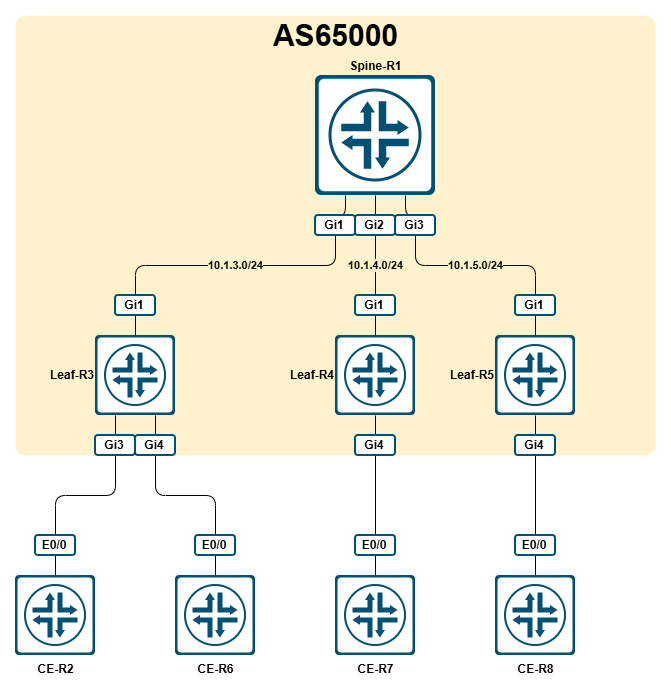
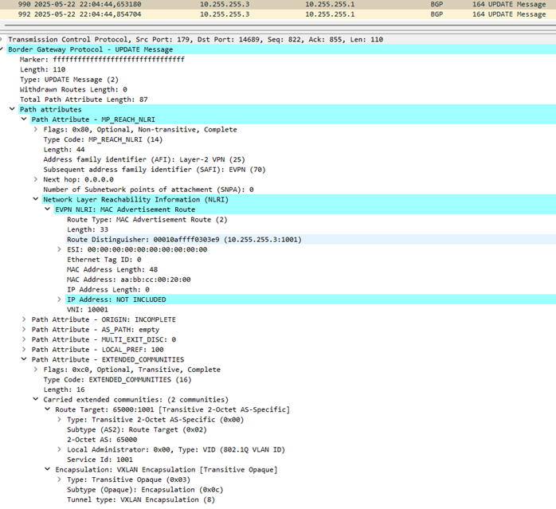
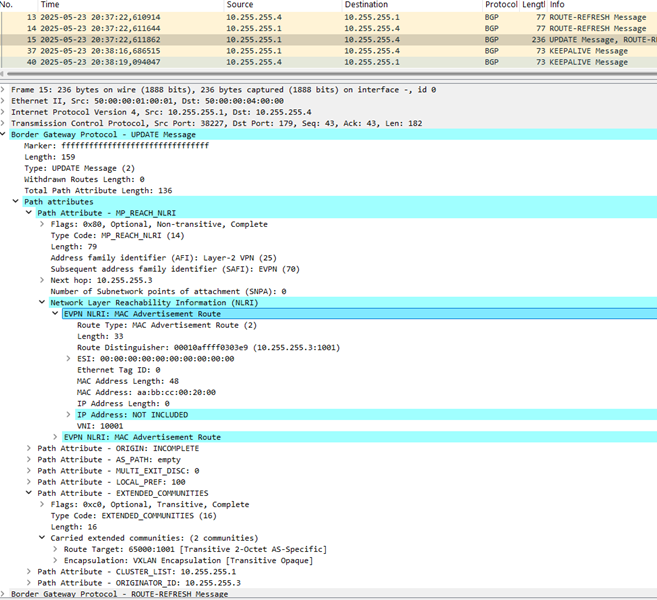
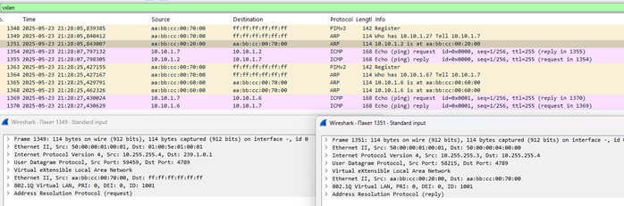

# LAB - Cisco - VxLAN L2VNI EVPN

- [LAB - Cisco - VxLAN L2VNI EVPN](#lab---cisco---vxlan-l2vni-evpn)
  - [Топология](#топология)
  - [Описание](#описание)
  - [Настройка](#настройка)
  - [Примененная конфигурация](#примененная-конфигурация)

## Топология



## Описание

В данной лабораторной работе необходимо организовать L2-связность между CE-маршрутизаторами. Для этого, в свою очередь, необходимо организовать VxLAN L2VNI при помощи EVPN.

Использованные образы:

- i86bi_LinuxL3-AdvEnterpriseK9-M2_157_3_May_2018.bin
- c8000v-17-13-01a

## Настройка

Исходим из того, что стартовая конфигурация (адресация, IGP, PIM) уже применена.

В данной лабораторной R1 – это транзитный маршрутизатор, R3, R4 и R5 – это VTEP’ы.

В предыдущей лабораторной (VxLAN L2VNI Flood and Learn) MAC-адреса изучались на уровне data plane как при CE-VTEP-взаимодействии, так и при VTEP-VTEP-взаимодействии. Грубо говоря, о том, что на R3 появился какой-то MAC-адрес остальные VTEP’ы узнавали только после фактического получения какого-либо VxLAN-пакета с Ethernet-кадром, в котором, в свою очередь, в SRC_ADDR был указан этот MAC-адрес.
На этот раз мы будем использовать EVPN в качестве механизма передачи информации об изученных на VTEP’е MAC-адресах. В чем разница? Разница в том, что в этом случае VTEP посредством EVPN просигнализирует другим VTEP об изученном MAC-адресе, без необходимости отправки кадра к ним.

EVPN – Ethernet VPN – это относительно новая технология, устраняющая недостатки традиционных VPLS (невозможность полноценного мультихоминга, изучение адресов только на уровне data plane и т.п.). Как было сказано выше, EVPN позволяет просигнализировать другим VTEP изученные MAC-адреса (и не только). Сигнализация происходит при помощи BGP, AFI: L2VPN (25), SAFI: EVPN (70).

Итак, для настройки сервисов нам необходимо будет выполнить следующие шаги:

- настроить CE-маршрутизаторы
- настроить NVE-интерфейс
- настроить BGP-связность между VTEP’ами
- настроить L2-сервисы на VTEP’ах, а именно:
  - EFP (Ethernet Flow Point)
  - Bridge-domain
  - EVI (EVPN Instance)
  - VNI (VxLAN Network Identifier)

Начнем с настройки CE: для сервиса будем использовать влан 1001.

**R2:**

```cisco
!
interface Ethernet0/0.1001
 encapsulation dot1Q 1001
 ip address 10.10.1.2 255.255.255.0
!
```

**R6:**

```cisco
!
interface Ethernet0/0.1001
 encapsulation dot1Q 1001
 ip address 10.10.1.6 255.255.255.0
!
```

**R7:**

```cisco
!
interface Ethernet0/0.1001
 encapsulation dot1Q 1001
 ip address 10.10.1.7 255.255.255.0
!
```

**R8:**

```cisco
!
interface Ethernet0/0.1001
 encapsulation dot1Q 1001
 ip address 10.10.1.8 255.255.255.0
!
```

Теперь создадим NVE-интерфейс на каждом VTEP:

**R3, R4, R5:**

```cisco
interface nve1
 source-interface Loopback0
!
```

Теперь давайте создадим 2 EFP для Leaf-R3 и добавим их в bridge-domain:

**R3:**

```cisco
!
interface GigabitEthernet3
service instance 1001 ethernet
  encapsulation dot1q 1001
  rewrite ingress tag pop 1 symmetric
  !
!
interface GigabitEthernet4
service instance 1001 ethernet
  encapsulation dot1q 1001
  rewrite ingress tag pop 1 symmetric
 !
!
bridge-domain 1001
 member GigabitEthernet3 service-instance 1001
 member GigabitEthernet4 service-instance 1001
!
```

И проверим связность:

**R2:**

```cisco
CE-R2#ping 10.10.1.6
Type escape sequence to abort.
Sending 5, 100-byte ICMP Echos to 10.10.1.6, timeout is 2 seconds:
.!!!!
Success rate is 80 percent (4/5), round-trip min/avg/max = 1/1/1 ms
CE-R2#
```

Для обеспечения юникастовой связности настоим на R2 и R6 BGP (никакой маршрутной информации там передаваться не будет – только KEEPALIVE-сообщения):

**R2:**

```cisco
!
router bgp 65001
 bgp log-neighbor-changes
 neighbor 10.10.1.6 remote-as 65001
!
```

**R6:**

```cisco
!
router bgp 65001
 bgp log-neighbor-changes
 neighbor 10.10.1.2 remote-as 65001
!
```

Оставим пока в покое CE-устройства и настроим BGP-связность в L2VPN EVPN.

В рамках данной лабораторной работы мы будем использовать R1 в качестве route-reflector, а Leaf’ы в свою очередь будут подключаться к нему как rr-клиенты.

**R1:**

```cisco
!
router bgp 65000
 bgp log-neighbor-changes
 no bgp default ipv4-unicast
 neighbor RRC peer-group
 neighbor RRC remote-as 65000
 neighbor RRC update-source Loopback0
 neighbor 10.255.255.3 peer-group RRC
 neighbor 10.255.255.4 peer-group RRC
 neighbor 10.255.255.5 peer-group RRC
 !
 address-family ipv4
 exit-address-family
 !
 address-family l2vpn evpn
  neighbor RRC send-community both
  neighbor RRC route-reflector-client
  neighbor 10.255.255.3 activate
  neighbor 10.255.255.4 activate
  neighbor 10.255.255.5 activate
 exit-address-family
!
```

**R3 / R4 / R5:**

```cisco
!
router bgp 65000
 bgp log-neighbor-changes
 no bgp default ipv4-unicast
 neighbor 10.255.255.1 remote-as 65000
 neighbor 10.255.255.1 update-source Loopback0
 !
 address-family ipv4
 exit-address-family
 !
 address-family l2vpn evpn
  neighbor 10.255.255.1 activate
  neighbor 10.255.255.1 send-community both
 exit-address-family
!
```

Проверяем:

**R1:**

```cisco
Spine-R1#show bgp l2vpn evpn summary
BGP router identifier 10.255.255.1, local AS number 65000
BGP table version is 1, main routing table version 1

Neighbor        V           AS MsgRcvd MsgSent   TblVer  InQ OutQ Up/Down  State/PfxRcd
10.255.255.3    4        65000       2       2        1    0    0 00:00:11        0
10.255.255.4    4        65000       5       5        1    0    0 00:00:57        0
10.255.255.5    4        65000       2       2        1    0    0 00:00:32        0
Spine-R1#
```

**R3:**

```cisco
Leaf-R3#show bgp l2vpn evpn summary
BGP router identifier 10.255.255.3, local AS number 65000
BGP table version is 1, main routing table version 1

Neighbor        V           AS MsgRcvd MsgSent   TblVer  InQ OutQ Up/Down  State/PfxRcd
10.255.255.1    4        65000       2       2        1    0    0 00:00:39        0
Leaf-R3#show bgp l2vpn evpn
Leaf-R3#
```

BGP-сессии поднялись, в таблицах, как видно, пока пусто.

Теперь перейдем к настройкам EVPN на R3. Сначала глобальные настройки:

**R3:**

```cisco
Leaf-R3(config)#l2vpn evpn
Leaf-R3(config-evpn)#?
L2VPN EVPN global configuration commands:
  default               Set a command to its defaults
  default-gateway       Default Gateway parameters
  exit                  Exit from L2VPN evpn global configuration mode
  flooding-suppression  Suppress flooding of broadcast, multicast, and/or
                        unknown unicast packets
  ip                    IP parameters
  logging               Configure logging flags
  mac                   MAC parameters
  mpls                  MPLS parameters
  multihoming           Multihoming parameters
  no                    Negate a command or set its defaults
  replication-type      Specify method for replicating BUM traffic
  route-target          Route Target VPN Extended Communities
  router-id             EVPN router ID

Leaf-R3(config-evpn)#
```

На данный момент нас здесь будут интересовать только следующие параметры:

1. `router-id` – здесь мы в явном виде укажем на основании адресации какого интерфейса будет создаваться route-distinguisher для наших EVI.
2. `replication-type` – здесь мы выберем метод отправки BUM-трафика. Нам доступны два варианта:
    1. `ingress` – речь про ingress replication, т.е. отправку юникастом BUM-трафика в сторону каждого прописанного руками пира;
    2. `static` – неочевидно, но здесь идет речь про отправку BUM-трафика через multicast-группы.

В явном виде укажем, что RD для всех EVI будет генерироваться на основании Loopback0, а BUM-трафик пойдет через мультикаст.

**R3:**

```cisco
!
l2vpn evpn
 replication-type static
 router-id Loopback0
!  
```

Теперь создадим EVI:

**R3:**

```cisco
l2vpn evpn instance 1001 vlan-based
 encapsulation vxlan
 ip local-learning disable
```

Что мы здесь сделали? Мы создали EVI под номером 1001 типа vlan-based (грубо говоря: один влан – один EVI – одна бридж-таблица, см. RFC7432#6.1 для подробностей). Мы указали, что инкапсулироваться пакеты должны в VxLAN и в явном виде запретили изучение IP-адресов.

Посмотрим, что сейчас видно в EVI и включим debug исходящих update’ов.:

**R3:**

```cisco
Leaf-R3#show l2vpn evpn evi 1001 detail
EVPN instance:       1001 (VLAN Based)
  RD:                10.255.255.3:1001 (auto)
  Import-RTs:        65000:1001
  Export-RTs:        65000:1001
  Per-EVI Label:     none
  State:             Established
  Replication Type:  Static (global)
  Encapsulation:     vxlan
  IP Local Learn:    Disabled
  Adv. Def. Gateway: Disabled (global)
  Re-originate RT5:  Disabled
  AR Flood Suppress: Enabled (global)

Leaf-R3#show bgp l2vpn evpn
Leaf-R3#
Leaf-R3#debug bgp l2vpn evpn updates out
BGP updates debugging is on (outbound) for address family: L2VPN E-VPN
```

Теперь посмотрим, что есть в бридже и добавим туда EVI:

**R3:**

```cisco
Leaf-R3#show bridge-domain 1001
Bridge-domain 1001 (2 ports in all)
State: UP                    Mac learning: Enabled
Aging-Timer: 300 second(s)
Unknown Unicast Flooding Suppression: Disabled
Maximum address limit: 65536
    GigabitEthernet3 service instance 1001
    GigabitEthernet4 service instance 1001
   AED MAC address    Policy  Tag       Age  Pseudoport
   -----------------------------------------------------------------------------
   0   AABB.CC00.6000 forward dynamic   297  GigabitEthernet4.EFP1001
   0   AABB.CC00.2000 forward dynamic   298  GigabitEthernet3.EFP1001

Leaf-R3# 
Leaf-R3#conf t
Enter configuration commands, one per line.  End with CNTL/Z.
Leaf-R3(config)#bridge-domain 1001
Leaf-R3(config-bdomain)#member evpn-instance 1001 vni 10001
Leaf-R3(config-bdomain)#end
Leaf-R3#
*May 23 2025 19:41:51.435 MSK: %SYS-5-CONFIG_I: Configured from console by console
Leaf-R3#show bridge-domain 1001
*May 23 2025 19:42:03.793 MSK: BGP: EVPN Rcvd pfx: [2][10.255.255.3:1001][0][48][AABBCC006000][0][*]/20, net flags: 0
*May 23 2025 19:42:03.793 MSK: TRM communities not added to sourced RT2
*May 23 2025 19:42:03.793 MSK: BGP(10): update modified for [2][10.255.255.3:1001][0][48][AABBCC006000][0][*]/23
*May 23 2025 19:42:03.794 MSK: BGP(10): 10.255.255.1 Path-gateway-IPv4: IPv4 NEXT_HOP set to vxlan local vtep-ip UNKNOWN for local net [2][10.255.255.3:1001][0][48][AABBCC006000][0][*]/20, nh_size: 4
*May 23 2025 19:42:03.794 MSK: BGP(10): update modified for [2][10.255.255.3:1001][0][48][AABBCC006000][0][*]/23
*May 23 2025 19:42:03.794 MSK: BGP(10): (base) 10.255.255.1 send UPDATE (format) [2][10.255.255.3:1001][0][48][AABBCC006000][0][*]/23, next 0.0.0.0, metric 0, path Local, extended community RT:65000:1001 ENCAP:8
*May 23 2025 19:42:03.997 MSK: BGP: EVPN Rcvd pfx: [2][10.255.255.3:1001][0][48][AABBCC002000][0][*]/20, net flags: 0
*May 23 2025 19:42:03.997 MSK: TRM communities not added to sourced RT2
*May 23 2025 19:42:03.997 MSK: BGP(10): update modified for [2][10.255.255.3:1001][0][48][AABBCC002000][0][*]/23
Leaf-R3#conf t
*May 23 2025 19:42:03.997 MSK: BGP(10): 10.255.255.1 Path-gateway-IPv4: IPv4 NEXT_HOP set to vxlan local vtep-ip UNKNOWN for local net [2][10.255.255.3:1001][0][48][AABBCC002000][0][*]/20, nh_size: 4
*May 23 2025 19:42:03.997 MSK: BGP(10): update modified for [2][10.255.255.3:1001][0][48][AABBCC002000][0][*]/23
*May 23 2025 19:42:03.997 MSK: BGP(10): (base) 10.255.255.1 send UPDATE (format) [2][10.255.255.3:1001][0][48][AABBCC002000][0][*]/23, next 0.0.0.0, metric 0, path Local, extended community RT:65000:1001 ENCAP:8
Leaf-R3# 
```

В дебаге мы видим, что в сторону R1 (RR) отправляется Update с двумя маршрутами типа 2, содержащих в себе RD (`10.255.255.3:1001`), RT (`65000:1001`), изученные MAC-адреса (по одному на каждый маршрут) и тип инкапсуляции (8 - VxLAN).

На скрине ниже содержимое этого пакета:



При этом на R1 мы увидим такое:

**R1:**

```cisco
Spine-R1#
*May 22 2025 22:04:44.636 MSK: %BGP-6-NEXTHOP: Invalid next hop (0.0.0.0) received from 10.255.255.3: martian next hop
Spine-R1#show bgp l2vpn evpn
Spine-R1#
```

Т.е. R1 из-за некорректного nexthop отбрасывает получаемые от R3 маршруты.
Чтобы разобраться в чем дело, вернемся на R3 и посмотрим внимательно на маршрутную информацию:

**R3:**

```cisco
Leaf-R3#undebug all
All possible debugging has been turned off
Leaf-R3#
Leaf-R3#show bgp l2vpn evpn
BGP table version is 7, local router ID is 10.255.255.3
Status codes: s suppressed, d damped, h history, * valid, > best, i - internal,
              r RIB-failure, S Stale, m multipath, b backup-path, f RT-Filter,
              x best-external, a additional-path, c RIB-compressed,
              t secondary path, L long-lived-stale,
Origin codes: i - IGP, e - EGP, ? - incomplete
RPKI validation codes: V valid, I invalid, N Not found

     Network          Next Hop            Metric LocPrf Weight Path
Route Distinguisher: 10.255.255.3:1001
 *>   [2][10.255.255.3:1001][0][48][AABBCC002000][0][*]/20
                      ::                                 32768 ?
 *>   [2][10.255.255.3:1001][0][48][AABBCC006000][0][*]/20
                      ::                                 32768 ?
Leaf-R3#show bgp l2vpn evpn detail

Route Distinguisher: 10.255.255.3:1001
BGP routing table entry for [2][10.255.255.3:1001][0][48][AABBCC002000][0][*]/20, version 7
  Paths: (1 available, best #1, table evi_1001)
  Advertised to update-groups:
     1
  Refresh Epoch 1
  Local
    :: (via default) from 0.0.0.0 (10.255.255.3)
      Origin incomplete, localpref 100, weight 32768, valid, sourced, local, best
      EVPN ESI: 00000000000000000000, Label1 10001
      Extended Community: RT:65000:1001 ENCAP:8
      Local irb vxlan vtep:(inaccessible)
      rx pathid: 0, tx pathid: 0x0
      Updated on May 23 2025 19:42:03 MSK
BGP routing table entry for [2][10.255.255.3:1001][0][48][AABBCC006000][0][*]/20, version 6
  Paths: (1 available, best #1, table evi_1001)
  Advertised to update-groups:
     1
  Refresh Epoch 1
  Local
    :: (via default) from 0.0.0.0 (10.255.255.3)
      Origin incomplete, localpref 100, weight 32768, valid, sourced, local, best
      EVPN ESI: 00000000000000000000, Label1 10001
      Extended Community: RT:65000:1001 ENCAP:8
      Local irb vxlan vtep:(inaccessible)
      rx pathid: 0, tx pathid: 0x0
      Updated on May 23 2025 19:42:03 MSK
Leaf-R3#
```

У нас не настроен VNI. Собственно, именно это мы сейчас и сделаем:

**R3:**

```cisco
Leaf-R3#debug bgp l2vpn evpn updates out
BGP updates debugging is on (outbound) for address family: L2VPN E-VPN
Leaf-R3#conf t
Enter configuration commands, one per line.  End with CNTL/Z.
Leaf-R3(config)#interface nve1
Leaf-R3(config-if)#host-reachability protocol bgp
Leaf-R3(config-if)#member vni 10001 mcast-group 239.1.0.1
Leaf-R3(config-if)#
*May 23 2025 19:56:05.540 MSK: TRM communities not added to sourced RT2
*May 23 2025 19:56:05.540 MSK: BGP(10): prefix [2][10.255.255.3:1001][0][48][AABBCC002000][0][*]/20 replacing esi starting 00 with 00 old vni label 002711 with new 002711 old vpn label 000000 with new 000000
*May 23 2025 19:56:05.540 MSK: TRM communities not added to sourced RT2
*May 23 2025 19:56:05.540 MSK: BGP(10): prefix [2][10.255.255.3:1001][0][48][AABBCC006000][0][*]/20 replacing esi starting 00 with 00 old vni label 002711 with new 002711 old vpn label 000000 with new 000000
*May 23 2025 19:56:05.541 MSK: BGP(10): update modified for [2][10.255.255.3:1001][0][48][AABBCC002000][0][*]/23
*May 23 2025 19:56:05.541 MSK: BGP(10): 10.255.255.1 Path-gateway-IPv4: IPv4 NEXT_HOP set to vxlan local vtep-ip 10.255.255.3 for local net [2][10.255.255.3:1001][0][48][AABBCC002000][0][*]/20, nh_size: 4
*May 23 2025 19:56:05.541 MSK: BGP(10): update modified for [2][10.255.255.3:1001][0][48][AABBCC002000][0][*]/23
*May 23 2025 19:56:05.541 MSK: BGP(10): (base) 10.255.255.1 send UPDATE (format) [2][10.255.255.3:1001][0][48][AABBCC002000][0][*]/23, next 10.255.255.3, metric 0, path Local, extended community RT:65000:1001 ENCAP:8
*May 23 2025 19:56:05.541 MSK: BGP(10): update modified for [2][10.255.255.3:1001][0][48][AABBCC006000][0][*]/23
*May 23 2025 19:56:05.541 MSK: BGP(10): 10.255.255.1 Path-gateway-IPv4: IPv4 NEXT_HOP set to vxlan local vtep-ip 10.255.255.3 for local net [2][10.255.255.3:1001][0][48][AABBCC006000][0][*]/20, nh_size: 4
*May 23 2025 19:56:05.541 MSK: BGP(10): update modified for [2][10.255.255.3:1001][0][48][AABBCC006000][0][*]/23
*May 23 2025 19:56:05.543 MSK: BGP(10): 10.255.255.1 rcv UPDATE w/ attr: nexthop 10.255.255.3, origin ?, localpref 100, metric 0, originator 10.255.255.3, clusterlist 10.255.255.1, merged path , AS_PATH , community , large community , extended community RT:65000:1001 ENCAP:8, SSA attribute
*May 23 2025 19:56:05.543 MSK: BGPSSA ssacount is 0, Tunnel attribute
*May 23 2025 19:56:05.543 MSK: Tunnel encap type: 0, encap size: 0, Link-state attribute: {}, PrefixSid attribute:
*May 23 2025 19:56:05.543 MSK: BGP(10): 10.255.255.1 rcv UPDATE about [2][10.255.255.3:1001][0][48][AABBCC002000][0][*]/23 -- DENIED due to: ORIGINATOR is us; MP_REACH NEXTHOP is our own address;
*May 23 2025 19:56:05.543 MSK: BGP(10): 10.255.255.1 rcv UPDATE about [2][10.255.255.3:1001][0][48][AABBCC006000][0][*]/23 -- DENIED due to: ORIGINATOR is us; MP_REACH NEXTHOP is our own address;
*May 23 2025 19:56:06.977 MSK: %PIM-5-DRCHG: DR change from neighbor 0.0.0.0 to 10.255.255.3 on interface Tunnel0
Leaf-R3(config-if)#end
*May 23 2025 19:56:56.221 MSK: %SYS-5-CONFIG_I: Configured from console by console
Leaf-R3#undebug all
All possible debugging has been turned off
Leaf-R3#
```

Итак, что мы сделали и что получилось в итоге?

Сначала мы применили `host-reachability protocol bgp` в настройках интерфейса nve1 – данная команда «включает» EVPN для VxLAN-туннелей, работающих через этот интерфейс. И, разумеется, создали VNI 10001, с подпиской на группу 239.1.0.1.

В дебаге видно, что в качестве next-hop’а для сгенерированных маршрутов 2 типа был выставлен vtep-ip локального VTEP, т.е. 10.255.255.3. В таком виде они были отданы на RR.

Теперь посмотрим, что у нас видно в EVPN и VNI:

**R3:**

```cisco
Leaf-R3#show l2vpn evpn evi 1001 detail
EVPN instance:       1001 (VLAN Based)
  RD:                10.255.255.3:1001 (auto)
  Import-RTs:        65000:1001
  Export-RTs:        65000:1001
  Per-EVI Label:     none
  State:             Established
  Replication Type:  Static (global)
  Encapsulation:     vxlan
  IP Local Learn:    Disabled
  Adv. Def. Gateway: Disabled (global)
  Re-originate RT5:  Disabled
  AR Flood Suppress: Enabled (global)
  Bridge Domain:     1001
    Ethernet-Tag:    0
    State:           Established
    Flood Suppress:  Detached
    Core If:
    Access If:
    NVE If:          nve1
    RMAC:            0000.0000.0000
    Core BD:         0
    L2 VNI:          10001
    L3 VNI:          0
    VTEP IP:         10.255.255.3
    MCAST IP:        239.1.0.1
    Pseudoports:
      GigabitEthernet3 service instance 1001
        Routes: 1 MAC, 0 MAC/IP
      GigabitEthernet4 service instance 1001
        Routes: 1 MAC, 0 MAC/IP

Leaf-R3#show nve vni 10001
Interface  VNI        Multicast-group  VNI state  Mode  BD    cfg vrf
nve1       10001      239.1.0.1        Up         L2CP  1001  CLI N/A
```

Здесь мы видим что, evi 1001 привязан к BD 1001, к NVE-интерфейсу nve1, номер и тип VNI, адрес VTEP и мультикастовую группу. Также в выводе информации о VNI стоит обратить внимание на столбец Mode – значение в нем L2CP означает то, что это L2VNI и изучение адресной информации (читай MAC-адресов) происходит на CP (читай EVPN).

Теперь посмотрим, что у нас в BGP на R3 и R1:

**R3:**

```cisco
Leaf-R3#show bgp l2vpn evpn AABBCC002000
BGP routing table entry for [2][10.255.255.3:1001][0][48][AABBCC002000][0][*]/20, version 18
Paths: (1 available, best #1, table evi_1001)
  Advertised to update-groups:
     1
  Refresh Epoch 1
  Local
    0.0.0.0 (via default) from 0.0.0.0 (10.255.255.3)
      Origin incomplete, localpref 100, weight 32768, valid, sourced, local, best
      EVPN ESI: 00000000000000000000, Label1 10001
      Extended Community: RT:65000:1001 ENCAP:8
      Local irb vxlan vtep:
        vrf:not found, l3-vni:0
        local router mac:0000.0000.0000
        core-irb interface:(not found)
        vtep-ip:10.255.255.3
      rx pathid: 0, tx pathid: 0x0
      Updated on May 23 2025 19:59:53 MSK
Leaf-R3#
```

**R1:**

```cisco
Spine-R1#show bgp l2vpn evpn | b Network
     Network          Next Hop            Metric LocPrf Weight Path
Route Distinguisher: 10.255.255.3:1001
 *>i  [2][10.255.255.3:1001][0][48][AABBCC002000][0][*]/20
                      10.255.255.3             0    100      0 ?
 *>i  [2][10.255.255.3:1001][0][48][AABBCC006000][0][*]/20
                      10.255.255.3             0    100      0 ?
Spine-R1#show bgp l2vpn evpn AABBCC002000
BGP routing table entry for [2][10.255.255.3:1001][0][48][AABBCC002000][0][*]/20, version 10
Paths: (1 available, best #1, table EVPN-BGP-Table)
  Advertised to update-groups:
     1
  Refresh Epoch 1
  Local, (Received from a RR-client)
    10.255.255.3 (metric 10) (via default) from 10.255.255.3 (10.255.255.3)
      Origin incomplete, metric 0, localpref 100, valid, internal, best
      EVPN ESI: 00000000000000000000, Label1 10001
      Extended Community: RT:65000:1001 ENCAP:8
      rx pathid: 0, tx pathid: 0x0
      Updated on May 23 2025 19:59:53 MSK
Spine-R1#
```

Здесь мы видим, что информация о VTEP’е в общем-то является локальными данными, из которых, впрочем, как мы видели в дебаге, подставляются во время UPDATE’а значения (IP-адрес VTEP в качестве next-hop’а).

В поле Label1 вместо номера MPLS-метки передается (ожидаемо) номер VNI.

Теперь идем на R4 и R5, снова настраивать EVI (конфиг для обоих роутеров будет одинаковый):

**R4 / R5:**

```cisco
l2vpn evpn
 replication-type static
 router-id Loopback0
!
l2vpn evpn instance 1001 vlan-based
 encapsulation vxlan
 ip local-learning disable
!
```

Сначала идем на R4. Но для начала посмотрим, видно ли что-нибудь сейчас в BGP:

**R4:**

```cisco
Leaf-R4#show bgp l2vpn evpn
Leaf-R4#
Leaf-R4#conf t
Enter configuration commands, one per line.  End with CNTL/Z.
Leaf-R4(config)#l2vpn evpn
Leaf-R4(config-evpn)# replication-type static
Leaf-R4(config-evpn)# router-id Loopback0
Leaf-R4(config-evpn)#!
Leaf-R4(config-evpn)#l2vpn evpn instance 1001 vlan-based
Leaf-R4(config-evpn-evi)# encapsulation vxlan
Leaf-R4(config-evpn-evi)# ip local-learning disable
Leaf-R4(config-evpn-evi)#!
Leaf-R4(config-evpn-evi)#end
Leaf-R4#
```

И посмотрим, изменилось ли что-нибудь:

**R4:**

```cisco
Leaf-R4#show bgp l2vpn evpn | b Network
     Network          Next Hop            Metric LocPrf Weight Path
Route Distinguisher: 10.255.255.3:1001
 *>i  [2][10.255.255.3:1001][0][48][AABBCC002000][0][*]/20
                      10.255.255.3             0    100      0 ?
 *>i  [2][10.255.255.3:1001][0][48][AABBCC006000][0][*]/20
                      10.255.255.3             0    100      0 ?
Route Distinguisher: 10.255.255.4:1001
 *>i  [2][10.255.255.4:1001][0][48][AABBCC002000][0][*]/20
                      10.255.255.3             0    100      0 ?
 *>i  [2][10.255.255.4:1001][0][48][AABBCC006000][0][*]/20
                      10.255.255.3             0    100      0 ?
Leaf-R4#
```



Что мы здесь видим? А видим мы здесь то, что как только мы создали EVI 1001, R4 отправил запрос ROUTE-REFRESH в сторону рефлектора и, в итоге, получил UPDATE с маршрутной информацией (см. скрин). Важно отметить, что сейчас мы даже не успели создать BD и, тем более, привязать к нему EVI.

Сейчас в таблице BGP EVPN находится 4 маршрута: 2 с RD 10.255.255.3:1001 (полученные от RR) и 2 этих же маршрута, но уже «импортированные» в таблицу evi_1001 с соответствующим RD. Если посмотреть на EVI, то можно будет увидеть почему эти маршруты были импортированы в этот MAC-VRF: у нас совпадают значения Import-RT на R4 со значением Export-RT на R3.

**R4:**

```cisco
Leaf-R4#show l2vpn evpn evi 1001 detail
EVPN instance:       1001 (VLAN Based)
  RD:                10.255.255.4:1001 (auto)
  Import-RTs:        65000:1001
  Export-RTs:        65000:1001
  Per-EVI Label:     none
  State:             Established
  Replication Type:  Static (global)
  Encapsulation:     vxlan
  IP Local Learn:    Disabled
  Adv. Def. Gateway: Disabled (global)
  Re-originate RT5:  Disabled
  AR Flood Suppress: Enabled (global)
```

**R3:**

```cisco
Leaf-R3#show l2vpn evpn evi 1001 detail
EVPN instance:       1001 (VLAN Based)
  RD:                10.255.255.3:1001 (auto)
  Import-RTs:        65000:1001
  Export-RTs:        65000:1001
  Per-EVI Label:     none
  State:             Established
  Replication Type:  Static (global)
  Encapsulation:     vxlan
  IP Local Learn:    Disabled
  Adv. Def. Gateway: Disabled (global)
  Re-originate RT5:  Disabled
  AR Flood Suppress: Enabled (global)
  Bridge Domain:     1001
    Ethernet-Tag:    0
    State:           Established
    Flood Suppress:  Detached
    Core If:
    Access If:
    NVE If:          nve1
    RMAC:            0000.0000.0000
    Core BD:         0
    L2 VNI:          10001
    L3 VNI:          0
    VTEP IP:         10.255.255.3
    MCAST IP:        239.1.0.1
    Pseudoports:
      GigabitEthernet3 service instance 1001
        Routes: 1 MAC, 0 MAC/IP
      GigabitEthernet4 service instance 1001
        Routes: 1 MAC, 0 MAC/IP
```

Теперь посмотрим повнимательнее на сами маршруты, на примере MAC-адреса CE-R2:

**R4:**

```cisco
Leaf-R4#show bgp l2vpn evpn AABBCC002000
BGP routing table entry for [2][10.255.255.3:1001][0][48][AABBCC002000][0][*]/20, version 18
Paths: (1 available, best #1, table EVPN-BGP-Table)
  Not advertised to any peer
  Refresh Epoch 6
  Local
    10.255.255.3 (metric 20) (via default) from 10.255.255.1 (10.255.255.1)
      Origin incomplete, metric 0, localpref 100, valid, internal, best
      EVPN ESI: 00000000000000000000, Label1 10001
      Extended Community: RT:65000:1001 ENCAP:8
      Originator: 10.255.255.3, Cluster list: 10.255.255.1
      rx pathid: 0, tx pathid: 0x0
      Updated on May 23 2025 20:37:22 MSK
BGP routing table entry for [2][10.255.255.4:1001][0][48][AABBCC002000][0][*]/20, version 20
Paths: (1 available, best #1, table evi_1001)
  Not advertised to any peer
  Refresh Epoch 6
  Local, imported path from [2][10.255.255.3:1001][0][48][AABBCC002000][0][*]/20 (global)
    10.255.255.3 (metric 20) (via default) from 10.255.255.1 (10.255.255.1)
      Origin incomplete, metric 0, localpref 100, valid, internal, best
      EVPN ESI: 00000000000000000000, Label1 10001
      Extended Community: RT:65000:1001 ENCAP:8
      Originator: 10.255.255.3, Cluster list: 10.255.255.1
      Local irb vxlan vtep:(inaccessible)
      rx pathid: 0, tx pathid: 0x0
      Updated on May 23 2025 20:37:22 MSK
```

Здесь мы в явном виде увидим номер VNI, откуда и куда импортированы маршруты, номер VTEP’а и т.п.

Создадим bridge-domain, EFP и донастроим интерфейс NVE:

```cisco
!
interface Gi4
 service instance 1001 ethernet
  encapsulation dot1q 1001
 !
!
interface nve1
 host-reachability protocol bgp
 member vni 10001 mcast-group 239.1.0.1
!
bridge-domain 1001
 member GigabitEthernet4 service-instance 1001
 member evpn-instance 1001 vni 10001
!
```

И проверим:

**R4:**

```cisco
Leaf-R4#show bridge-domain 1001
Bridge-domain 1001 (2 ports in all)
State: UP                    Mac learning: Enabled
Aging-Timer: 300 second(s)
Unknown Unicast Flooding Suppression: Disabled
Maximum address limit: 65536
    GigabitEthernet4 service instance 1001
    vni 10001
   AED MAC address    Policy  Tag       Age  Pseudoport
   -----------------------------------------------------------------------------
   -   AABB.CC00.6000 forward static_r  0    nve1.VNI10001, EVPN
   -   AABB.CC00.2000 forward static_r  0    nve1.VNI10001, EVPN 

Leaf-R4#show l2vpn evpn mac evi 1001
MAC Address    EVI   BD    ESI                      Ether Tag  Next Hop(s)
-------------- ----- ----- ------------------------ ---------- ---------------
aabb.cc00.2000 1001  1001  0000.0000.0000.0000.0000 0          10.255.255.3
aabb.cc00.6000 1001  1001  0000.0000.0000.0000.0000 0          10.255.255.3

Leaf-R4#show l2vpn evpn mac evi 1001 detail
MAC Address:                aabb.cc00.2000
EVPN Instance:              1001
Bridge Domain:              1001
Ethernet Segment:           0000.0000.0000.0000.0000
Ethernet Tag ID:            0
Next Hop(s):                V:10001 10.255.255.3
Local Address:              10.255.255.4
Sequence Number:            0
MAC only present:           Yes
MAC Duplication Detection:  Timer not running

MAC Address:                aabb.cc00.6000
EVPN Instance:              1001
Bridge Domain:              1001
Ethernet Segment:           0000.0000.0000.0000.0000
Ethernet Tag ID:            0
Next Hop(s):                V:10001 10.255.255.3
Local Address:              10.255.255.4
Sequence Number:            0
MAC only present:           Yes
MAC Duplication Detection:  Timer not running
```

В выводе BD мы видим, что таблице MAC-адресов есть две записи, полученные по EVPN и доступные через VNI 10001. Если мы повнимательнее посмотрим на MAC-адреса в l2vpn evpn, то сможем увидеть, какие маршрутизаторы являются next-hop’ами.

Попробуем пропинговать R2 и R6 с R7:

**R7:**

```cisco
CE-R7#ping 10.10.1.2 rep 2
Type escape sequence to abort.
Sending 2, 100-byte ICMP Echos to 10.10.1.2, timeout is 2 seconds:
.!
Success rate is 50 percent (1/2), round-trip min/avg/max = 2/2/2 ms
CE-R7#ping 10.10.1.6 rep 2
Type escape sequence to abort.
Sending 2, 100-byte ICMP Echos to 10.10.1.6, timeout is 2 seconds:
.!
Success rate is 50 percent (1/2), round-trip min/avg/max = 1/1/1 ms
CE-R7#
```

Связность есть, а на скрине ниже видны все пакеты.



Теперь еще раз посмотрим, что у нас таблицах BGP:

**R4:**

```cisco
Leaf-R4#show bgp l2vpn evpn | b Network
     Network          Next Hop            Metric LocPrf Weight Path
Route Distinguisher: 10.255.255.3:1001
 *>i  [2][10.255.255.3:1001][0][48][AABBCC002000][0][*]/20
                      10.255.255.3             0    100      0 ?
 *>i  [2][10.255.255.3:1001][0][48][AABBCC006000][0][*]/20
                      10.255.255.3             0    100      0 ?
Route Distinguisher: 10.255.255.4:1001
 *>i  [2][10.255.255.4:1001][0][48][AABBCC002000][0][*]/20
                      10.255.255.3             0    100      0 ?
 *>i  [2][10.255.255.4:1001][0][48][AABBCC006000][0][*]/20
                      10.255.255.3             0    100      0 ?
 *>   [2][10.255.255.4:1001][0][48][AABBCC007000][0][*]/20
                      0.0.0.0                            32768 ?
Leaf-R4#
```

**R3:**

```cisco
Leaf-R3# show bgp l2vpn evpn | b Network
     Network          Next Hop            Metric LocPrf Weight Path
Route Distinguisher: 10.255.255.3:1001
 *>   [2][10.255.255.3:1001][0][48][AABBCC002000][0][*]/20
                      0.0.0.0                            32768 ?
 *>   [2][10.255.255.3:1001][0][48][AABBCC006000][0][*]/20
                      0.0.0.0                            32768 ?
 *>i  [2][10.255.255.3:1001][0][48][AABBCC007000][0][*]/20
                      10.255.255.4             0    100      0 ?
Route Distinguisher: 10.255.255.4:1001
 *>i  [2][10.255.255.4:1001][0][48][AABBCC007000][0][*]/20
                      10.255.255.4             0    100      0 ?
Leaf-R3#
```

Теперь пришла пора настроить последний VTEP.

```cisco
l2vpn evpn
 replication-type static
 router-id Loopback0
!
l2vpn evpn instance 1001 vlan-based
 encapsulation vxlan
 ip local-learning disable
!
!
interface Gi4
 service instance 1001 ethernet
  encapsulation dot1q 1001
 !
!
interface nve1
 host-reachability protocol bgp
 member vni 10001 mcast-group 239.1.0.1
!
bridge-domain 1001
 member GigabitEthernet4 service-instance 1001
 member evpn-instance 1001 vni 10001
!
```

Применяем конфигурацию и проверяем:

**R5:**

```cisco
Leaf-R5#show bgp l2vpn evpn | b Network
     Network          Next Hop            Metric LocPrf Weight Path
Route Distinguisher: 10.255.255.3:1001
 *>i  [2][10.255.255.3:1001][0][48][AABBCC002000][0][*]/20
                      10.255.255.3             0    100      0 ?
 *>i  [2][10.255.255.3:1001][0][48][AABBCC006000][0][*]/20
                      10.255.255.3             0    100      0 ?
Route Distinguisher: 10.255.255.4:1001
 *>i  [2][10.255.255.4:1001][0][48][AABBCC007000][0][*]/20
                      10.255.255.4             0    100      0 ?
Route Distinguisher: 10.255.255.5:1001
 *>i  [2][10.255.255.5:1001][0][48][AABBCC002000][0][*]/20
                      10.255.255.3             0    100      0 ?
 *>i  [2][10.255.255.5:1001][0][48][AABBCC006000][0][*]/20
                      10.255.255.3             0    100      0 ?
 *>i  [2][10.255.255.5:1001][0][48][AABBCC007000][0][*]/20
                      10.255.255.4             0    100      0 ?
Leaf-R5#
Leaf-R5#show bridge-domain 1001
Bridge-domain 1001 (2 ports in all)
State: UP                    Mac learning: Enabled
Aging-Timer: 300 second(s)
Unknown Unicast Flooding Suppression: Disabled
Maximum address limit: 65536
    GigabitEthernet4 service instance 1001
    vni 10001
   AED MAC address    Policy  Tag       Age  Pseudoport
   -----------------------------------------------------------------------------
   -   AABB.CC00.6000 forward static_r  0    nve1.VNI10001, EVPN
   -   AABB.CC00.7000 forward static_r  0    nve1.VNI10001, EVPN
   -   AABB.CC00.2000 forward static_r  0    nve1.VNI10001, EVPN

Leaf-R5#show l2vpn evpn mac evi 1001 detail
MAC Address:                aabb.cc00.2000
EVPN Instance:              1001
Bridge Domain:              1001
Ethernet Segment:           0000.0000.0000.0000.0000
Ethernet Tag ID:            0
Next Hop(s):                V:10001 10.255.255.3
Local Address:              10.255.255.5
Sequence Number:            0
MAC only present:           Yes
MAC Duplication Detection:  Timer not running

MAC Address:                aabb.cc00.6000
EVPN Instance:              1001
Bridge Domain:              1001
Ethernet Segment:           0000.0000.0000.0000.0000
Ethernet Tag ID:            0
Next Hop(s):                V:10001 10.255.255.3
Local Address:              10.255.255.5
Sequence Number:            0
MAC only present:           Yes
MAC Duplication Detection:  Timer not running

MAC Address:                aabb.cc00.7000
EVPN Instance:              1001
Bridge Domain:              1001
Ethernet Segment:           0000.0000.0000.0000.0000
Ethernet Tag ID:            0
Next Hop(s):                V:10001 10.255.255.4
Local Address:              10.255.255.5
Sequence Number:            0
MAC only present:           Yes
MAC Duplication Detection:  Timer not running
```

Теперь давайте настроим на всех 4 CE-роутерах Full-mesh iBGP и, таким образом, проверим связность «каждый с каждым».

**CE-R2:**

```cisco
router bgp 65001
 neighbor 10.10.1.6 remote-as 65001
 neighbor 10.10.1.7 remote-as 65001
 neighbor 10.10.1.8 remote-as 65001
!
```

**CE-R6:**

```cisco
router bgp 65001
 neighbor 10.10.1.2 remote-as 65001
 neighbor 10.10.1.7 remote-as 65001
 neighbor 10.10.1.8 remote-as 65001
!
```

**CE-R7:**

```cisco
router bgp 65001
 neighbor 10.10.1.2 remote-as 65001
 neighbor 10.10.1.6 remote-as 65001
 neighbor 10.10.1.8 remote-as 65001
!
```

**CE-R8:**

```cisco
router bgp 65001
 neighbor 10.10.1.2 remote-as 65001
 neighbor 10.10.1.6 remote-as 65001
 neighbor 10.10.1.7 remote-as 65001
!
```

**R2:**

```cisco
CE-R2#show bgp ipv4 unicast summary
BGP router identifier 10.10.1.2, local AS number 65001
BGP table version is 1, main routing table version 1

Neighbor        V           AS MsgRcvd MsgSent   TblVer  InQ OutQ Up/Down  State/PfxRcd
10.10.1.6       4        65001       4       6        1    0    0 00:01:48        0
10.10.1.7       4        65001       5       3        1    0    0 00:01:47        0
10.10.1.8       4        65001       4       4        1    0    0 00:01:47        0
```

**R6:**

```cisco
CE-R6#show bgp ipv4 unicast summary
BGP router identifier 10.10.1.6, local AS number 65001
BGP table version is 1, main routing table version 1

Neighbor        V           AS MsgRcvd MsgSent   TblVer  InQ OutQ Up/Down  State/PfxRcd
10.10.1.2       4        65001       6       4        1    0    0 00:01:48        0
10.10.1.7       4        65001       3       3        1    0    0 00:01:45        0
10.10.1.8       4        65001       6       6        1    0    0 00:01:49        0
```

**R7:**

```cisco
CE-R7#show bgp ipv4 unicast summary
BGP router identifier 10.10.1.7, local AS number 65001
BGP table version is 1, main routing table version 1

Neighbor        V           AS MsgRcvd MsgSent   TblVer  InQ OutQ Up/Down  State/PfxRcd
10.10.1.2       4        65001       3       5        1    0    0 00:01:47        0
10.10.1.6       4        65001       3       3        1    0    0 00:01:45        0
10.10.1.8       4        65001       3       3        1    0    0 00:01:42        0
```

**R8:**

```cisco
CE-R8#show bgp ipv4 unicast summary
BGP router identifier 10.10.1.8, local AS number 65001
BGP table version is 1, main routing table version 1

Neighbor        V           AS MsgRcvd MsgSent   TblVer  InQ OutQ Up/Down  State/PfxRcd
10.10.1.2       4        65001       4       4        1    0    0 00:01:47        0
10.10.1.6       4        65001       6       6        1    0    0 00:01:49        0
10.10.1.7       4        65001       3       3        1    0    0 00:01:42        0
```

## Примененная конфигурация

**Spine-R1:**

```cisco
router bgp 65000
 bgp log-neighbor-changes
 no bgp default ipv4-unicast
 neighbor RRC peer-group
 neighbor RRC remote-as 65000
 neighbor RRC update-source Loopback0
 neighbor 10.255.255.3 peer-group RRC
 neighbor 10.255.255.4 peer-group RRC
 neighbor 10.255.255.5 peer-group RRC
 address-family l2vpn evpn
  neighbor RRC send-community both
  neighbor RRC route-reflector-client
  neighbor 10.255.255.3 activate
  neighbor 10.255.255.4 activate
  neighbor 10.255.255.5 activate
!
```

**Leaf-R3:**

```cisco
l2vpn evpn
 replication-type static
 router-id Loopback0
!
l2vpn evpn instance 1001 vlan-based
 encapsulation vxlan
 ip local-learning disable
!
bridge-domain 1001
 member GigabitEthernet3 service-instance 1001
 member GigabitEthernet4 service-instance 1001
 member evpn-instance 1001 vni 10001
!
interface GigabitEthernet3
 service instance 1001 ethernet
  encapsulation dot1q 1001
!
interface GigabitEthernet4
 service instance 1001 ethernet
  encapsulation dot1q 1001
!
interface nve1
 source-interface Loopback0
 host-reachability protocol bgp
 member vni 10001 mcast-group 239.1.0.1
!
router bgp 65000
 bgp log-neighbor-changes
 no bgp default ipv4-unicast
 neighbor 10.255.255.1 remote-as 65000
 neighbor 10.255.255.1 update-source Loopback0
 address-family l2vpn evpn
  neighbor 10.255.255.1 activate
  neighbor 10.255.255.1 send-community both
!
```

**Leaf-R4:**

```cisco
l2vpn evpn
 replication-type static
 router-id Loopback0
!
l2vpn evpn instance 1001 vlan-based
 encapsulation vxlan
 ip local-learning disable
!
bridge-domain 1001
 member GigabitEthernet4 service-instance 1001
 member evpn-instance 1001 vni 10001
!
interface GigabitEthernet4
 service instance 1001 ethernet
  encapsulation dot1q 1001
!
interface nve1
 source-interface Loopback0
 host-reachability protocol bgp
 member vni 10001 mcast-group 239.1.0.1
!
router bgp 65000
 bgp log-neighbor-changes
 no bgp default ipv4-unicast
 neighbor 10.255.255.1 remote-as 65000
 neighbor 10.255.255.1 update-source Loopback0
 address-family l2vpn evpn
  neighbor 10.255.255.1 activate
  neighbor 10.255.255.1 send-community both
!
```

**Leaf-R5:**

```cisco
l2vpn evpn
 replication-type static
 router-id Loopback0
!
l2vpn evpn instance 1001 vlan-based
 encapsulation vxlan
 ip local-learning disable
!
bridge-domain 1001
 member GigabitEthernet4 service-instance 1001
 member evpn-instance 1001 vni 10001
!
interface GigabitEthernet4
 service instance 1001 ethernet
  encapsulation dot1q 1001
!
interface nve1
 source-interface Loopback0
 host-reachability protocol bgp
 member vni 10001 mcast-group 239.1.0.1
!
router bgp 65000
 bgp log-neighbor-changes
 no bgp default ipv4-unicast
 neighbor 10.255.255.1 remote-as 65000
 neighbor 10.255.255.1 update-source Loopback0
 address-family l2vpn evpn
  neighbor 10.255.255.1 activate
  neighbor 10.255.255.1 send-community both
!
```

**CE-R2:**

```cisco
!
interface Ethernet0/0.1001
 encapsulation dot1Q 1001
 ip address 10.10.1.2 255.255.255.0
!
router bgp 65001
 neighbor 10.10.1.6 remote-as 65001
 neighbor 10.10.1.7 remote-as 65001
 neighbor 10.10.1.8 remote-as 65001
!
```

**CE-R6:**

```cisco
!
interface Ethernet0/0.1001
 encapsulation dot1Q 1001
 ip address 10.10.1.6 255.255.255.0
!
router bgp 65001
 neighbor 10.10.1.2 remote-as 65001
 neighbor 10.10.1.7 remote-as 65001
 neighbor 10.10.1.8 remote-as 65001
!
```

**CE-R7:**

```cisco
!
interface Ethernet0/0.1001
 encapsulation dot1Q 1001
 ip address 10.10.1.7 255.255.255.0
!
router bgp 65001
 neighbor 10.10.1.2 remote-as 65001
 neighbor 10.10.1.6 remote-as 65001
 neighbor 10.10.1.8 remote-as 65001
!
```

**CE-R8:**

```cisco
!
interface Ethernet0/0.1001
 encapsulation dot1Q 1001
 ip address 10.10.1.8 255.255.255.0
!
router bgp 65001
 neighbor 10.10.1.2 remote-as 65001
 neighbor 10.10.1.6 remote-as 65001
 neighbor 10.10.1.7 remote-as 65001
!
```
