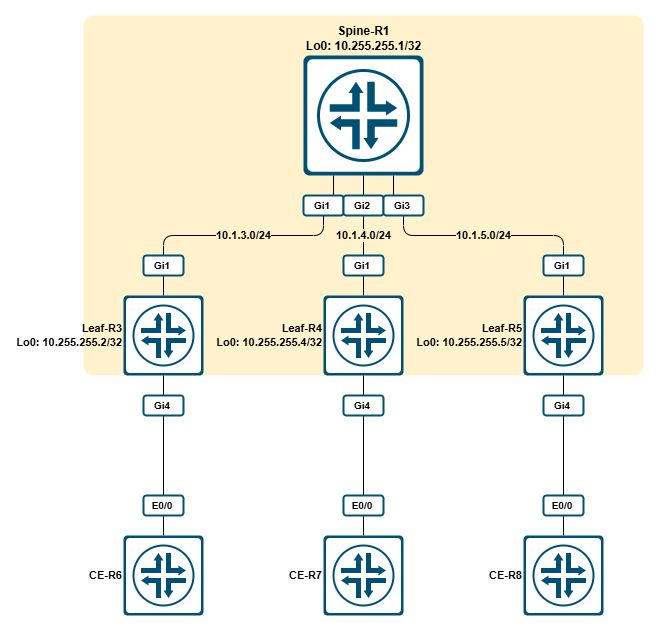
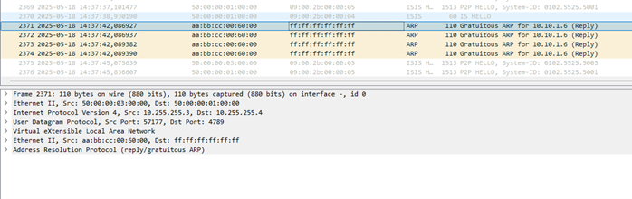
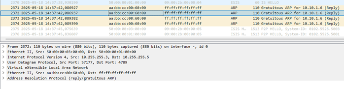
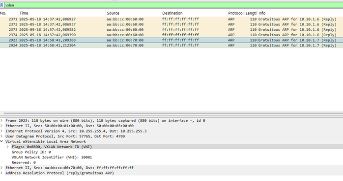
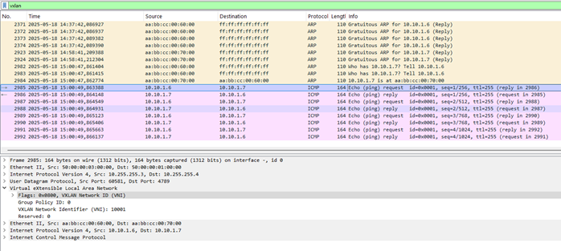
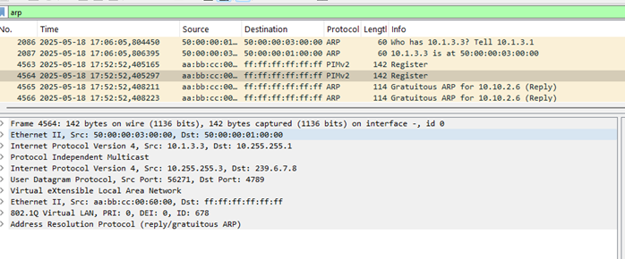
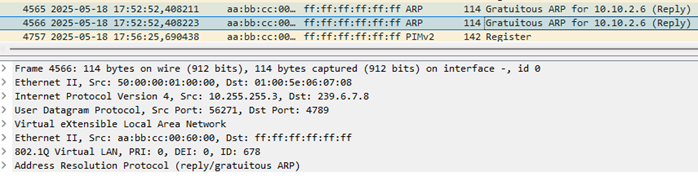
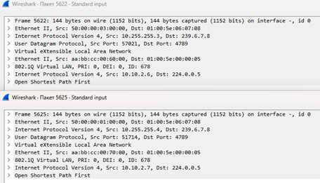
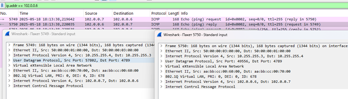

# LAB - Cisco - VxLAN L2VNI Flood and learn

- [LAB - Cisco - VxLAN L2VNI Flood and learn](#lab---cisco---vxlan-l2vni-flood-and-learn)
  - [Топология](#топология)
  - [Описание](#описание)
  - [Настройка](#настройка)
    - [Настройка - NVE-интерфейс](#настройка---nve-интерфейс)
    - [Настройка - VNI 10001 – L2VNI Ingress Replication](#настройка---vni-10001--l2vni-ingress-replication)
    - [Настройка - VNI 10002 – L2VNI Multicast group](#настройка---vni-10002--l2vni-multicast-group)
  - [Примененная конфигурация](#примененная-конфигурация)
    - [Примененная конфигурация - L2VNI Ingress Replication solution config](#примененная-конфигурация---l2vni-ingress-replication-solution-config)
    - [Примененная конфигурация - L2VNI Multicast Group](#примененная-конфигурация---l2vni-multicast-group)

## Топология



## Описание

В данной лабораторной работе необходимо организовать L2-связность между CE-маршрутизаторами. Для этого необходимо организовать VxLAN L2VNI в режиме Flood and learn.

Использованные образы:

- i86bi_LinuxL3-AdvEnterpriseK9-M2_157_3_May_2018.bin
- c8000v-17-13-01a

## Настройка

### Настройка - NVE-интерфейс

Исходим из того, что стартовая конфигурация (адресация, IGP, PIM) уже применена.

Проверяем RIB и наличие связности:

**R1:**

```cisco
Spine-R1#show ip route | b Gateway
Gateway of last resort is not set

      10.0.0.0/8 is variably subnetted, 10 subnets, 2 masks
C        10.1.3.0/24 is directly connected, GigabitEthernet1
L        10.1.3.1/32 is directly connected, GigabitEthernet1
C        10.1.4.0/24 is directly connected, GigabitEthernet2
L        10.1.4.1/32 is directly connected, GigabitEthernet2
C        10.1.5.0/24 is directly connected, GigabitEthernet3
L        10.1.5.1/32 is directly connected, GigabitEthernet3
C        10.255.255.1/32 is directly connected, Loopback0
i L2     10.255.255.3/32 [115/10] via 10.1.3.3, 00:06:50, GigabitEthernet1
i L2     10.255.255.4/32 [115/10] via 10.1.4.4, 00:06:48, GigabitEthernet2
i L2     10.255.255.5/32 [115/10] via 10.1.5.5, 00:06:46, GigabitEthernet3
Spine-R1#tclsh
Spine-R1(tcl)#foreach IP {
+>10.255.255.3
+>10.255.255.4
+>10.255.255.5
+>} { ping $IP source Loopback0 }
Type escape sequence to abort.
Sending 5, 100-byte ICMP Echos to 10.255.255.3, timeout is 2 seconds:
Packet sent with a source address of 10.255.255.1
!!!!!
Success rate is 100 percent (5/5), round-trip min/avg/max = 1/1/3 ms
Type escape sequence to abort.
Sending 5, 100-byte ICMP Echos to 10.255.255.4, timeout is 2 seconds:
Packet sent with a source address of 10.255.255.1
!!!!!
Success rate is 100 percent (5/5), round-trip min/avg/max = 1/1/2 ms
Type escape sequence to abort.
Sending 5, 100-byte ICMP Echos to 10.255.255.5, timeout is 2 seconds:
Packet sent with a source address of 10.255.255.1
!!!!!
Success rate is 100 percent (5/5), round-trip min/avg/max = 1/1/2 ms
Spine-R1(tcl)#
```

L3-связность, как видно, есть. Теперь проверим MRIB и значения RP:

**R1:**

```cisco
Spine-R1#show ip pim rp mapping
Auto-RP is not enabled
PIM Group-to-RP Mappings

Group(s): 224.0.0.0/4, Static
    RP: 10.255.255.1 (?)
Spine-R1#show ip mroute | b Outgoing
Outgoing interface flags: H - Hardware switched, A - Assert winner, p - PIM Join
                          t - LISP transit group
 Timers: Uptime/Expires
 Interface state: Interface, Next-Hop or VCD, State/Mode

IP Multicast Forwarding is not enabled.

Spine-R1#
```

**R3:**

```cisco
Leaf-R3#show ip pim rp mapping
Auto-RP is not enabled
PIM Group-to-RP Mappings

Group(s): 224.0.0.0/4, Static
    RP: 10.255.255.1 (?)
Leaf-R3#show ip mroute | b Outgoing
Outgoing interface flags: H - Hardware switched, A - Assert winner, p - PIM Join
                          t - LISP transit group
 Timers: Uptime/Expires
 Interface state: Interface, Next-Hop or VCD, State/Mode

Leaf-R3#
```

Как мы видим, в качестве RP настроен R1, MRIB пустой. В общем-то, все готово к настройке.

Для начала определимся с ролями маршрутизаторов: R1 – это транзитный маршрутизатор, который не будет на себе держать никакие сервисы (в терминологии SP – это P-маршрутизатор); R3, R4, R5 будут VTEP’ами (VxLAN Tunnel Endpoint – т.е. терминировать на себе VxLAN-туннели, в терминологии SP – PE-маршрутизаторами).

Чтобы настроить VTEP нам необходимы:

1. L3-связность между устройствами.
2. Работающий мультикаст (для репликации BUM-трафика через мультикаст)
3. Включенный и настроенный интерфейс NVE (network virtualization endpoint).

Первые два пункта у нас есть, создадим NVE-интерфейс на R3:

**R3:**

```cisco
interface nve 1
 source-interface Loopback0
!
```

**R3:**

```cisco
Leaf-R3(config)#interface nve 1
Leaf-R3(config-if)#
*May 18 2025 13:07:14.786 MSK: %LINK-3-UPDOWN: Interface nve1, changed state to down
Leaf-R3(config-if)#source-interface Loopback0
*May 18 2025 13:07:36.841 MSK: %LINK-3-UPDOWN: Interface nve1, changed state to up
Leaf-R3(config-if)#
*May 18 2025 13:07:37.791 MSK: %LINEPROTO-5-UPDOWN: Line protocol on Interface Tunnel1, changed state to up
*May 18 2025 13:07:37.841 MSK: %LINEPROTO-5-UPDOWN: Line protocol on Interface nve1, changed state to up
```

Что мы сделали? Мы создали интерфейс nve1, указали, что в качестве источника он должен использовать интерфейс Loopback0.
После того, как мы указали src-интерфейс, nve1 поднялся, как и поднялся Tunnel1. Что это за интерфейс? А это технологический туннельный интерфейс для VxLAN-туннелей. Об этом нам говорят MUDP в качестве туннельного протокола и source_port == 4789 (UDP/4789 – это зарезервированный порт VxLAN).

**R3:**

```cisco
Leaf-R3#show int tun1
Tunnel1 is up, line protocol is up
  Hardware is Tunnel
  Interface is unnumbered. Using address of Loopback0 (10.255.255.3)
  MTU 9972 bytes, BW 100 Kbit/sec, DLY 50000 usec,
     reliability 255/255, txload 1/255, rxload 1/255
  Encapsulation TUNNEL, loopback not set
  Keepalive not set
  Tunnel linestate evaluation up
  Tunnel source 10.255.255.3
  Tunnel protocol/transport MUDP/IP
    TEID 0x0, sequencing disabled
    Checksumming of packets disabled
    source_port:4789, destination_port:0
  Tunnel TTL 255
  Tunnel transport MTU 1472 bytes
  Tunnel transmit bandwidth 8000 (kbps)
  Tunnel receive bandwidth 8000 (kbps)
  Last input never, output never, output hang never
  Last clearing of "show interface" counters 00:09:06
  Input queue: 0/375/0/0 (size/max/drops/flushes); Total output drops: 0
  Queueing strategy: fifo
  Output queue: 0/0 (size/max)
  5 minute input rate 0 bits/sec, 0 packets/sec
  5 minute output rate 0 bits/sec, 0 packets/sec
     0 packets input, 0 bytes, 0 no buffer
     Received 0 broadcasts (0 IP multicasts)
     0 runts, 0 giants, 0 throttles
     0 input errors, 0 CRC, 0 frame, 0 overrun, 0 ignored, 0 abort
     0 packets output, 0 bytes, 0 underruns
     Output 0 broadcasts (0 IP multicasts)
     0 output errors, 0 collisions, 0 interface resets
     0 unknown protocol drops
     0 output buffer failures, 0 output buffers swapped out
Leaf-R3#
```

Эту же конфигурацию реплицируем на другие VTEP:

**R4 / R5:**

```cisco
interface nve 1
 source-interface Loopback0
!
```

На данный момент у нас произведена первичная настройка 3 VTEP (R3 – R5) и все они готовы для разворачивания сервисов. Однако, прежде чем настраивать L2 VNI (VxLAN Network Id – в данном случае это обозначает отдельный vxlan-сервис), остановимся на том, как будет передаваться BUM-трафик.

BUM-трафик мы можем передавать несколькими путями:

1. Ingress replication
2. Multicast-group

**Ingress replication** – в данном случае BUM-трафик будет отправляться юникастом на каждого прописанного вручную VTEP’а внутри одного VNI. Т.е. на один вошедший на VTEP BUM-кадр, будет выпущено N VxLAN-пакетов, содержащих этот BUM-кадр, где N – это количество прописанных VTEP’ов. Не требует никаких дополнительных «вложений» – достаточно L3-связности между VTEP’ами.

**Multicast-group** – в данном случае BUM-трафик будет распространяться в рамках многоадресной рассылки. Очевидно, требует развернутой multicast-сети.

В рамках данной лабораторной работы мы настроим два L2 VNI:

1. 10001 – VNI с Ingress Replication
2. 10002 – VNI с Multicast-group

### Настройка - VNI 10001 – L2VNI Ingress Replication

Начнем с VNI 10001:

**R3:**

```cisco
Leaf-R3#debug nve all
NVE Manager all debugging is on
Leaf-R3#conf t
Enter configuration commands, one per line.  End with CNTL/Z.
Leaf-R3(config)#int nve 1
Leaf-R3(config-if)#member vni 10001
Leaf-R3(config-if-nve-vni)#ingress-replication 10.255.255.4
Leaf-R3(config-if-nve-vni)#
*May 18 2025 14:00:51.691 MSK: NVE-MGR-DB: [IF 0xE]VNI node creation
*May 18 2025 14:00:51.691 MSK: NVE-MGR-DB: Allocate VNI ID 10001
*May 18 2025 14:00:51.691 MSK: NVE-MGR-DB: Lock VNI ID 10001
*May 18 2025 14:00:51.691 MSK: NVE-MGR-DB: VNI Node created [77349A4AA910]
*May 18 2025 14:00:51.691 MSK: NVE-MGR-DB: Insert individual VNI 10001 into nveos->vni_list
*May 18 2025 14:00:51.692 MSK: NVE-MGR-PARSER: VNI bitlist: 10001
*May 18 2025 14:00:51.692 MSK: NVE-MGR-PD: VNI 10001 create notification to PD
*May 18 2025 14:00:51.695 MSK: NVE-MGR-PD: VNI 10001 Create notif successful, map [pd 0x404011] to [pi 0x77349A4AA910]
*May 18 2025 14:00:51.695 MSK: NVE-MGR-DB: creating peer node for 10.255.255.4
*May 18 2025 14:00:51.695 MSK: NVE-DB-EVT: Add peer 10.255.255.4 on VNI 10001 on interface 0xE
*May 18 2025 14:00:51.695 MSK: NVE-DB-EVT: Added peer 10.255.255.4 on VNI 10001 on NVE 1
*May 18 2025 14:00:51.695 MSK: NVE-DB-EVT: Add VNI 10001 to peer 10.255.255.4 source 4
*May 18 2025 14:00:51.695 MSK: NVE-DB-EVT: Add VNI 10001 to peer 10.255.255.4 NVE 1 rc 0 flags 4 state 32
*May 18 2025 14:00:51.695 MSK: NVE-DB-EVT: Added VNI 10001 on Peer 10.255.255.4
*May 18 2025 14:00:51.697 MSK: NVE-MGR-TUNNEL: Tunnel Endpoint 10.255.255.4 added, dport 4789
*May 18 2025 14:00:51.697 MSK: NVE-MGR-EI: Notify L2FIB of install addr 10.255.255.4 for vni 10001
*May 18 2025 14:00:51.697 MSK: NVE-MGR-TUNNEL: Endpoint 10.255.255.4 already added
*May 18 2025 14:00:51.697 MSK: NVE-MGR-EI: Notifying BD engine of VNI 10001 create
*May 18 2025 14:00:51.697 MSK: NVE-MGR-STATE: VNI 10001 NVE if is up
*May 18 2025 14:00:51.697 MSK: NVE-MGR-STATE: VNI 10001 BD unbinded or down
*May 18 2025 14:00:51.697 MSK: NVE-MGR-STATE: VNI 10001 down reason: BD is down
*May 18 2025 14:00:51.697 MSK: NVE-MGR-STATE: vni 10001: Notify clients of state change Create to BD Down/Removed, dirty 0
Leaf-R3(config-if-nve-vni)#
*May 18 2025 14:00:51.698 MSK: NVE-MGR-PD: VNI 10001 Create to BD Down/Removed State update to PD successful
*May 18 2025 14:00:51.698 MSK: NVE-MGR-STATE: No Mcast Node found
*May 18 2025 14:00:51.698 MSK: NVE-MGR-STATE: No Mcast Node found
*May 18 2025 14:00:51.698 MSK: NVE-MGR-EI: No BD association for vni 10001
*May 18 2025 14:00:51.698 MSK: NVE-MGR-STATE: vni 10001: New State as a result of create BD Down/Removed
*May 18 2025 14:00:51.698 MSK: NVE-MGR-PARSER: VNI 10001 ingr-repl 10.255.255.4 created
Leaf-R3(config-if-nve-vni)#ingress-replication 10.255.255.5
Leaf-R3(config-if-nve-vni)#
*May 18 2025 14:01:02.036 MSK: NVE-MGR-DB: [IF 0xE]VNI node creation
*May 18 2025 14:01:02.036 MSK: NVE-MGR-DB: VNI update for 10001, local_routing 0
*May 18 2025 14:01:02.036 MSK: NVE-MGR-DB: creating peer node for 10.255.255.5
*May 18 2025 14:01:02.036 MSK: NVE-DB-EVT: Add peer 10.255.255.5 on VNI 10001 on interface 0xE
*May 18 2025 14:01:02.036 MSK: NVE-DB-EVT: Added peer 10.255.255.5 on VNI 10001 on NVE 1
*May 18 2025 14:01:02.036 MSK: NVE-DB-EVT: Add VNI 10001 to peer 10.255.255.5 source 4
*May 18 2025 14:01:02.036 MSK: NVE-DB-EVT: Add VNI 10001 to peer 10.255.255.5 NVE 1 rc 0 flags 4 state 32
Leaf-R3(config-if-nve-vni)#
*May 18 2025 14:01:02.036 MSK: NVE-DB-EVT: Added VNI 10001 on Peer 10.255.255.5
*May 18 2025 14:01:02.037 MSK: NVE-MGR-TUNNEL: Tunnel Endpoint 10.255.255.5 added, dport 4789
*May 18 2025 14:01:02.037 MSK: NVE-MGR-EI: Notify L2FIB of install addr 10.255.255.5 for vni 10001
*May 18 2025 14:01:02.037 MSK: NVE-MGR-PARSER: VNI 10001 ingr-repl 10.255.255.5 created
Leaf-R3(config-if-nve-vni)#end
Leaf-R3#show
*May 18 2025 14:01:12.510 MSK: %SYS-5-CONFIG_I: Configured from console by console
Leaf-R3#show run int nve 1
Building configuration...

Current configuration : 186 bytes
!
interface nve1
 no ip address
 source-interface Loopback0
 member vni 10001
  ingress-replication 10.255.255.4
  ingress-replication 10.255.255.5
 !
 no mop enabled
 no mop sysid
end

Leaf-R3#show nve vni 10001
Interface  VNI        Multicast-group  VNI state  Mode  BD    cfg vrf
nve1       10001      N/A              BD Down/Re L2DP  N/A   CLI N/A
Leaf-R3#
*May 18 2025 14:01:31.749 MSK: NVE-MGR-PARSER: show nve vni 10001
Leaf-R3#show nve vni 10001 detail
Interface  VNI        Multicast-group  VNI state  Mode  BD    cfg vrf
nve1       10001      N/A              BD Down/Re L2DP  N/A   CLI N/A

VNI down reason:
BD un-configured or down

VNI Detailed statistics:
   Pkts In   Bytes In   Pkts Out  Bytes Out
         0          0          0          0
Leaf-R3#show nve peers
'M' - MAC entry download flag  'A' - Adjacency download flag
'4' - IPv4 flag  '6' - IPv6 flag

Interface  VNI      Type Peer-IP          RMAC/Num_RTs   eVNI     state flags UP time
nve1       10001    L2DP 10.255.255.4         ----       -          --   -/-
nve1       10001    L2DP 10.255.255.5         ----       -          --   -/-
```

Что здесь произошло? Сначала мы включили дебаг всего для NVE. После этого мы зашли в настройки интерфейса nve1 и создали новый VNI (member vni 10001). Внутри этого VNI мы включили ingress-replication для 10.255.255.4 и 10.255.255.5.

Теперь настроим подключение клиента. Для этого сначала настроим EFP (Ethernet Flow Point):

**R3:**

```cisco
interface GigabitEthernet4
 description NE=CE-R6_Eth0/0
 service instance 6 ethernet
  encapsulation dot1q 6
  rewrite ingress tag pop 1 symmetric
!
```

Здесь:

- `service-instance 6 ethernet` – это создание EFP под номером 6.
- `encapsulation dot1q 6` – указываем, что данный EFP должен обрабатывать dot1q-кадры с VID == 6.
- `rewrite ingress tag pop 1 symmetric` – мы указываем, что для входящих (ingress) кадров, попадающих в EFP, мы изменяем (rewrite) метку, а именно удаляем 1 внешнюю метку (pop 1). Symmetric означает, что для исходящих из EFP кадров мы проводим обратную манипуляцию (т.е. добавляем внешний dot1q-заголовок с VID == 6).

Теперь свяжем EFP и VNI через bridge-domain:

**R3:**

```cisco
bridge-domain 1001
 member Gi4 service-instance 6
 member vni 10001
!
```

**R3:**

```cisco
Leaf-R3(config)#bridge-domain 1001
Leaf-R3(config-bdomain)#member Gi4 service-instance 6
Leaf-R3(config-bdomain-efp)#exit
Leaf-R3(config-bdomain)#member vni 10001
Leaf-R3(config-bdomain)#
*May 18 2025 14:09:03.213 MSK: NVE-MGR-DB: Return pi_hdl[0x77349A4AA910] for vni 10001
*May 18 2025 14:09:03.214 MSK: NVE-MGR-DB: Return vni state BD Down/Removed for pi_hdl[0x77349A4AA910], vni[10001]
*May 18 2025 14:09:03.214 MSK: NVE-MGR-DB: Return vni state BD Down/Removed for pi_hdl[0x77349A4AA910], vni[10001]
*May 18 2025 14:09:03.214 MSK: NVE-MGR-EI: L2FIB query info for BD 0, VNI 10001
*May 18 2025 14:09:03.215 MSK: NVE-MGR-EI: PP up notification for bd_id 1001
*May 18 2025 14:09:03.215 MSK: NVE-DB-EVT: Initialized BD(1001) node for VNI 10001
*May 18 2025 14:09:03.215 MSK: NVE-MGR-EI: DP VNI 10001 doesn't support on demand mcast join
*May 18 2025 14:09:03.215 MSK: NVE-MGR-STATE: VNI 10001 NVE if is up
*May 18 2025 14:09:03.215 MSK: NVE-MGR-STATE: VNI 10001 BD 1001 binded and UP
*May 18 2025 14:09:03.215 MSK: NVE-MGR-STATE: VNI 10001 state_flags 0xA
*May 18 2025 14:09:03.215 MSK: NVE-MGR-STATE: vni 10001: Notify clients of state change BD Down/Removed to Up, dirty 0
*May 18 2025 14:09:03.215 MSK: NVE-MGR-PD: VNI 10001 BD Down/Removed to Up State update to PD successful
*May 18 2025 14:09:03.215 MSK: NVE-MGR-STATE: No Mcast Node found
*May 18 2025 14:09:03.215 MSK: NVE-MGR-STATE: No Mcast Node found
*May 18 2025 14:09:03.215 MSK: NVE-MGR-EI: Notify L2FIB of updated tunnel handle 0xF for vni 10001
*May 18 2025 14:09:03.215 MSK: NVE-MGR-EI: DP VNI 10001 doesn't support on demand mcast join
*May 18 2025 14:09:03.215 MSK: NVE-MGR-STATE: VNI 10001 NVE if is up
*May 18 2025 14:09:03.215 MSK: NVE-MGR-STATE: VNI 10001 BD 1001 binded and UP
*May 18 2025 14:09:03.215 MSK: NVE-MGR-STATE: VNI 10001 state_flags 0xA
*May 18 2025 14:09:03.215 MSK: NVE-MGR-STATE: vni 10001: Notify clients of state change Up to Up, dirty 0
*May 18 2025 14:09:03.215 MSK: NVE-MGR-PD: VNI 10001 Up to Up State update to PD successful
*May 18 2025 14:09:03.215 MSK: NVE-MGR-STATE: No Mcast Node found
*May 18 2025 14:09:03.215 MSK: NVE-MGR-STATE: No Mcast Node found
*May 18 2025 14:09:03.215 MSK: NVE-MGR-EI: Notify L2FIB of updated tunnel handle 0xF for vni 10001
*May 18 2025 14:09:03.216 MSK: NVE-MGR-EI: VNI 10001: BD state changed to up, vni state to Up
*May 18 2025 14:09:03.234 MSK: NVE-MGR-DB: Return pi_hdl[0x77349A4AA910] for vni 10001
*May 18 2025 14:09:03.249 MSK: NVE-MGR-DB: Return pi_hdl[0x77349A4AA910] for vni 10001
*May 18 2025 14:09:03.249 MSK: NVE-MGR-DB: Return pi_hdl[0x77349A4AA910] for vni 10001
*May 18 2025 14:09:03.249 MSK: NVE-MGR-DB: Return pi_hdl[0x77349A4AA910] for vni 10001
*May 18 2025 14:09:03.249 MSK: NVE-MGR-DB: Return pi_hdl[0x77349A4AA910] for vni 10001
Leaf-R3(config-bdomain)#
*May 18 2025 14:09:03.249 MSK: NVE-MGR-DB: Return pi_hdl[0x77349A4AA910] for vni 10001
*May 18 2025 14:09:03.249 MSK: NVE-MGR-DB: Return pi_hdl[0x77349A4AA910] for vni 10001
Leaf-R3(config-bdomain)#end
```

В дебаге мы видим, что к VNI 10001 был привязан bridge-domain 1001, сам VNI перешел в состояние UP. Посмотрим, что видно в BD:

**R3:**

```cisco
Leaf-R3#show bridge-domain 1001
Bridge-domain 1001 (2 ports in all)
State: UP                    Mac learning: Enabled
Aging-Timer: 300 second(s)
Unknown Unicast Flooding Suppression: Disabled
Maximum address limit: 65536
    GigabitEthernet4 service instance 6
    vni 10001
   AED MAC address    Policy  Tag       Age  Pseudoport
   -----------------------------------------------------------------------------
```

На данный момент таблица MAC-адресов пуста, т.к. у нас ничего нет со стороны клиента. Настроим на CE-R6:

**R6:**

```cisco
interface Ethernet0/0.6
 encapsulation dot1q 6
 description VNI_10001
 ip address 10.10.1.6 255.255.255.0
!
```

После того, как мы введем IP-адрес, R6 отправит Gratuitous ARP. Но перед этим стоит включить дамп трафика на R3, Gi1:





На скринах мы видим, что GrARP был отправлен юникастовыми пакетами с 10.255.255.3 (Lo0 R3) на 10.255.255.4 и 10.255.255.5. При этом стоит обратить внимание на то, что внутри VxLAN-пакета находится Ethernet-кадр без dot1q-заголовка.

Посмотрим, что у нас на R3:

**R3:**

```cisco
Leaf-R3#show bridge-domain 1001
Bridge-domain 1001 (2 ports in all)
State: UP                    Mac learning: Enabled
Aging-Timer: 300 second(s)
Unknown Unicast Flooding Suppression: Disabled
Maximum address limit: 65536
    GigabitEthernet4 service instance 6
    vni 10001
   AED MAC address    Policy  Tag       Age  Pseudoport
   -----------------------------------------------------------------------------
   0   AABB.CC00.6000 forward dynamic   15   GigabitEthernet4.EFP6

Leaf-R3#show nve vni 10001 detail
Interface  VNI        Multicast-group  VNI state  Mode  BD    cfg vrf
nve1       10001      N/A              Up         L2DP  1001  CLI N/A
VNI Detailed statistics:
   Pkts In   Bytes In   Pkts Out  Bytes Out
         0          0          4        272
Leaf-R3#
```

BD изучил MAC-адрес R6 за Gi4.EFP6. А в статистике VNI счетчик отправленных пакетов увеличился на 4.

Теперь подключим и CE-R7. Для этого на R4 делаем аналогичные действия:

Создаем VNI:

**R4:**

```cisco
interface nve1
 member vni 10001
  ingress-replication 10.255.255.3
  ingress-replication 10.255.255.5
!
```

Создаем EFP:

**R4:**

```cisco
interface GigabitEthernet4
 description NE=CE-R7_Eth0/0
 service instance 7 ethernet
  encapsulation dot1q 7
  rewrite ingress tag pop 1 symmetric
!
```

Связываем EFP и VNI через bridge-domain:

**R4:**

```cisco
bridge-domain 1001
 member Gi4 service-instance 7
 member vni 10001
!
```

Проверяем:

**R4:**

```cisco
Leaf-R4#show bridge-domain 1001
Bridge-domain 1001 (2 ports in all)
State: UP                    Mac learning: Enabled
Aging-Timer: 300 second(s)
Unknown Unicast Flooding Suppression: Disabled
Maximum address limit: 65536
    GigabitEthernet4 service instance 7
    vni 10001
   AED MAC address    Policy  Tag       Age  Pseudoport
   -----------------------------------------------------------------------------

Leaf-R4#
```

Теперь настроим CE-R7:

**R7:**

```cisco
interface Ethernet0/0.7
 encapsulation dot1q 7
 ip address 10.10.1.7 255.255.255.0
!
```

Также, как и R6, R7 отправил GratARP, который дошел до R3 и до R6



**R3:**

```cisco
Leaf-R3#show bridge-domain 1001
Bridge-domain 1001 (2 ports in all)
State: UP                    Mac learning: Enabled
Aging-Timer: 300 second(s)
Unknown Unicast Flooding Suppression: Disabled
Maximum address limit: 65536
    GigabitEthernet4 service instance 6
    vni 10001
   AED MAC address    Policy  Tag       Age  Pseudoport
   -----------------------------------------------------------------------------
   0   AABB.CC00.6000 forward dynamic   294  GigabitEthernet4.EFP6
   0   AABB.CC00.7000 forward dynamic   293  nve1.VNI10001, VxLAN
                                             src: 10.255.255.3 dst: 10.255.255.4

Leaf-R3#
```

**R4:**

```cisco
CE-R6#ping 10.10.1.7
Type escape sequence to abort.
Sending 5, 100-byte ICMP Echos to 10.10.1.7, timeout is 2 seconds:
.!!!!
Success rate is 80 percent (4/5), round-trip min/avg/max = 1/1/1 ms
CE-R6#
```

На R4 BD выглядит так:

**R4:**

```cisco
Leaf-R4#show bridge-domain 1001
Bridge-domain 1001 (2 ports in all)
State: UP                    Mac learning: Enabled
Aging-Timer: 300 second(s)
Unknown Unicast Flooding Suppression: Disabled
Maximum address limit: 65536
    GigabitEthernet4 service instance 7
    vni 10001
   AED MAC address    Policy  Tag       Age  Pseudoport
   -----------------------------------------------------------------------------
   0   AABB.CC00.6000 forward dynamic   270  nve1.VNI10001, VxLAN
                                             src: 10.255.255.4 dst: 10.255.255.3
   0   AABB.CC00.7000 forward dynamic   270  GigabitEthernet4.EFP7

Leaf-R4#
```

При этом стоит обратить внимание:



Мы явно видим, что ICMP-запросы шли только между R3 и R4, т.к. это уже known-unicast.

Статистика с R3:

**R3:**

```cisco
Leaf-R3#show nve vni 10001 detail
Interface  VNI        Multicast-group  VNI state  Mode  BD    cfg vrf
nve1       10001      N/A              Up         L2DP  1001  CLI N/A
VNI Detailed statistics:
   Pkts In   Bytes In   Pkts Out  Bytes Out
         7        692         10        896
Leaf-R3#
```

Также стоит обратить внимание на следующее: казалось бы, R6 и R7 находятся в разных вланах (6 и 7 соответственно), но, при этом, связность вполне себе есть. Дело в том, что в рамках EFP мы явно указали, что внешний тег должен быть снят при попадании в EFP (а на выходе наоборот, добавить), что мы видели в дампах, поэтому никаких противоречий здесь нет.

Включим OSPF между R6 и R7:

**R6:**

```cisco
interface Ethernet0/0.6
 ip ospf 10001 area 0
```

**R7:**

```cisco
interface Ethernet0/0.7
 ip ospf 10001 area 0
```

Проверяем:

**R6:**

```cisco
CE-R6#show ip ospf nei

Neighbor ID     Pri   State           Dead Time   Address         Interface
10.10.1.7         1   FULL/DR         00:00:39    10.10.1.7       Ethernet0/0.6
CE-R6#
```

**R7:**

```cisco
CE-R7#show ip ospf nei

Neighbor ID     Pri   State           Dead Time   Address         Interface
10.10.1.6         1   FULL/BDR        00:00:34    10.10.1.6       Ethernet0/0.7
CE-R7#
```

А также на R8 осуществим аналогичные настройки (создадим интерфейс и включим OSPF):

**R8:**

```cisco
interface GigabitEthernet1
 service instance 8 ethernet
 encapsulation dot1q 8
 exit
exit
bridge-domain 8
 member GigabitEthernet1 service-instance 8
exit
interface BDI8
 ip address 10.10.1.8 255.255.255.0
 no shutdown
 ip ospf 10001 area 0
!
```

> *Примечание: настройка на CE-R8 выглядит нестандартно из-за проблем с вложенной эмуляцией сетевых адаптеров (особенно vmxnet) в EVE-NG CE 6.x, из-за чего для тегированного трафика нормально работает только такой вариант в паре с virtio-net-pci (актуально в первую очередь для CSR1kv и C8kv).*

На R5 настроим сервис:

**R5:**

```cisco
interface GigabitEthernet4
 service instance 8 ethernet
  encapsulation dot1q 8
  rewrite ingress tag pop 1 symmetric
 exit
exit
interface nve1
 member vni 10001
  ingress-replication 10.255.255.3
  ingress-replication 10.255.255.4
!
bridge-domain 1001
 member vni 10001
 member GigabitEthernet4 service-instance 8
```

Проверяем:

**R6:**

```cisco
CE-R6#show ip ospf nei

Neighbor ID     Pri   State           Dead Time   Address         Interface
10.10.1.7         1   FULL/DR         00:00:35    10.10.1.7       Ethernet0/0.6
10.10.1.8         1   FULL/DROTHER    00:00:33    10.10.1.8       Ethernet0/0.6
CE-R6#
```

**R8:**

```cisco
CE-R8#show ip ospf nei

Neighbor ID     Pri   State           Dead Time   Address         Interface
10.10.1.6         1   FULL/BDR        00:00:31    10.10.1.6       BDI8
10.10.1.7         1   FULL/DR         00:00:39    10.10.1.7       BDI8
CE-R8#
```

Для проверки добавим на каждый CE Loopback101 с IP-адресами 101.0.0.$R_NUM/32 и добавим их в OSPF:

**R6:**

```cisco
interface Loopback101
 ip address 101.0.0.6 255.255.255.255
 ip ospf 10001 area 0
!
```

**R7:**

```cisco
interface Loopback101
 ip address 101.0.0.7 255.255.255.255
 ip ospf 10001 area 0
!
```

**R8:**

```cisco
interface Loopback101
 ip address 101.0.0.8 255.255.255.255
 ip ospf 10001 area 0
!
```

Проверим:

**R6:**

```cisco
CE-R6#show ip route ospf | b Gate
Gateway of last resort is not set

      101.0.0.0/32 is subnetted, 3 subnets
O        101.0.0.7 [110/11] via 10.10.1.7, 00:00:21, Ethernet0/0.6
O        101.0.0.8 [110/11] via 10.10.1.8, 00:00:21, Ethernet0/0.6
CE-R6#tclsh
CE-R6(tcl)#foreach IP {
+>101.0.0.7
+>101.0.0.8
+>} { ping $IP source Loopback101 }
Type escape sequence to abort.
Sending 5, 100-byte ICMP Echos to 101.0.0.7, timeout is 2 seconds:
Packet sent with a source address of 101.0.0.6
!!!!!
Success rate is 100 percent (5/5), round-trip min/avg/max = 1/1/1 ms
Type escape sequence to abort.
Sending 5, 100-byte ICMP Echos to 101.0.0.8, timeout is 2 seconds:
Packet sent with a source address of 101.0.0.6
!!!!!
Success rate is 100 percent (5/5), round-trip min/avg/max = 1/1/1 ms
CE-R6(tcl)#
```

**R7:**

```cisco
CE-R7#show ip route ospf | b Gate
Gateway of last resort is not set

      101.0.0.0/32 is subnetted, 3 subnets
O        101.0.0.6 [110/11] via 10.10.1.6, 00:00:40, Ethernet0/0.7
O        101.0.0.8 [110/11] via 10.10.1.8, 00:00:40, Ethernet0/0.7
CE-R7#tclsh
CE-R7(tcl)#foreach IP {
+>101.0.0.6
+>101.0.0.8
+>} { ping $IP source Loopback101 }
Type escape sequence to abort.
Sending 5, 100-byte ICMP Echos to 101.0.0.6, timeout is 2 seconds:
Packet sent with a source address of 101.0.0.7
!!!!!
Success rate is 100 percent (5/5), round-trip min/avg/max = 1/1/1 ms
Type escape sequence to abort.
Sending 5, 100-byte ICMP Echos to 101.0.0.8, timeout is 2 seconds:
Packet sent with a source address of 101.0.0.7
!!!!!
Success rate is 100 percent (5/5), round-trip min/avg/max = 1/1/1 ms
CE-R7(tcl)#
```

**R8:**

```cisco
CE-R8#show ip route ospf | b Gate
Gateway of last resort is not set

      101.0.0.0/32 is subnetted, 3 subnets
O        101.0.0.6 [110/2] via 10.10.1.6, 00:01:04, BDI8
O        101.0.0.7 [110/2] via 10.10.1.7, 00:01:08, BDI8
CE-R8#tclsh
CE-R8(tcl)#foreach IP {
+>101.0.0.6
+>101.0.0.7
+>} { ping $IP source Loopback101 }
Type escape sequence to abort.
Sending 5, 100-byte ICMP Echos to 101.0.0.6, timeout is 2 seconds:
Packet sent with a source address of 101.0.0.8
!!!!!
Success rate is 100 percent (5/5), round-trip min/avg/max = 1/1/2 ms
Type escape sequence to abort.
Sending 5, 100-byte ICMP Echos to 101.0.0.7, timeout is 2 seconds:
Packet sent with a source address of 101.0.0.8
!!!!!
Success rate is 100 percent (5/5), round-trip min/avg/max = 1/1/1 ms
CE-R8(tcl)#
```

Соответственно, мы видим, что связность есть между всеми CE-устройствами. На VTEP’ах в бриджах видим такое:

**R3:**

```cisco
Leaf-R3#show bridge-domain 1001
Bridge-domain 1001 (2 ports in all)
State: UP                    Mac learning: Enabled
Aging-Timer: 300 second(s)
Unknown Unicast Flooding Suppression: Disabled
Maximum address limit: 65536
    GigabitEthernet4 service instance 6
    vni 10001
   AED MAC address    Policy  Tag       Age  Pseudoport
   -----------------------------------------------------------------------------
   0   AABB.CC00.6000 forward dynamic   298  GigabitEthernet4.EFP6
   0   001E.F69F.AEBF forward dynamic   300  nve1.VNI10001, VxLAN
                                             src: 10.255.255.3 dst: 10.255.255.5
   0   AABB.CC00.7000 forward dynamic   298  nve1.VNI10001, VxLAN
                                             src: 10.255.255.3 dst: 10.255.255.4
```

**R4:**

```cisco
Leaf-R4#show bridge-domain 1001
Bridge-domain 1001 (2 ports in all)
State: UP                    Mac learning: Enabled
Aging-Timer: 300 second(s)
Unknown Unicast Flooding Suppression: Disabled
Maximum address limit: 65536
    GigabitEthernet4 service instance 7
    vni 10001
   AED MAC address    Policy  Tag       Age  Pseudoport
   -----------------------------------------------------------------------------
   0   AABB.CC00.6000 forward dynamic   293  nve1.VNI10001, VxLAN
                                             src: 10.255.255.4 dst: 10.255.255.3
   0   001E.F69F.AEBF forward dynamic   294  nve1.VNI10001, VxLAN
                                             src: 10.255.255.4 dst: 10.255.255.5
   0   AABB.CC00.7000 forward dynamic   292  GigabitEthernet4.EFP7
```

**R5:**

```cisco
Leaf-R5#show bridge-domain 1001
Bridge-domain 1001 (2 ports in all)
State: UP                    Mac learning: Enabled
Aging-Timer: 300 second(s)
Unknown Unicast Flooding Suppression: Disabled
Maximum address limit: 65536
    GigabitEthernet4 service instance 8
    vni 10001
   AED MAC address    Policy  Tag       Age  Pseudoport
   -----------------------------------------------------------------------------
   0   AABB.CC00.6000 forward dynamic   298  nve1.VNI10001, VxLAN
                                             src: 10.255.255.5 dst: 10.255.255.3
   0   001E.F69F.AEBF forward dynamic   291  GigabitEthernet4.EFP8
   0   AABB.CC00.7000 forward dynamic   297  nve1.VNI10001, VxLAN
                                             src: 10.255.255.5 dst: 10.255.255.4
```

На этом создание L2VNI в режиме Flood and Learn, с Ingress replication для BUM-трафика завершено.

### Настройка - VNI 10002 – L2VNI Multicast group

Теперь перейдем к настройке L2VNI с multicast-group для рассылки BUM-трафика. В рамках этого задания будем использовать следующее:

- Номер VNI: 10002.
- Номер VLAN (стык VTEP <> CE): 678 (при этом, dot1q-метку мы должны будем оставить внутри VxLAN-пакета).
- Адрес группы: 239.6.7.8.

Для начала посмотрим, что у нас в MRIB на каждом роутере:

**R1:**

```cisco
Spine-R1#show ip mroute | b Outgoing
Outgoing interface flags: H - Hardware switched, A - Assert winner, p - PIM Join
                          t - LISP transit group
 Timers: Uptime/Expires
 Interface state: Interface, Next-Hop or VCD, State/Mode

IP Multicast Forwarding is not enabled.
```

**R3:**

```cisco
Leaf-R3#show ip mroute | b Outgoing
Outgoing interface flags: H - Hardware switched, A - Assert winner, p - PIM Join
                          t - LISP transit group
 Timers: Uptime/Expires
 Interface state: Interface, Next-Hop or VCD, State/Mode
```

**R4:**

```cisco
Leaf-R4#show ip mroute | b Outgoing
Outgoing interface flags: H - Hardware switched, A - Assert winner, p - PIM Join
                          t - LISP transit group
 Timers: Uptime/Expires
 Interface state: Interface, Next-Hop or VCD, State/Mode
```

**R5:**

```cisco
Leaf-R5#show ip mroute | b Outgoing
Outgoing interface flags: H - Hardware switched, A - Assert winner, p - PIM Join
                          t - LISP transit group
 Timers: Uptime/Expires
 Interface state: Interface, Next-Hop or VCD, State/Mode
```

MRIB у нас пустой.

Для начала создадим VNI на VTEP R3:

**R3:**

```cisco
interface nve1
 member vni 10002
  mcast-group 239.6.7.8
!
```

**R3:**

```cisco
Leaf-R3#debug nve all
NVE Manager all debugging is on
Leaf-R3#conf t
Enter configuration commands, one per line.  End with CNTL/Z.
Leaf-R3(config)#interface nve1
Leaf-R3(config-if)#member vni 10002
Leaf-R3(config-if-nve-vni)#mcast-group 239.6.7.8
Leaf-R3(config-if-nve-vni)#
*May 18 2025 16:27:57.986 MSK: NVE-MGR-DB: [IF 0xE]VNI node creation
*May 18 2025 16:27:57.986 MSK: NVE-MGR-DB: Allocate VNI ID 10002
*May 18 2025 16:27:57.986 MSK: NVE-MGR-DB: Lock VNI ID 10002
*May 18 2025 16:27:57.986 MSK: NVE-MGR-DB: VNI Node created [77349A4AA7B8]
*May 18 2025 16:27:57.986 MSK: NVE-MGR-DB: Insert individual VNI 10002 into nveos->vni_list
*May 18 2025 16:27:57.986 MSK: NVE-MGR-PARSER: VNI bitlist: 10001-10002
*May 18 2025 16:27:57.986 MSK: NVE-MGR-PD: VNI 10002 create notification to PD
*May 18 2025 16:27:58.000 MSK: NVE-MGR-PD: VNI 10002 Create notif successful, map [pd 0x404013] to [pi 0x77349A4AA7B8]
*May 18 2025 16:27:58.000 MSK: NVE-MGR-MCAST: creating mcast node for 239.6.7.8
*May 18 2025 16:27:58.009 MSK: NVE-MGR-MCAST: IGMP add for (0.0.0.0,239.6.7.8) was successful
*May 18 2025 16:27:58.018 MSK: NVE-MGR-TUNNEL: Tunnel Endpoint 239.6.7.8 added, dport 4789
*May 18 2025 16:27:58.018 MSK: NVE-MGR-TUNNEL: Endpoint 239.6.7.8 added
*May 18 2025 16:27:58.018 MSK: NVE-MGR-STATE: Mcast processed vni 10002 create on bay 0
*May 18 2025 16:27:58.018 MSK: NVE-MGR-EI: Notifying BD engine of VNI 10002 create
*May 18 2025 16:27:58.018 MSK: NVE-MGR-STATE: VNI 10002 NVE if is up
*May 18 2025 16:27:58.018 MSK: NVE-MGR-STATE: VNI 10002 BD unbinded or down
*May 18 2025 16:27:58.018 MSK: NVE-MGR-STATE: VNI 10002 down reason: BD is down
*May 18 2025 16:27:58.018 MSK: NVE-MGR-STATE: vni 10002: Notify clients of state change Create to BD Down/Removed, dirty 0
*May 18 2025 16:27:58.018 MSK: NVE-MGR-PD: VNI 10002 Create to BD Down/Removed State update to PD successful
*May 18 2025 16:27:58.018 MSK: NVE-MGR-STATE: No Mcast Node found
*May 18 2025 16:27:58.018 MSK: NVE-MGR-EI: No BD association for vni 10002
*May 18 2025 16:27:58.018 MSK: NVE-MGR-STATE: vni 10002: New State as a result of create BD Down/Removed
*May 18 2025 16:27:58.018 MSK: NVE-MGR-PARSER: VNI 10002 mcast 239.6.7.8 UNKNOWN created, lrouting 0
*May 18 2025 16:27:59.481 MSK: %PIM-5-DRCHG: DR change from neighbor 0.0.0.0 to 10.255.255.3 on interface Tunnel1
Leaf-R3(config-if-nve-vni)#end
```

Итак, что мы здесь видим? А видим мы то, что создали VNI 10002 с группой 239.6.7.8, из-за чего была добавлена подписка на эту группу. Также был создан endpoint udp/239.6.7.8:4789. Сам по себе VNI ушел в down, т.к. пока не привязан к bridge-domain. И в конце был включен PIM на интерфейсе Tunnel1 (напоминаю, это туннельный интерфейс MUDP/IP для NVE).

На всякий случай проверим вышесказанное и, заодно, посмотрим MRIB:

**R3:**

```cisco
*May 18 2025 16:28:12.629 MSK: %SYS-5-CONFIG_I: Configured from console by console
Leaf-R3#show ip pim interface

Address          Interface                Ver/   Nbr    Query  DR         DR
                                          Mode   Count  Intvl  Prior
10.255.255.3     Loopback0                v2/S   0      30     1          10.255.255.3
10.1.3.3         GigabitEthernet1         v2/S   1      30     1          10.1.3.3
10.255.255.3     Tunnel1                  v2/P   0      30     1          10.255.255.3
Leaf-R3#show tunnel endpoints
 Tunnel1 running in MUDP/IP mode

 Endpoint transport 10.255.255.4 Refcount 3 Base 0x77349A6A4CF8 Create Time 02:28:31
   overlay 10.255.255.4 port 4789 Refcount 2 Parent 0x77349A6A4CF8 Create Time 02:28:31
   connid 1
 Endpoint transport 10.255.255.5 Refcount 3 Base 0x77349A6A4E88 Create Time 02:28:21
   overlay 10.255.255.5 port 4789 Refcount 2 Parent 0x77349A6A4E88 Create Time 02:28:21
   connid 1
 Endpoint transport 239.6.7.8 Refcount 3 Base 0x77349A6A4B68 Create Time 00:01:25
   overlay 239.6.7.8 port 4789 Refcount 2 Parent 0x77349A6A4B68 Create Time 00:01:25
   connid 1

Leaf-R3#show ip mroute
IP Multicast Routing Table
Flags: D - Dense, S - Sparse, B - Bidir Group, s - SSM Group, C - Connected,
       L - Local, P - Pruned, R - RP-bit set, F - Register flag,
       T - SPT-bit set, J - Join SPT, M - MSDP created entry, E - Extranet,
       X - Proxy Join Timer Running, A - Candidate for MSDP Advertisement,
       U - URD, I - Received Source Specific Host Report,
       Z - Multicast Tunnel, z - MDT-data group sender,
       Y - Joined MDT-data group, y - Sending to MDT-data group,
       G - Received BGP C-Mroute, g - Sent BGP C-Mroute,
       N - Received BGP Shared-Tree Prune, n - BGP C-Mroute suppressed,
       Q - Received BGP S-A Route, q - Sent BGP S-A Route,
       V - RD & Vector, v - Vector, p - PIM Joins on route,
       x - VxLAN group, c - PFP-SA cache created entry,
       * - determined by Assert, # - iif-starg configured on rpf intf,
       e - encap-helper tunnel flag, l - LISP decap ref count contributor
Outgoing interface flags: H - Hardware switched, A - Assert winner, p - PIM Join
                          t - LISP transit group
 Timers: Uptime/Expires
 Interface state: Interface, Next-Hop or VCD, State/Mode

(*, 239.6.7.8), 00:00:42/00:02:18, RP 10.255.255.1, flags: SJCx
  Incoming interface: GigabitEthernet1, RPF nbr 10.1.3.1
  Outgoing interface list:
    Tunnel1, Forward/Sparse-Dense, 00:00:42/00:02:18, flags:
```

В MRIB мы видим starG-запись, которая говорит о наличии подписки на группу 239.6.7.8, в которой входящим интерфейсом выбран Gi1 (как интерфейс, смотрящий на RP), а исходящим – Tunnel1. Флаги, указанные в записи, говорят нам о следующем:

- `S` – `Sparse` – PIM в режиме Sparse
- `J` – `Join SPT` – по возможности будет переключение на SPT
- `C` – `Connected`
- `x` – `VxLAN group` – группа используется для VxLAN

Также стоит отметить о том, что R3 начал отправлять PIM-Join для группы 239.6.7.8 в сторону RP. На маршрутизаторах в дебагах это видно:

**R3:**

```cisco
Leaf-R3#debug ip pim
PIM debugging is on
Leaf-R3#
*May 18 2025 17:35:47.551 MSK: PIM(0)[default]: Building Periodic (*,G) Join / (S,G,RP-bit) Prune message for 239.6.7.8
*May 18 2025 17:35:47.551 MSK: PIM(0)[default]: Insert (*,239.6.7.8) join in nbr 10.1.3.1's queue
*May 18 2025 17:35:47.551 MSK: PIM(0)[default]: Building Join/Prune packet for nbr 10.1.3.1
*May 18 2025 17:35:47.551 MSK: PIM(0)[default]:  Adding v2 (10.255.255.1/32, 239.6.7.8), WC-bit, RPT-bit, S-bit Join, RLOC_G: 0.0.0.0
*May 18 2025 17:35:47.551 MSK: PIM(0)[default]: Send v2 join/prune to 10.1.3.1 (GigabitEthernet1)
Leaf-R3#
```

**R1:**

```cisco
Spine-R1#
*May 18 2025 17:35:47.552 MSK: PIM(0)[default]: Received v2 Join/Prune on GigabitEthernet1 from 10.1.3.3, to us
*May 18 2025 17:35:47.552 MSK: PIM(0)[default]: Join-list: (*, 239.6.7.8), RPT-bit set, WC-bit set, S-bit set
*May 18 2025 17:35:47.553 MSK: PIM(0)[default]: Re-check RP 10.255.255.1 into the (*, 239.6.7.8) entry
*May 18 2025 17:35:47.554 MSK: PIM(0)[default]: Tunnel1 locked on (0.0.0.0,239.6.7.8), lock TUN_MODE_PIM_DEC_IPV4_default refcnt 1, mdb [0]:TUN_MODE_PIM_DEC_IPV4_default [1]:
*May 18 2025 17:35:47.554 MSK: PIM(0)[default]: Adding register decap tunnel (Tunnel1) as accepting interface of (*, 239.6.7.8).
Spine-R1#
*May 18 2025 17:35:47.556 MSK: PIM(0)[default]: MIDB Add GigabitEthernet1/10.1.3.3 to (*, 239.6.7.8), Forward state, by PIM *G Join
Spine-R1#
```

MRIB на R1:

**R1:**

```cisco
Spine-R1#show ip mroute
IP Multicast Routing Table
Flags: D - Dense, S - Sparse, B - Bidir Group, s - SSM Group, C - Connected,
       L - Local, P - Pruned, R - RP-bit set, F - Register flag,
       T - SPT-bit set, J - Join SPT, M - MSDP created entry, E - Extranet,
       X - Proxy Join Timer Running, A - Candidate for MSDP Advertisement,
       U - URD, I - Received Source Specific Host Report,
       Z - Multicast Tunnel, z - MDT-data group sender,
       Y - Joined MDT-data group, y - Sending to MDT-data group,
       G - Received BGP C-Mroute, g - Sent BGP C-Mroute,
       N - Received BGP Shared-Tree Prune, n - BGP C-Mroute suppressed,
       Q - Received BGP S-A Route, q - Sent BGP S-A Route,
       V - RD & Vector, v - Vector, p - PIM Joins on route,
       x - VxLAN group, c - PFP-SA cache created entry,
       * - determined by Assert, # - iif-starg configured on rpf intf,
       e - encap-helper tunnel flag, l - LISP decap ref count contributor
Outgoing interface flags: H - Hardware switched, A - Assert winner, p - PIM Join
                          t - LISP transit group
 Timers: Uptime/Expires
 Interface state: Interface, Next-Hop or VCD, State/Mode

(*, 239.6.7.8), 00:12:52/00:03:26, RP 10.255.255.1, flags: S
  Incoming interface: Null, RPF nbr 0.0.0.0
  Outgoing interface list:
    GigabitEthernet1, Forward/Sparse, 00:12:51/00:03:26, flags:
```

Теперь добавим настройки сервиса на R3 и на R6:

**R3:**

```cisco
interface GigabitEthernet4
 service instance 678 ethernet
  encapsulation dot1q 678
  exit
!
bridge-domain 678
 member Gi4 service-instance 678
 member vni 10002
!
```

**R6:**

```cisco
interface Ethernet0/0.678
 encapsulation dot1q 678
 ip address 10.10.2.6 255.255.255.0
!
```

Когда мы добавили адрес на R6, то в дебагах увидим следующее:

**R3:**

```cisco
Leaf-R3#
*May 18 2025 17:52:52.365 MSK: PIM(0)[default]: Tunnel0 locked on (10.255.255.3,239.6.7.8), lock TUN_MODE_PIM_ENC_IPV4_default refcnt 1, mdb [0]:TUN_MODE_PIM_ENC_IPV4_default [1]:
*May 18 2025 17:52:52.365 MSK: PIM(0)[default]: Adding register encap tunnel (Tunnel0) as forwarding interface of (10.255.255.3, 239.6.7.8).
*May 18 2025 17:52:52.365 MSK: PIM(0)[default]: Insert (10.255.255.3,239.6.7.8) sgr prune in nbr 10.1.3.1's queue
*May 18 2025 17:52:52.365 MSK: PIM(0)[default]: previous iif and rpf_nbr is same as new one, ignoring it
*May 18 2025 17:52:52.365 MSK: PIM(0)[default]: Building Join/Prune packet for nbr 10.1.3.1
*May 18 2025 17:52:52.365 MSK: PIM(0)[default]:  Adding v2 (10.255.255.3/32, 239.6.7.8), RPT-bit, S-bit Prune, RLOC_G: 0.0.0.0
*May 18 2025 17:52:52.365 MSK: PIM(0)[default]: Send v2 join/prune to 10.1.3.1 (GigabitEthernet1)
*May 18 2025 17:52:52.391 MSK: PIM(0)[default]: Received v2 Join/Prune on GigabitEthernet1 from 10.1.3.1, to us
*May 18 2025 17:52:52.391 MSK: PIM(0)[default]: Join-list: (10.255.255.3/32, 239.6.7.8), S-bit set
*May 18 2025 17:52:52.391 MSK: PIM(0)[default]: MIDB Add GigabitEthernet1/10.1.3.1 to (10.255.255.3, 239.6.7.8), Forward state, by PIM SG Join
Leaf-R3#
*May 18 2025 17:52:52.391 MSK: PIM(0)[default]:  Join to 0.0.0.0 on Loopback0 for (10.255.255.3, 239.6.7.8), Ignored.
*May 18 2025 17:52:52.445 MSK: PIM(0)[default]: Received v2 Join/Prune on GigabitEthernet1 from 10.1.3.1, to us
*May 18 2025 17:52:52.445 MSK: PIM(0)[default]: Join-list: (10.255.255.3/32, 239.6.7.8), S-bit set
*May 18 2025 17:52:52.445 MSK: PIM(0)[default]: MIDB Update GigabitEthernet1/10.1.3.1 to (10.255.255.3, 239.6.7.8), Forward state, by PIM SG Join
Leaf-R3#
```

**R1:**

```cisco
Spine-R1#
*May 18 2025 17:52:52.365 MSK: PIM(0)[default]: Received v2 Join/Prune on GigabitEthernet1 from 10.1.3.3, to us
*May 18 2025 17:52:52.365 MSK: PIM(0)[default]: Prune-list: (10.255.255.3/32, 239.6.7.8) RPT-bit set
*May 18 2025 17:52:52.387 MSK: PIM(0)[default]: Received v2 Register on GigabitEthernet1 from 10.1.3.3
*May 18 2025 17:52:52.387 MSK:      for 10.255.255.3, group 239.6.7.8
*May 18 2025 17:52:52.388 MSK: PIM(0)[default]: Tunnel1 locked on (10.255.255.3,239.6.7.8), lock TUN_MODE_PIM_DEC_IPV4_default refcnt 2, mdb [0]:TUN_MODE_PIM_DEC_IPV4_default [1]:
*May 18 2025 17:52:52.388 MSK: PIM(0)[default]: Adding register decap tunnel (Tunnel1) as accepting interface of (10.255.255.3, 239.6.7.8).
*May 18 2025 17:52:52.389 MSK: PIM(0)[default]: Insert (10.255.255.3,239.6.7.8) join in nbr 10.1.3.3's queue
*May 18 2025 17:52:52.389 MSK: PIM(0)[default]: Received v2 Register on GigabitEthernet1 from 10.1.3.3
*May 18 2025 17:52:52.389 MSK:      for 10.255.255.3, group 239.6.7.8
*May 18 2025 17:52:52.389 MSK: PIM(0)[default]: Building Join/Prune packet for nbr 10.1.3.3
*May 18 2025 17:52:52.390 MSK: PIM(0)[default]:  Adding v2 (10.255.255.3/32, 239.6.7.8), S-bit Join, RLOC_G: 0.0.0.0
Spine-R1#
*May 18 2025 17:52:52.390 MSK: PIM(0)[default]: Send v2 join/prune to 10.1.3.3 (GigabitEthernet1)
*May 18 2025 17:52:52.391 MSK: PIM(0)[default]: previous iif and rpf_nbr is same as new one, ignoring it
*May 18 2025 17:52:52.443 MSK: PIM(0)[default]: Insert (10.255.255.3,239.6.7.8) join in nbr 10.1.3.3's queue
*May 18 2025 17:52:52.444 MSK: PIM(0)[default]: Building Join/Prune packet for nbr 10.1.3.3
*May 18 2025 17:52:52.444 MSK: PIM(0)[default]:  Adding v2 (10.255.255.3/32, 239.6.7.8), S-bit Join, RLOC_G: 0.0.0.0
*May 18 2025 17:52:52.444 MSK: PIM(0)[default]: Send v2 join/prune to 10.1.3.3 (GigabitEthernet1)
Spine-R1#show ip mroute

Spine-R1#show ip mroute
IP Multicast Routing Table
Flags: D - Dense, S - Sparse, B - Bidir Group, s - SSM Group, C - Connected,
       L - Local, P - Pruned, R - RP-bit set, F - Register flag,
       T - SPT-bit set, J - Join SPT, M - MSDP created entry, E - Extranet,
       X - Proxy Join Timer Running, A - Candidate for MSDP Advertisement,
       U - URD, I - Received Source Specific Host Report,
       Z - Multicast Tunnel, z - MDT-data group sender,
       Y - Joined MDT-data group, y - Sending to MDT-data group,
       G - Received BGP C-Mroute, g - Sent BGP C-Mroute,
       N - Received BGP Shared-Tree Prune, n - BGP C-Mroute suppressed,
       Q - Received BGP S-A Route, q - Sent BGP S-A Route,
       V - RD & Vector, v - Vector, p - PIM Joins on route,
       x - VxLAN group, c - PFP-SA cache created entry,
       * - determined by Assert, # - iif-starg configured on rpf intf,
       e - encap-helper tunnel flag, l - LISP decap ref count contributor
Outgoing interface flags: H - Hardware switched, A - Assert winner, p - PIM Join
                          t - LISP transit group
 Timers: Uptime/Expires
 Interface state: Interface, Next-Hop or VCD, State/Mode

(*, 239.6.7.8), 00:17:15/stopped, RP 10.255.255.1, flags: S
  Incoming interface: Null, RPF nbr 0.0.0.0
  Outgoing interface list:
    GigabitEthernet1, Forward/Sparse, 00:17:15/00:02:58, flags:

(10.255.255.3, 239.6.7.8), 00:00:10/00:02:49, flags: PX
  Incoming interface: GigabitEthernet1, RPF nbr 10.1.3.3
  Outgoing interface list: Null
```

Что произошло? Когда мы добавили IP-адрес на R6, CE отправил GratARP, который, в свою очередь, дошел до VTEP R3. Т.к. ARP – это широковещательный кадр, он был упакован в мультикастовый VxLAN-пакет на группу 239.6.7.8, а он был упакован в register-туннель.



На скриншоте видны все слои упаковки: ARP >> в dot1q с VID == 678 (т.к. мы не указывали rewrite-действие в EFP, метка влана сохранена) >> Ethernet >> VxLAN >> UDP >> IP (DST == 239.6.7.8) >> PIM Register >> IP (DST == 10.255.255.1) >> Ethernet.

После пары пакетов в register-Туннеле, они же были реплицированы в виде обычных мультикаст-пакетов:



Сейчас мы увидели, что действительно, BUM-трафик отправляется через multicast-рассылку. Давайте подключим CE-R7:

**R4:**

```cisco
interface nve1
 member vni 10002 mcast-group 239.6.7.8
!
interface GigabitEthernet4
 service instance 678 ethernet
  encapsulation dot1q 678
  exit
!
bridge-domain 678
 member vni 10002
 member Gi4 service-instance 678
!
```

**R7:**

```cisco
interface Ethernet0/0.678
 encapsulation dot1q 678
 ip address 10.10.2.7 255.255.255.0
!
```

В итоге мы получаем на RP такое:

**R1:**

```cisco
Spine-R1#show ip mroute
IP Multicast Routing Table
Flags: D - Dense, S - Sparse, B - Bidir Group, s - SSM Group, C - Connected,
       L - Local, P - Pruned, R - RP-bit set, F - Register flag,
       T - SPT-bit set, J - Join SPT, M - MSDP created entry, E - Extranet,
       X - Proxy Join Timer Running, A - Candidate for MSDP Advertisement,
       U - URD, I - Received Source Specific Host Report,
       Z - Multicast Tunnel, z - MDT-data group sender,
       Y - Joined MDT-data group, y - Sending to MDT-data group,
       G - Received BGP C-Mroute, g - Sent BGP C-Mroute,
       N - Received BGP Shared-Tree Prune, n - BGP C-Mroute suppressed,
       Q - Received BGP S-A Route, q - Sent BGP S-A Route,
       V - RD & Vector, v - Vector, p - PIM Joins on route,
       x - VxLAN group, c - PFP-SA cache created entry,
       * - determined by Assert, # - iif-starg configured on rpf intf,
       e - encap-helper tunnel flag, l - LISP decap ref count contributor
Outgoing interface flags: H - Hardware switched, A - Assert winner, p - PIM Join
                          t - LISP transit group
 Timers: Uptime/Expires
 Interface state: Interface, Next-Hop or VCD, State/Mode

(*, 239.6.7.8), 00:31:42/00:03:15, RP 10.255.255.1, flags: S
  Incoming interface: Null, RPF nbr 0.0.0.0
  Outgoing interface list:
    GigabitEthernet2, Forward/Sparse, 00:02:29/00:02:57, flags:
    GigabitEthernet1, Forward/Sparse, 00:31:42/00:03:15, flags:

(10.255.255.3, 239.6.7.8), 00:00:06/00:02:53, flags:
  Incoming interface: GigabitEthernet1, RPF nbr 10.1.3.3
  Outgoing interface list:
    GigabitEthernet2, Forward/Sparse, 00:00:06/00:03:23, flags:

(10.255.255.4, 239.6.7.8), 00:00:23/00:02:36, flags:
  Incoming interface: GigabitEthernet2, RPF nbr 10.1.4.4
  Outgoing interface list:
    GigabitEthernet1, Forward/Sparse, 00:00:23/00:03:15, flags:

Spine-R1#
```

Стоит обратить внимание на то, что время работы обоих маршрутов небольшое – это связано с тем, что никаких BUM-пакетов на регулярной основе с обоих CE-устройств не приходит, поэтому периодически эти маршруты исчезают (в реальной сети, разумеется, такое будет встречаться гораздо реже, т.к. трафик там есть постоянно).
Включим еще один процесс OSPF на CE-R6 и CE-R7:

**R6:**

```cisco
interface Loopback102
 ip address 102.0.0.6 255.255.255.255
 ip ospf 10002 area 0
!
interface Ethernet0/0.678
 ip ospf 10002 area 0
!
```

**R7:**

```cisco
interface Loopback102
 ip address 102.0.0.7 255.255.255.255
 ip ospf 10002 area 0
!
interface Ethernet0/0.678
 ip ospf 10002 area 0
!
```

В дампе трафика (снимается все также на R3_Gi1) видим, что OSPF-пакеты ходят, упакованные в группу 239.6.7.8:



Давайте сейчас проверим обычное юникастовое взаимодействие:

**R7:**

```cisco
CE-R7#ping 102.0.0.6 source 102.0.0.7
Type escape sequence to abort.
Sending 5, 100-byte ICMP Echos to 102.0.0.6, timeout is 2 seconds:
Packet sent with a source address of 102.0.0.7
!!!!!
Success rate is 100 percent (5/5), round-trip min/avg/max = 1/1/1 ms
CE-R7#
```



Связность есть, а из дампа мы видим, что эти ICMP-запросы/ответы уже упакованы в юникастовые VxLAN-пакеты.

Давайте настроим оставшуюся пару VTEP-CE:

**R5:**

```cisco
interface nve1
 member vni 10002 mcast-group 239.6.7.8
!
interface GigabitEthernet4
  service instance 678 ethernet
  encapsulation dot1q 678
  exit
!
bridge-domain 678
 member vni 10002
 member Gi4 service-instance 678
!
```

**R8:**

```cisco
interface Loopback102
 ip address 102.0.0.8 255.255.255.255
 ip ospf 10002 area 0
!
interface GigabitEthernet1
 service instance 678 ethernet
  encapsulation dot1q 678
  rewrite ingress tag pop 1 symmetric
  exit
!
bridge-domain 678
 member Gi1 service-instance 678
!
interface BDI678
 ip address 10.10.2.8 255.255.255.0
 ip ospf 10002 area 0
 no shutdown
!
```

Проверим связность:

**R8:**

```cisco
CE-R8#ping 102.0.0.6 so Lo102
Type escape sequence to abort.
Sending 5, 100-byte ICMP Echos to 102.0.0.6, timeout is 2 seconds:
Packet sent with a source address of 102.0.0.8
!!!!!
Success rate is 100 percent (5/5), round-trip min/avg/max = 1/1/2 ms
CE-R8#ping 102.0.0.7 so Lo102
Type escape sequence to abort.
Sending 5, 100-byte ICMP Echos to 102.0.0.7, timeout is 2 seconds:
Packet sent with a source address of 102.0.0.8
!!!!!
Success rate is 100 percent (5/5), round-trip min/avg/max = 1/1/2 ms
CE-R8#
```

Посмотрим MRIB:

**R1:**

```cisco
Spine-R1#show ip mroute | b Outgoing
Outgoing interface flags: H - Hardware switched, A - Assert winner, p - PIM Join
                          t - LISP transit group
 Timers: Uptime/Expires
 Interface state: Interface, Next-Hop or VCD, State/Mode

(*, 239.6.7.8), 00:54:42/00:03:24, RP 10.255.255.1, flags: S
  Incoming interface: Null, RPF nbr 0.0.0.0
  Outgoing interface list:
    GigabitEthernet3, Forward/Sparse, 00:10:54/00:03:24, flags:
    GigabitEthernet2, Forward/Sparse, 00:25:29/00:02:40, flags:
    GigabitEthernet1, Forward/Sparse, 00:54:42/00:02:56, flags:

(10.255.255.5, 239.6.7.8), 00:07:12/00:02:39, flags: T
  Incoming interface: GigabitEthernet3, RPF nbr 10.1.5.5
  Outgoing interface list:
    GigabitEthernet1, Forward/Sparse, 00:07:12/00:03:10, flags:
    GigabitEthernet2, Forward/Sparse, 00:07:12/00:03:13, flags:

(10.255.255.4, 239.6.7.8), 00:18:21/00:03:10, flags: T
  Incoming interface: GigabitEthernet2, RPF nbr 10.1.4.4
  Outgoing interface list:
    GigabitEthernet3, Forward/Sparse, 00:10:54/00:03:24, flags:
    GigabitEthernet1, Forward/Sparse, 00:18:21/00:02:56, flags:

(10.255.255.3, 239.6.7.8), 00:19:11/00:02:37, flags: T
  Incoming interface: GigabitEthernet1, RPF nbr 10.1.3.3
  Outgoing interface list:
    GigabitEthernet3, Forward/Sparse, 00:10:54/00:03:24, flags:
    GigabitEthernet2, Forward/Sparse, 00:19:11/00:02:59, flags:
```

**R3:**

```cisco
Leaf-R3#show ip mroute | b Outgoing
Outgoing interface flags: H - Hardware switched, A - Assert winner, p - PIM Join
                          t - LISP transit group
 Timers: Uptime/Expires
 Interface state: Interface, Next-Hop or VCD, State/Mode

(*, 239.6.7.8), 02:02:46/stopped, RP 10.255.255.1, flags: SJCFx
  Incoming interface: GigabitEthernet1, RPF nbr 10.1.3.1
  Outgoing interface list:
    Tunnel1, Forward/Sparse-Dense, 02:02:46/00:00:14, flags:

(10.255.255.5, 239.6.7.8), 00:07:26/00:01:32, flags: JTx
  Incoming interface: GigabitEthernet1, RPF nbr 10.1.3.1
  Outgoing interface list:
    Tunnel1, Forward/Sparse-Dense, 00:07:26/00:01:33, flags:

(10.255.255.4, 239.6.7.8), 00:18:35/00:02:14, flags: JTx
  Incoming interface: GigabitEthernet1, RPF nbr 10.1.3.1
  Outgoing interface list:
    Tunnel1, Forward/Sparse-Dense, 00:18:35/00:02:24, flags:

(10.255.255.3, 239.6.7.8), 00:19:26/00:02:22, flags: FTx
  Incoming interface: Loopback0, RPF nbr 0.0.0.0
  Outgoing interface list:
    GigabitEthernet1, Forward/Sparse, 00:19:26/00:02:53, flags:
```

**R4:**

```cisco
Leaf-R4#show ip mroute | b Outgoing
Outgoing interface flags: H - Hardware switched, A - Assert winner, p - PIM Join
                          t - LISP transit group
 Timers: Uptime/Expires
 Interface state: Interface, Next-Hop or VCD, State/Mode

(*, 239.6.7.8), 00:26:08/stopped, RP 10.255.255.1, flags: SJCFx
  Incoming interface: GigabitEthernet1, RPF nbr 10.1.4.1
  Outgoing interface list:
    Tunnel1, Forward/Sparse-Dense, 00:26:08/00:00:53, flags:

(10.255.255.5, 239.6.7.8), 00:07:51/00:01:11, flags: JTx
  Incoming interface: GigabitEthernet1, RPF nbr 10.1.4.1
  Outgoing interface list:
    Tunnel1, Forward/Sparse-Dense, 00:07:51/00:01:08, flags:

(10.255.255.4, 239.6.7.8), 00:19:00/00:02:57, flags: FTx
  Incoming interface: Loopback0, RPF nbr 0.0.0.0
  Outgoing interface list:
    GigabitEthernet1, Forward/Sparse, 00:19:00/00:03:12, flags:

(10.255.255.3, 239.6.7.8), 00:19:50/00:01:30, flags: JTx
  Incoming interface: GigabitEthernet1, RPF nbr 10.1.4.1
  Outgoing interface list:
    Tunnel1, Forward/Sparse-Dense, 00:19:50/00:01:09, flags:
```

**R5:**

```cisco
Leaf-R5#show ip mroute | b Outgoing
Outgoing interface flags: H - Hardware switched, A - Assert winner, p - PIM Join
                          t - LISP transit group
 Timers: Uptime/Expires
 Interface state: Interface, Next-Hop or VCD, State/Mode

(*, 239.6.7.8), 00:11:36/stopped, RP 10.255.255.1, flags: SJCFx
  Incoming interface: GigabitEthernet1, RPF nbr 10.1.5.1
  Outgoing interface list:
    Tunnel1, Forward/Sparse-Dense, 00:11:36/00:00:25, flags:

(10.255.255.5, 239.6.7.8), 00:07:53/00:01:57, flags: FTx
  Incoming interface: Loopback0, RPF nbr 0.0.0.0
  Outgoing interface list:
    GigabitEthernet1, Forward/Sparse, 00:07:53/00:02:31, flags:

(10.255.255.3, 239.6.7.8), 00:11:28/00:01:22, flags: JTx
  Incoming interface: GigabitEthernet1, RPF nbr 10.1.5.1
  Outgoing interface list:
    Tunnel1, Forward/Sparse-Dense, 00:11:28/00:00:31, flags:

(10.255.255.4, 239.6.7.8), 00:11:33/00:01:19, flags: JTx
  Incoming interface: GigabitEthernet1, RPF nbr 10.1.5.1
  Outgoing interface list:
    Tunnel1, Forward/Sparse-Dense, 00:11:33/00:00:25, flags:
```

Как мы видим, связность есть (как для юникаста, так и для BUM), в MRIB есть все необходимые записи (как starg, так и sg). На этом создание L2VNI в режиме Flood and Learn, с Multicast-group для BUM-трафика завершено.

## Примененная конфигурация

### Примененная конфигурация - L2VNI Ingress Replication solution config

**Leaf-R3:**

```cisco
!
interface GigabitEthernet4
 service instance 6 ethernet
  encapsulation dot1q 6
  rewrite ingress tag pop 1 symmetric
 !
!
interface nve1
 source-interface Loopback0
 member vni 10001
  ingress-replication 10.255.255.4
  ingress-replication 10.255.255.5
 !
!
bridge-domain 1001
 member vni 10001
 member GigabitEthernet4 service-instance 6
!
```

**Leaf-R4:**

```cisco
!
interface GigabitEthernet4
 service instance 7 ethernet
  encapsulation dot1q 7
  rewrite ingress tag pop 1 symmetric
 !
!
interface nve1
 source-interface Loopback0
 member vni 10001
  ingress-replication 10.255.255.3
  ingress-replication 10.255.255.5
 !
!
bridge-domain 1001
 member vni 10001
 member GigabitEthernet4 service-instance 7
!
```

**Leaf-R5:**

```cisco
!
interface GigabitEthernet4
 service instance 8 ethernet
  encapsulation dot1q 8
  rewrite ingress tag pop 1 symmetric
 !
!
interface nve1
 source-interface Loopback0
 member vni 10001
  ingress-replication 10.255.255.3
  ingress-replication 10.255.255.4
 !
!
bridge-domain 1001
 member vni 10001
 member GigabitEthernet4 service-instance 8
!
```

**CE-R6:**

```cisco
!
interface Ethernet0/0.6
 description VNI_10001
 encapsulation dot1Q 6
 ip address 10.10.1.6 255.255.255.0
 ip ospf 10001 area 0
!
```

**CE-R7:**

```cisco
!
interface Ethernet0/0.7
 description VNI_10001
 encapsulation dot1Q 7
 ip address 10.10.1.7 255.255.255.0
 ip ospf 10001 area 0
!
```

**CE-R8:**

```cisco
!
interface GigabitEthernet1
 service instance 8 ethernet
  encapsulation dot1q 8
  rewrite ingress tag pop 1 symmetric
 !
!
bridge-domain 8
 member GigabitEthernet1 service-instance 8
!
interface BDI8
 description VNI_10001
 ip address 10.10.1.8 255.255.255.0
 ip ospf 10001 area 0
```

### Примененная конфигурация - L2VNI Multicast Group

**Leaf-R3 / Leaf-R4 / Leaf-R5:**

```cisco
!
interface GigabitEthernet4
 service instance 678 ethernet
  encapsulation dot1q 678
 !
!
interface nve1
 source-interface Loopback0
 member vni 10002 mcast-group 239.6.7.8
!
bridge-domain 678
 member vni 10002
 member GigabitEthernet4 service-instance 678
!
```

**CE-R6:**

```cisco
!
interface Ethernet0/0.678
 description VNI_10002
 encapsulation dot1Q 678
 ip address 10.10.2.6 255.255.255.0
 ip ospf 10002 area 0
!
```

**CE-R7:**

```cisco
!
interface Ethernet0/0.678
 description VNI_10002
 encapsulation dot1Q 678
 ip address 10.10.2.7 255.255.255.0
 ip ospf 10002 area 0
!
```

**CE-R8:**

```cisco
!
interface GigabitEthernet1
 service instance 678 ethernet
  encapsulation dot1q 678
  rewrite ingress tag pop 1 symmetric
 !
!
bridge-domain 678
 member GigabitEthernet1 service-instance 678
!
!
interface BDI678
 ip address 10.10.2.8 255.255.255.0
 ip ospf 10002 area 0
!
```
